# 通用基础管理系统项目

这里做一个关于Go的管理系统。

# 1. 项目初始化

## 1.1 项目搭建

首先做好项目的目录搭建。

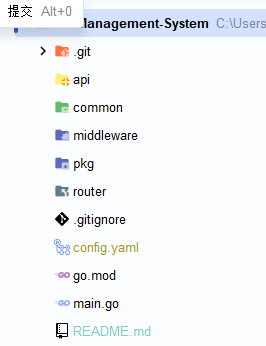

## 1.2 项目依赖

然后安装依赖。

```cmd
go get github.com/gin-gonic/gin
go get gorm.io/gorm
go get gorm.io/driver/mysql
go get github.com/sirupsen/logrus
go get github.com/lestrrat-go/file-rotatelogs
go get github.com/rifflock/lfshook
go get github.com/go-redis/redis/v8@v8.11.5
go get github.com/mojocn/base64Captcha@v1.3.6
go get github.com/dgrijalva/jwt-go
go get gopkg.in/yaml.v3
go get -u github.com/wenlng/go-user-agent
go get github.com/gogf/gf
go get github.com/swaggo/files
go get github.com/swaggo/gin-swagger
```

## 1.3 项目配置文件

然后写配置文件`config.yaml`进行初始配置。

```yaml
server:
  address:  :2000
  # debug模式
  model: debug
  # release模式
  # model: release
```

## 1.4 配置文件读取的初始化

在common中创建`config/config.go`，用来读取配置文件。

```go
package config

import (
	"os"

	"github.com/goccy/go-yaml"
)

// config 全局配置文件
type config struct {
	Server server `yaml:"server"`
}

// server 初始服务器配置
type server struct {
	Address string `yaml:"address"`
	Model   string `yaml:"model"`
}

var Config config

// InitConfig 配置初始化，读取初始配置
func InitConfig() {

	yamlFile, err := os.ReadFile("./config.yaml")
	if err != nil {
		panic(err)
	}
	// 绑定配置文件与结构体
	err = yaml.Unmarshal(yamlFile, &Config)
	if err != nil {
		panic(err)
	}
}
```

## 1.5 主入口初始化配置文件

然后在主入口进行初始化。

```go
package main

import (
	"Go-Management-System/common/config"

	"github.com/bytedance/gopkg/util/logger"
	"github.com/gin-gonic/gin"
)

// main 启动程序，只负责启动，不负责具体逻辑
func main() {
	r := gin.Default()
	config.InitConfig()
	err := r.Run(config.Config.Server.Address)
	if err != nil {
		logger.Error("gin run error: %v", err)
	}
}
```

## 1.6 数据库配置

在`config.yaml`中配置数据库信息。

```yaml
db:
  dialects: "mysql"
  host: "localhost"
  port: "3307"
  dbName: "admin-go-api"
  username: "root"
  password: ${passowrd}
  charset: "utf8mb4"
  maxIdle: 10
  maxOpen: 100
```

然后创建这个数据库。

```mysql
create database `admin-go-api`;
```

在`config.go`中添加这个数据库的结构体并配置。

```go
// config 全局配置文件
type config struct {
	Server server `yaml:"server"`
	DB     db     `yaml:"db"`
}

// db 数据库配置
type db struct {
	Dialects string `yaml:"dialects"`
	Host     string `yaml:"host"`
	Port     string `yaml:"port"`
	Db       string `yaml:"db"`
	Username string `yaml:"username"`
	Password string `yaml:"password"`
	Charset  string `yaml:"charset"`
	MaxIdle  int    `yaml:"max_idle"`
	MaxOpen  int    `yaml:"max_open"`
}
```

## 1.7 Redis配置

接下来在`config.yaml`中配置redis。

```yaml
# redis 配置
redis:
  address: 127.0.0.1:6379
  password:
  db: 0
```

这里password留空，是因为docker上的redis没有配置密码。

然后在`config.go`中添加对应的结构体。

```go
type config struct {
	Server server `yaml:"server"`
	DB     db     `yaml:"db"`
	Redis  redis  `yaml:"redis"`
}

// redis 配置
type redis struct {
	Address  string `yaml:"address"`
	Password string `yaml:"password"`
    DB       int    `yaml:"db"`
}
```

## 1.8 图片上传地址

```yaml
# 图片上传配置
imageSettings:
  # 本地磁盘地址
  uploadDir: ./uploads/
  # 图片访问地址
  imageHost: http://localhost:2002
```

```go
// imageSettings 图片上传配置
type imageSettings struct {
	UploadDir string `yaml:"uploadDir"`
	ImageHost string `yaml:"imageHost"`
}
// config 全局配置文件
type config struct {
	Server server `yaml:"server"`
	DB     db     `yaml:"db"`
	Redis  redis  `yaml:"redis"`
	ImageSettings imageSettings `yaml:"image_settings"`
}
```

## 1.9 日志log配置

```yaml
# 日志配置
log:
  path: ./log
  name: sys
  # 输出到控制台
  model: console
  # 输出到文件
#  model: file
```

```go
// log 日志配置
type log struct {
	Path string `yaml:"path"`
	Name string `yaml:"name"`
	Model string `yaml:"model"`
}

// config 全局配置文件
type config struct {
	Server        server        `yaml:"server"`
	DB            db            `yaml:"db"`
	Redis         redis         `yaml:"redis"`
	ImageSettings imageSettings `yaml:"image_settings"`
	Log           log           `yaml:"log"`
}
```

# 2. 完善基础配置

## 2.1 数据库配置

在pkg的db下创建`db.go`，用来初始化数据库。

```go
package db

import (
	"Go-Management-System/common/config"
	"fmt"

	"gorm.io/driver/mysql"
	"gorm.io/gorm"
	"gorm.io/gorm/logger"
)

var (
	Db *gorm.DB
)

// InitDB 数据库初始化
func InitDB() {
	var err error
	// 获取config里的DB
	var dbConfig = config.Config.DB
	url := fmt.Sprintf("%s:%s@tcp(%s:%s)/%s?charset=%s&parseTime=true",
		dbConfig.Username,
		dbConfig.Password,
		dbConfig.Host,
		dbConfig.Port,
		dbConfig.DbName,
		dbConfig.Charset,
	)
	Db, err = gorm.Open(mysql.Open(url), &gorm.Config{
		Logger:                                   logger.Default.LogMode(logger.Info),
		DisableForeignKeyConstraintWhenMigrating: true,
	})
	if err != nil {
		panic(err)
	}
	if Db.Error != nil {
		panic(Db.Error)
	}
	sqlDB, err := Db.DB()
	if err != nil {
		panic(err)
	}
	sqlDB.SetMaxIdleConns(dbConfig.MaxIdle)
	sqlDB.SetMaxOpenConns(dbConfig.MaxOpen)
}
```

然后在主入口中使用这个方法初始化数据库。

## 2.2 Redis配置

接下来在pkg中创建`redis/redis.go`，初始化Redis客户端。

```go
package redis

import (
	"Go-Management-System/common/config"
	"context"

	"github.com/go-redis/redis/v8"
)

// RedisClient 得到的Redis客户端
var (
	RedisClient *redis.Client
)

// InitRedis 初始化Redis
func InitRedis() {

	// 获取config里的Redis
	redisConfig := config.Config.Redis
	// 创建Redis客户端
	RedisClient = redis.NewClient(&redis.Options{
		Addr:     redisConfig.Address,
		Password: redisConfig.Password,
		DB:       redisConfig.DB,
	})
	// 测试连接
	ctx := context.Background()
	_, err := RedisClient.Ping(ctx).Result()
	if err != nil {
		panic(err)
	}
}
```

然后在主入口进行初始化。

```go
package main

import (
	"Go-Management-System/common/config"
	"Go-Management-System/pkg/db"
	"Go-Management-System/pkg/redis"

	"github.com/bytedance/gopkg/util/logger"
	"github.com/gin-gonic/gin"
)

// main 启动程序，只负责启动，不负责具体逻辑
func main() {

	r := gin.Default()

	// 初始化配置文件
	config.InitConfig()

	// 初始化数据库
	db.InitDB()
	
	// 初始化Redis
	redis.InitRedis()

	err := r.Run(config.Config.Server.Address)
	if err != nil {
		logger.Error("gin run error: %v", err)
	}
}
```

## 2.3 跨域中间件

在middleware中写下面的中间件`cors.go`。

```go
package middleware

import (
	"net/http"

	"github.com/gin-gonic/gin"
)

// Cors 跨域中间件
func Cors() gin.HandlerFunc {
	return func(c *gin.Context) {
		method := c.Request.Method
		// 允许来自任何域名、任何端口的客户端发起的跨域请求
		c.Header("Access-Control-Allow-Origin", "*")
		// 允许客户端发送的请求头字段
		c.Header("Access-Control-Allow-Headers", "Content-type, AccessToken, X-CSRF-Token, Authorization, Token")
		// 限制跨域请求的方法
		c.Header("Access-Control-Allow-Methods", "POST, GET, OPTIONS")
		// JS代码获取跨域响应本来只能获取基本响应头，但这里设置了允许前端代码读取到的响应头额外信息
		c.Header("Access-Control-Expose-Headers", "Content-Length, Access-Control-Allow-Origin, Access-Control-Allow-Headers, Content-Type")
		// 允许在跨域请求中携带凭证
		c.Header("Access-Control-Allow-Credentials", "true")
		// 放行所有OPTIONS方法
		if method == "OPTIONS" {
			// OPTIONS方法预检请求，直接返回204状态码
			c.AbortWithStatus(http.StatusNoContent)
		}
		// 处理请求
		c.Next()
	}
}
```

这个是解决了Go的跨域访问的问题。

## 2.4 通用返回结构

由于存在不同的方法，后端返回给前端的数据可能是各式各样的。为了方便前端获取数据，即通过一个通用的方法来获取数据，后端需要封装一个通用的返回结构。

首先，需要实现状态码。在common的`result/code.go`中实现。

```go
package result

// Codes 定义状态
type Codes struct {
	SUCCESS                    uint
	FAILED                     uint
	NOAUTH                     uint
	AUTHFORMATERROR            uint
	Message                    map[uint]string
	INVALIDTOKEN               uint
	MissingLoginParameter      uint
	VerificationCodeHasExpired uint
	CAPTCHANOTTRUE             uint
	PASSWORDNOTTRUE            uint
	STATUSISENABLE             uint
}

// ApiCode 状态码
var ApiCode = &Codes{
	SUCCESS:                    200,
	FAILED:                     501,
	NOAUTH:                     403,
	AUTHFORMATERROR:            405,
	INVALIDTOKEN:               406,
	MissingLoginParameter:      407,
	VerificationCodeHasExpired: 408,
	CAPTCHANOTTRUE:             409,
	PASSWORDNOTTRUE:            410,
	STATUSISENABLE:             411,
}

// init 初始化状态信息
func init() {
	ApiCode.Message = map[uint]string{
		ApiCode.SUCCESS:         "成功",
		ApiCode.FAILED:          "失败",
		ApiCode.NOAUTH:          "未授权",
		ApiCode.AUTHFORMATERROR: "授权格式错误",
		ApiCode.INVALIDTOKEN: "无效的Token",
		ApiCode.MissingLoginParameter: "缺少登录参数",
		ApiCode.VerificationCodeHasExpired: "验证码已失效",
		ApiCode.CAPTCHANOTTRUE: "验证码不正确",
		ApiCode.PASSWORDNOTTRUE: "密码不正确",
		ApiCode.STATUSISENABLE: "您的账号被停用",
	}
}

// GetMessage 供外部使用的获取数据方法，提供状态码到状态信息的映射
func (c *Codes) GetMessage(code uint) string {
	message, ok := c.Message[code]
	if !ok {
		return ""
	}
	return message
}
```

这里就能实现从状态码到状态信息的映射。

然后在result下的`result.go`中实现通用信息的结构体和返回的方法。

```go
package result

import (
	"net/http"

	"github.com/gin-gonic/gin"
)

// Result 消息结构体
type Result struct {
	Code    int    `json:"code"`    // 状态码
	Message string `json:"message"` // 提示信息
	Data    any    `json:"data"`    // 返回的数据
}

// Success 返回成功
func Success(c *gin.Context, data any) {
	if data == nil {
		data = gin.H{}
	}
	res := Result{}
	res.Code = int(ApiCode.SUCCESS)
	res.Message = ApiCode.GetMessage(ApiCode.SUCCESS)
	res.Data = data
	c.JSON(http.StatusOK, res)
}

// Failed 返回失败
func Failed(c *gin.Context, code int, message string) {
	res := Result{}
	res.Code = code
	res.Message = message
	res.Data = gin.H{}
	c.JSON(http.StatusOK, res)
}
```

这样，根据返回的状态码和信息就能通过Success和Failed方法来返回数据。

## 2.5 鉴权中间件

这里需要验证请求的登陆用户。在common的constant下创建`constant.go`来维护系统常量。

```go
package constant

const (
	ContextKeyUserObj = "authUserObj"
)
```

然后在middleware下创建`auth.go`来进行鉴权。

```go
package middleware

import (
	"Go-Management-System/common/constant"
	"Go-Management-System/common/result"
	"strings"

	"github.com/gin-gonic/gin"
)

func AuthMiddleware() func(c *gin.Context) {
	return func(c *gin.Context) {
		authHeader := c.Request.Header.Get("Authorization")
		if authHeader == "" {
			// 未授权
			result.Failed(c, int(result.ApiCode.NOAUTHORIZATION), result.ApiCode.GetMessage(result.ApiCode.NOAUTHORIZATION))
			c.Abort()
			return
		}
		// 长度不等于2，格式错误
		parts := strings.SplitN(authHeader, " ", 2)
		if !(len(parts) == 2 && parts[0] == "Bearer") {
			result.Failed(c, int(result.ApiCode.AUTHORIZATIONFORMATERROR), result.ApiCode.GetMessage(result.ApiCode.AUTHORIZATIONFORMATERROR))
			c.Abort()
			return
		}
		// todo 校验token
		var token = "token"
		c.Set(constant.ContextKeyUserObj, token)
		c.Next()
	}
}
```

这里主要是从请求头中进行鉴权。未授权就使用定义好的通用错误结构来进行返回，如果成功，则将授权的token传入上下文，这样这个上下文就获取了能用的token。其中，鉴权会出现两种错误：未授权和格式错误，这两种错误需要在`code.go`中进行定义，方便直接调用。

```go
package result

// Codes 定义状态
type Codes struct {
	SUCCESS                  uint
	FAILED                   uint
	NOAUTHORIZATION          uint
	AUTHORIZATIONFORMATERROR uint
	Message                  map[uint]string
}

// ApiCode 状态码
var ApiCode = &Codes{
	SUCCESS:                  200,
	FAILED:                   501,
	NOAUTHORIZATION:          403,
	AUTHORIZATIONFORMATERROR: 405,
}

// init 初始化状态信息
func init() {
	ApiCode.Message = map[uint]string{
		ApiCode.SUCCESS:                  "成功",
		ApiCode.FAILED:                   "失败",
		ApiCode.NOAUTHORIZATION:          "未授权",
		ApiCode.AUTHORIZATIONFORMATERROR: "授权格式错误",
	}
}

// GetMessage 供外部使用的获取数据方法，提供状态码到状态信息的映射
func (c *Codes) GetMessage(code uint) string {
	message, ok := c.Message[code]
	if !ok {
		return ""
	}
	return message
}
```

## 2.6 日志中间件

现在需要配置日志的中间件。首先在pkg的`log/logger.go`初始化日志。

```go
package log

import (
	"Go-Management-System/common/config"
	"os"
	"path/filepath"
	"time"

	rotatelogs "github.com/lestrrat-go/file-rotatelogs"
	"github.com/rifflock/lfshook"
	"github.com/sirupsen/logrus"
)

var log *logrus.Logger
var logToFile *logrus.Logger

// 日志文件名
var loggerFile string

// setLogFile 设置日志文件名
func setLogFile(file string) {
	loggerFile = file
}

// init 初始化，从配置文件中读取日志的配置信息
func init() {
	setLogFile(filepath.Join(config.Config.Log.Path, config.Config.Log.Name))
}

// Log 使用日志
func Log() *logrus.Logger {
	// 如果配置文件中 Log.Model == "file"，使用文件日志
	if config.Config.Log.Model == "file" {
		// 设置日志输入到文件中
		return logFile()
	}

	// 设置日志输入到控制台
	if log == nil {
		log = logrus.New()
		log.Out = os.Stdout
		log.Formatter = &logrus.JSONFormatter{TimestampFormat: "2006-01-02 15:04:05"}
		log.SetLevel(logrus.DebugLevel)
	}
	return log
}

// logFile 日志方法
func logFile() *logrus.Logger {
	if logToFile == nil {
		logToFile = logrus.New()
		logToFile.SetLevel(logrus.DebugLevel)
		logWriter, _ := rotatelogs.New(
			// 分割后的文件名
			loggerFile+"_%Y%m%d.log",
			// 设置最大保存时间
			rotatelogs.WithMaxAge(30*24*time.Hour),
			// 设置日志切割时间间隔
			rotatelogs.WithRotationTime(24*time.Hour),
		)
		writeMap := lfshook.WriterMap{
			logrus.InfoLevel:  logWriter,
			logrus.FatalLevel: logWriter,
			logrus.DebugLevel: logWriter,
			logrus.WarnLevel:  logWriter,
			logrus.ErrorLevel: logWriter,
			logrus.PanicLevel: logWriter,
		}
		// 设置时间格式
		lfHook := lfshook.NewHook(writeMap, &logrus.JSONFormatter{TimestampFormat: "2006-01-02 15:04:05"})
		// 新增Hook
		logToFile.AddHook(lfHook)

	}
	return logToFile
}
```

然后在middleware中配置日志中间件`logger.go`。

```go
package middleware

import (
	"Go-Management-System/pkg/log"
	"io/ioutil"
	"time"

	"github.com/gin-gonic/gin"
	"github.com/sirupsen/logrus"
)

// Logger 将请求日志打印到日志文件中
func Logger() gin.HandlerFunc {
	logger := log.Log()
	return func(c *gin.Context) {
		startTime := time.Now()
		c.Next()
		endTime := time.Now()
		latencyTime := endTime.Sub(startTime)
		reqMethod := c.Request.Method
		reqUri := c.Request.RequestURI
		header := c.Request.Header
		proto := c.Request.Proto
		statusCode := c.Writer.Status()
		clientIP := c.ClientIP()
		err := c.Err()
		body, _ := ioutil.ReadAll(c.Request.Body)
		logger.WithFields(logrus.Fields{
			"status_code":  statusCode,
			"latency_time": latencyTime,
			"client_ip":    clientIP,
			"req_method":   reqMethod,
			"req_uri":      reqUri,
			"header":       header,
			"proto":        proto,
			"err":          err,
			"body":         body,
		}).Info()
	}
}
```

## 2.7 路由设置

这里的路由设置需要在router中实现。

```go
package router

import (
	"Go-Management-System/common/config"
	"Go-Management-System/middleware"
	"net/http"

	"github.com/gin-gonic/gin"
)

// InitRouter 初始化路由
func InitRouter() *gin.Engine {
	// 创建初始的Engine
	router := gin.New()
	// 配置中间件
	// 1. 配置Recovery
	router.Use(gin.Recovery())
	// 2. 配置跨域请求
	router.Use(middleware.Cors())
	// 3. 配置文件上传服务
	router.StaticFS(config.Config.ImageSettings.UploadDir, http.Dir(config.Config.ImageSettings.UploadDir))
	// 4. 配置日志中间件
	router.Use(middleware.Logger())

	// 5. 注册路由
	register(router)

	return router
}

// register 路由注册
func register(router *gin.Engine) {
	// todo 添加接口url
}
```

这里在初始化路由时，最好只添加中间件，保持解耦，然后通过register来注册路由。

### 2.7.1 先进的启动程序

在先前的启动程序如下。

```go
r := gin.Default() // 初始化Engine
// 注册路由 ...
r.Run(":8080")  // 直接启动程序
```

在这个项目中，使用的是生产环境、适用性更强的启动程序。

```go
package main

import (
	"Go-Management-System/common/config"
	"Go-Management-System/pkg/db"
	"Go-Management-System/pkg/log"
	"Go-Management-System/pkg/redis"
	"Go-Management-System/router"
	"context"
	"errors"
	"net/http"
	"os"
	"os/signal"
	"time"

	"github.com/gin-gonic/gin"
)

// main 启动程序，只负责启动，不负责具体逻辑
func main() {

	// 初始化日志
	log := log.Log()

	// 确认Gin模式，当前为Debug
	gin.SetMode(config.Config.Server.Model)

	// 初始化路由，准备好了中间件
	r := router.InitRouter()

	// 将初始化的路由传给http.Server
	srv := &http.Server{
		// 定义路由的监听地址
		Addr: config.Config.Server.Address,
		// 将路由Engine传入
		Handler: r,
	}

	// 使用协程来启动服务
	go func() {
		// 通过ListenAndServe启动路由
		if err := srv.ListenAndServe(); err != nil && !errors.Is(err, http.ErrServerClosed) {
			log.Info("listen: %s\n", err)
		}
		// 启动成功，打印监听地址
		log.Info("listen: %s\n", config.Config.Server.Address)
	}()
	// 创建信号通道，将关闭程序的信号装入channel中
	quit := make(chan os.Signal)
	// 监听消息
	signal.Notify(quit, os.Interrupt)
	// 一直阻塞，直到收到关闭信号
	<-quit
	log.Info("Shutdown Server ...")
	// 等待5秒，确保所有请求都处理完毕
	ctx, cancel := context.WithTimeout(context.Background(), 5*time.Second)
	defer cancel()
	// 尝试关闭路由
	if err := srv.Shutdown(ctx); err != nil {
		log.Info("Server Shutdown: ", err)
	}
	log.Info("Server exiting")

}

// 初始化连接
func init() {
	// 读取配置文件
	config.InitConfig()
	// 初始化数据库
	db.InitDB()
	// 初始化Redis
	redis.InitRedis()
}
```

这里实现的是Graceful Shutdown优雅关闭。

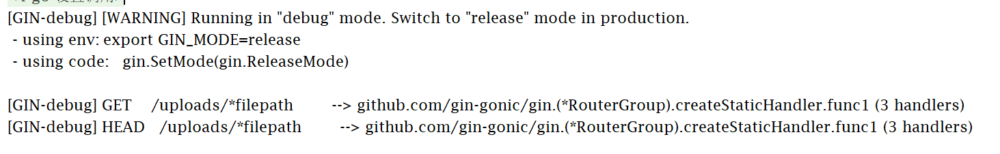

这样就是启动成功。

# 3. 登录及验证码接口

## 3.1 用Redis操作验证码

验证码存储在Redis中，因此需要使用Redis来存储、取出和校验验证码。这里在`common/util/redisStore.go`中实现。

```go
package util

import (
	"Go-Management-System/common/constant"
	"Go-Management-System/pkg/redis"
	"context"
	"log"
	"time"
)

// Redis 存取验证码，这里的ctx为无限制的上下文，以后需要通过context.WithTimeout来设置超时时间，避免redis无限等待
var ctx = context.Background()

type RedisStore struct {
}

// Set 存验证码
func (r RedisStore) Set(id string, value string) {
	key := constant.LOGIN_CODE + id
	// 通过Redis客户端存储键值对
	err := redis.RedisClient.Set(ctx, key, value, time.Minute*5).Err()
	if err != nil {
		log.Panicln(err.Error())
	}
}

// Get 获取验证码
func (r RedisStore) Get(id string, clear bool) string {
	key := constant.LOGIN_CODE + id
	val, err := redis.RedisClient.Get(ctx, key).Result()
	if err != nil {
		return ""
	}
	return val
}

// Verify 校验验证码
func (r RedisStore) Verify(id, answer string, clear bool) bool {
	v := RedisStore{}.Get(id, clear)
	return v == answer
}
```

然后在api的service中配置验证码的生成逻辑。

```go
package service

import (
	"Go-Management-System/common/util"
	"image/color"

	"github.com/mojocn/base64Captcha"
)

// 验证码

var store = util.RedisStore{}

// CreateCaptcha 生成验证码
func CreateCaptcha() (id, b64s string) {
	var driver base64Captcha.Driver
	var driverString base64Captcha.DriverString
	// 配置验证码图片信息
	captchaConfig := base64Captcha.DriverString{
		Height:          69,
		Width:           200,
		NoiseCount:      0,
		ShowLineOptions: 2 | 4,
		Length:          6,
		Source:          "1234567890qwertyuioplkjhgfdsazxcvbnm",
		BgColor: &color.RGBA{
			R: 3,
			G: 102,
			B: 214,
			A: 125,
		},
		Fonts: []string{"wqy-microhei.ttc"},
	}
	driverString = captchaConfig
	driver = driverString.ConvertFonts()
	captcha := base64Captcha.NewCaptcha(driver, store)
	// 生成并返回结果
	lid, lb64s, _, _ := captcha.Generate()
	return lid, lb64s

}

// CaptVerify 验证Captcha是否正确
func CaptVerify(id string, capt string) bool {
	if store.Verify(id, capt, false) {
		return true
	}
	return false
}
```

然后再api的controller中创建`captcha.go`，从service中获取验证码图片和id。

```go
package controller

import (
	"Go-Management-System/api/service"
	"Go-Management-System/common/result"

	"github.com/gin-gonic/gin"
)

// Captcha 从Service获取验证码图片和ID
// @Summary 验证码接口
// @Produce json
// @Description 验证码接口
// @Success 200 {object} result.Result
// @router /api/captcha [get]
func Captcha(c *gin.Context) {
	// 获取验证码图片和ID
	id, base64Image := service.CreateCaptcha()
	result.Success(c, map[string]interface{}{"idKey": id, "image": base64Image})
}
```

然后在router中注册路由，包括获取验证码和Swagger，并注册swagger。

```go
package main

import (
	"Go-Management-System/common/config"
	"Go-Management-System/pkg/db"
    _"Go-Management-System/docs"
	"Go-Management-System/pkg/log"
	"Go-Management-System/pkg/redis"
	"Go-Management-System/router"
	"context"
	"errors"
	"net/http"
	"os"
	"os/signal"
	"time"

	"github.com/gin-gonic/gin"
)

// main 启动程序，只负责启动，不负责具体逻辑
// @title 通用后台管理系统
// @description 后台管理系统API接口文档
// @securityDefinitions.apikey ApiKeyAuth
// @in header
// @name Authorization
func main() {

	// 初始化日志
	log := log.Log()

	// 确认Gin模式，当前为Debug
	gin.SetMode(config.Config.Server.Model)

	// 初始化路由，准备好了中间件
	r := router.InitRouter()

	// 将初始化的路由传给http.Server
	srv := &http.Server{
		// 定义路由的监听地址
		Addr: config.Config.Server.Address,
		// 将路由Engine传入
		Handler: r,
	}

	// 使用协程来启动服务
	go func() {
		// 通过ListenAndServe启动路由
		if err := srv.ListenAndServe(); err != nil && !errors.Is(err, http.ErrServerClosed) {
			log.Info("listen: %s\n", err)
		}
		// 启动成功，打印监听地址
		log.Info("listen: %s\n", config.Config.Server.Address)
	}()
	// 创建信号通道，将关闭程序的信号装入channel中
	quit := make(chan os.Signal)
	// 监听消息
	signal.Notify(quit, os.Interrupt)
	// 一直阻塞，直到收到关闭信号
	<-quit
	log.Info("Shutdown Server ...")
	// 等待5秒，确保所有请求都处理完毕
	ctx, cancel := context.WithTimeout(context.Background(), 5*time.Second)
	defer cancel()
	// 尝试关闭路由
	if err := srv.Shutdown(ctx); err != nil {
		log.Info("Server Shutdown: ", err)
	}
	log.Info("Server exiting")
}

// 初始化连接
func init() {
	// 读取配置文件
	config.InitConfig()
	// 初始化数据库
	db.InitDB()
	// 初始化Redis
	redis.InitRedis()
}
```

在终端中运行`swag init`来初始化swagger。

```cmd
go get github.com/swaggo/swag
```

访问`http://localhost:8080/swagger/index.html`可以获取swagger文档。

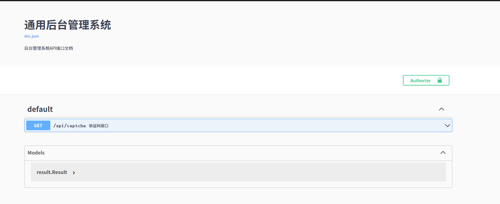

并且能够测试这里的验证码接口。

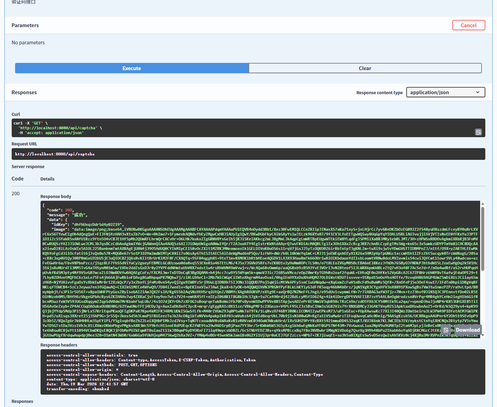

## 3.2 登录接口

这里首先需要实现两个工具类，在uitl下创建`times.go`。

```go
package util

import (
	"database/sql/driver"
	"fmt"
	"time"
)

// HTime 自定义时间类型
type HTime struct {
	time.Time
}

// 使用一个具体的时间来定义格式
var (
	formatTime = "2006-01-02 15:04:05"
)

// MarshalJSON 通过json.Marshal来序列化包含HTime的结构体时，会使用自定义的时间输出
func (t HTime) MarshalJSON() ([]byte, error) {
	formatted := fmt.Sprintf("\"%s\"", t.Format(formatTime))
	return []byte(formatted), nil
}

// UnmarshalJSON 通过json.Unmarshal来反序列化包含HTime的结构体时，会使用自定义的时间输入
func (t *HTime) UnmarshalJSON(data []byte) (err error) {
	now, err := time.ParseInLocation(`"`+formatTime+`"`, string(data), time.Local)
	*t = HTime{Time: now}
	return
}

// Value 写入数据库前进行转换
func (t HTime) Value() (driver.Value, error) {
	var zeroTime time.Time
	if t.Time.UnixNano() == zeroTime.UnixNano() {
		return nil, nil
	}
	return t.Time, nil
}

// Scan 从数据库读取时进行转换
func (t *HTime) Scan(v any) error {
	value, ok := v.(time.Time)
	if ok {
		*t = HTime{Time: value}
		return nil
	}
	return fmt.Errorf("can not convert %v to timestamp", v)
}
```

登录时需要加密密码，因此添加`encryption.go`。

```go
package util

import (
	"crypto/md5"
	"encoding/hex"
)

// EncryptionMd5 字符串加密
func EncryptionMd5(s string) string {
	// 创建md5哈希计算器
	ctx := md5.New()
	// 向计算器写入目标数据
	ctx.Write([]byte(s))
	// 输出十六进制字符串，Sum的nil表示不添加前缀
	return hex.EncodeToString(ctx.Sum(nil))
}
```

然后，在api的entity中创建用户信息实体。

```go
package entity

import "Go-Management-System/common/util"

// SysAdmin 用户模型对象
type SysAdmin struct {
	ID         uint       `gorm:"column:id;comment:'主键';primaryKey;NOT NULL" json:"id"`
	PostId     int        `gorm:"column:post_id;comment:'岗位id'" json:"post_id"`
	DeptId     int        `gorm:"column:dept_id;comment:'部门id'" json:"dept_id"`
	Username   string     `gorm:"column:username;varchar(64);comment:'用户账号';NOT NULL" json:"username"`
	Password   string     `gorm:"column:password;varchar(64);comment:'密码';NOT NULL" json:"password"`
	NickName   string     `gorm:"column:nickname;varchar(64);comment:'昵称'" json:"nickname"`
	Status     int        `gorm:"column:status;default:1;comment:'账号启用状态：1->启用；2->禁用';NOT NULL" json:"status"`
	Icon       string     `gorm:"column:icon;varchar(500);comment:'头像'" json:"icon"`
	Email      string     `gorm:"column:email;varchar(64);comment:'邮箱'" json:"email"`
	Phone      string     `gorm:"column:phone;varchar(64);comment:'电话'" json:"phone"`
	Note       string     `gorm:"column:note;varchar(500);comment:'备注'" json:"note"`
	CreateTime util.HTime `gorm:"column:create_time;comment:'创建时间';NOT NULL" json:"create_time"`
}

func (SysAdmin) TableName() string {
	return "sys_admin"
}

// JwtAdmin 鉴权用户结构体
type JwtAdmin struct {
	Id       uint   `json:"id"`
	Username string `json:"username"`
	Nickname string `json:"nickname"`
	Icon     string `json:"icon"`
	Email    string `json:"email"`
	Phone    string `json:"phone"`
	Note     string `json:"note"`
}

// 登陆对象
type LoginDto struct {
	Username string `json:"username" validate:"required"` // 用户名
	Password string `json:"password" validate:"required"` // 密码
	Image string `json:"image" validate:"required,min=4,max=6"` // 验证码
	IdKey string `json:"id_key" validate:"required"` // uuid
}
```

然后根据资料中的sql来创建对应的表。

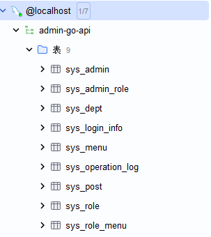

接下来在pkg的`jwt/jwt.go`中实现token生成和校验。

```go
// Package jwt JWT 工具类，生成token和解析token，以及获取当前登录用户的id及用户信息
package jwt

import (
	"Go-Management-System/api/entity"
	"Go-Management-System/common/constant"
	"errors"
	"fmt"
	"time"

	"github.com/dgrijalva/jwt-go"
	"github.com/gin-gonic/gin"
)

// userStdClaims 自定义Claims结构体，包含用户数据以及标准字段
type userStdClaims struct {
	entity.JwtAdmin
	jwt.StandardClaims
}

// TokenExpireDuration 过期时间
const TokenExpireDuration = time.Hour * 24

// Secret token密钥，对称加密，服务端用同一个Secret来签名和验证
var Secret = []byte("admin-go-api")

// 定义错误
var (
	ErrAbsent  = "jwt token absent"  // 令牌不存在
	ErrInvalid = "jwt token invalid" // 令牌无效
)

// GenerateTokenByAdmin 根据用户信息生成token
func GenerateTokenByAdmin(admin entity.SysAdmin) (string, error) {
	// 获取jwt专用的实体，专门构建这个实体的目的是避免敏感信息存到token中
	var jwtAdmin = entity.JwtAdmin{
		Id:       admin.ID,
		Username: admin.Username,
		Nickname: admin.Nickname,
		Icon:     admin.Icon,
		Email:    admin.Email,
		Phone:    admin.Phone,
		Note:     admin.Note,
	}
	// 构建完整的Claims
	c := userStdClaims{
		// 放入业务数据
		jwtAdmin,
		// 放入标准字段
		jwt.StandardClaims{
			// 设置过期时间
			ExpiresAt: time.Now().Add(TokenExpireDuration).Unix(),
			// 签发人
			Issuer: "admin",
		},
	}
	// 签名并传入Claims来生成token
	token := jwt.NewWithClaims(jwt.SigningMethodHS256, c)
	// 使用密钥进行哈希运算
	return token.SignedString(Secret)
}

// ValidateToken 解析JWT
func ValidateToken(tokenString string) (*entity.JwtAdmin, error) {
	// 没有token直接返回
	if tokenString == "" {
		return nil, errors.New(ErrAbsent)
	}

	// 通过Secret解析token
	token, err := jwt.Parse(tokenString, func(token *jwt.Token) (any, error) {
		return Secret, nil
	})
	if token == nil {
		return nil, errors.New(ErrInvalid)
	}
	// 准备Claims容器
	claims := userStdClaims{}
	// 传入Claims容器来解析token
	_, err = jwt.ParseWithClaims(tokenString, &claims, func(token *jwt.Token) (any, error) {
		if _, ok := token.Method.(*jwt.SigningMethodHMAC); !ok {
			return nil, fmt.Errorf("unexpected signing method: %v", token.Header["alg"])
		}
		return Secret, nil
	})
	if err != nil {
		return nil, err
	}

	return &claims.JwtAdmin, nil
}

// GetAdminId 返回用户Id
func GetAdminId(c *gin.Context) (uint, error) {
	u, exist := c.Get(constant.ContextKeyUserObj)
	if !exist {
		return 0, errors.New("can't get user id")
	}
	admin, ok := u.(*entity.JwtAdmin)
	if ok {
		return admin.Id, nil
	}
	return 0, errors.New("can't convert to id struct")
}

// GetAdminName 返回用户名
func GetAdminName(c *gin.Context) (string, error) {
	u, exist := c.Get(constant.ContextKeyUserObj)
	if !exist {
		return "", errors.New("can't get user name")
	}
	admin, ok := u.(*entity.JwtAdmin)
	if ok {
		return admin.Username, nil
	}
	return "", errors.New("can't convert to api name")
}

// GetAdmin 返回admin信息
func GetAdmin(c *gin.Context) (*entity.JwtAdmin, error) {
	u, exist := c.Get(constant.ContextKeyUserObj)
	if !exist {
		return nil, errors.New("can't get user id")
	}
	admin, ok := u.(*entity.JwtAdmin)
	if ok {
		return admin, nil
	}
	return nil, errors.New("can't convert to api admin struct")
}
```

由于这里的token可能会暴露密码，因此需要使用不包含密码的JwtAdmin鉴权结构体来生成token。

接下来在dao的`sysAdmin.go`中做好获取用户名的方法。

```go
// Package dao 用户数据层
package dao

import (
	"Go-Management-System/api/entity"
	. "Go-Management-System/pkg/db"
)

// SysAdminDetail 用户详情
func SysAdminDetail(dto entity.LoginDto) (sysAdmin entity.SysAdmin) {
	username := dto.Username
	Db.Where("username = ?", username).First(&sysAdmin)
	return sysAdmin
}
```

接下来在service下的`sysAdmin.go`实现登录功能。

```go
// Package service 用户服务层
package service

import (
	"Go-Management-System/api/dao"
	"Go-Management-System/api/entity"
	"Go-Management-System/common/result"
	"Go-Management-System/common/util"
	"Go-Management-System/pkg/jwt"

	"github.com/gin-gonic/gin"
	"github.com/go-playground/validator/v10"
)

// ISysAdminService 定义接口
type ISysAdminService interface {
	Login(c *gin.Context, dto entity.LoginDto)
}

type SysAdminServiceImpl struct {
}

var sysAdminService = SysAdminServiceImpl{}

func SysAdminService() ISysAdminService {
	return &sysAdminService
}

// Login 用户登录
func (s SysAdminServiceImpl) Login(c *gin.Context, dto entity.LoginDto) {
	// 登录参数校验，根据结构体的validate标签校验属性值是否合法
	err := validator.New().Struct(dto)
	if err != nil {
		result.Failed(c, int(result.ApiCode.MissingLoginParameter), result.ApiCode.GetMessage(result.ApiCode.MissingLoginParameter))
		return
	}
	// 验证码是否过期
	code := util.RedisStore{}.Get(dto.IdKey, true)
	if len(code) == 0 {
		result.Failed(c, int(result.ApiCode.VerificationCodeHasExpired), result.ApiCode.GetMessage(result.ApiCode.VerificationCodeHasExpired))
		return
	}
	// 校验验证码
	verifyRes := CaptVerify(dto.IdKey, dto.Image)
	if !verifyRes {
		result.Failed(c, int(result.ApiCode.CAPTCHANOTTRUE), result.ApiCode.GetMessage(result.ApiCode.CAPTCHANOTTRUE))
		return
	}
	//校验密码
	sysAdmin := dao.SysAdminDetail(dto)
	if sysAdmin.Password != util.EncryptionMd5(dto.Password) {
		result.Failed(c, int(result.ApiCode.PASSWORDNOTTRUE), result.ApiCode.GetMessage(result.ApiCode.PASSWORDNOTTRUE))
		return
	}
	// 判断用户是否被禁用
	const status int = 2
	if sysAdmin.Status == status {
		result.Failed(c, int(result.ApiCode.STATUSISENABLE), result.ApiCode.GetMessage(result.ApiCode.STATUSISENABLE))
		return
	}
	// 生成token
	tokenString, _ := jwt.GenerateTokenByAdmin(sysAdmin)
	result.Success(c, map[string]any{
		"token":    tokenString,
		"sysAdmin": sysAdmin,
	})

}
```

在这里，登录分为了多个步骤。

1. 登录参数校验。首先校验从前端获取到的信息，看看是否符合后端要求的格式。
2. 登录时需要输入验证码，查看验证码是否过期。
3. 验证码未过期，则校验验证码是否正确。
4. 验证码没问题，校验密码是否正确。
5. 获取用户后，查看用户的状态，被禁用则不可用。
6. 用户合法，生成token。

然后在controller中创建用户登录的控制层`sysAdmin.go`。

```go
// Package controller 用户控制层
package controller

import (
	"Go-Management-System/api/entity"
	"Go-Management-System/api/service"

	"github.com/gin-gonic/gin"
)

// Login 登录
// @Summary 用户登录接口
// @Produce json
// @Description 用户登录接口
// @param data body entity.LoginDto true "data"
// @Success 200 {object} result.Result
// @router /api/login [post]
func Login(c *gin.Context) {
	var dto entity.LoginDto
	_ = c.BindJSON(&dto)
	service.SysAdminService().Login(c, dto)
}
```

最后，在`router.go`中注册用户登录的接口。

```go
// register 路由注册
func register(router *gin.Engine) {
	// todo 添加接口url
	router.GET("/api/captcha", controller.Captcha)
	router.GET("/swagger/*any", ginSwagger.WrapHandler(swaggerFiles.Handler))
	router.POST("/api/login", controller.Login)
}
```

这样，可以访问`localhsot:8080/swwagger/index.html`来访问swagger文档。此外，每次添加一个swagger注释的接口，都需要执行一次`swag init`来重新生成文档。

这样，可以在swagger中进行测试。

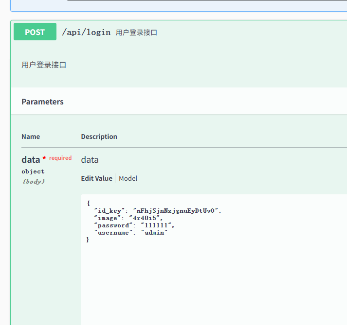

这里的id_key是验证码的id，image是验证码的结果，登录的用户是默认初始化的用户。

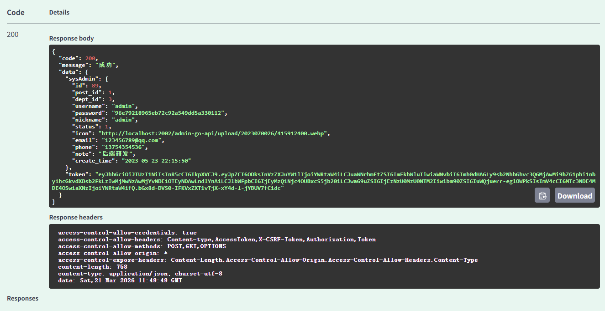

这样就成功实现了登录和验证码的开发。

# 4. 岗位相关接口

上面实现了用户，这里需要实现与用户绑定的岗位。

## 4.1 新增岗位

### 4.1.1 岗位实体

首先在entity创建岗位的实体`sysPost.go`。

```go
// Package entity 岗位相关模型
package entity

import "Go-Management-System/common/util"

type SysPost struct {
	ID         uint       `gorm:"column:id; comment:'主键';primaryKey;NOT NULL" json:"id"`
	PostCode   string     `gorm:"column:post_code;varchar(64);comment:'岗位编码;NOT NULL" json:"postCode"`
	PostName   string     `gorm:"column:post_name;varchar(50);comment:'岗位名称';NOT NULL" json:"postName"`
	PostStatus int        `gorm:"column:post_status;default:1;comment:'状态（1->正常 2->停用）';NOT NULL" json:"postStatus"`
	CreateTime util.HTime `gorm:"column:create_time;comment:'创建时间';NOT NULL" json:"createTime"`
	Remark     string     `gorm:"column:remark;varchar(500);comment:'备注'" json:"remark"`
}

func (SysPost) TableName() string {
	return "sys_post"
}
```

### 4.1.2 岗位dao层

现在需要实现岗位的存储。

首先，为了适配岗位的错误信息，需要在`code.go`中添加新的错误信息和状态码。

```go
package result

// Codes 定义状态
type Codes struct {
	SUCCESS                    uint
	FAILED                     uint
	NOAUTH                     uint
	AUTHFORMATERROR            uint
	Message                    map[uint]string
	INVALIDTOKEN               uint
	MissingLoginParameter      uint
	VerificationCodeHasExpired uint
	CAPTCHANOTTRUE             uint
	PASSWORDNOTTRUE            uint
	STATUSISENABLE             uint
	ROLENAMEALREADYEXISTS      uint
	MENUISEXIST                uint
	DELSYSMENUFAILED           uint
	DEPTISEXIST                uint
	DEPTISDISTRIBUTE           uint
	POSTALREADYEXISTS           uint
}

// ApiCode 状态码
var ApiCode = &Codes{
	SUCCESS:                    200,
	FAILED:                     501,
	NOAUTH:                     403,
	AUTHFORMATERROR:            405,
	INVALIDTOKEN:               406,
	MissingLoginParameter:      407,
	VerificationCodeHasExpired: 408,
	CAPTCHANOTTRUE:             409,
	PASSWORDNOTTRUE:            410,
	STATUSISENABLE:             411,
	ROLENAMEALREADYEXISTS:      412,
	MENUISEXIST:                413,
	DELSYSMENUFAILED:           414,
	DEPTISEXIST:                415,
	DEPTISDISTRIBUTE:           416,
	POSTALREADYEXISTS:           417,
}

// init 初始化状态信息
func init() {
	ApiCode.Message = map[uint]string{
		ApiCode.SUCCESS:                    "成功",
		ApiCode.FAILED:                     "失败",
		ApiCode.NOAUTH:                     "未授权",
		ApiCode.AUTHFORMATERROR:            "授权格式错误",
		ApiCode.INVALIDTOKEN:               "无效的Token",
		ApiCode.MissingLoginParameter:      "缺少登录参数",
		ApiCode.VerificationCodeHasExpired: "验证码已失效",
		ApiCode.CAPTCHANOTTRUE:             "验证码不正确",
		ApiCode.PASSWORDNOTTRUE:            "密码不正确",
		ApiCode.STATUSISENABLE:             "您的账号被停用",
		ApiCode.ROLENAMEALREADYEXISTS:      "角色名称已存在，重新输入",
		ApiCode.MENUISEXIST:                "菜单已存在，重新输入",
		ApiCode.DELSYSMENUFAILED:           "菜单已分配",
		ApiCode.DEPTISEXIST:                "部门名称已存在",
		ApiCode.DEPTISDISTRIBUTE:           "部门已分配，不能删除",
		ApiCode.POSTALREADYEXISTS:           "岗位名称已存在",
	}
}

// GetMessage 供外部使用的获取数据方法，提供状态码到状态信息的映射
func (c *Codes) GetMessage(code uint) string {
	message, ok := c.Message[code]
	if !ok {
		return ""
	}
	return message
}
```

然后实现岗位的dao层。

```go
package dao

import (
	"Go-Management-System/api/entity"
	"Go-Management-System/common/util"
	"Go-Management-System/pkg/db"
	"time"
)

// GetSysPostByCode 根据postCode查询岗位
func GetSysPostByCode(postCode string) (sysPost entity.SysPost) {
	db.Db.Where("post_code = ?", postCode).First(&sysPost)
	return sysPost
}

// GetSysPostByName 根据岗位名称查询
func GetSysPostByName(postName string) (sysPost entity.SysPost) {
	db.Db.Where("post_name = ?", postName).First(&sysPost)
	return sysPost
}

// CreateSysPost 新增岗位
func CreateSysPost(sysPost entity.SysPost) bool {
	// 查看postCode是否重复
	sysPostByCode := GetSysPostByCode(sysPost.PostCode)
	if sysPostByCode.ID > 0 {
		return false
	}
	// 查看postName是否重复
	sysPostByName := GetSysPostByName(sysPost.PostName)
	if sysPostByName.ID > 0 {
		return false
	}
	// 创建新增岗位实例
	addSysPost := entity.SysPost{
		PostCode:   sysPost.PostCode,
		PostName:   sysPost.PostName,
		PostStatus: sysPost.PostStatus,
		CreateTime: util.HTime{Time: time.Now()},
		Remark:     sysPost.Remark,
	}
	// 保存到数据库的sys_post表中
	tx := db.Db.Save(&addSysPost)
	if tx.RowsAffected > 0 {
		return true
	}
	return false
}
```

### 4.1.3 岗位service层

有了dao层，就能在service中进行封装。

```go
// Package service 岗位服务层
package service

import (
	"Go-Management-System/api/dao"
	"Go-Management-System/api/entity"
	"Go-Management-System/common/result"

	"github.com/gin-gonic/gin"
)

type ISysPostService interface {
	CreateSysPost(c *gin.Context, sysPost entity.SysPost)
}

type SysPostServiceImpl struct {
}

var sysPostService = SysPostServiceImpl{}

func SysPostService() ISysPostService {
	return &sysPostService
}

// CreateSysPost 新增岗位
func (s SysPostServiceImpl) CreateSysPost(c *gin.Context, sysPost entity.SysPost) {
	ok := dao.CreateSysPost(sysPost)
	if !ok {
		result.Failed(c, int(result.ApiCode.POSTALREADYEXISTS), result.ApiCode.GetMessage(result.ApiCode.POSTALREADYEXISTS))
		return
	}
	result.Success(c, true)
}
```

### 4.1.4 controller层

在controller中写`sysPost.go`。

```go
// Package controller 岗位控制层
package controller

import (
	"Go-Management-System/api/entity"
	"Go-Management-System/api/service"

	"github.com/gin-gonic/gin"
)

var sysPost entity.SysPost

// CreateSysPost 新增岗位
// @Summary 新增岗位接口
// @Produce json
// @Description 新增岗位接口
// @Param data body entity.SysPost true "data"
// @Success 200 {object} result.Result
// @router /api/post/add [post]
func CreateSysPost(c *gin.Context) {
	// 从请求中获取JSON数据并绑定到sysPost结构体
	_ = c.BindJSON(&sysPost)
	service.SysPostService().CreateSysPost(c, sysPost)
}
```

这里实现了较为简单的新增岗位的方法。

### 4.1.5 配置router

写了controller后，在`router.go`中配置好路由。

```go
// register 路由注册
func register(router *gin.Engine) {
	// todo 添加接口url
	router.GET("/api/captcha", controller.Captcha)
	router.GET("/swagger/*any", ginSwagger.WrapHandler(swaggerFiles.Handler))
	router.POST("/api/login", controller.Login)
	router.POST("/api/post/add", controller.CreateSysPost)
}
```

### 4.1.6 Swagger测试

在`localhost:8080/swagger/index.html`中能够测试成功。

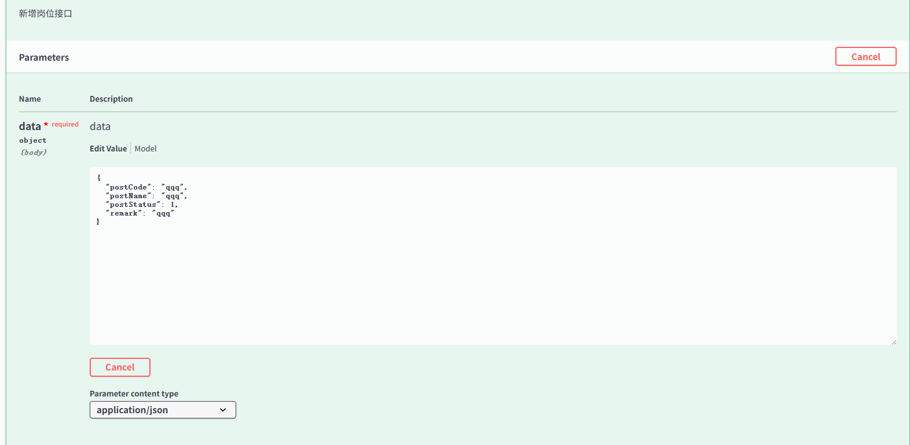

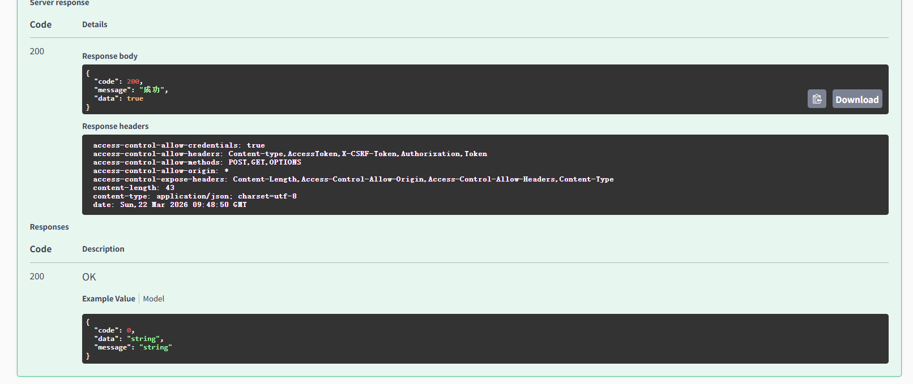

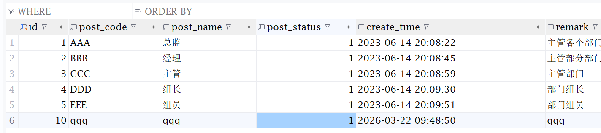

## 4.2 岗位列表查询

上面实现了新增的方法，接下来实现查询方法。

### 4.2.1 dao层

首先在dao层实现分页查询效果。而查询时可能会输入岗位的名称、状态或者时间范围，这些都要考虑到，同时通过sql的limit和offset来实现分页。在dao的`sysPost.go`中实现。

```go
// GetSysPostList 分页查询岗位列表
func GetSysPostList(PageNum, PageSize int, PostName, PostStatus, BeginTime, EndTime string) (sysPost []entity.SysPost, count int64) {
	// 指定sys_post表，能够得到可以链式调用的查询对象
	curDb := db.Db.Table("sys_post")
	if PostName != "" {
		curDb = curDb.Where("post_name = ?", PostName)
	}
	if PostStatus != "" {
		curDb = curDb.Where("post_status = ?", PostStatus)
	}
	if BeginTime != "" && EndTime != "" {
		curDb = curDb.Where("create_time BETWEEN ? AND ?", BeginTime, EndTime)
	}
	// 统计符合条件的总数
	curDb.Count(&count)
	// 分页查询符合条件的岗位列表
	curDb.Limit(PageSize).Offset((PageNum - 1) * PageSize).Order("create_time desc").Find(&sysPost)
	return sysPost, count
}
```

### 4.2.2 service层

service层中，首先要先识别页数和每页大小是否合法，不合法则给出默认值。然后调用dao层的方法来查询岗位列表和总数，返回成功结果即可。

```go
// GetSysPostList 分页查询岗位列表
func (s SysPostServiceImpl) GetSysPostList(c *gin.Context, PageNum, PageSize int, PostName, PostStatus, BeginTime, EndTime string) {
	// 未设置页面大小，给出默认值
	if PageSize < 1 {
		PageSize = 10
	}
	// 未设置页数，给出首页
	if PageNum < 1 {
		PageNum = 1
	}
	// 调用dao层方法获取特定的岗位列表和总数
	sysPost, count := dao.GetSysPostList(PageNum, PageSize, PostName, PostStatus, BeginTime, EndTime)
	// 返回结果
	result.Success(c, map[string]any{"total": count, "pageSize": PageSize, "pageNum": PageNum, "list": sysPost})
}
```

### 4.2.3 controller层

controller比较简单，从请求上下文获取参数后调用service层接口即可。

```go
// GetSysPostList 根据条件分页查询岗位
// @Summary 分页查询岗位列表
// @Produce json
// @Description 分页查询岗位列表
// @Param pageNum query int false "分页数"
// @Param pageSize query int false "每页数"
// @Param postName query string false "岗位名称"
// @Param postStatus query string false "状态：1-> 启用，2->停用"
// @Param beginTime query string false "开始时间"
// @Param endTime query string false "结束时间"
// @Success 200 {object} result.Result
// @router /api/post/list [get]
func GetSysPostList(c *gin.Context) {
	// 从请求中获取参数，int类型需要通过strconv.Atoi来转换
	PageNum, _ := strconv.Atoi(c.Query("pageNum"))
	PageSize, _ := strconv.Atoi(c.Query("pageSize"))
	// string类型可直接通过Query获取
	PostName := c.Query("postName")
	PostStatus := c.Query("postStatus")
	BeginTime := c.Query("beginTime")
	EndTime := c.Query("endTime")
	service.SysPostService().GetSysPostList(c, PageNum, PageSize, PostName, PostStatus, BeginTime, EndTime)
}
```

这里controller只负责获取参数和转发，不负责响应，页面的响应完全交给result类来实现。这里是之前定义好的成功和失败的返回类型，调用`c.JSON`就能实现响应。

```go
// Success 返回成功
func Success(c *gin.Context, data any) {
	if data == nil {
		data = gin.H{}
	}
	res := Result{}
	res.Code = int(ApiCode.SUCCESS)
	res.Message = ApiCode.GetMessage(ApiCode.SUCCESS)
	res.Data = data
	c.JSON(http.StatusOK, res)
}

// Failed 返回失败
func Failed(c *gin.Context, code int, message string) {
	res := Result{}
	res.Code = code
	res.Message = message
	res.Data = gin.H{}
	c.JSON(http.StatusOK, res)
}
```

### 4.2.4 router配置

在`router.go`中添加路由。

```go
// register 路由注册
func register(router *gin.Engine) {
	// todo 添加接口url
	router.GET("/api/captcha", controller.Captcha)
	router.GET("/swagger/*any", ginSwagger.WrapHandler(swaggerFiles.Handler))
	router.POST("/api/login", controller.Login)
	router.POST("/api/post/add", controller.CreateSysPost)
	router.GET("/api/post/list", controller.GetSysPostList)
}
```

刷新swagger，打开`localhost:8080/swagger/index.html`就能实现分页查询。

### 4.2.5 Swagger测试

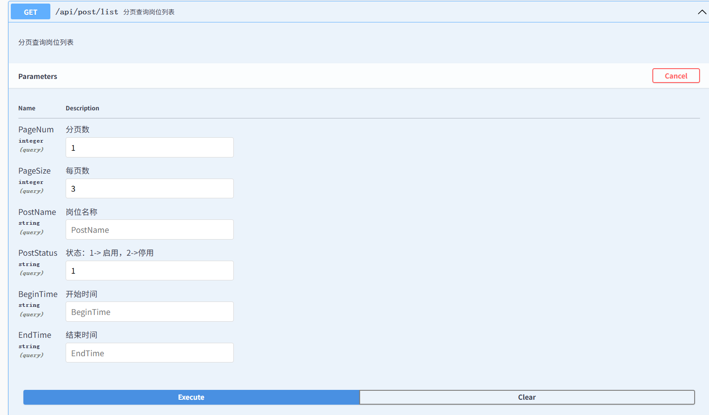

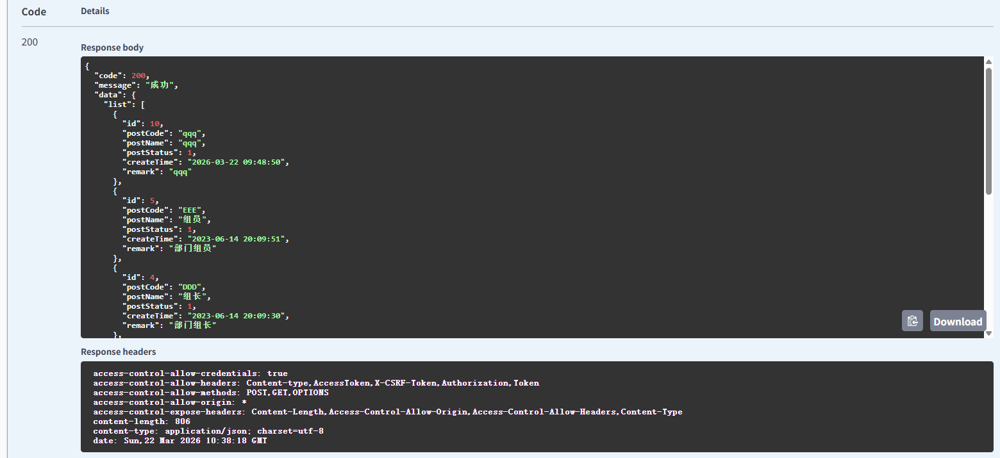

按名称查询。

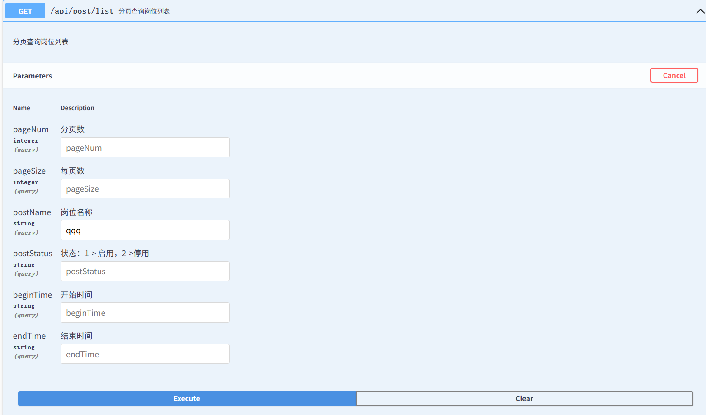

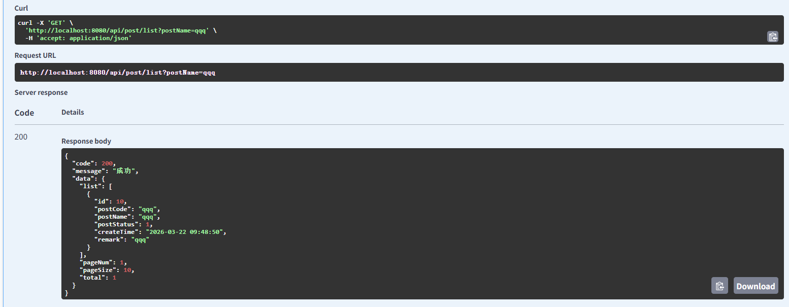

## 4.3 根据岗位id查询岗位

