# 通用基础管理系统项目

这里做一个关于Go的管理系统。

# 1. 项目初始化

## 1.1 项目搭建

首先做好项目的目录搭建。


## 1.2 项目依赖

然后安装依赖。

```cmd
go get github.com/gin-gonic/gin
go get gorm.io/gorm
go get gorm.io/driver/mysql
go get github.com/sirupsen/logrus
go get github.com/lestrrat-go/file-rotatelogs
go get github.com/rifflock/lfshook
go get github.com/go-redis/redis/v8@v8.11.5
go get github.com/mojocn/base64Captcha@v1.3.6
go get github.com/dgrijalva/jwt-go
go get gopkg.in/yaml.v3
go get -u github.com/wenlng/go-user-agent
go get github.com/gogf/gf
go get github.com/swaggo/files
go get github.com/swaggo/gin-swagger
```

## 1.3 项目配置文件

然后写配置文件`config.yaml`进行初始配置。

```yaml
server:
  address:  :2000
  # debug模式
  model: debug
  # release模式
  # model: release
```

## 1.4 配置文件读取的初始化

在common中创建`config/config.go`，用来读取配置文件。

```go
package config

import (
	"os"

	"github.com/goccy/go-yaml"
)

// config 全局配置文件
type config struct {
	Server server `yaml:"server"`
}

// server 初始服务器配置
type server struct {
	Address string `yaml:"address"`
	Model   string `yaml:"model"`
}

var Config config

// InitConfig 配置初始化，读取初始配置
func InitConfig() {

	yamlFile, err := os.ReadFile("./config.yaml")
	if err != nil {
		panic(err)
	}
	// 绑定配置文件与结构体
	err = yaml.Unmarshal(yamlFile, &Config)
	if err != nil {
		panic(err)
	}
}
```

## 1.5 主入口初始化配置文件

然后在主入口进行初始化。

```go
package main

import (
	"Go-Management-System/common/config"

	"github.com/bytedance/gopkg/util/logger"
	"github.com/gin-gonic/gin"
)

// main 启动程序，只负责启动，不负责具体逻辑
func main() {
	r := gin.Default()
	config.InitConfig()
	err := r.Run(config.Config.Server.Address)
	if err != nil {
		logger.Error("gin run error: %v", err)
	}
}
```

## 1.6 数据库配置

在`config.yaml`中配置数据库信息。

```yaml
db:
  dialects: "mysql"
  host: "localhost"
  port: "3307"
  dbName: "admin-go-api"
  username: "root"
  password: ${passowrd}
  charset: "utf8mb4"
  maxIdle: 10
  maxOpen: 100
```

然后创建这个数据库。

```mysql
create database `admin-go-api`;
```

在`config.go`中添加这个数据库的结构体并配置。

```go
// config 全局配置文件
type config struct {
	Server server `yaml:"server"`
	DB     db     `yaml:"db"`
}

// db 数据库配置
type db struct {
	Dialects string `yaml:"dialects"`
	Host     string `yaml:"host"`
	Port     string `yaml:"port"`
	Db       string `yaml:"db"`
	Username string `yaml:"username"`
	Password string `yaml:"password"`
	Charset  string `yaml:"charset"`
	MaxIdle  int    `yaml:"max_idle"`
	MaxOpen  int    `yaml:"max_open"`
}
```

## 1.7 Redis配置

接下来在`config.yaml`中配置redis。

```yaml
# redis 配置
redis:
  address: 127.0.0.1:6379
  password:
  db: 0
```

这里password留空，是因为docker上的redis没有配置密码。

然后在`config.go`中添加对应的结构体。

```go
type config struct {
	Server server `yaml:"server"`
	DB     db     `yaml:"db"`
	Redis  redis  `yaml:"redis"`
}

// redis 配置
type redis struct {
	Address  string `yaml:"address"`
	Password string `yaml:"password"`
    DB       int    `yaml:"db"`
}
```

## 1.8 图片上传地址

```yaml
# 图片上传配置
imageSettings:
  # 本地磁盘地址
  uploadDir: /admin-go-api/upload/
  # 图片访问地址
  imageHost: http://localhost:2002
```

```go
// imageSettings 图片上传配置
type imageSettings struct {
	UploadDir string `yaml:"uploadDir"`
	ImageHost string `yaml:"imageHost"`
}
// config 全局配置文件
type config struct {
	Server server `yaml:"server"`
	DB     db     `yaml:"db"`
	Redis  redis  `yaml:"redis"`
	ImageSettings imageSettings `yaml:"image_settings"`
}
```

## 1.9 日志log配置

```yaml
# 日志配置
log:
  path: ./log
  name: sys
  # 输出到控制台
  model: console
  # 输出到文件
#  model: file
```

```go
// log 日志配置
type log struct {
	Path string `yaml:"path"`
	Name string `yaml:"name"`
	Model string `yaml:"model"`
}

// config 全局配置文件
type config struct {
	Server        server        `yaml:"server"`
	DB            db            `yaml:"db"`
	Redis         redis         `yaml:"redis"`
	ImageSettings imageSettings `yaml:"image_settings"`
	Log           log           `yaml:"log"`
}
```

# 2. 完善基础配置

## 2.1 数据库配置

在pkg的db下创建`db.go`，用来初始化数据库。

```go
package db

import (
	"Go-Management-System/common/config"
	"fmt"

	"gorm.io/driver/mysql"
	"gorm.io/gorm"
	"gorm.io/gorm/logger"
)

var (
	Db *gorm.DB
)

// InitDB 数据库初始化
func InitDB() {
	var err error
	// 获取config里的DB
	var dbConfig = config.Config.DB
	url := fmt.Sprintf("%s:%s@tcp(%s:%s)/%s?charset=%s&parseTime=true",
		dbConfig.Username,
		dbConfig.Password,
		dbConfig.Host,
		dbConfig.Port,
		dbConfig.DbName,
		dbConfig.Charset,
	)
	Db, err = gorm.Open(mysql.Open(url), &gorm.Config{
		Logger:                                   logger.Default.LogMode(logger.Info),
		DisableForeignKeyConstraintWhenMigrating: true,
	})
	if err != nil {
		panic(err)
	}
	if Db.Error != nil {
		panic(Db.Error)
	}
	sqlDB, err := Db.DB()
	if err != nil {
		panic(err)
	}
	sqlDB.SetMaxIdleConns(dbConfig.MaxIdle)
	sqlDB.SetMaxOpenConns(dbConfig.MaxOpen)
}
```

然后在主入口中使用这个方法初始化数据库。

## 2.2 Redis配置

接下来在pkg中创建`redis/redis.go`，初始化Redis客户端。

```go
package redis

import (
	"Go-Management-System/common/config"
	"context"

	"github.com/go-redis/redis/v8"
)

// RedisClient 得到的Redis客户端
var (
	RedisClient *redis.Client
)

// InitRedis 初始化Redis
func InitRedis() {

	// 获取config里的Redis
	redisConfig := config.Config.Redis
	// 创建Redis客户端
	RedisClient = redis.NewClient(&redis.Options{
		Addr:     redisConfig.Address,
		Password: redisConfig.Password,
		DB:       redisConfig.DB,
	})
	// 测试连接
	ctx := context.Background()
	_, err := RedisClient.Ping(ctx).Result()
	if err != nil {
		panic(err)
	}
}
```

然后在主入口进行初始化。

```go
package main

import (
	"Go-Management-System/common/config"
	"Go-Management-System/pkg/db"
	"Go-Management-System/pkg/redis"

	"github.com/bytedance/gopkg/util/logger"
	"github.com/gin-gonic/gin"
)

// main 启动程序，只负责启动，不负责具体逻辑
func main() {

	r := gin.Default()

	// 初始化配置文件
	config.InitConfig()

	// 初始化数据库
	db.InitDB()
	
	// 初始化Redis
	redis.InitRedis()

	err := r.Run(config.Config.Server.Address)
	if err != nil {
		logger.Error("gin run error: %v", err)
	}
}
```

## 2.3 跨域中间件

在middleware中写下面的中间件`cors.go`。

```go
package middleware

import (
	"net/http"

	"github.com/gin-gonic/gin"
)

// Cors 跨域中间件
func Cors() gin.HandlerFunc {
	return func(c *gin.Context) {
		method := c.Request.Method
		// 允许来自任何域名、任何端口的客户端发起的跨域请求
		c.Header("Access-Control-Allow-Origin", "*")
		// 允许客户端发送的请求头字段
		c.Header("Access-Control-Allow-Headers", "Content-type, AccessToken, X-CSRF-Token, Authorization, Token")
		// 限制跨域请求的方法
		c.Header("Access-Control-Allow-Methods", "POST, GET, OPTIONS")
		// JS代码获取跨域响应本来只能获取基本响应头，但这里设置了允许前端代码读取到的响应头额外信息
		c.Header("Access-Control-Expose-Headers", "Content-Length, Access-Control-Allow-Origin, Access-Control-Allow-Headers, Content-Type")
		// 允许在跨域请求中携带凭证
		c.Header("Access-Control-Allow-Credentials", "true")
		// 放行所有OPTIONS方法
		if method == "OPTIONS" {
			// OPTIONS方法预检请求，直接返回204状态码
			c.AbortWithStatus(http.StatusNoContent)
		}
		// 处理请求
		c.Next()
	}
}
```

这个是解决了Go的跨域访问的问题。

## 2.4 通用返回结构

由于存在不同的方法，后端返回给前端的数据可能是各式各样的。为了方便前端获取数据，即通过一个通用的方法来获取数据，后端需要封装一个通用的返回结构。

首先，需要实现状态码。在common的`result/code.go`中实现。

```go
package result

// Codes 定义状态
type Codes struct {
	SUCCESS                                 uint
	FAILED                                  uint
	NOAUTH                                  uint
	AUTHFORMATERROR                         uint
	Message                                 map[uint]string
	INVALIDTOKEN                            uint
	MissingLoginParameter                   uint
	VerificationCodeHasExpired              uint
	CAPTCHANOTTRUE                          uint
	PASSWORDNOTTRUE                         uint
	STATUSISENABLE                          uint
	ROLENAMEALREADYEXISTS                   uint
	MENUISEXIST                             uint
	DELSYSMENUFAILED                        uint
	DEPTISEXIST                             uint
	DEPTISDISTRIBUTE                        uint
	POSTALREADYEXISTS                       uint
	USERNAMEALREADYEXISTS                   uint
	MissingNewAdminParameter                uint
	FileUploadError                         uint
	MissingModificationOfPersonalParameters uint
	MissingChangePasswordParameter uint
}

// ApiCode 状态码
var ApiCode = &Codes{
	SUCCESS:                                 200,
	FAILED:                                  501,
	NOAUTH:                                  403,
	AUTHFORMATERROR:                         405,
	INVALIDTOKEN:                            406,
	MissingLoginParameter:                   407,
	VerificationCodeHasExpired:              408,
	CAPTCHANOTTRUE:                          409,
	PASSWORDNOTTRUE:                         410,
	STATUSISENABLE:                          411,
	ROLENAMEALREADYEXISTS:                   412,
	MENUISEXIST:                             413,
	DELSYSMENUFAILED:                        414,
	DEPTISEXIST:                             415,
	DEPTISDISTRIBUTE:                        416,
	POSTALREADYEXISTS:                       417,
	USERNAMEALREADYEXISTS:                   418,
	MissingNewAdminParameter:                419,
	FileUploadError:                         427,
	MissingModificationOfPersonalParameters: 428,
	MissingChangePasswordParameter: 429,
}

// init 初始化状态信息
func init() {
	ApiCode.Message = map[uint]string{
		ApiCode.SUCCESS:                                 "成功",
		ApiCode.FAILED:                                  "失败",
		ApiCode.NOAUTH:                                  "未授权",
		ApiCode.AUTHFORMATERROR:                         "授权格式错误",
		ApiCode.INVALIDTOKEN:                            "无效的Token",
		ApiCode.MissingLoginParameter:                   "缺少登录参数",
		ApiCode.VerificationCodeHasExpired:              "验证码已失效",
		ApiCode.CAPTCHANOTTRUE:                          "验证码不正确",
		ApiCode.PASSWORDNOTTRUE:                         "密码不正确",
		ApiCode.STATUSISENABLE:                          "您的账号被停用",
		ApiCode.ROLENAMEALREADYEXISTS:                   "角色名称已存在，重新输入",
		ApiCode.MENUISEXIST:                             "菜单已存在，重新输入",
		ApiCode.DELSYSMENUFAILED:                        "菜单已分配",
		ApiCode.DEPTISEXIST:                             "部门名称已存在",
		ApiCode.DEPTISDISTRIBUTE:                        "部门已分配，不能删除",
		ApiCode.POSTALREADYEXISTS:                       "岗位名称已存在",
		ApiCode.USERNAMEALREADYEXISTS:                   "用户名已存在",
		ApiCode.MissingNewAdminParameter:                "缺少新增参数",
		ApiCode.FileUploadError:                         "文件上传错误",
		ApiCode.MissingModificationOfPersonalParameters: "缺少必要信息",
		ApiCode.MissingChangePasswordParameter: "缺少密码",
	}
}

// GetMessage 供外部使用的获取数据方法，提供状态码到状态信息的映射
func (c *Codes) GetMessage(code uint) string {
	message, ok := c.Message[code]
	if !ok {
		return ""
	}
	return message
}
```

这里就能实现从状态码到状态信息的映射。

然后在result下的`result.go`中实现通用信息的结构体和返回的方法。

```go
package result

import (
	"net/http"

	"github.com/gin-gonic/gin"
)

// Result 消息结构体
type Result struct {
	Code    int    `json:"code"`    // 状态码
	Message string `json:"message"` // 提示信息
	Data    any    `json:"data"`    // 返回的数据
}

// Success 返回成功
func Success(c *gin.Context, data any) {
	if data == nil {
		data = gin.H{}
	}
	res := Result{}
	res.Code = int(ApiCode.SUCCESS)
	res.Message = ApiCode.GetMessage(ApiCode.SUCCESS)
	res.Data = data
	c.JSON(http.StatusOK, res)
}

// Failed 返回失败
func Failed(c *gin.Context, code int, message string) {
	res := Result{}
	res.Code = code
	res.Message = message
	res.Data = gin.H{}
	c.JSON(http.StatusOK, res)
}
```

这样，根据返回的状态码和信息就能通过Success和Failed方法来返回数据。

## 2.5 鉴权中间件

这里需要验证请求的登陆用户。在common的constant下创建`constant.go`来维护系统常量。

```go
package constant

const (
	ContextKeyUserObj = "authUserObj"
)
```

然后在middleware下创建`auth.go`来进行鉴权。

```go
package middleware

import (
	"Go-Management-System/common/constant"
	"Go-Management-System/common/result"
	"strings"

	"github.com/gin-gonic/gin"
)

func AuthMiddleware() func(c *gin.Context) {
	return func(c *gin.Context) {
		authHeader := c.Request.Header.Get("Authorization")
		if authHeader == "" {
			// 未授权
			result.Failed(c, int(result.ApiCode.NOAUTHORIZATION), result.ApiCode.GetMessage(result.ApiCode.NOAUTHORIZATION))
			c.Abort()
			return
		}
		// 长度不等于2，格式错误
		parts := strings.SplitN(authHeader, " ", 2)
		if !(len(parts) == 2 && parts[0] == "Bearer") {
			result.Failed(c, int(result.ApiCode.AUTHORIZATIONFORMATERROR), result.ApiCode.GetMessage(result.ApiCode.AUTHORIZATIONFORMATERROR))
			c.Abort()
			return
		}
		// todo 校验token
		var token = "token"
		c.Set(constant.ContextKeyUserObj, token)
		c.Next()
	}
}
```

这里主要是从请求头中进行鉴权。未授权就使用定义好的通用错误结构来进行返回，如果成功，则将授权的token传入上下文，这样这个上下文就获取了能用的token。其中，鉴权会出现两种错误：未授权和格式错误，这两种错误需要在`code.go`中进行定义，方便直接调用。

```go
package result

// Codes 定义状态
type Codes struct {
	SUCCESS                  uint
	FAILED                   uint
	NOAUTHORIZATION          uint
	AUTHORIZATIONFORMATERROR uint
	Message                  map[uint]string
}

// ApiCode 状态码
var ApiCode = &Codes{
	SUCCESS:                  200,
	FAILED:                   501,
	NOAUTHORIZATION:          403,
	AUTHORIZATIONFORMATERROR: 405,
}

// init 初始化状态信息
func init() {
	ApiCode.Message = map[uint]string{
		ApiCode.SUCCESS:                  "成功",
		ApiCode.FAILED:                   "失败",
		ApiCode.NOAUTHORIZATION:          "未授权",
		ApiCode.AUTHORIZATIONFORMATERROR: "授权格式错误",
	}
}

// GetMessage 供外部使用的获取数据方法，提供状态码到状态信息的映射
func (c *Codes) GetMessage(code uint) string {
	message, ok := c.Message[code]
	if !ok {
		return ""
	}
	return message
}
```

## 2.6 日志中间件

现在需要配置日志的中间件。首先在pkg的`log/logger.go`初始化日志。

```go
package log

import (
	"Go-Management-System/common/config"
	"os"
	"path/filepath"
	"time"

	rotatelogs "github.com/lestrrat-go/file-rotatelogs"
	"github.com/rifflock/lfshook"
	"github.com/sirupsen/logrus"
)

var log *logrus.Logger
var logToFile *logrus.Logger

// 日志文件名
var loggerFile string

// setLogFile 设置日志文件名
func setLogFile(file string) {
	loggerFile = file
}

// init 初始化，从配置文件中读取日志的配置信息
func init() {
	setLogFile(filepath.Join(config.Config.Log.Path, config.Config.Log.Name))
}

// Log 使用日志
func Log() *logrus.Logger {
	// 如果配置文件中 Log.Model == "file"，使用文件日志
	if config.Config.Log.Model == "file" {
		// 设置日志输入到文件中
		return logFile()
	}

	// 设置日志输入到控制台
	if log == nil {
		log = logrus.New()
		log.Out = os.Stdout
		log.Formatter = &logrus.JSONFormatter{TimestampFormat: "2006-01-02 15:04:05"}
		log.SetLevel(logrus.DebugLevel)
	}
	return log
}

// logFile 日志方法
func logFile() *logrus.Logger {
	if logToFile == nil {
		logToFile = logrus.New()
		logToFile.SetLevel(logrus.DebugLevel)
		logWriter, _ := rotatelogs.New(
			// 分割后的文件名
			loggerFile+"_%Y%m%d.log",
			// 设置最大保存时间
			rotatelogs.WithMaxAge(30*24*time.Hour),
			// 设置日志切割时间间隔
			rotatelogs.WithRotationTime(24*time.Hour),
		)
		writeMap := lfshook.WriterMap{
			logrus.InfoLevel:  logWriter,
			logrus.FatalLevel: logWriter,
			logrus.DebugLevel: logWriter,
			logrus.WarnLevel:  logWriter,
			logrus.ErrorLevel: logWriter,
			logrus.PanicLevel: logWriter,
		}
		// 设置时间格式
		lfHook := lfshook.NewHook(writeMap, &logrus.JSONFormatter{TimestampFormat: "2006-01-02 15:04:05"})
		// 新增Hook
		logToFile.AddHook(lfHook)

	}
	return logToFile
}
```

然后在middleware中配置日志中间件`logger.go`。

```go
package middleware

import (
	"Go-Management-System/pkg/log"
	"io/ioutil"
	"time"

	"github.com/gin-gonic/gin"
	"github.com/sirupsen/logrus"
)

// Logger 将请求日志打印到日志文件中
func Logger() gin.HandlerFunc {
	logger := log.Log()
	return func(c *gin.Context) {
		startTime := time.Now()
		c.Next()
		endTime := time.Now()
		latencyTime := endTime.Sub(startTime)
		reqMethod := c.Request.Method
		reqUri := c.Request.RequestURI
		header := c.Request.Header
		proto := c.Request.Proto
		statusCode := c.Writer.Status()
		clientIP := c.ClientIP()
		err := c.Err()
		body, _ := ioutil.ReadAll(c.Request.Body)
		logger.WithFields(logrus.Fields{
			"status_code":  statusCode,
			"latency_time": latencyTime,
			"client_ip":    clientIP,
			"req_method":   reqMethod,
			"req_uri":      reqUri,
			"header":       header,
			"proto":        proto,
			"err":          err,
			"body":         body,
		}).Info()
	}
}
```

## 2.7 路由设置

这里的路由设置需要在router中实现。

```go
package router

import (
	"Go-Management-System/common/config"
	"Go-Management-System/middleware"
	"net/http"

	"github.com/gin-gonic/gin"
)

// InitRouter 初始化路由
func InitRouter() *gin.Engine {
	// 创建初始的Engine
	router := gin.New()
	// 配置中间件
	// 1. 配置Recovery
	router.Use(gin.Recovery())
	// 2. 配置跨域请求
	router.Use(middleware.Cors())
	// 3. 配置文件上传服务
	router.StaticFS(config.Config.ImageSettings.UploadDir, http.Dir(config.Config.ImageSettings.UploadDir))
	// 4. 配置日志中间件
	router.Use(middleware.Logger())

	// 5. 注册路由
	register(router)

	return router
}

// register 路由注册
func register(router *gin.Engine) {
	// todo 添加接口url
}
```

这里在初始化路由时，最好只添加中间件，保持解耦，然后通过register来注册路由。

### 2.7.1 先进的启动程序

在先前的启动程序如下。

```go
r := gin.Default() // 初始化Engine
// 注册路由 ...
r.Run(":8080")  // 直接启动程序
```

在这个项目中，使用的是生产环境、适用性更强的启动程序。

```go
package main

import (
	"Go-Management-System/common/config"
	"Go-Management-System/pkg/db"
	"Go-Management-System/pkg/log"
	"Go-Management-System/pkg/redis"
	"Go-Management-System/router"
	"context"
	"errors"
	"net/http"
	"os"
	"os/signal"
	"time"

	"github.com/gin-gonic/gin"
)

// main 启动程序，只负责启动，不负责具体逻辑
func main() {

	// 初始化日志
	log := log.Log()

	// 确认Gin模式，当前为Debug
	gin.SetMode(config.Config.Server.Model)

	// 初始化路由，准备好了中间件
	r := router.InitRouter()

	// 将初始化的路由传给http.Server
	srv := &http.Server{
		// 定义路由的监听地址
		Addr: config.Config.Server.Address,
		// 将路由Engine传入
		Handler: r,
	}

	// 使用协程来启动服务
	go func() {
		// 通过ListenAndServe启动路由
		if err := srv.ListenAndServe(); err != nil && !errors.Is(err, http.ErrServerClosed) {
			log.Info("listen: %s\n", err)
		}
		// 启动成功，打印监听地址
		log.Info("listen: %s\n", config.Config.Server.Address)
	}()
	// 创建信号通道，将关闭程序的信号装入channel中
	quit := make(chan os.Signal)
	// 监听消息
	signal.Notify(quit, os.Interrupt)
	// 一直阻塞，直到收到关闭信号
	<-quit
	log.Info("Shutdown Server ...")
	// 等待5秒，确保所有请求都处理完毕
	ctx, cancel := context.WithTimeout(context.Background(), 5*time.Second)
	defer cancel()
	// 尝试关闭路由
	if err := srv.Shutdown(ctx); err != nil {
		log.Info("Server Shutdown: ", err)
	}
	log.Info("Server exiting")

}

// 初始化连接
func init() {
	// 读取配置文件
	config.InitConfig()
	// 初始化数据库
	db.InitDB()
	// 初始化Redis
	redis.InitRedis()
}
```

这里实现的是Graceful Shutdown优雅关闭。


这样就是启动成功。

# 3. 登录及验证码接口

## 3.1 用Redis操作验证码

验证码存储在Redis中，因此需要使用Redis来存储、取出和校验验证码。这里在`common/util/redisStore.go`中实现。

```go
package util

import (
	"Go-Management-System/common/constant"
	"Go-Management-System/pkg/redis"
	"context"
	"log"
	"time"
)

// Redis 存取验证码，这里的ctx为无限制的上下文，以后需要通过context.WithTimeout来设置超时时间，避免redis无限等待
var ctx = context.Background()

type RedisStore struct {
}

// Set 存验证码
func (r RedisStore) Set(id string, value string) {
	key := constant.LOGIN_CODE + id
	// 通过Redis客户端存储键值对
	err := redis.RedisClient.Set(ctx, key, value, time.Minute*5).Err()
	if err != nil {
		log.Panicln(err.Error())
	}
}

// Get 获取验证码
func (r RedisStore) Get(id string, clear bool) string {
	key := constant.LOGIN_CODE + id
	val, err := redis.RedisClient.Get(ctx, key).Result()
	if err != nil {
		return ""
	}
	return val
}

// Verify 校验验证码
func (r RedisStore) Verify(id, answer string, clear bool) bool {
	v := RedisStore{}.Get(id, clear)
	return v == answer
}
```

然后在api的service中配置验证码的生成逻辑。

```go
package service

import (
	"Go-Management-System/common/util"
	"image/color"

	"github.com/mojocn/base64Captcha"
)

// 验证码

var store = util.RedisStore{}

// CreateCaptcha 生成验证码
func CreateCaptcha() (id, b64s string) {
	var driver base64Captcha.Driver
	var driverString base64Captcha.DriverString
	// 配置验证码图片信息
	captchaConfig := base64Captcha.DriverString{
		Height:          69,
		Width:           200,
		NoiseCount:      0,
		ShowLineOptions: 2 | 4,
		Length:          6,
		Source:          "1234567890qwertyuioplkjhgfdsazxcvbnm",
		BgColor: &color.RGBA{
			R: 3,
			G: 102,
			B: 214,
			A: 125,
		},
		Fonts: []string{"wqy-microhei.ttc"},
	}
	driverString = captchaConfig
	driver = driverString.ConvertFonts()
	captcha := base64Captcha.NewCaptcha(driver, store)
	// 生成并返回结果
	lid, lb64s, _, _ := captcha.Generate()
	return lid, lb64s

}

// CaptVerify 验证Captcha是否正确
func CaptVerify(id string, capt string) bool {
	if store.Verify(id, capt, false) {
		return true
	}
	return false
}
```

然后再api的controller中创建`captcha.go`，从service中获取验证码图片和id。

```go
package controller

import (
	"Go-Management-System/api/service"
	"Go-Management-System/common/result"

	"github.com/gin-gonic/gin"
)

// Captcha 从Service获取验证码图片和ID
// @Summary 验证码接口
// @Produce json
// @Description 验证码接口
// @Success 200 {object} result.Result
// @router /api/captcha [get]
func Captcha(c *gin.Context) {
	// 获取验证码图片和ID
	id, base64Image := service.CreateCaptcha()
	result.Success(c, map[string]interface{}{"idKey": id, "image": base64Image})
}
```

然后在router中注册路由，包括获取验证码和Swagger，并注册swagger。

```go
package main

import (
	"Go-Management-System/common/config"
	"Go-Management-System/pkg/db"
    _"Go-Management-System/docs"
	"Go-Management-System/pkg/log"
	"Go-Management-System/pkg/redis"
	"Go-Management-System/router"
	"context"
	"errors"
	"net/http"
	"os"
	"os/signal"
	"time"

	"github.com/gin-gonic/gin"
)

// main 启动程序，只负责启动，不负责具体逻辑
// @title 通用后台管理系统
// @description 后台管理系统API接口文档
// @securityDefinitions.apikey ApiKeyAuth
// @in header
// @name Authorization
func main() {

	// 初始化日志
	log := log.Log()

	// 确认Gin模式，当前为Debug
	gin.SetMode(config.Config.Server.Model)

	// 初始化路由，准备好了中间件
	r := router.InitRouter()

	// 将初始化的路由传给http.Server
	srv := &http.Server{
		// 定义路由的监听地址
		Addr: config.Config.Server.Address,
		// 将路由Engine传入
		Handler: r,
	}

	// 使用协程来启动服务
	go func() {
		// 通过ListenAndServe启动路由
		if err := srv.ListenAndServe(); err != nil && !errors.Is(err, http.ErrServerClosed) {
			log.Info("listen: %s\n", err)
		}
		// 启动成功，打印监听地址
		log.Info("listen: %s\n", config.Config.Server.Address)
	}()
	// 创建信号通道，将关闭程序的信号装入channel中
	quit := make(chan os.Signal)
	// 监听消息
	signal.Notify(quit, os.Interrupt)
	// 一直阻塞，直到收到关闭信号
	<-quit
	log.Info("Shutdown Server ...")
	// 等待5秒，确保所有请求都处理完毕
	ctx, cancel := context.WithTimeout(context.Background(), 5*time.Second)
	defer cancel()
	// 尝试关闭路由
	if err := srv.Shutdown(ctx); err != nil {
		log.Info("Server Shutdown: ", err)
	}
	log.Info("Server exiting")
}

// 初始化连接
func init() {
	// 读取配置文件
	config.InitConfig()
	// 初始化数据库
	db.InitDB()
	// 初始化Redis
	redis.InitRedis()
}
```

在终端中运行`swag init`来初始化swagger。

```cmd
go get github.com/swaggo/swag
```

访问`http://localhost:8080/swagger/index.html`可以获取swagger文档。


并且能够测试这里的验证码接口。


## 3.2 登录接口

这里首先需要实现两个工具类，在uitl下创建`times.go`。

```go
package util

import (
	"database/sql/driver"
	"fmt"
	"time"
)

// HTime 自定义时间类型
type HTime struct {
	time.Time
}

// 使用一个具体的时间来定义格式
var (
	formatTime = "2006-01-02 15:04:05"
)

// MarshalJSON 通过json.Marshal来序列化包含HTime的结构体时，会使用自定义的时间输出
func (t HTime) MarshalJSON() ([]byte, error) {
	formatted := fmt.Sprintf("\"%s\"", t.Format(formatTime))
	return []byte(formatted), nil
}

// UnmarshalJSON 通过json.Unmarshal来反序列化包含HTime的结构体时，会使用自定义的时间输入
func (t *HTime) UnmarshalJSON(data []byte) (err error) {
	now, err := time.ParseInLocation(`"`+formatTime+`"`, string(data), time.Local)
	*t = HTime{Time: now}
	return
}

// Value 写入数据库前进行转换
func (t HTime) Value() (driver.Value, error) {
	var zeroTime time.Time
	if t.Time.UnixNano() == zeroTime.UnixNano() {
		return nil, nil
	}
	return t.Time, nil
}

// Scan 从数据库读取时进行转换
func (t *HTime) Scan(v any) error {
	value, ok := v.(time.Time)
	if ok {
		*t = HTime{Time: value}
		return nil
	}
	return fmt.Errorf("can not convert %v to timestamp", v)
}
```

登录时需要加密密码，因此添加`encryption.go`。

```go
package util

import (
	"crypto/md5"
	"encoding/hex"
)

// EncryptionMd5 字符串加密
func EncryptionMd5(s string) string {
	// 创建md5哈希计算器
	ctx := md5.New()
	// 向计算器写入目标数据
	ctx.Write([]byte(s))
	// 输出十六进制字符串，Sum的nil表示不添加前缀
	return hex.EncodeToString(ctx.Sum(nil))
}
```

然后，在api的entity中创建用户信息实体。

```go
package entity

import "Go-Management-System/common/util"

// SysAdmin 用户模型对象
type SysAdmin struct {
	ID         uint       `gorm:"column:id;comment:'主键';primaryKey;NOT NULL" json:"id"`
	PostId     int        `gorm:"column:post_id;comment:'岗位id'" json:"post_id"`
	DeptId     int        `gorm:"column:dept_id;comment:'部门id'" json:"dept_id"`
	Username   string     `gorm:"column:username;varchar(64);comment:'用户账号';NOT NULL" json:"username"`
	Password   string     `gorm:"column:password;varchar(64);comment:'密码';NOT NULL" json:"password"`
	NickName   string     `gorm:"column:nickname;varchar(64);comment:'昵称'" json:"nickname"`
	Status     int        `gorm:"column:status;default:1;comment:'账号启用状态：1->启用；2->禁用';NOT NULL" json:"status"`
	Icon       string     `gorm:"column:icon;varchar(500);comment:'头像'" json:"icon"`
	Email      string     `gorm:"column:email;varchar(64);comment:'邮箱'" json:"email"`
	Phone      string     `gorm:"column:phone;varchar(64);comment:'电话'" json:"phone"`
	Note       string     `gorm:"column:note;varchar(500);comment:'备注'" json:"note"`
	CreateTime util.HTime `gorm:"column:create_time;comment:'创建时间';NOT NULL" json:"create_time"`
}

func (SysAdmin) TableName() string {
	return "sys_admin"
}

// JwtAdmin 鉴权用户结构体
type JwtAdmin struct {
	Id       uint   `json:"id"`
	Username string `json:"username"`
	Nickname string `json:"nickname"`
	Icon     string `json:"icon"`
	Email    string `json:"email"`
	Phone    string `json:"phone"`
	Note     string `json:"note"`
}

// 登陆对象
type LoginDto struct {
	Username string `json:"username" validate:"required"` // 用户名
	Password string `json:"password" validate:"required"` // 密码
	Image string `json:"image" validate:"required,min=4,max=6"` // 验证码
	IdKey string `json:"id_key" validate:"required"` // uuid
}
```

然后根据资料中的sql来创建对应的表。


接下来在pkg的`jwt/jwt.go`中实现token生成和校验。

```go
// Package jwt JWT 工具类，生成token和解析token，以及获取当前登录用户的id及用户信息
package jwt

import (
	"Go-Management-System/api/entity"
	"Go-Management-System/common/constant"
	"errors"
	"fmt"
	"time"

	"github.com/dgrijalva/jwt-go"
	"github.com/gin-gonic/gin"
)

// userStdClaims 自定义Claims结构体，包含用户数据以及标准字段
type userStdClaims struct {
	entity.JwtAdmin
	jwt.StandardClaims
}

// TokenExpireDuration 过期时间
const TokenExpireDuration = time.Hour * 24

// Secret token密钥，对称加密，服务端用同一个Secret来签名和验证
var Secret = []byte("admin-go-api")

// 定义错误
var (
	ErrAbsent  = "jwt token absent"  // 令牌不存在
	ErrInvalid = "jwt token invalid" // 令牌无效
)

// GenerateTokenByAdmin 根据用户信息生成token
func GenerateTokenByAdmin(admin entity.SysAdmin) (string, error) {
	// 获取jwt专用的实体，专门构建这个实体的目的是避免敏感信息存到token中
	var jwtAdmin = entity.JwtAdmin{
		Id:       admin.ID,
		Username: admin.Username,
		Nickname: admin.Nickname,
		Icon:     admin.Icon,
		Email:    admin.Email,
		Phone:    admin.Phone,
		Note:     admin.Note,
	}
	// 构建完整的Claims
	c := userStdClaims{
		// 放入业务数据
		jwtAdmin,
		// 放入标准字段
		jwt.StandardClaims{
			// 设置过期时间
			ExpiresAt: time.Now().Add(TokenExpireDuration).Unix(),
			// 签发人
			Issuer: "admin",
		},
	}
	// 签名并传入Claims来生成token
	token := jwt.NewWithClaims(jwt.SigningMethodHS256, c)
	// 使用密钥进行哈希运算
	return token.SignedString(Secret)
}

// ValidateToken 解析JWT
func ValidateToken(tokenString string) (*entity.JwtAdmin, error) {
	// 没有token直接返回
	if tokenString == "" {
		return nil, errors.New(ErrAbsent)
	}

	// 通过Secret解析token
	token, err := jwt.Parse(tokenString, func(token *jwt.Token) (any, error) {
		return Secret, nil
	})
	if token == nil {
		return nil, errors.New(ErrInvalid)
	}
	// 准备Claims容器
	claims := userStdClaims{}
	// 传入Claims容器来解析token
	_, err = jwt.ParseWithClaims(tokenString, &claims, func(token *jwt.Token) (any, error) {
		if _, ok := token.Method.(*jwt.SigningMethodHMAC); !ok {
			return nil, fmt.Errorf("unexpected signing method: %v", token.Header["alg"])
		}
		return Secret, nil
	})
	if err != nil {
		return nil, err
	}

	return &claims.JwtAdmin, nil
}

// GetAdminId 返回用户Id
func GetAdminId(c *gin.Context) (uint, error) {
	u, exist := c.Get(constant.ContextKeyUserObj)
	if !exist {
		return 0, errors.New("can't get user id")
	}
	admin, ok := u.(*entity.JwtAdmin)
	if ok {
		return admin.Id, nil
	}
	return 0, errors.New("can't convert to id struct")
}

// GetAdminName 返回用户名
func GetAdminName(c *gin.Context) (string, error) {
	u, exist := c.Get(constant.ContextKeyUserObj)
	if !exist {
		return "", errors.New("can't get user name")
	}
	admin, ok := u.(*entity.JwtAdmin)
	if ok {
		return admin.Username, nil
	}
	return "", errors.New("can't convert to api name")
}

// GetAdmin 返回admin信息
func GetAdmin(c *gin.Context) (*entity.JwtAdmin, error) {
	u, exist := c.Get(constant.ContextKeyUserObj)
	if !exist {
		return nil, errors.New("can't get user id")
	}
	admin, ok := u.(*entity.JwtAdmin)
	if ok {
		return admin, nil
	}
	return nil, errors.New("can't convert to api admin struct")
}
```

由于这里的token可能会暴露密码，因此需要使用不包含密码的JwtAdmin鉴权结构体来生成token。

接下来在dao的`sysAdmin.go`中做好获取用户名的方法。

```go
// Package dao 用户数据层
package dao

import (
	"Go-Management-System/api/entity"
	. "Go-Management-System/pkg/db"
)

// SysAdminDetail 用户详情
func SysAdminDetail(dto entity.LoginDto) (sysAdmin entity.SysAdmin) {
	username := dto.Username
	Db.Where("username = ?", username).First(&sysAdmin)
	return sysAdmin
}
```

接下来在service下的`sysAdmin.go`实现登录功能。

```go
// Package service 用户服务层
package service

import (
	"Go-Management-System/api/dao"
	"Go-Management-System/api/entity"
	"Go-Management-System/common/result"
	"Go-Management-System/common/util"
	"Go-Management-System/pkg/jwt"

	"github.com/gin-gonic/gin"
	"github.com/go-playground/validator/v10"
)

// ISysAdminService 定义接口
type ISysAdminService interface {
	Login(c *gin.Context, dto entity.LoginDto)
}

type SysAdminServiceImpl struct {
}

var sysAdminService = SysAdminServiceImpl{}

func SysAdminService() ISysAdminService {
	return &sysAdminService
}

// Login 用户登录
func (s SysAdminServiceImpl) Login(c *gin.Context, dto entity.LoginDto) {
	// 登录参数校验，根据结构体的validate标签校验属性值是否合法
	err := validator.New().Struct(dto)
	if err != nil {
		result.Failed(c, int(result.ApiCode.MissingLoginParameter), result.ApiCode.GetMessage(result.ApiCode.MissingLoginParameter))
		return
	}
	// 验证码是否过期
	code := util.RedisStore{}.Get(dto.IdKey, true)
	if len(code) == 0 {
		result.Failed(c, int(result.ApiCode.VerificationCodeHasExpired), result.ApiCode.GetMessage(result.ApiCode.VerificationCodeHasExpired))
		return
	}
	// 校验验证码
	verifyRes := CaptVerify(dto.IdKey, dto.Image)
	if !verifyRes {
		result.Failed(c, int(result.ApiCode.CAPTCHANOTTRUE), result.ApiCode.GetMessage(result.ApiCode.CAPTCHANOTTRUE))
		return
	}
	//校验密码
	sysAdmin := dao.SysAdminDetail(dto)
	if sysAdmin.Password != util.EncryptionMd5(dto.Password) {
		result.Failed(c, int(result.ApiCode.PASSWORDNOTTRUE), result.ApiCode.GetMessage(result.ApiCode.PASSWORDNOTTRUE))
		return
	}
	// 判断用户是否被禁用
	const status int = 2
	if sysAdmin.Status == status {
		result.Failed(c, int(result.ApiCode.STATUSISENABLE), result.ApiCode.GetMessage(result.ApiCode.STATUSISENABLE))
		return
	}
	// 生成token
	tokenString, _ := jwt.GenerateTokenByAdmin(sysAdmin)
	result.Success(c, map[string]any{
		"token":    tokenString,
		"sysAdmin": sysAdmin,
	})

}
```

在这里，登录分为了多个步骤。

1. 登录参数校验。首先校验从前端获取到的信息，看看是否符合后端要求的格式。
2. 登录时需要输入验证码，查看验证码是否过期。
3. 验证码未过期，则校验验证码是否正确。
4. 验证码没问题，校验密码是否正确。
5. 获取用户后，查看用户的状态，被禁用则不可用。
6. 用户合法，生成token。

然后在controller中创建用户登录的控制层`sysAdmin.go`。

```go
// Package controller 用户控制层
package controller

import (
	"Go-Management-System/api/entity"
	"Go-Management-System/api/service"

	"github.com/gin-gonic/gin"
)

// Login 登录
// @Summary 用户登录接口
// @Produce json
// @Description 用户登录接口
// @param data body entity.LoginDto true "data"
// @Success 200 {object} result.Result
// @router /api/login [post]
func Login(c *gin.Context) {
	var dto entity.LoginDto
	_ = c.BindJSON(&dto)
	service.SysAdminService().Login(c, dto)
}
```

最后，在`router.go`中注册用户登录的接口。

```go
// register 路由注册
func register(router *gin.Engine) {
	// todo 添加接口url
	router.GET("/api/captcha", controller.Captcha)
	router.GET("/swagger/*any", ginSwagger.WrapHandler(swaggerFiles.Handler))
	router.POST("/api/login", controller.Login)
}
```

这样，可以访问`localhsot:8080/swwagger/index.html`来访问swagger文档。此外，每次添加一个swagger注释的接口，都需要执行一次`swag init`来重新生成文档。

这样，可以在swagger中进行测试。


这里的id_key是验证码的id，image是验证码的结果，登录的用户是默认初始化的用户。


这样就成功实现了登录和验证码的开发。

# 4. 岗位相关接口

上面实现了用户，这里需要实现与用户绑定的岗位。

## 4.1 新增岗位

### 4.1.1 岗位实体

首先在entity创建岗位的实体`sysPost.go`。

```go
// Package entity 岗位相关模型
package entity

import "Go-Management-System/common/util"

type SysPost struct {
	ID         uint       `gorm:"column:id; comment:'主键';primaryKey;NOT NULL" json:"id"`
	PostCode   string     `gorm:"column:post_code;varchar(64);comment:'岗位编码;NOT NULL" json:"postCode"`
	PostName   string     `gorm:"column:post_name;varchar(50);comment:'岗位名称';NOT NULL" json:"postName"`
	PostStatus int        `gorm:"column:post_status;default:1;comment:'状态（1->正常 2->停用）';NOT NULL" json:"postStatus"`
	CreateTime util.HTime `gorm:"column:create_time;comment:'创建时间';NOT NULL" json:"createTime"`
	Remark     string     `gorm:"column:remark;varchar(500);comment:'备注'" json:"remark"`
}

func (SysPost) TableName() string {
	return "sys_post"
}
```

### 4.1.2 岗位dao层

现在需要实现岗位的存储。

首先，为了适配岗位的错误信息，需要在`code.go`中添加新的错误信息和状态码。

```go
package result

// Codes 定义状态
type Codes struct {
	SUCCESS                    uint
	FAILED                     uint
	NOAUTH                     uint
	AUTHFORMATERROR            uint
	Message                    map[uint]string
	INVALIDTOKEN               uint
	MissingLoginParameter      uint
	VerificationCodeHasExpired uint
	CAPTCHANOTTRUE             uint
	PASSWORDNOTTRUE            uint
	STATUSISENABLE             uint
	ROLENAMEALREADYEXISTS      uint
	MENUISEXIST                uint
	DELSYSMENUFAILED           uint
	DEPTISEXIST                uint
	DEPTISDISTRIBUTE           uint
	POSTALREADYEXISTS           uint
}

// ApiCode 状态码
var ApiCode = &Codes{
	SUCCESS:                    200,
	FAILED:                     501,
	NOAUTH:                     403,
	AUTHFORMATERROR:            405,
	INVALIDTOKEN:               406,
	MissingLoginParameter:      407,
	VerificationCodeHasExpired: 408,
	CAPTCHANOTTRUE:             409,
	PASSWORDNOTTRUE:            410,
	STATUSISENABLE:             411,
	ROLENAMEALREADYEXISTS:      412,
	MENUISEXIST:                413,
	DELSYSMENUFAILED:           414,
	DEPTISEXIST:                415,
	DEPTISDISTRIBUTE:           416,
	POSTALREADYEXISTS:           417,
}

// init 初始化状态信息
func init() {
	ApiCode.Message = map[uint]string{
		ApiCode.SUCCESS:                    "成功",
		ApiCode.FAILED:                     "失败",
		ApiCode.NOAUTH:                     "未授权",
		ApiCode.AUTHFORMATERROR:            "授权格式错误",
		ApiCode.INVALIDTOKEN:               "无效的Token",
		ApiCode.MissingLoginParameter:      "缺少登录参数",
		ApiCode.VerificationCodeHasExpired: "验证码已失效",
		ApiCode.CAPTCHANOTTRUE:             "验证码不正确",
		ApiCode.PASSWORDNOTTRUE:            "密码不正确",
		ApiCode.STATUSISENABLE:             "您的账号被停用",
		ApiCode.ROLENAMEALREADYEXISTS:      "角色名称已存在，重新输入",
		ApiCode.MENUISEXIST:                "菜单已存在，重新输入",
		ApiCode.DELSYSMENUFAILED:           "菜单已分配",
		ApiCode.DEPTISEXIST:                "部门名称已存在",
		ApiCode.DEPTISDISTRIBUTE:           "部门已分配，不能删除",
		ApiCode.POSTALREADYEXISTS:           "岗位名称已存在",
	}
}

// GetMessage 供外部使用的获取数据方法，提供状态码到状态信息的映射
func (c *Codes) GetMessage(code uint) string {
	message, ok := c.Message[code]
	if !ok {
		return ""
	}
	return message
}
```

然后实现岗位的dao层。

```go
package dao

import (
	"Go-Management-System/api/entity"
	"Go-Management-System/common/util"
	"Go-Management-System/pkg/db"
	"time"
)

// GetSysPostByCode 根据postCode查询岗位
func GetSysPostByCode(postCode string) (sysPost entity.SysPost) {
	db.Db.Where("post_code = ?", postCode).First(&sysPost)
	return sysPost
}

// GetSysPostByName 根据岗位名称查询
func GetSysPostByName(postName string) (sysPost entity.SysPost) {
	db.Db.Where("post_name = ?", postName).First(&sysPost)
	return sysPost
}

// CreateSysPost 新增岗位
func CreateSysPost(sysPost entity.SysPost) bool {
	// 查看postCode是否重复
	sysPostByCode := GetSysPostByCode(sysPost.PostCode)
	if sysPostByCode.ID > 0 {
		return false
	}
	// 查看postName是否重复
	sysPostByName := GetSysPostByName(sysPost.PostName)
	if sysPostByName.ID > 0 {
		return false
	}
	// 创建新增岗位实例
	addSysPost := entity.SysPost{
		PostCode:   sysPost.PostCode,
		PostName:   sysPost.PostName,
		PostStatus: sysPost.PostStatus,
		CreateTime: util.HTime{Time: time.Now()},
		Remark:     sysPost.Remark,
	}
	// 保存到数据库的sys_post表中
	tx := db.Db.Save(&addSysPost)
	if tx.RowsAffected > 0 {
		return true
	}
	return false
}
```

### 4.1.3 岗位service层

有了dao层，就能在service中进行封装。

```go
// Package service 岗位服务层
package service

import (
	"Go-Management-System/api/dao"
	"Go-Management-System/api/entity"
	"Go-Management-System/common/result"

	"github.com/gin-gonic/gin"
)

type ISysPostService interface {
	CreateSysPost(c *gin.Context, sysPost entity.SysPost)
}

type SysPostServiceImpl struct {
}

var sysPostService = SysPostServiceImpl{}

func SysPostService() ISysPostService {
	return &sysPostService
}

// CreateSysPost 新增岗位
func (s SysPostServiceImpl) CreateSysPost(c *gin.Context, sysPost entity.SysPost) {
	ok := dao.CreateSysPost(sysPost)
	if !ok {
		result.Failed(c, int(result.ApiCode.POSTALREADYEXISTS), result.ApiCode.GetMessage(result.ApiCode.POSTALREADYEXISTS))
		return
	}
	result.Success(c, true)
}
```

### 4.1.4 controller层

在controller中写`sysPost.go`。

```go
// Package controller 岗位控制层
package controller

import (
	"Go-Management-System/api/entity"
	"Go-Management-System/api/service"

	"github.com/gin-gonic/gin"
)

var sysPost entity.SysPost

// CreateSysPost 新增岗位
// @Summary 新增岗位接口
// @Produce json
// @Description 新增岗位接口
// @Param data body entity.SysPost true "data"
// @Success 200 {object} result.Result
// @router /api/post/add [post]
func CreateSysPost(c *gin.Context) {
	// 从请求中获取JSON数据并绑定到sysPost结构体
	_ = c.BindJSON(&sysPost)
	service.SysPostService().CreateSysPost(c, sysPost)
}
```

这里实现了较为简单的新增岗位的方法。

### 4.1.5 配置router

写了controller后，在`router.go`中配置好路由。

```go
// register 路由注册
func register(router *gin.Engine) {
	// todo 添加接口url
	router.GET("/api/captcha", controller.Captcha)
	router.GET("/swagger/*any", ginSwagger.WrapHandler(swaggerFiles.Handler))
	router.POST("/api/login", controller.Login)
	router.POST("/api/post/add", controller.CreateSysPost)
}
```

### 4.1.6 Swagger测试

在`localhost:8080/swagger/index.html`中能够测试成功。


## 4.2 岗位列表查询

上面实现了新增的方法，接下来实现查询方法。

### 4.2.1 dao层

首先在dao层实现分页查询效果。而查询时可能会输入岗位的名称、状态或者时间范围，这些都要考虑到，同时通过sql的limit和offset来实现分页。在dao的`sysPost.go`中实现。

```go
// GetSysPostList 分页查询岗位列表
func GetSysPostList(PageNum, PageSize int, PostName, PostStatus, BeginTime, EndTime string) (sysPost []entity.SysPost, count int64) {
	// 指定sys_post表，能够得到可以链式调用的查询对象
	curDb := db.Db.Table("sys_post")
	if PostName != "" {
		curDb = curDb.Where("post_name = ?", PostName)
	}
	if PostStatus != "" {
		curDb = curDb.Where("post_status = ?", PostStatus)
	}
	if BeginTime != "" && EndTime != "" {
		curDb = curDb.Where("create_time BETWEEN ? AND ?", BeginTime, EndTime)
	}
	// 统计符合条件的总数
	curDb.Count(&count)
	// 分页查询符合条件的岗位列表
	curDb.Limit(PageSize).Offset((PageNum - 1) * PageSize).Order("create_time desc").Find(&sysPost)
	return sysPost, count
}
```

### 4.2.2 service层

service层中，首先要先识别页数和每页大小是否合法，不合法则给出默认值。然后调用dao层的方法来查询岗位列表和总数，返回成功结果即可。

```go
// GetSysPostList 分页查询岗位列表
func (s SysPostServiceImpl) GetSysPostList(c *gin.Context, PageNum, PageSize int, PostName, PostStatus, BeginTime, EndTime string) {
	// 未设置页面大小，给出默认值
	if PageSize < 1 {
		PageSize = 10
	}
	// 未设置页数，给出首页
	if PageNum < 1 {
		PageNum = 1
	}
	// 调用dao层方法获取特定的岗位列表和总数
	sysPost, count := dao.GetSysPostList(PageNum, PageSize, PostName, PostStatus, BeginTime, EndTime)
	// 返回结果
	result.Success(c, map[string]any{"total": count, "pageSize": PageSize, "pageNum": PageNum, "list": sysPost})
}
```

### 4.2.3 controller层

controller比较简单，从请求上下文获取参数后调用service层接口即可。

```go
// GetSysPostList 根据条件分页查询岗位
// @Summary 分页查询岗位列表
// @Produce json
// @Description 分页查询岗位列表
// @Param pageNum query int false "分页数"
// @Param pageSize query int false "每页数"
// @Param postName query string false "岗位名称"
// @Param postStatus query string false "状态：1-> 启用，2->停用"
// @Param beginTime query string false "开始时间"
// @Param endTime query string false "结束时间"
// @Success 200 {object} result.Result
// @router /api/post/list [get]
func GetSysPostList(c *gin.Context) {
	// 从请求中获取参数，int类型需要通过strconv.Atoi来转换
	PageNum, _ := strconv.Atoi(c.Query("pageNum"))
	PageSize, _ := strconv.Atoi(c.Query("pageSize"))
	// string类型可直接通过Query获取
	PostName := c.Query("postName")
	PostStatus := c.Query("postStatus")
	BeginTime := c.Query("beginTime")
	EndTime := c.Query("endTime")
	service.SysPostService().GetSysPostList(c, PageNum, PageSize, PostName, PostStatus, BeginTime, EndTime)
}
```

这里controller只负责获取参数和转发，不负责响应，页面的响应完全交给result类来实现。这里是之前定义好的成功和失败的返回类型，调用`c.JSON`就能实现响应。

```go
// Success 返回成功
func Success(c *gin.Context, data any) {
	if data == nil {
		data = gin.H{}
	}
	res := Result{}
	res.Code = int(ApiCode.SUCCESS)
	res.Message = ApiCode.GetMessage(ApiCode.SUCCESS)
	res.Data = data
	c.JSON(http.StatusOK, res)
}

// Failed 返回失败
func Failed(c *gin.Context, code int, message string) {
	res := Result{}
	res.Code = code
	res.Message = message
	res.Data = gin.H{}
	c.JSON(http.StatusOK, res)
}
```

### 4.2.4 router配置

在`router.go`中添加路由。

```go
// register 路由注册
func register(router *gin.Engine) {
	// todo 添加接口url
	router.GET("/api/captcha", controller.Captcha)
	router.GET("/swagger/*any", ginSwagger.WrapHandler(swaggerFiles.Handler))
	router.POST("/api/login", controller.Login)
	router.POST("/api/post/add", controller.CreateSysPost)
	router.GET("/api/post/list", controller.GetSysPostList)
}
```

刷新swagger，打开`localhost:8080/swagger/index.html`就能实现分页查询。

### 4.2.5 Swagger测试


按名称查询。


## 4.3 根据岗位id查询岗位

### 4.3.1 dao层

在dao上实现id查询。

```go
// GetSysPostById 根据id查询岗位
func GetSysPostById(post entity.SysPost) (sysPost entity.SysPost) {
	db.Db.First(&sysPost, post.ID)
	return sysPost
}
```

为了完整性，即使只需要id，也要封装为SysPost来使用。

### 4.3.2 service层

```go
// GetSysPostById 根据id查询岗位
func (s SysPostServiceImpl) GetSysPostById(c *gin.Context, post entity.SysPost) {
	result.Success(c, dao.GetSysPostById(post))
}
```

注意，这里的方法需要在ISysPostService接口上声明。

```go
// ISysPostService 岗位相关接口
type ISysPostService interface {
	CreateSysPost(c *gin.Context, sysPost entity.SysPost)
	GetSysPostList(c *gin.Context, PageNum, PageSize int, PostName, PostStatus, BeginTime, EndTime string)
	GetSysPostById(c *gin.Context, post entity.SysPost)
}
```

### 4.3.3 controller层

```go
// GetSysPostById 根据id查询岗位
// @Summary 根据id查询岗位
// @Produce json
// @Description 根据id查询岗位
// @Param id query int true "ID"
// @Success 200 {object} result.Result
// @router /api/post/info [get]
func GetSysPostById(c *gin.Context) {
	Id, _ := strconv.Atoi(c.Query("id"))
	service.SysPostService().GetSysPostById(c, entity.SysPost{ID: uint(Id)})
}
```

### 4.3.4 router层

```go
// register 路由注册
func register(router *gin.Engine) {
	// todo 添加接口url
	router.GET("/api/captcha", controller.Captcha)
	router.GET("/swagger/*any", ginSwagger.WrapHandler(swaggerFiles.Handler))
	router.POST("/api/login", controller.Login)
	router.POST("/api/post/add", controller.CreateSysPost)
	router.GET("/api/post/list", controller.GetSysPostList)
	router.GET("/api/post/info", controller.GetSysPostById)
}
```

### 4.3.5 Swagger测试

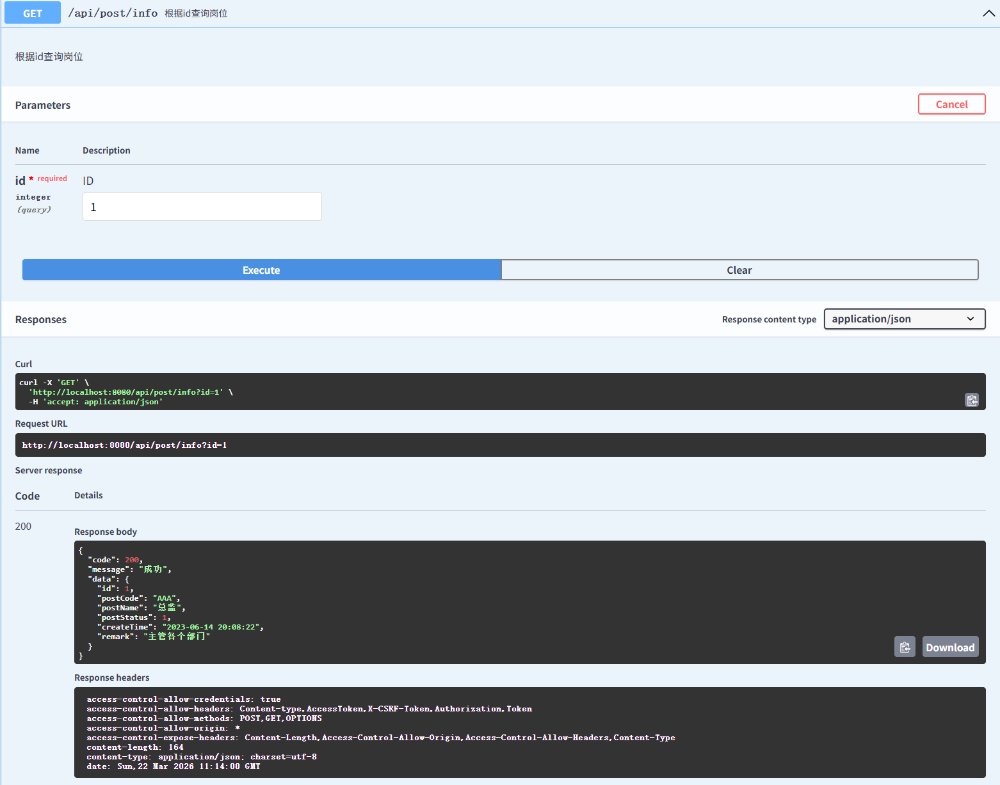

## 4.4 修改岗位接口

### 4.4.1 dao层

```go
// UpdateSysPost 修改岗位
func UpdateSysPost(post entity.SysPost) (sysPost entity.SysPost) {
	// 先查找源数据
	db.Db.First(&sysPost, post.ID)
	sysPost.PostName = post.PostName
	sysPost.PostCode = post.PostCode
	sysPost.PostStatus = post.PostStatus
	if post.Remark != "" {
		sysPost.Remark = post.Remark
	}
	// sysPost存在主键，因此Save会执行更新操作
	db.Db.Save(&sysPost)
	return sysPost
}
```

修改和更新的区别就是有无主键，修改的时候会获取到主键，因此执行`Save()`时会使用update语句而不是insert语句。

### 4.4.2 service层

service层也是直接获取controller传来的post形参来实现修改。注意还要在接口中声明这个方法。

```go
// UpdateSysPost 修改岗位
func (s SysPostServiceImpl) UpdateSysPost(c *gin.Context, post entity.SysPost) {
	result.Success(c, dao.UpdateSysPost(post))
}
```

### 4.4.3 controller层

接下来是在controller中通过上下文来绑定结构体，并将这个包含新岗位的结构体post传入到service中完成修改。

```go
// UpdateSysPost 修改岗位
// @Summary 修改岗位接口
// @Producce json
// @Description 修改岗位接口
// @Param data body entity.SysPost true "data"
// @Success 200 {object} result.Result
// @router /api/post/update [put]
func UpdateSysPost(c *gin.Context) {
	_ = c.BindJSON(&sysPost)
	service.SysPostService().UpdateSysPost(c, sysPost)
}
```

### 4.4.4 router配置

```go
// register 路由注册
func register(router *gin.Engine) {
	// todo 添加接口url
	router.GET("/api/captcha", controller.Captcha)
	router.GET("/swagger/*any", ginSwagger.WrapHandler(swaggerFiles.Handler))
	router.POST("/api/login", controller.Login)
	router.POST("/api/post/add", controller.CreateSysPost)
	router.GET("/api/post/list", controller.GetSysPostList)
	router.GET("/api/post/info", controller.GetSysPostById)
	router.PUT("/api/post/update", controller.UpdateSysPost)
}
```

### 4.4.5 Swagger测试

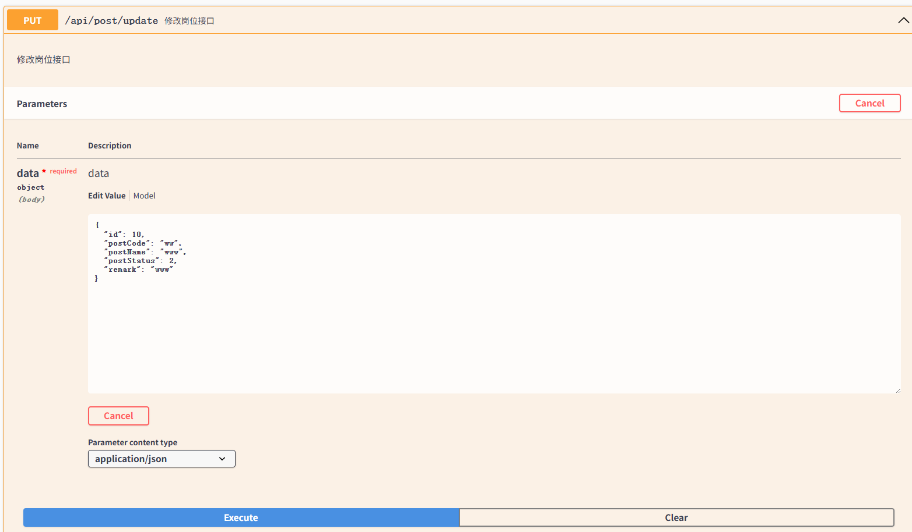

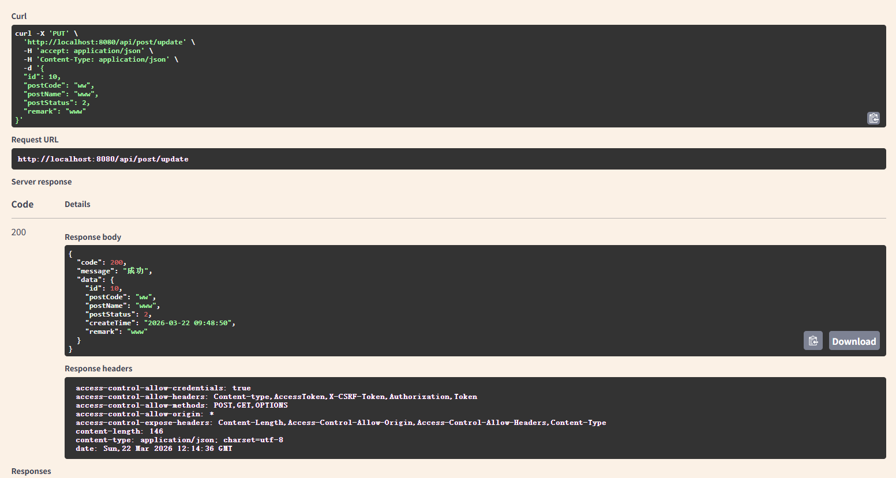

这样就实现了岗位修改。

## 4.5 删除岗位接口

由于删除只需要id参数，因此为了适配单个删除和多个删除，需要新增对应的实体类。

```go
// SysPostIdDto Id参数
type SysPostIdDto struct {
	Id uint `json:"id"`
}

func (SysPostIdDto) TableName() string {
	return "sys_post"
}
```

### 4.4.1 dao层

```go
// DeleteSysPostById 根据id删除岗位
func DeleteSysPostById(dto entity.SysPost) {
	db.Db.Delete(&dto)
}
```

### 4.4.2 service层

```go
// DeleteSysPostById 根据id删除岗位
func (s SysPostServiceImpl) DeleteSysPostById(c *gin.Context, post entity.SysPost) {
	dao.DeleteSysPostById(post)
	result.Success(c, true)
}
```

### 4.4.3 controller层

```go
// DeleteSysPostById 根据id删除岗位
// @Summary 根据id删除岗位
// @Produce json
// @Description 根据id删除岗位
// @Param data body entity.SysPostIdDto true "data"
// @Success 200 {object} result.Result
// @router /api/post/delete [delete]
func DeleteSysPostById(c *gin.Context) {
	var dto entity.SysPostIdDto
	_ = c.ShouldBindJSON(&dto)
	service.SysPostService().DeleteSysPostById(c, dto)
}
```

### 4.4.4 router配置

```go
// register 路由注册
func register(router *gin.Engine) {
	// todo 添加接口url
	router.GET("/api/captcha", controller.Captcha)
	router.GET("/swagger/*any", ginSwagger.WrapHandler(swaggerFiles.Handler))
	router.POST("/api/login", controller.Login)
	router.POST("/api/post/add", controller.CreateSysPost)
	router.GET("/api/post/list", controller.GetSysPostList)
	router.GET("/api/post/info", controller.GetSysPostById)
	router.PUT("/api/post/update", controller.UpdateSysPost)
	router.DELETE("/api/post/delete", controller.DeleteSysPostById)
}
```

### 4.4.5 Swagger 测试

访问`localhost:8080/swagger/index.html`即可使用swagger测试删除接口。

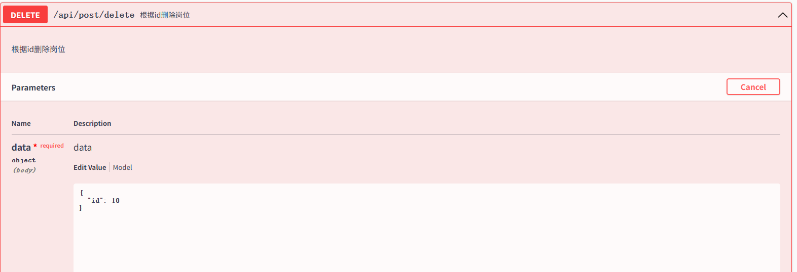

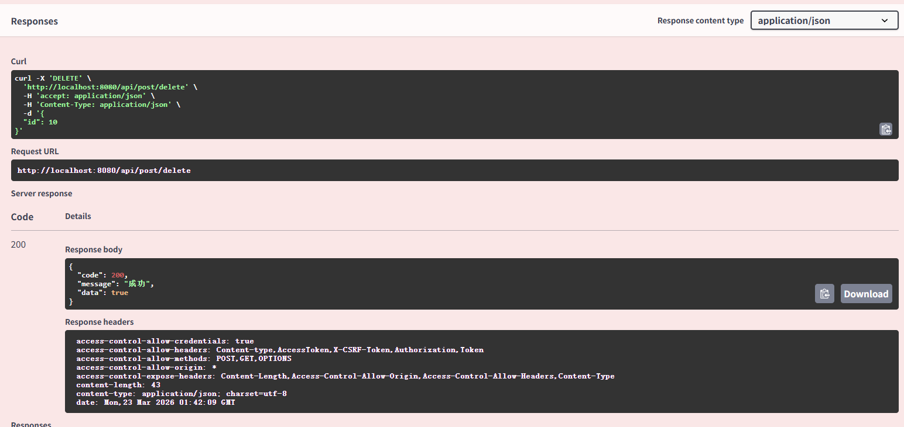

## 4.6 批量删除岗位

现在是批量删除岗位，需要新建对应的实体类，保存id数组。

```go
// DelSysPostDto 删除多个岗位
type DelSysPostDto struct {
	Ids []uint
}

func (DelSysPostDto) TableName() string {
	return "sys_post"
}
```

### 4.6.1 dao 层

```go
// BatchDeleteSysPost 批量删除岗位
func BatchDeleteSysPost(dto entity.DelSysPostDto) {
	db.Db.Where("id in (?)", dto.Ids).Delete(&entity.SysPost{})
}
```

### 4.6.2 service层

```go
// BatchDeleteSysPost 批量删除岗位
func (s SysPostServiceImpl) BatchDeleteSysPost(c *gin.Context, dto entity.DelSysPostDto) {
	dao.BatchDeleteSysPost(dto)
	result.Success(c, true)
}
```

### 4.6.3 controller层

```go
// BatchDeleteSysPost 批量删除岗位
// @Summary 批量删除岗位
// @Produce json
// @Description 批量删除岗位
// @Param data body entity.DelSysPostDto true "data"
// @Success 200 {object} result.Result
// @router /api/post/batch/delete [delete]
func BatchDeleteSysPost(c *gin.Context) {
	var dto entity.DelSysPostDto
	_ = c.ShouldBindJSON(&dto)
	service.SysPostService().BatchDeleteSysPost(c, dto)
}
```

### 4.6.4 router配置

```go
// register 路由注册
func register(router *gin.Engine) {
	// todo 添加接口url
	router.GET("/api/captcha", controller.Captcha)
	router.GET("/swagger/*any", ginSwagger.WrapHandler(swaggerFiles.Handler))
	router.POST("/api/login", controller.Login)
	router.POST("/api/post/add", controller.CreateSysPost)
	router.GET("/api/post/list", controller.GetSysPostList)
	router.GET("/api/post/info", controller.GetSysPostById)
	router.PUT("/api/post/update", controller.UpdateSysPost)
	router.DELETE("/api/post/delete", controller.DeleteSysPostById)
	router.DELETE("/api/post/batch/delete", controller.BatchDeleteSysPost)
}
```

### 4.6.5 Swagger测试

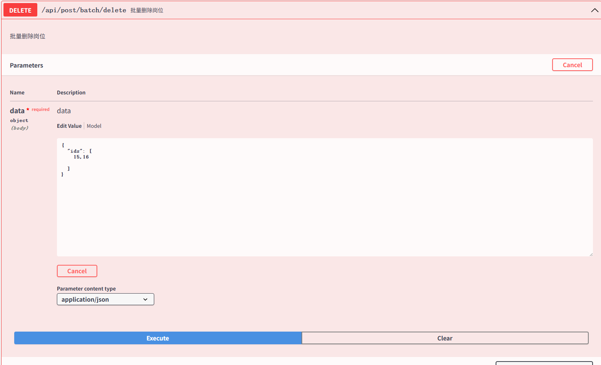

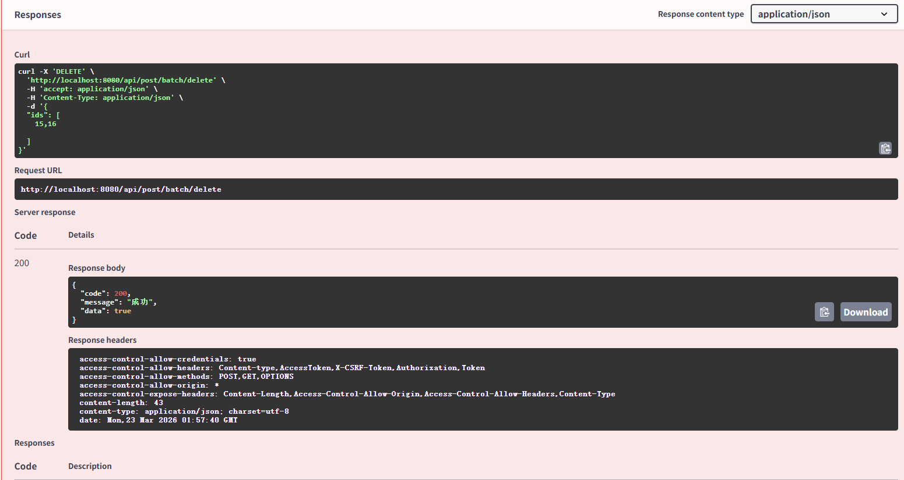

## 4.7 修改岗位状态

修改岗位状态时，只需要获取岗位id和新的岗位状态即可，因此需要将这两个属性封装到新的实体类。

```go
// UpdateSysPostStatusDto 修改状态参数
type UpdateSysPostStatusDto struct {
	Id uint `json:"id"`
	PostStatus int `json:"postStatus"`
}

func (UpdateSysPostStatusDto) TableName() string {
	return "sys_post"
}
```

### 4.7.1 dao层

```go
// UpdateSysPostStatus 修改岗位状态
func UpdateSysPostStatus(dto entity.UpdateSysPostStatusDto) {
	var sysPost entity.SysPost
	db.Db.First(&sysPost, dto.Id)
	sysPost.PostStatus = dto.PostStatus
	db.Db.Save(&sysPost)
}
```

### 4.7.2 service层

```go
// UpdateSysPostStatus 修改岗位状态
func (s SysPostServiceImpl) UpdateSysPostStatus(c *gin.Context, dto entity.UpdateSysPostStatusDto) {
	dao.UpdateSysPostStatus(dto)
	result.Success(c, true)
}
```

### 4.7.3 controller层

```go
// UpdateSysPostStatus 修改岗位状态
// @Summary 岗位状态启用/停用窗口
// @Produce json
// @Description 岗位状态启用/停用窗口
// @Param data body entity.UpdateSysPostStatusDto true "data"
// @Success 200 {object} result.Result
// @router /api/post/updateStatus [put]
func UpdateSysPostStatus(c *gin.Context) {
	var dto entity.UpdateSysPostStatusDto
	_ = c.BindJSON(&dto)
	service.SysPostService().UpdateSysPostStatus(c, dto)
}
```

### 4.7.4 router配置

```go
// register 路由注册
func register(router *gin.Engine) {
	// todo 添加接口url
	router.GET("/api/captcha", controller.Captcha)
	router.GET("/swagger/*any", ginSwagger.WrapHandler(swaggerFiles.Handler))
	router.POST("/api/login", controller.Login)
	router.POST("/api/post/add", controller.CreateSysPost)
	router.GET("/api/post/list", controller.GetSysPostList)
	router.GET("/api/post/info", controller.GetSysPostById)
	router.PUT("/api/post/update", controller.UpdateSysPost)
	router.DELETE("/api/post/delete", controller.DeleteSysPostById)
	router.DELETE("/api/post/batch/delete", controller.BatchDeleteSysPost)
	router.PUT("/api/post/updateStatus", controller.UpdateSysPostStatus)
}
```

### 4.7.5 swagger配置


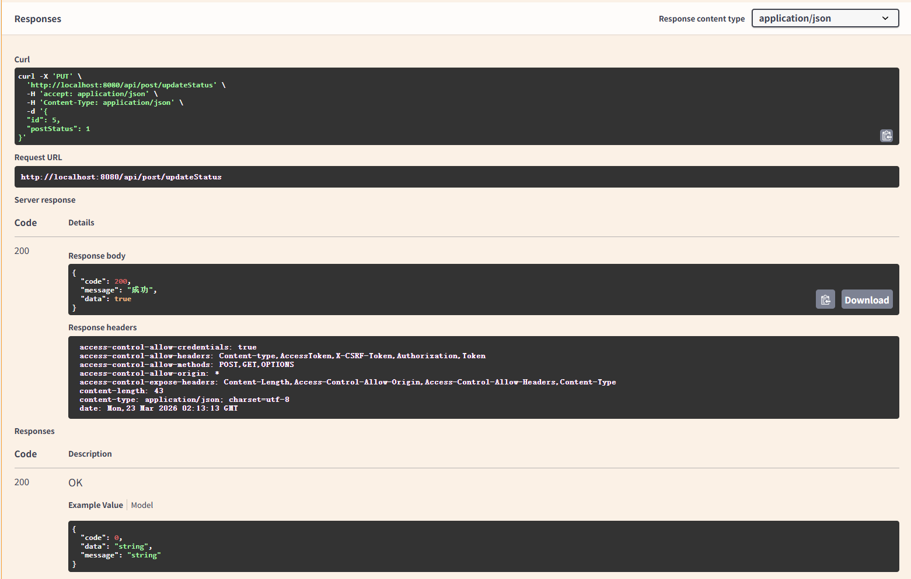

## 4.8 岗位下拉列表

岗位下拉列表是为了给前端的用户快速查看当前的所有岗位，这里只需要岗位的id和岗位名字。因此需要封装实体类。

```go
// SysPostVO 返回给前端的岗位列表信息
type SysPostVO struct {
	Id uint `json:"id"`
	PostName string `json:"postName"`
}
```

### 4.8.1 dao层

```go
// QuerySysPostVOList 岗位下拉列表
func QuerySysPostVOList() (sysPostVO []entity.SysPostVO) {
    db.Db.Table("sys_post").Select("id, post_name").Scan(&sysPostVO)
    return sysPostVO
}
```

### 4.8.2 service层

```go
// QuerySysPostVOList 查询岗位下拉列表
func (s SysPostServiceImpl) QuerySysPostVOList(c *gin.Context) {
    result.Success(c, dao.QuerySysPostVOList())
}
```

### 4.8.3 controller层

```go
// QuerySysPostVOList 查询岗位下拉列表
// @Summary 岗位下拉列表
// @Produce json
// @Description 岗位下拉列表
// @Success 200 {object} result.Result
// @router /api/post/vo/list [get]
func QuerySysPostVOList(c *gin.Context) {
	service.SysPostService().QuerySysPostVOList(c)
}
```

### 4.8.4 router配置

```go
// register 路由注册
func register(router *gin.Engine) {
	// todo 添加接口url
	router.GET("/api/captcha", controller.Captcha)
	router.GET("/swagger/*any", ginSwagger.WrapHandler(swaggerFiles.Handler))
	router.POST("/api/login", controller.Login)
	router.POST("/api/post/add", controller.CreateSysPost)
	router.GET("/api/post/list", controller.GetSysPostList)
	router.GET("/api/post/info", controller.GetSysPostById)
	router.PUT("/api/post/update", controller.UpdateSysPost)
	router.DELETE("/api/post/delete", controller.DeleteSysPostById)
	router.DELETE("/api/post/batch/delete", controller.BatchDeleteSysPost)
	router.PUT("/api/post/updateStatus", controller.UpdateSysPostStatus)
	router.GET("/api/post/vo/list", controller.QuerySysPostVOList)
}
```

### 4.8.5 swagger测试

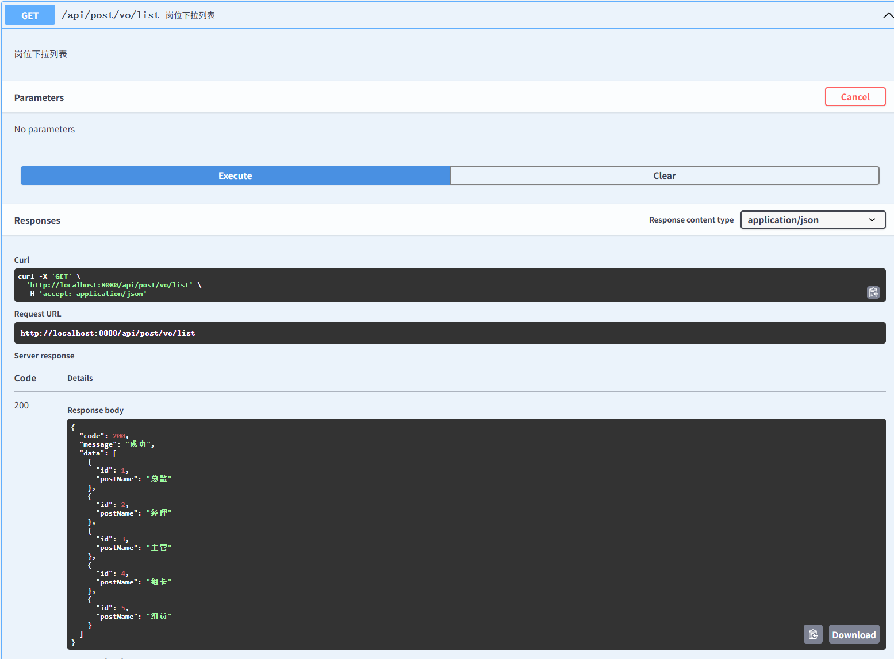

# 5. 部门相关接口

用户除了有岗位，还有部门。这样，需要先创建实体类`sysDept.go`。

```go
// Package entity 部门相关模型
package entity

import "Go-Management-System/common/util"

// SysDept 部门模型
type SysDept struct {
	ID uint `gorm:"column:id;comment:'主键';primary_key;NOT NULL" json:"id"`
	ParentId uint `gorm:"column:parent_id;comment:'父id';NOT NULL" json:"parentId"`
	DeptType uint `gorm:"column:dept_type;comment:'部门类型（1->公司，2->中心，3->部门）';NOT NULL" json:"deptType"`
	DeptName string `gorm:"column:dept_name;varchar(30);comment:'部门名称';NOT NULL" json:"deptName"`
	DeptStatus int `gorm:"column:dept_status;default:1;comment:'部门状态（1->正常，2->停用）'" json:"deptStatus"`
	CreateTime util.HTime `gorm:"column:create_time;comment:'创建时间';NOT NULL" json:"createTime"`
	Children []SysDept `gorm:"-" json:"children"`
}

func (SysDept) TableName() string {
	return "sys_dept"
}
```

## 5.1 查询部门列表

### 5.1.1 dao层

在`sysDept.go`中实现。

```go
// Package dao 部门dao层
package dao

import (
	"Go-Management-System/api/entity"
	. "Go-Management-System/pkg/db"
)

// GetSysDeptList 查询部门列表
func GetSysDeptList(DeptName string, DeptStatus string) (sysDept []entity.SysDept) {
	curDb := Db.Table("sys_dept")
	if DeptName != "" {
		curDb = curDb.Where("dept_name LIKE ?", "%"+DeptName+"%")
	}
	if DeptStatus != "" {
		curDb = curDb.Where("dept_status LIKE ?", "%"+DeptStatus+"%")
	}
	curDb.Find(&sysDept)
	return sysDept
}
```

### 5.1.2 service层

```go
// Package service 部门service层
package service

import (
	"Go-Management-System/api/dao"
	"Go-Management-System/common/result"

	"github.com/gin-gonic/gin"
)

type ISysDeptService interface {
	GetSysDeptList(c *gin.Context, DeptName, DeptStatus string)
}

type SysDeptServiceImpl struct {
}

var sysDeptService = SysDeptServiceImpl{}

func SysDeptService() ISysDeptService {
	return &sysDeptService
}

// GetSysDeptList 部门列表查询
func (s SysDeptServiceImpl) GetSysDeptList(c *gin.Context, DeptName, DeptStatus string) {
	result.Success(c, dao.GetSysDeptList(DeptName, DeptStatus))
}
```

### 5.1.3 controller层

```go
// Package controller 部门controller层
package controller

import (
	"Go-Management-System/api/service"

	"github.com/gin-gonic/gin"
)

var sysDeptService = service.SysDeptService()

// GetSysDeptList 查询部门列表
// @Summary 查询部门列表接口
// @Produce json
// @Description 查询部门列表接口
// @Param deptName query string false "部门名称"
// @Param deptStatus query string false "部门状态"
// @Succss 200 {object} result.Result
// @router /api/dept/list [get]
func GetSysDeptList(c *gin.Context) {
	DeptName := c.Query("deptName")
	DeptStatus := c.Query("deptStatus")
	sysDeptService.GetSysDeptList(c, DeptName, DeptStatus)
}
```

### 5.1.4 router配置

```go
router.GET("/api/dept/list", controller.GetSysDeptList)
```

### 5.1.5 swagger测试

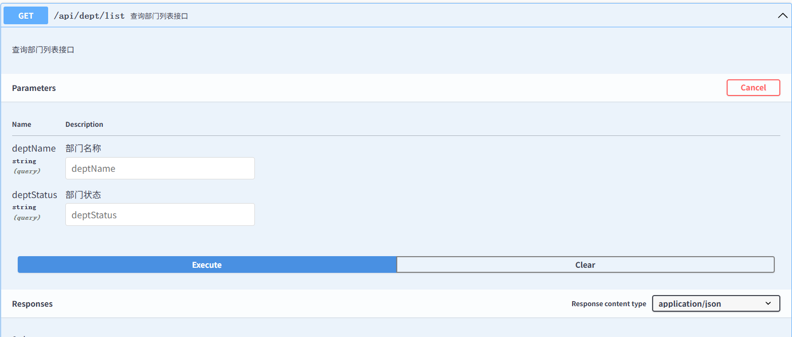

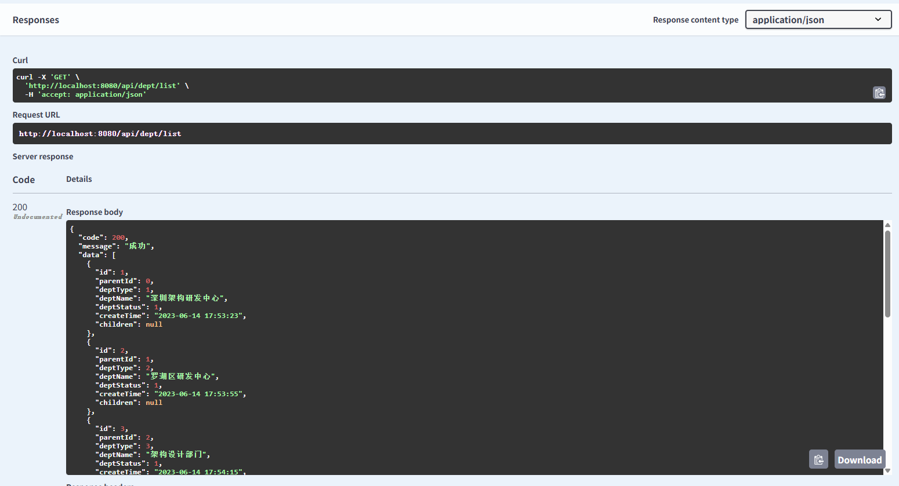

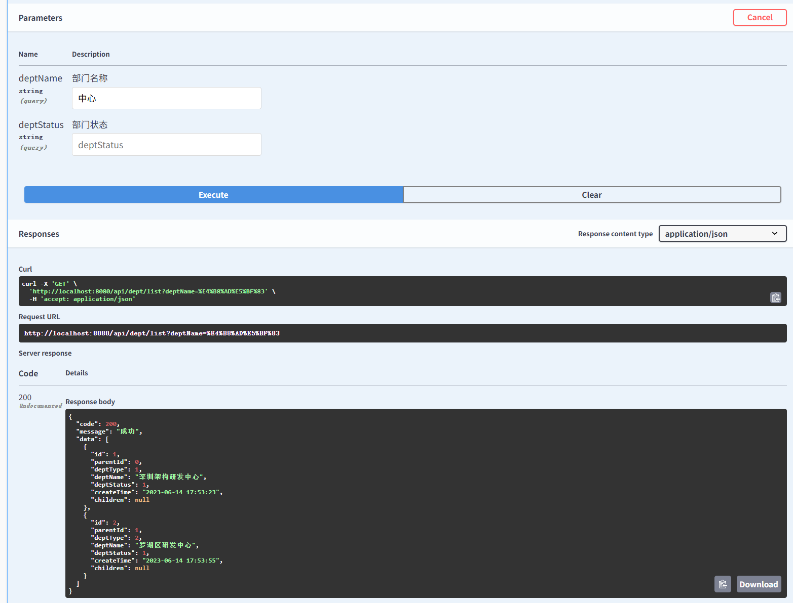

## 5.2 新增部门

新增部门时，需要实现名字查重效果，因此需要先写好根据部门名称查询的功能。

### 5.2.1 dao层

在dao下实现根据名称查询和新增部门。

```go
// GetSysDeptByName 根据部门名称查询
func GetSysDeptByName(deptName string) (sysDept entity.SysDept) {
	Db.Where("dept_name = ?", deptName).First(&sysDept)
	return sysDept
}

// CreateSysDept 新增部门
func CreateSysDept(sysDept entity.SysDept) bool {
	// 查重
	sysDeptByName := GetSysDeptByName(sysDept.DeptName)
	if sysDeptByName.ID > 0 {
		return false
	}
	if sysDept.DeptType == 1 {
		sysDept := entity.SysDept{
			DeptStatus: sysDept.DeptStatus,
			ParentId:   0,
			DeptType:   sysDept.DeptType,
			DeptName:   sysDept.DeptName,
			CreateTime: util.HTime{Time: time.Now()},
		}
		Db.Create(&sysDept)
		return true
	} else {
		sysDept := entity.SysDept{
			DeptStatus: sysDept.DeptStatus,
			ParentId:   sysDept.ParentId,
			DeptType:   sysDept.DeptType,
			DeptName:   sysDept.DeptName,
			CreateTime: util.HTime{Time: time.Now()},
		}
		Db.Create(&sysDept)
		return true
	}
}
```

### 5.2.2 service层

```go
// CreateSysDept 新增部门
func (s SysDeptServiceImpl) CreateSysDept(c *gin.Context, sysDept entity.SysDept) {
	ok := dao.CreateSysDept(sysDept)
	if !ok {
		result.Failed(c, int(result.ApiCode.DEPTISEXIST), result.ApiCode.GetMessage(result.ApiCode.DEPTISEXIST))
		return
	}
	result.Success(c, true)
}
```

### 5.2.3 controller层

```go
// CreateSysDept 新增部门
// @Summary 新增部门接口
// @Produce json
// @Description 新增部门接口
// @Param data body entity.SysDept true "data"
// @Success 200 {object} result.Result
// @router /api/dept/add [post]
func CreateSysDept(c *gin.Context) {
	_ = c.BindJSON(&sysDept)
	service.SysDeptService().CreateSysDept(c, sysDept)
}
```

### 5.2.4 router配置

```go
router.POST("/api/dept/add", controller.CreateSysDept)
```

### 5.2.5 swagger测试

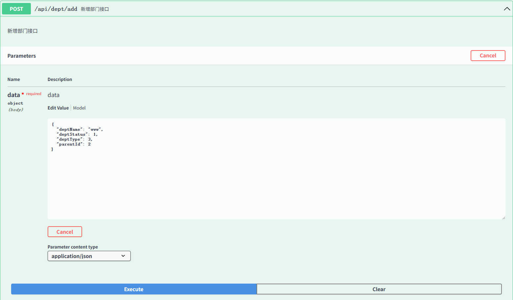

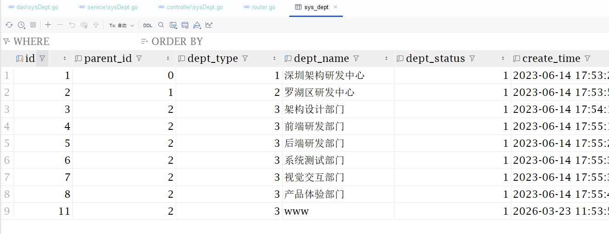

## 5.3 根据id查询部门

### 5.3.1 dao层

```go
// GetSysDeptById 根据id查询部门
func GetSysDeptById(sysDept entity.SysDept) entity.SysDept {
    Db.Where("id = ?", sysDept.ID).First(&sysDept)
    return sysDept
}
```

### 5.3.2 service层

```go
// GetSysDeptById 根据id查询部门
func (s SysDeptServiceImpl) GetSysDeptById(c *gin.Context, sysDept entity.SysDept) {
	result.Success(c, dao.GetSysDeptById(sysDept))
}
```

### 5.3.3 controller层

```go
// GetSysDeptById 根据id查询部门
// @Summary 根据id查询部门
// @Produce json
// @Description 根据id查询部门
// @Param id query int true "id"
// @Success 200 {object} result.Result
// @router /api/dept/info [get]
func GetSysDeptById(c *gin.Context) {
	id, _ := strconv.Atoi(c.Query("id"))
	sysDept.ID = uint(id)
	service.SysDeptService().GetSysDeptById(c, sysDept)
}
```

### 5.3.4 router配置

```go
router.GET("/api/dept/info", controller.GetSysDeptById)
```

### 5.3.5 swagger测试

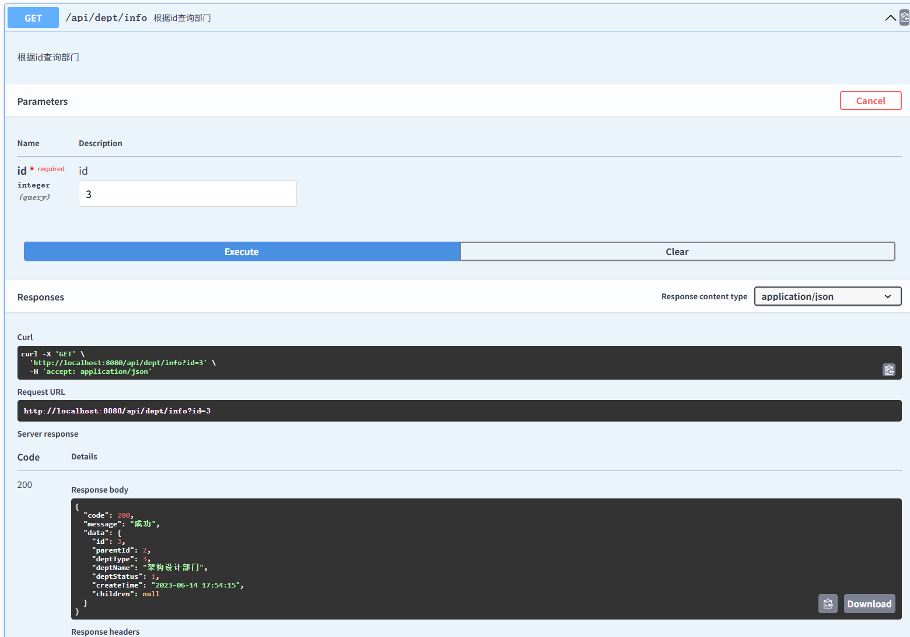

## 5.4 修改部门

### 5.4.1 dao层

首先根据id查询到旧数据，用前端获取的新数据来覆盖旧数据然后调用Save即可。

```go
// UpdateSysDept 修改部门
func UpdateSysDept(dept entity.SysDept) (sysDept entity.SysDept){
	Db.First(&sysDept, dept.ID)
	sysDept.ParentId = dept.ParentId
	sysDept.DeptName = dept.DeptName
	sysDept.DeptType = dept.DeptType
	sysDept.DeptStatus = dept.DeptStatus
	Db.Save(&sysDept)
	return sysDept
}
```

### 5.4.2 service层

```go
// UpdateSysDept 修改部门
func (s SysDeptServiceImpl) UpdateSysDept(c *gin.Context, sysDept entity.SysDept) {
	dao.UpdateSysDept(sysDept)
	result.Success(c, sysDept)
}
```

### 5.4.3 controller层

```go
// UpdateSysDept 修改部门
// @Summary 修改部门
// @Produce json
// @Description 修改部门
// @Param data body entity.SysDept true "data"
// @Success 200 {object} result.Result
// @router /api/dept/update [put]
func UpdateSysDept(c *gin.Context) {
	_ = c.BindJSON(&sysDept)
	service.SysDeptService().UpdateSysDept(c, sysDept)
}
```

### 5.4.4 router配置

```go
router.PUT("/api/dept/update", controller.UpdateSysDept)
```

### 5.4.5 swagger测试

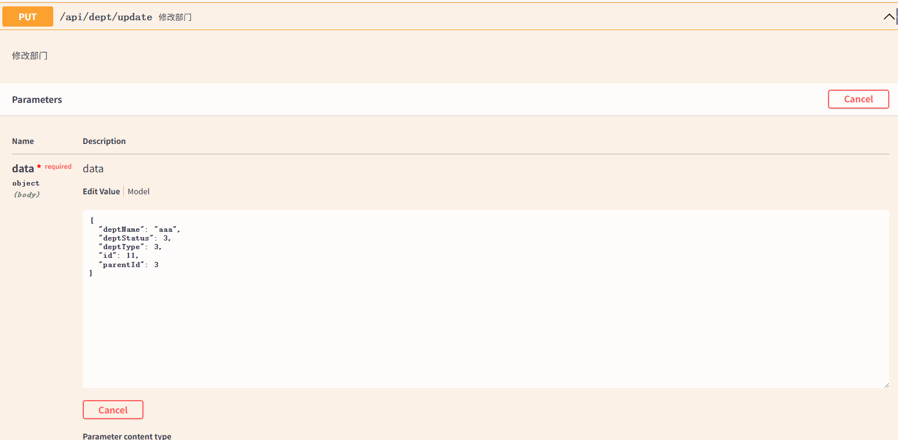

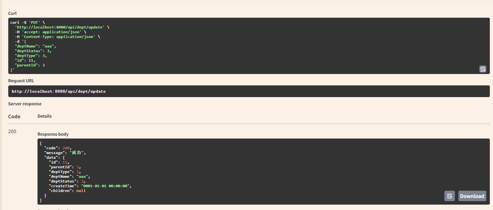

## 5.5 删除部门

### 5.4.1 entity

删除只需要获取id，因此创建对应的实体类。

```go
// SysDeptIdDto 接收id参数执行删除
type SysDeptIdDto struct {
	Id int `json:"id"`
}

func (SysDeptIdDto) TableName() string {
	return "sys_dept"
}
```

### 5.4.2 dao层

这里的删除有点复杂。部门存在上级部门和下级部门，最下级的部门可以直接删除，而上级的部门需要先将下级部门全部删除。

```go
// GetSysAdminDept 查询部门是否有人
func GetSysAdminDept(id int) (sysAdmin entity.SysAdmin) {
	Db.Where("dept_id = ?", id).First(&sysAdmin)
	return sysAdmin
}

// DeleteSysDeptById 删除部门
func DeleteSysDeptById(dto entity.SysDeptIdDto) bool {
	sysAdmin := GetSysAdminDept(dto.Id)
	if sysAdmin.ID > 0 {
		return false
	}
	Db.Where("parent_id = ?", dto.Id).Delete(&entity.SysDept{})
	Db.Delete(&entity.SysDept{}, dto.Id)
	return true
}
```

这里首先查找当前部门是否有人，有人则不能删除。

### 5.4.3 service层

```go
// DeleteSysDeptById 删除部门
func (s SysDeptServiceImpl) DeleteSysDeptById(c *gin.Context, dto entity.SysDeptIdDto) {
	ok := dao.DeleteSysDeptById(dto)
	if !ok {
		result.Failed(c, int(result.ApiCode.DEPTISDISTRIBUTE), result.ApiCode.GetMessage(result.ApiCode.DEPTISDISTRIBUTE))
		return
	}
	result.Success(c, true)
}
```

### 5.4.4 controller层

```go
// DeleteSysDeptById 删除部门
// @Summary 删除部门
// @Produce json
// @Description 删除部门
// @Param data body entity.SysDeptIdDto true "data"
// @Success 200 {object} result.Result
// @router /api/dept/delete [delete]
func DeleteSysDeptById(c *gin.Context) {
    _ = c.BindJSON(&sysDeptIdDto)
    service.SysDeptService().DeleteSysDeptById(c, sysDeptIdDto)
}
```

### 5.4.5 router配置

```go
router.DELETE("/api/dept/delete", controller.DeleteSysDeptById)
```

### 5.4.6 swagger测试

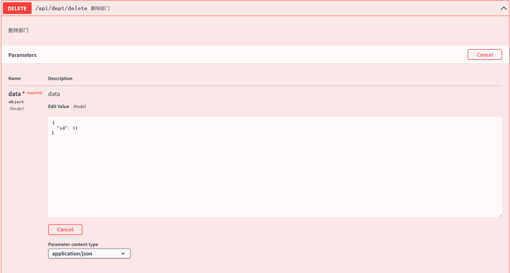

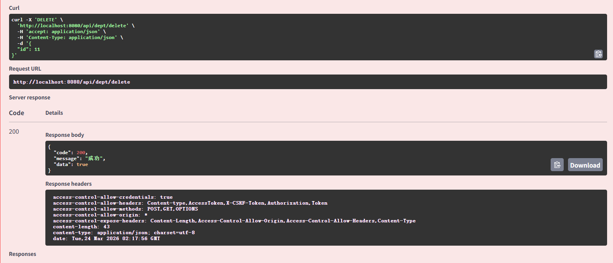

## 5.6 部门下拉列表

这里需要实现部门下拉列表，用来向前端展示所有的部门，新增用户时能够查看所有部门来选择。

### 5.6.1 entity的VO对象

这里的数据用于向前端展示，只需要获取id、父部门id和部门名称即可，需要封装成VO结构体。

```go
// SysDeptVO 向前端返回的对象
type SysDeptVO struct {
	Id uint `json:"id"`
	ParentId uint `json:"parentId"`
	Label string `json:"label"`
}
func (SysDeptVO) TableName() string {
	return "sys_dept"
}
```

### 5.6.2 dao层

```go
// QuerySysDeptVOList 查询部门列表
func QuerySysDeptVOList() (sysDeptVO []entity.SysDeptVO) {
	Db.Table("sys_dept").Select("id, dept_name AS label, parent_id").Scan(&sysDeptVO)
	return sysDeptVO
}
```

### 5.6.3 service层

```go
// QuerySysDeptVOList 查询部门列表
func (s SysDeptServiceImpl) QuerySysDeptVOList(c *gin.Context) {
	result.Success(c, dao.QuerySysDeptVOList())
}
```

### 5.6.4 controller层

```go
// QuerySysDeptVOList 查询部门列表
// @Summary 查询部门列表
// @Produce json
// @Description 查询部门列表
// @Success 200 {object} result.Result
// @router /api/dept/vo/list [get]
func QuerySysDeptVOList(c *gin.Context) {
	service.SysDeptService().QuerySysDeptVOList(c)
}
```

### 5.6.5 router配置

```go
router.GET("/api/dept/vo/list", controller.QuerySysDeptVOList)
```

### 5.6.6 swagger测试

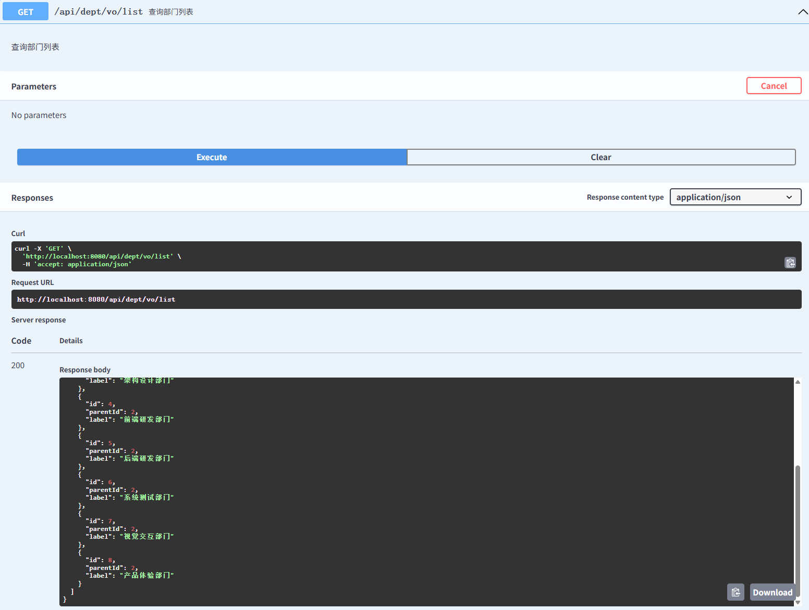

# 6. 菜单相关接口

这里的菜单接口用于绑定角色与角色选定的menu。

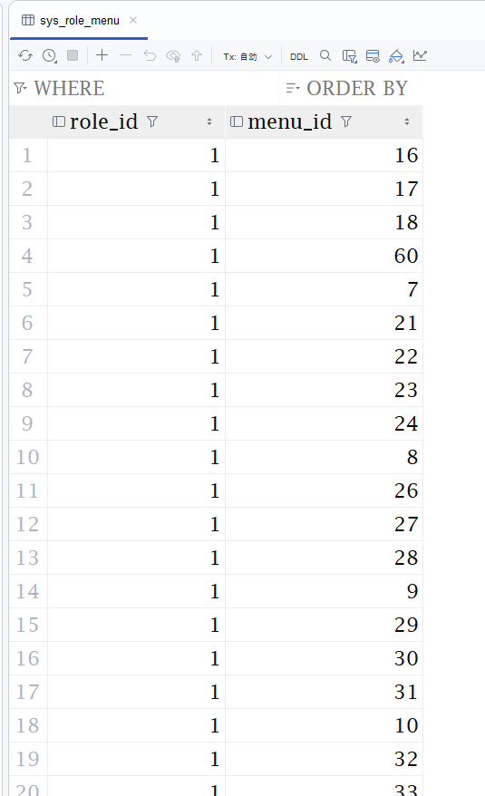

## 6.1 新增菜单

首先制作菜单的对应实体类`sysRoleMenu.go`。

```go
// Package entity 角色菜单模型
package entity

// SysRoleMenu 角色与菜单关系模型
type SysRoleMenu struct {
	RoleId uint `gorm:"column:role_id;comment:'角色ID';NOT NULL" json:"roleId"`
	MenuId uint `gorm:"column:menu_id;comment:'用户id';NOT NULL" json:"menuId"`
}

func (SysRoleMenu) TableName() string {
	return "sys_role_menu"
}

```

同时，也要创建菜单的实体类`sysMenu.go`。

```go
// Package entity 菜单模型
package entity

import "Go-Management-System/common/util"

// SysMenu 菜单模型
type SysMenu struct {
	ID         uint       `gorm:"column:id;comment:'主键';primaryKey;NOT NULL" json:"id"`
	ParentId   uint       `gorm:"column:parent_id;comment:'父菜单id'" json:"parentId"`
	MenuName   string     `gorm:"column:menu_name;varchar(100);comment:'菜单名称'" json:"menuName"`
	Icon       string     `gorm:"column:icon;varchar(100);comment:'菜单图标'" json:"icon"`
	Value      string     `gorm:"column:value;varchar(100);comment:'权限值'" json:"value"`
	MenuType   uint       `gorm:"column:menu_type;comment:'菜单类型：1->目录；2->菜单；3->按钮'" json:"menuType"`
	Url        string     `gorm:"column:url;varchar(100);comment:'菜单URL'" json:"url"`
	MenuStatus uint       `gorm:"column:menu_status;comment:'启动状态：1->启用；2->禁用'" json:"menuStatus"`
	Sort       uint       `gorm:"column:sort;comment:'排序'" json:"sort"`
	CreateTime util.HTime `gorm:"column:create_time;comment:'创建时间'" json:"createTime"`
	Children   []SysMenu  `gorm:"-" json:"children"`
}

func (SysMenu) TableName() string {
	return "sys_menu"
}

```

### 6.1.1 dao层

这里菜单有三种类型，需要分别进行传值。

```go
// Package dao 菜单dao层
package dao

import (
	"Go-Management-System/api/entity"
	"Go-Management-System/common/util"
	. "Go-Management-System/pkg/db"
	"fmt"
	"time"
)

// GetSysMenuByName 根据菜单名称进行查询
func GetSysMenuByName(menuName string) (sysMenu entity.SysMenu) {
	Db.Where("menu_name = ?", menuName).First(&sysMenu)
	return sysMenu
}

// CreateSysMenu 新增菜单
func CreateSysMenu(addSysMenu entity.SysMenu) bool {
	sysMenuByName := GetSysMenuByName(addSysMenu.MenuName)
	if sysMenuByName.ID > 0 {
		fmt.Println(sysMenuByName.ID)
		return false
	}
	// 目录
	if addSysMenu.MenuType == 1 {
		sysMenu := entity.SysMenu{
			ParentId:   0,
			MenuName:   addSysMenu.MenuName,
			Icon:       addSysMenu.Icon,
			MenuType:   addSysMenu.MenuType,
			Url:        addSysMenu.Url,
			MenuStatus: addSysMenu.MenuStatus,
			Sort:       addSysMenu.Sort,
			CreateTime: util.HTime{Time: time.Now()},
		}
		Db.Create(&sysMenu)
		return true
	} else if addSysMenu.MenuType == 2 {
		sysMenu := entity.SysMenu{
			ParentId:   addSysMenu.ParentId,
			MenuName:   addSysMenu.MenuName,
			Icon:       addSysMenu.Icon,
			MenuType:   addSysMenu.MenuType,
			MenuStatus: addSysMenu.MenuStatus,
			Value:      addSysMenu.Value,
			Url:        addSysMenu.Url,
			Sort:       addSysMenu.Sort,
			CreateTime: util.HTime{Time: time.Now()},
		}
		Db.Create(&sysMenu)
		return true
	} else if addSysMenu.MenuType == 3 {
		sysMenu := entity.SysMenu{
			ParentId:   addSysMenu.ParentId,
			MenuName:   addSysMenu.MenuName,
			MenuType:   addSysMenu.MenuType,
			MenuStatus: addSysMenu.MenuStatus,
			Value:      addSysMenu.Value,
			Sort:       addSysMenu.Sort,
			CreateTime: util.HTime{Time: time.Now()},
		}
		Db.Create(&sysMenu)
		return true
	}
	return false
}
```

### 6.1.2 service层

```go
// Package service 菜单service层
package service

import (
	"Go-Management-System/api/dao"
	"Go-Management-System/api/entity"
	"Go-Management-System/common/result"

	"github.com/gin-gonic/gin"
)

type ISysMenuService interface {
	CreateSysMenu(c *gin.Context, SysMenu entity.SysMenu)
}

type SysMenuServiceImpl struct {
}

var sysMenuService = SysMenuServiceImpl{}

func SysMenuService() ISysMenuService {
	return &sysMenuService
}

// CreateSysMenu 创建菜单
func (s SysMenuServiceImpl) CreateSysMenu(c *gin.Context, SysMenu entity.SysMenu) {
	ok := dao.CreateSysMenu(SysMenu)
	if !ok {
		result.Failed(c, int(result.ApiCode.MENUISEXIST), result.ApiCode.GetMessage(result.ApiCode.MENUISEXIST))
		return
	}
	result.Success(c, true)
}
```

### 6.1.3 controller层

```go
// Package controller 菜单controller层
package controller

import (
	"Go-Management-System/api/entity"
	"Go-Management-System/api/service"

	"github.com/gin-gonic/gin"
)

var sysMenu entity.SysMenu

// CreateSysMenu 创建菜单
// @Summary 新增菜单接口
// @Producce json
// @Description 新增菜单接口
// @Param data body entity.SysMenu true "data"
// @Success 200 {object} result.Result
// @router /api/menu/add [post]
func CreateSysMenu(c *gin.Context) {
	_ = c.BindJSON(&sysMenu)
	service.SysMenuService().CreateSysMenu(c, sysMenu)
}
```

### 6.1.4 router配置

```go
router.POST("/api/menu/add", controller.CreateSysMenu)
```

### 6.1.5 swagger测试

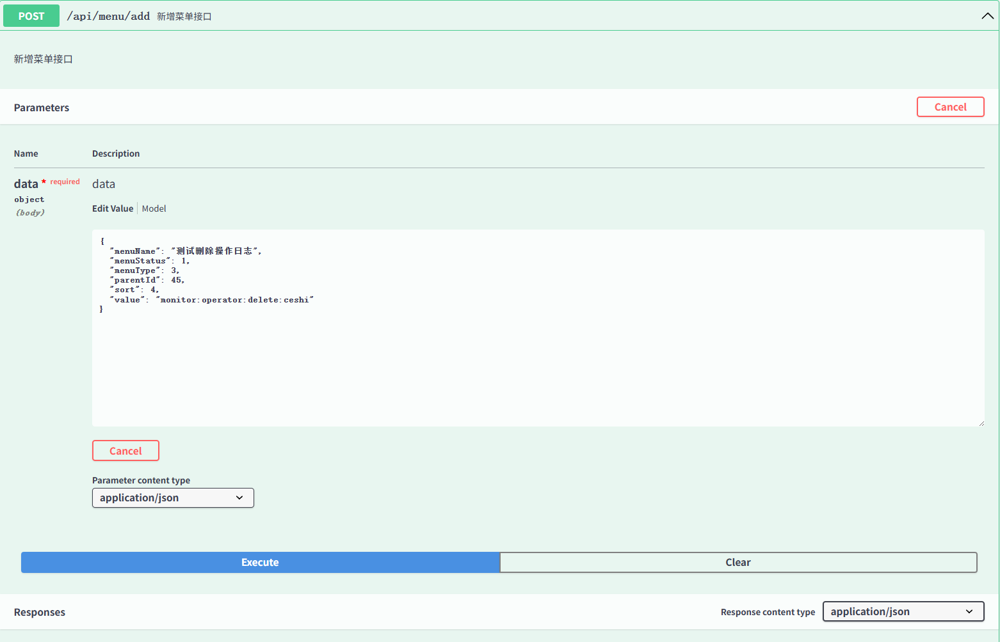

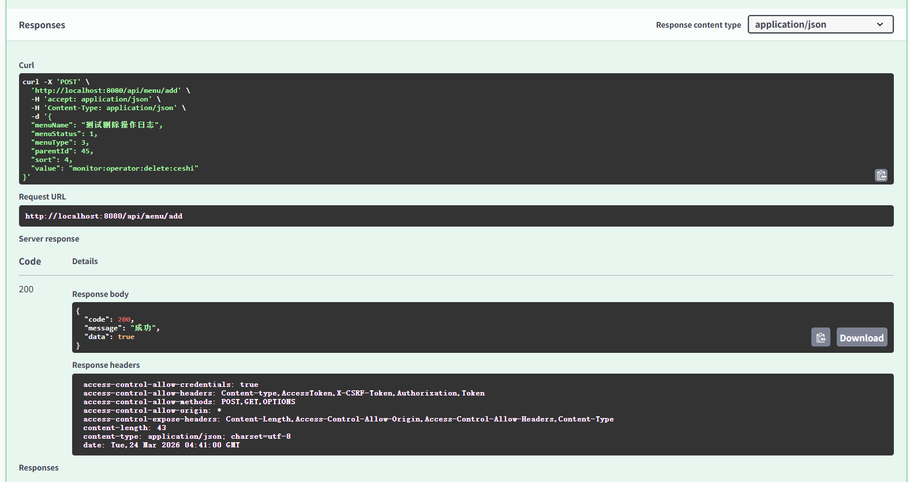

## 6.2 菜单下拉列表

前端的时候需要展示对应的菜单，因此需要获取菜单列表。

### 6.2.1 entity

首先创建对应的VO对象。

```go
// SysMenuVO 返回给前端的对象
type SysMenuVO struct {
	Id       uint   `gorm:"column:id" json:"id"`
	ParentId uint   `gorm:"column:parent_id" json:"parentId"`
	Label    string `gorm:"column:label" json:"label"`
}

func (SysMenuVO) TableName() string {
	return "sys_menu"
}
```

### 6.2.2 dao层

```go
// QuerySysMenuVOList 查询菜单列表
func QuerySysMenuVOList() (sysMenoVO []entity.SysMenuVO) {
	Db.Table("sys_menu").Select("id, menu_name AS label, parent_id").Scan(&sysMenoVO)
	return sysMenoVO
}
```

### 6.2.3 service层

```go
// QuerySysMenuVOList 查询菜单列表
func (s SysMenuServiceImpl) QuerySysMenuVOList(c *gin.Context) {
	result.Success(c, dao.QuerySysMenuVOList())
}
```

### 6.2.4 controller层

```go
// QuerySysMenuVOList 查询菜单列表
// @Summary 查询菜单列表
// @Producce json
// @Description 查询菜单列表
// @Success 200 {object} result.Result
// @router /api/menu/vo/list [get]
func QuerySysMenuVOList(c *gin.Context) {
	_ = c.BindJSON(&sysMenuVO)
	service.SysMenuService().QuerySysMenuVOList(c)
}
```

### 6.2.5 router配置

```go
router.GET("/api/menu/vo/list", controller.QuerySysMenuVOList)
```

### 6.2.6 swagger测试

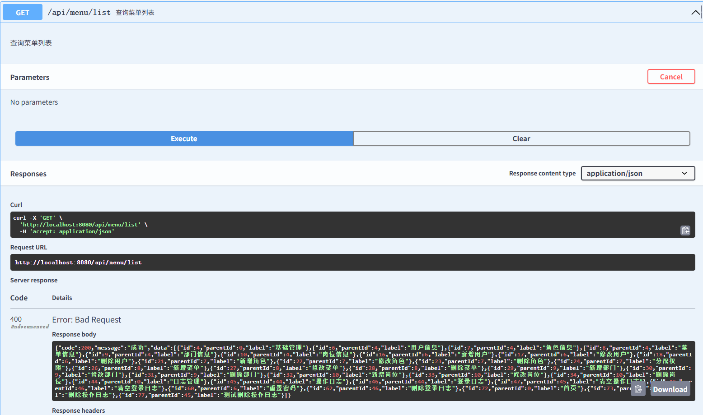

## 6.3 根据id查询菜单

### 6.3.1 dao层

```go
// GetSysMenuById 根据id获取菜单
func GetSysMenuById(id int) (sysMenu entity.SysMenu) {
    Db.First(&sysMenu, id)
    return sysMenu
}
```

### 6.3.2 service层

```go
// GetSysMenuById 根据id查询菜单
func (s SysMenuServiceImpl) GetSysMenuById(c *gin.Context, id int) {
    result.Success(c, dao.GetSysMenuById(id))
}
```

### 6.3.3 controller层

```go
// GetSysMenuById 根据id查询菜单
// @Summary 根据id查询菜单
// @Producce json
// @Description 根据id查询菜单
// @Param id query int true "id"
// @Success 200 {object} result.Result
// @router /api/menu/info [get]
func GetSysMenuById(c *gin.Context) {
	id, _ := strconv.Atoi(c.Query("id"))
	service.SysMenuService().GetSysMenuById(c, id)
}
```

### 6.3.4 router配置

```go
router.GET("/api/menu/info", controller.GetSysMenuById)
```

### 6.3.5 swagger测试

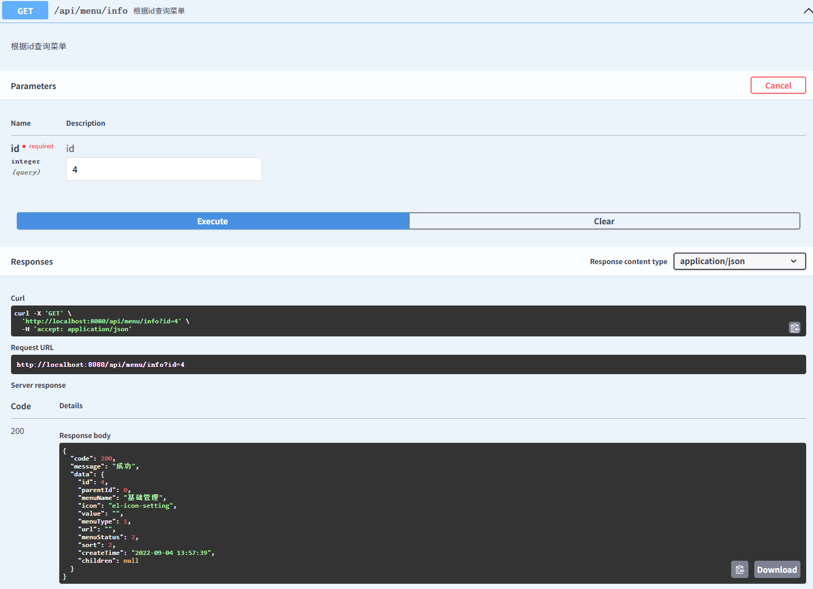

## 6.4 修改菜单

### 6.4.1 dao层

同样的，先根据获取的menu从数据库中查找，然后再替换保存。

```go
// UpdateSysMenu 编辑菜单
func UpdateSysMenu(menu entity.SysMenu) (sysMenu entity.SysMenu) {
	Db.First(&sysMenu, menu.ID)
	sysMenu.ParentId = menu.ParentId
	sysMenu.MenuName = menu.MenuName
	sysMenu.Icon = menu.Icon
	sysMenu.Value = menu.Value
	sysMenu.MenuType = menu.MenuType
	sysMenu.Url = menu.Url
	sysMenu.MenuStatus = menu.MenuStatus
	sysMenu.Sort = menu.Sort
	Db.Save(&sysMenu)
	return sysMenu
}
```

### 6.4.2 service层

```go
// UpdateSysMenu 更新菜单
func (s SysMenuServiceImpl) UpdateSysMenu(c *gin.Context, menu entity.SysMenu) {
	result.Success(c, dao.UpdateSysMenu(menu))
}
```

### 6.4.3 controller层

```go
// UpdateSysMenu 修改菜单
// @Summary 修改菜单
// @Producce json
// @Description 修改菜单
// @Param data body entity.SysMenu true "data"
// @Success 200 {object} result.Result
// @router /api/menu/update [put]
func UpdateSysMenu(c *gin.Context) {
	_ = c.BindJSON(&sysMenu)
	service.SysMenuService().UpdateSysMenu(c, sysMenu)
}
```

### 6.4.4 router配置

```go
router.PUT("/api/menu/update", controller.UpdateSysMenu)
```

### 6.4.5 swagger测试

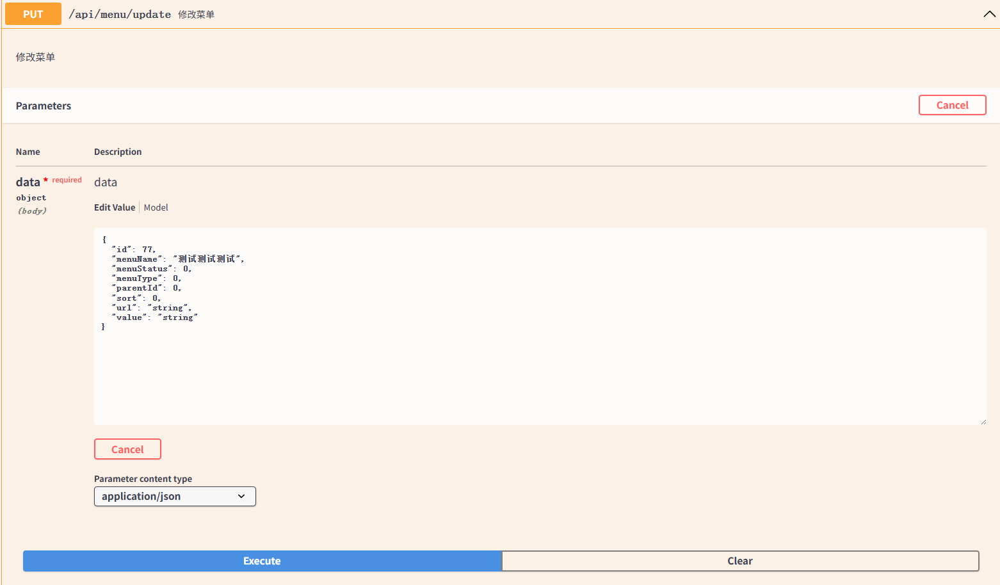

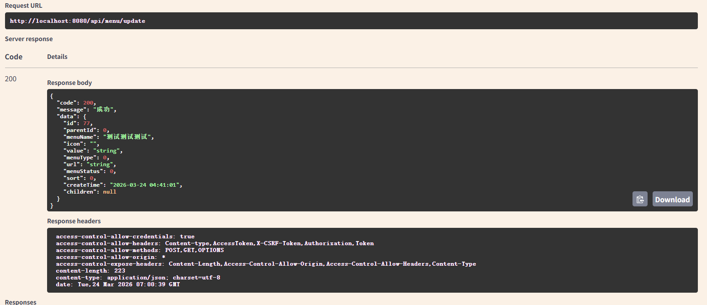

## 6.5 删除菜单功能

### 6.5.1 entity

首先创建dto对象。

```go
// SysMenuIdDto 只需要id
type SysMenuIdDto struct {
	Id uint `json:"id"`
}

func (SysMenuIdDto) TableName() string {
	return "sys_menu"
}
```

### 6.5.1 dao层

删除前首先要确定有没有用户使用了这个菜单。

```go
// GetSysRoleMenu 根据id查找菜单是否联系了用户
func GetSysRoleMenu(id uint) (sysRoleMenu entity.SysRoleMenu) {
	Db.Where("menu_id = ?", id).First(&sysRoleMenu)
	return sysRoleMenu
}

// DeleteSysMenuById 删除菜单
func DeleteSysMenuById(dto entity.SysMenuIdDto) bool {
	sysRoleMenu := GetSysRoleMenu(dto.Id)
	if sysRoleMenu.MenuId > 0 {
		return false
	}
	Db.Where("parent_id = ?", dto.Id).Delete(&entity.SysMenu{})
	Db.Delete(&entity.SysMenu{}, dto.Id)
	return true
}
```

### 6.5.3 service层

```go
// DeleteSysMenuById 删除菜单
func (s SysMenuServiceImpl) DeleteSysMenuById(c *gin.Context, dto entity.SysMenuIdDto) {
	ok := dao.DeleteSysMenuById(dto)
	if !ok {
		result.Failed(c, int(result.ApiCode.DELSYSMENUFAILED), result.ApiCode.GetMessage(result.ApiCode.DELSYSMENUFAILED))
		return
	}
	result.Success(c, true)
}
```

### 6.5.4 controller层

```go
// DeleteSysMenuById 删除菜单
// @Summary 删除菜单
// @Producce json
// @Description 删除菜单
// @Param data body entity.SysMenuIdDto true "data"
// @Success 200 {object} result.Result
// @router /api/menu/delete [delete]
func DeleteSysMenuById(c *gin.Context) {
    _ = c.BindJSON(&sysMenuIdDto)
    service.SysMenuService().DeleteSysMenuById(c, sysMenuIdDto)
}
```

### 6.5.5 router配置

```go
router.DELETE("/api/menu/delete", controller.DeleteSysMenuById)
```

### 6.5.6 swagger测试

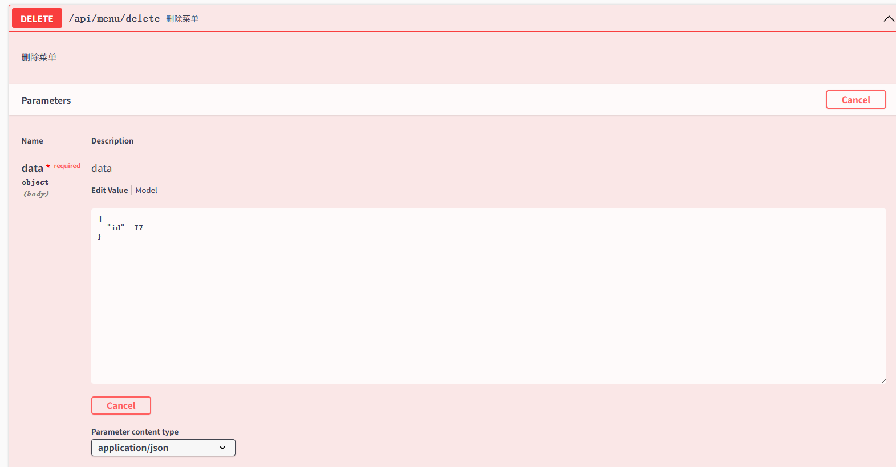

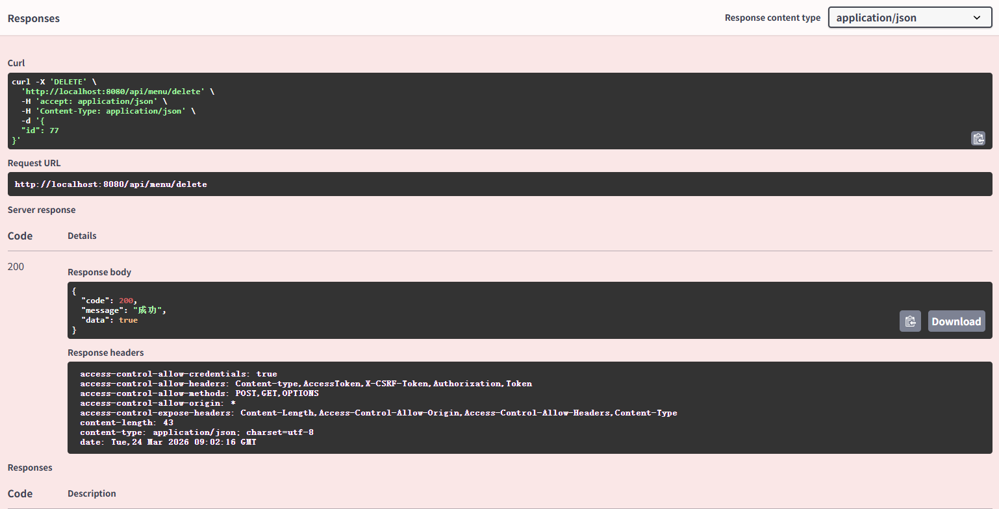

## 6.6 根据名称和状态查询菜单

### 6.6.1 dao层

```go
// GetSysMenuList 查询菜单列表
func GetSysMenuList(MenuName string, MenuStatus string) (sysMenu []*entity.SysMenu) {
	curDb := Db.Table("sys_menu").Order("sort")
	if MenuName != "" {
		curDb = curDb.Where("menu_name = ?", MenuName)
	}
	if MenuStatus != "" {
		curDb = curDb.Where("menu_status = ?", MenuStatus)
	}
	curDb.Find(&sysMenu)
	return sysMenu
}
```

### 6.6.2 service层

```go
// GetSysMenuList 查询菜单列表
func (s SysMenuServiceImpl) GetSysMenuList(c *gin.Context, MenuName, MenuStatus string) {
		result.Success(c, dao.GetSysMenuList(MenuName, MenuStatus))
}
```

### 6.6.3 controller层

```go
// GetSysMenuList 查询菜单列表
// @Summary 查询菜单列表
// @Producce json
// @Description 查询菜单列表
// @Param MenuName query string false "MenuName"
// @Param MenuStatus query string false "MenuStatus"
// @Success 200 {object} result.Result
// @router /api/menu/list [get]
func GetSysMenuList(c *gin.Context) {
	MenuName := c.Query("MenuName")
	MenuStatus := c.Query("MenuStatus")
	service.SysMenuService().GetSysMenuList(c, MenuName, MenuStatus)
}
```

### 6.6.4 router配置

```go
router.GET("/api/menu/list", controller.GetSysMenuList)
```

### 6.6.5 swagger测试

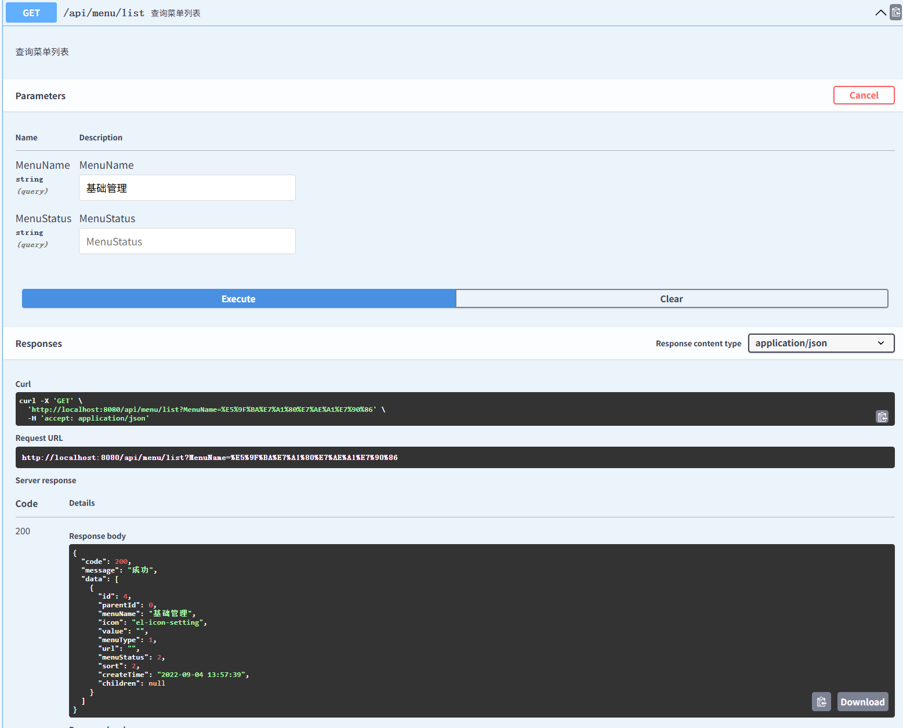

# 7. 角色相关接口

角色也就是用户，需要实现根据角色id查询对应的菜单、给角色分配权限等功能。

## 7.1 新增角色

### 7.1.1 entity

首先创建角色的实体类`sysRole.go`。

```go
// Package entity 角色相关实体类
package entity

import "Go-Management-System/common/util"

// SysRole 角色模型
type SysRole struct {
	ID          uint       `gorm:"column:id;comment:'主键';primaryKey;NOT NULL" json:"id"`
	RoleName    string     `gorm:"column:role_name;varchar(64);comment:'角色名称';NOT NULL" json:"roleName"`
	RoleKey     string     `gorm:"column:role_key;varchar(64);comment:'权限字符串';NOT NULL" json:"roleKey"`
	Status      int        `gorm:"column:status;default:1;comment:'账号启用状态：1->启用；2->禁用';NOT NULL" json:"status"`
	Description string     `gorm:"column:description;varchar(500);comment:'描述'" json:"description"`
	CreateTime  util.HTime `gorm:"column:create_time;comment:'创建时间';NOT NULL" json:"createTime"`
}

func (SysRole) TableName() string {
	return "sys_role"
}

// AddSysRoleDto 新增角色所需参数
type AddSysRoleDto struct {
	RoleName string 
	RoleKey string
	Status int
	Description string
}
```

### 7.1.2 dao层

```go
// Package dao 角色相关dao层
package dao

import (
	"Go-Management-System/api/entity"
	"Go-Management-System/common/util"
	. "Go-Management-System/pkg/db"
	"time"
)

// GetSysRoleByName 根据角色名称获取角色
func GetSysRoleByName(roleName string) (sysRole entity.SysRole) {
	Db.Where("role_name = ?", roleName).First(&sysRole)
	return sysRole
}
// GetSysRoleByKey 根据角色权限字符串获取角色
func GetSysRoleByKey(roleKey string) (sysRole entity.SysRole) {
	Db.Where("role_key = ?", roleKey).First(&sysRole)
	return sysRole
}
// CreateSysRole 创建角色
func CreateSysRole(dto entity.AddSysRoleDto) bool {
	sysRoleByName := GetSysRoleByName(dto.RoleName)
	if sysRoleByName.ID > 0 {
		return false
	}
	sysRoleByKey := GetSysRoleByKey(dto.RoleKey)
	if sysRoleByKey.ID > 0 {
		return false
	}
	addSysRole := entity.SysRole{
		RoleName:    dto.RoleName,
		RoleKey:     dto.RoleKey,
		Description: dto.Description,
		Status:      dto.Status,
		CreateTime:  util.HTime{Time: time.Now()},
	}
	tx := Db.Create(&addSysRole)
	if tx.RowsAffected > 0 {
		return true
	}
	return false
}
```

### 7.1.3 service层

```go
// Package service 角色相关service层
package service

import (
	"Go-Management-System/api/dao"
	"Go-Management-System/api/entity"
	"Go-Management-System/common/result"

	"github.com/gin-gonic/gin"
)

type ISysRoleService interface {
	CreateSysRole(c *gin.Context, dto entity.AddSysRoleDto)
}

type SysRoleServiceImpl struct {
}

var sysRoleService = SysRoleServiceImpl{}

func SysRoleService() ISysRoleService {
	return &sysRoleService
}

// CreateSysRole 创建角色
func (s SysRoleServiceImpl) CreateSysRole(c *gin.Context, dto entity.AddSysRoleDto) {
	ok := dao.CreateSysRole(dto)
	if !ok {
		result.Failed(c, int(result.ApiCode.ROLENAMEALREADYEXISTS), result.ApiCode.GetMessage(result.ApiCode.ROLENAMEALREADYEXISTS))
		return
	}
	result.Success(c, true)
}
```

### 7.1.4 controller层

```go
// Package controller 角色相关controller层
package controller

import (
	"Go-Management-System/api/entity"
	"Go-Management-System/api/service"

	"github.com/gin-gonic/gin"
)

var addSysRole entity.AddSysRoleDto

// CreateSysRole 创建角色
// @Summary 新增角色接口
// @Produce json
// @Description 新增角色接口
// @Param data body entity.AddSysRoleDto true "data"
// @Success 200 {object} result.Result
// @router /api/role/add [post]
func CreateSysRole(c *gin.Context) {
	_ = c.BindJSON(&addSysRole)
	service.SysRoleService().CreateSysRole(c, addSysRole)
}
```

### 7.1.5 router配置

```go
router.POST("/api/role/add", controller.CreateSysRole)
```

### 7.1.6 swagger测试

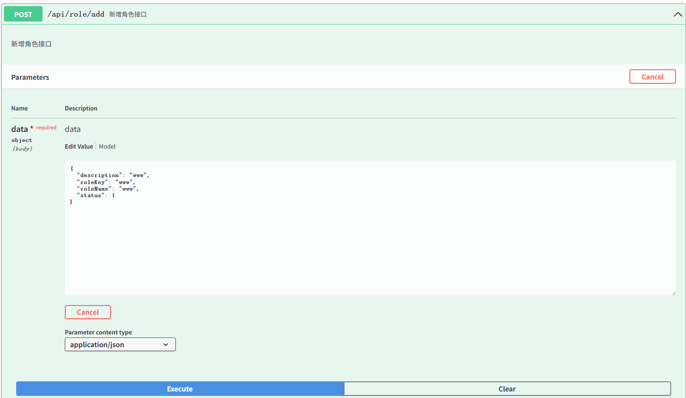

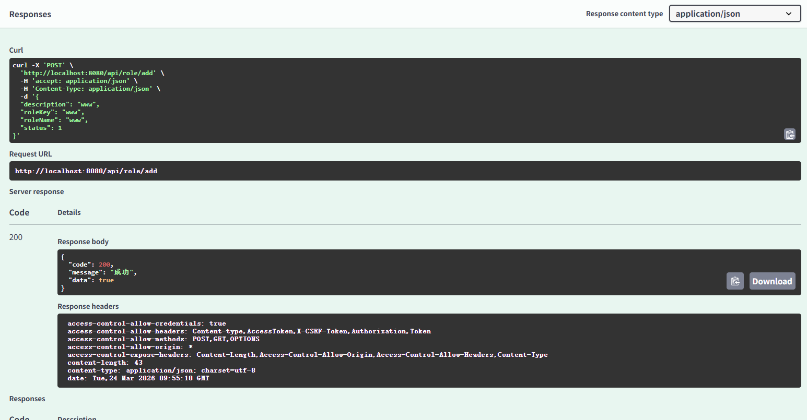

## 7.2 根据id查询角色

### 7.2.1 dao层

```go
// GetSysRoleById 根据id查询角色
func GetSysRoleById(Id uint) (sysRole entity.SysRole) {
	Db.First(&sysRole, Id)
	return sysRole
}
```

### 7.2.2 service层

```go
// GetSysRoleById 根据id查询角色
func (s SysRoleServiceImpl) GetSysRoleById(c *gin.Context, id uint) {
    result.Success(c, dao.GetSysRoleById(id))
}
```

### 7.2.3 controller层

```go
// GetSysRoleById 根据id查询角色
// @Summary 根据id查询角色
// @Produce json
// @Description 根据id查询角色
// @Param id query int true "id"
// @Success 200 {object} result.Result
// @router /api/role/info [get]
func GetSysRoleById(c *gin.Context) {
    id, _ := strconv.Atoi(c.Query("id"))
    service.SysRoleService().GetSysRoleById(c, uint(id))
}
```

### 7.2.4 router配置

```go
router.GET("/api/role/info", controller.GetSysRoleById)
```

### 7.2.5 swagger测试

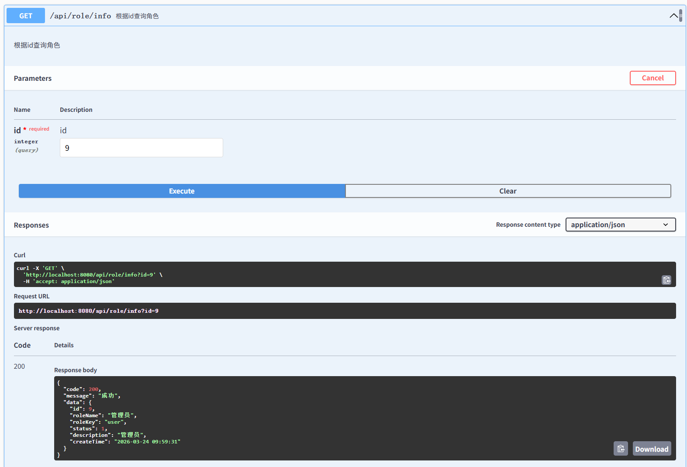

## 7.3 修改角色

首先，修改时只修改部分参数，因此需要创建新的实体类。

### 7.3.1 entity

```go
// UpdateSysRoleDto 修改所需参数
type UpdateSysRoleDto struct {
    Id          uint
    RoleName    string
    RoleKey     string
    Status      int
    Description string
}
```

### 7.3.2 dao层

```go
// UpdateSysRole 修改角色
func UpdateSysRole(dto entity.UpdateSysRoleDto) (sysRole entity.SysRole) {
	Db.First(&sysRole, dto.Id)
	sysRole.RoleName = dto.RoleName
	sysRole.RoleKey = dto.RoleKey
	sysRole.Status = dto.Status
	if dto.Description != "" {
		sysRole.Description = dto.Description
	}
	Db.Save(&sysRole)
	return sysRole
}
```

### 7.3.3 service层

```go
// UpdateSysRole 修改角色
func (s SysRoleServiceImpl) UpdateSysRole(c *gin.Context, dto entity.UpdateSysRoleDto) {
	result.Success(c, dao.UpdateSysRole(dto))
}
```

### 7.3.4 controller层

```go
// UpdateSysRole 修改角色
// @Summary 修改角色
// @Produce json
// @Description 修改角色
// @Param data body entity.UpdateSysRoleDto true "data"
// @Success 200 {object} result.Result
// @router /api/role/update [put]
func UpdateSysRole(c *gin.Context) {
	_ = c.BindJSON(&updateSysRole)
	service.SysRoleService().UpdateSysRole(c, updateSysRole)
}
```

### 7.3.5 router配置

```go
router.PUT("/api/role/update", controller.UpdateSysRole)
```

### 7.3.6 swagger测试

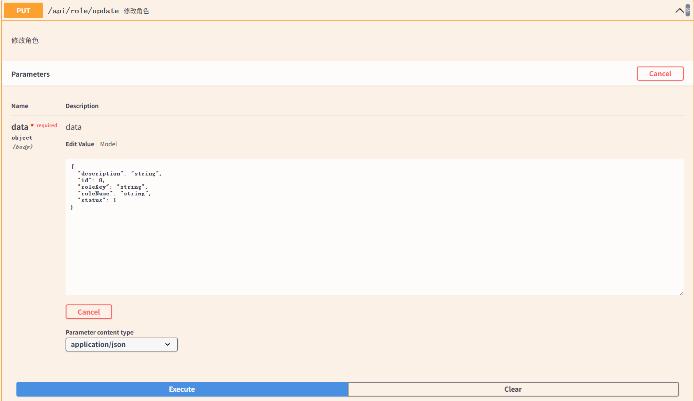

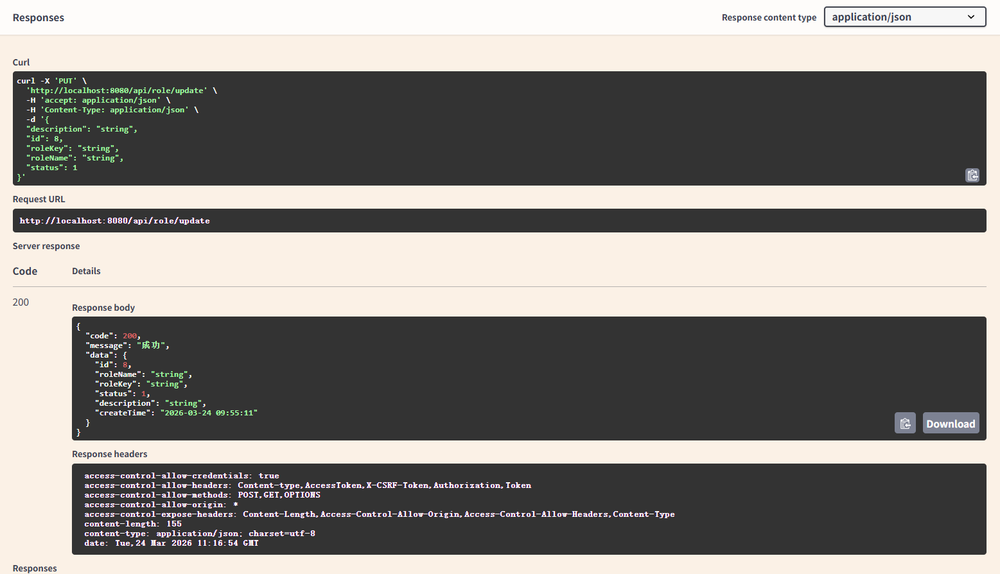

## 7.4 根据id删除角色

同样的，删除只需要获取id，创建对应实体类。

### 7.4.1 entity

```go
// SysRoleIdDto 删除角色所需参数
type SysRoleIdDto struct {
	Id uint
}
```

### 7.4.2 dao层

```go
// DeleteSysRoleById 删除角色
func DeleteSysRoleById(dto entity.SysRoleIdDto) {
	Db.Table("sys_role").Delete(&entity.SysRole{}, dto.Id)
	Db.Table("sys_role_menu").Where("role_id = ?", dto.Id).Delete(&entity.SysRoleMenu{})
}
```

### 7.4.3 service

```go
// DeleteSysRoleById 删除角色
func (s SysRoleServiceImpl) DeleteSysRoleById(c *gin.Context, dto entity.SysRoleIdDto) {
	dao.DeleteSysRoleById(dto)
	result.Success(c, true)
}
```

### 7.4.4 controller

```go
// DeleteSysRoleById 删除角色
// @Summary 删除角色
// @Produce json
// @Description 删除角色
// @Param data body entity.SysRoleIdDto true "data"
// @Success 200 {object} result.Result
// @router /api/role/delete [delete]
func DeleteSysRoleById(c *gin.Context) {
	_ = c.BindJSON(&sysRoleIdDto)
	service.SysRoleService().DeleteSysRoleById(c, sysRoleIdDto)
}
```

### 7.4.5 router配置

```go
router.DELETE("/api/role/delete", controller.DeleteSysRoleById)
```

### 7.4.6 swagger测试

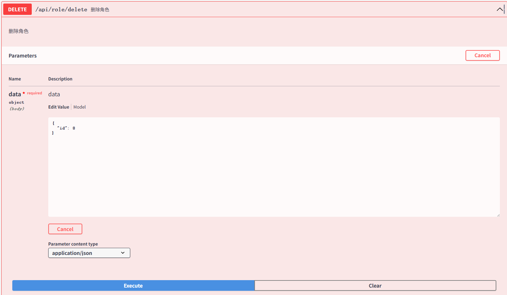

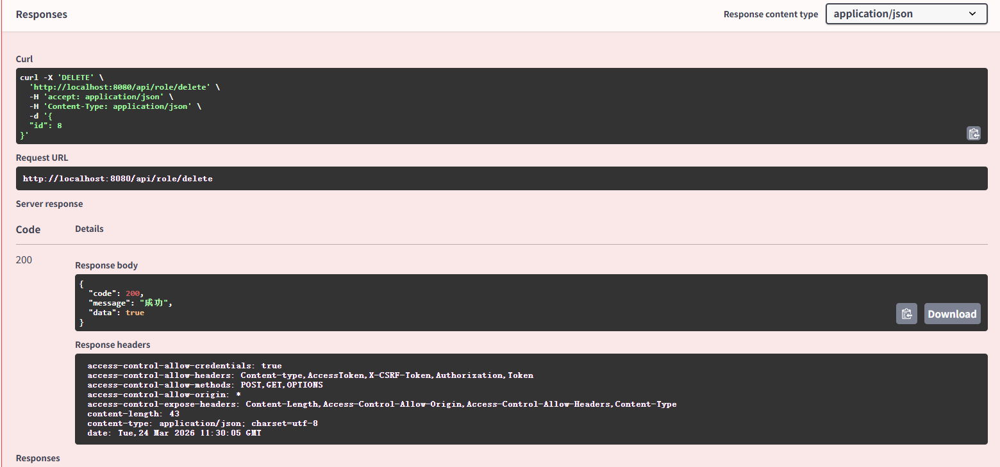

## 7.5 修改角色状态

修改角色状态首先创建对应的修改结构体。

### 7.5.1 entity

```go
// UpdateSysRoleStatusDto 更新角色状态所需参数
type UpdateSysRoleStatusDto struct {
    Id uint
    Status int
}
```

### 7.5.2 dao

```go
// UpdateSysRoleStatus 角色状态更新
func UpdateSysRoleStatus(dto entity.UpdateSysRoleStatusDto) bool {
    var sysRole entity.SysRole
    Db.First(&sysRole, dto.Id)
    sysRole.Status = dto.Status
    tx := Db.Save(&sysRole)
    if tx.RowsAffected > 0 {
       return true
    }
    return false
}
```

### 7.5.3 service

```go
// UpdateSysRoleStatus 修改角色状态
func (s SysRoleServiceImpl) UpdateSysRoleStatus(c *gin.Context, dto entity.UpdateSysRoleStatusDto) {
    ok := dao.UpdateSysRoleStatus(dto)
    if !ok {
       return
    }
    result.Success(c, true)
}
```

### 7.5.4 controller

```go
// UpdateSysRoleStatus 修改角色状态
// @Summary 修改角色状态
// @Produce json
// @Description 修改角色状态
// @Param data body entity.UpdateSysRoleStatusDto true "data"
// @Success 200 {object} result.Result
// @router /api/role/updateStatus [put]
func UpdateSysRoleStatus(c *gin.Context) {
	var dto entity.UpdateSysRoleStatusDto
	_ = c.BindJSON(&dto)
	service.SysRoleService().UpdateSysRoleStatus(c, dto)
}
```

### 7.5.5 router

```go
router.PUT("/api/role/updateStatus", controller.UpdateSysRole)
```

### 7.5.6 swagger测试

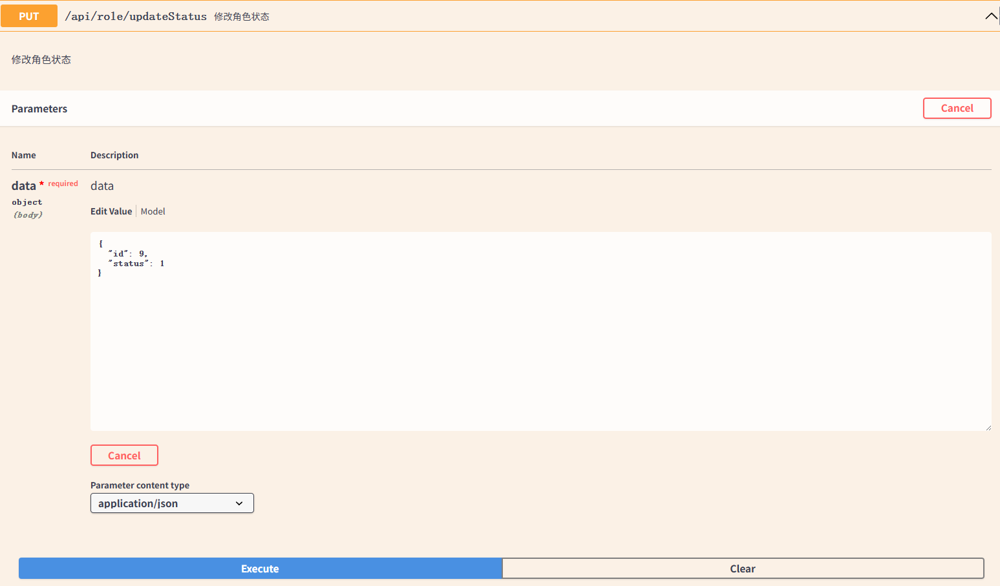

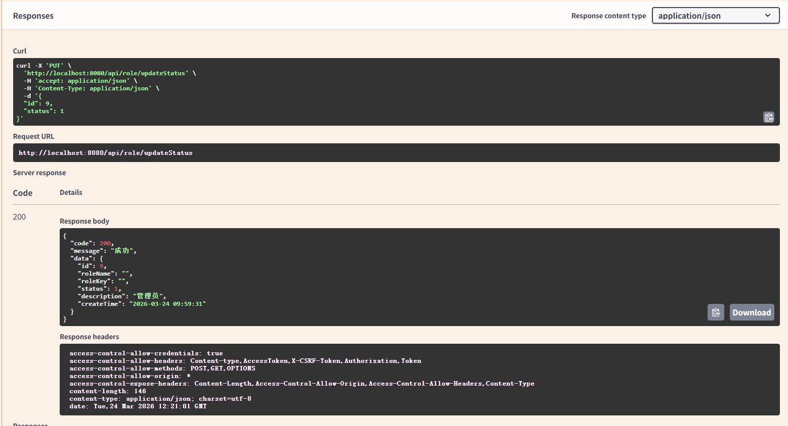

## 7.6 分页查询角色列表

### 7.6.1 dao

```go
// GetSysRoleList 分页查询角色列表
func GetSysRoleList(PageNum, PageSize int, RoleName, status, BeginTime, EndTime string) (sysRole []*entity.SysRole, count int64) {
	curDb := Db.Table("sys_role")
	if RoleName != "" {
		curDb = curDb.Where("role_name like ?", "%"+RoleName+"%")
	}
	if BeginTime != "" && EndTime != "" {
		curDb = curDb.Where("create_time BETWEEN ? AND ?", BeginTime, EndTime)
	}
	if status != "" {
		curDb = curDb.Where("status = ?", status)
	}
	curDb.Count(&count)
	curDb.Limit(PageSize).Offset((PageNum - 1) * PageSize).Order("create_time desc").Find(&sysRole)
	return sysRole, count
}
```

### 7.6.2 service

```go
// GetSysRoleList 分页查询角色
func (s SysRoleServiceImpl) GetSysRoleList(c *gin.Context, PageNum, PageSize int, RoleName, Status, BeginTime, EndTime string) {
    if PageSize < 1 {
       PageSize = 10
    }
    if PageNum < 1 {
       PageNum = 1
    }
    sysRole, count := dao.GetSysRoleList(PageNum, PageSize, RoleName, Status, BeginTime, EndTime)
    result.Success(c, map[string]any{"total": count, "pageSize": PageSize, "pageNum": PageNum, "list": sysRole})
}
```

### 7.6.3 controller

```go
// GetSysRoleList 分页查询角色列表
// @Summary 分页查询角色列表
// @Produce json
// @Description 分页查询角色列表
// @Param pageNum query int false "分页数"
// @Param pageSize query int false "每页数"
// @Param roleName query string false "角色名称"
// @Param status query int false "状态：1->启用；2->禁用"
// @Param beginTime query string false "开始时间"
// @Param endTime query string false "结束时间"
// @Success 200 {object} result.Result
// @router /api/role/list [get]
func GetSysRoleList(c *gin.Context) {
	PageNum, _ := strconv.Atoi(c.Query("pageNum"))
	PageSize, _ := strconv.Atoi(c.Query("pageSize"))
	RoleName := c.Query("roleName")
	Status := c.Query("status")
	BeginTime := c.Query("beginTime")
	EndTime := c.Query("endTime")
	service.SysRoleService().GetSysRoleList(c, PageNum, PageSize, RoleName, Status, BeginTime, EndTime)
}
```

### 7.6.4 router

```go
router.GET("/api/role/list", controller.GetSysRoleList)
```

### 7.6.5 swagger测试


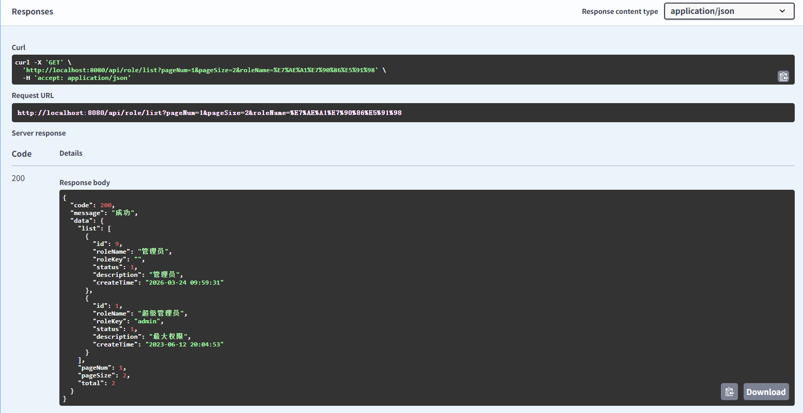

## 7.7 下拉查询角色

在用户选择角色时，需要获取到所有角色。从数据库中获取数据只需要id和名称。

### 7.7.1 entity

```go
// SysRoleVO 角色下拉列表
type SysRoleVO struct {
    Id int `json:"id"`
    RoleName string `json:"roleName"`
}
```

### 7.7.2 dao

```go
// QuerySysRoleVOList 角色下拉查询
func QuerySysRoleVOList() (sysRoleVO []entity.SysRoleVO) {
	Db.Table("sys_role").Select("id, role_name").Scan(&sysRoleVO)
	return sysRoleVO
}
```

### 7.7.3 service

```go
// QuerySysRoleVOList 查询角色下拉列表
func (s SysRoleServiceImpl) QuerySysRoleVOList(c *gin.Context) {
    result.Success(c, dao.QuerySysRoleVOList())
}
```

### 7.7.4 controller

```go
// QuerySysRoleVOList 查询角色下拉列表
// @Summary 查询角色下拉列表
// @Produce json
// @Description 查询角色下拉列表
// @Success 200 {object} result.Result
// @router /api/role/vo/list [get]
func QuerySysRoleVOList(c *gin.Context) {
    service.SysRoleService().QuerySysRoleVOList(c)
}
```

### 7.7.5 router

```go
router.GET("/api/role/vo/list", controller.QuerySysRoleVOList)
```

### 7.7.6 swagger

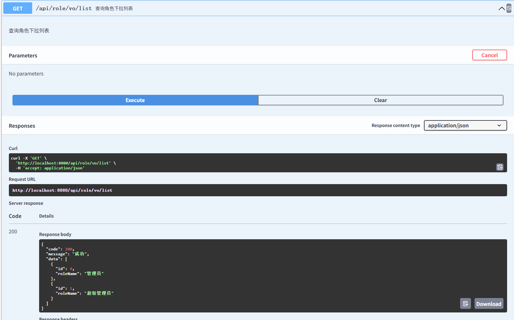

## 7.8 根据角色查询菜单权限

### 7.8.1 entity

```go
// IdVO 当前角色的菜单权限id
type IdVO struct {
    Id uint `json:"id"`
}
```

### 7.8.2 dao

```go
// QuerySysRoleMenuIdList 根据角色id查询菜单权限id
func QuerySysRoleMenuIdList(id int) (idVO []entity.IdVO) {
	const menuType int = 3
	Db.Table("sys_menu sm").
		Select("sm.id").
		Joins("LEFT JOIN sys_role_menu srm ON srm.menu_id = sm.id").
		Joins("LEFT JOIN sys_role sr ON sr.id = srm.role_id").
		Where("sm.menu_type = ?", menuType).
		Where("sr.id = ?", id).
		Scan(&idVO)
	return idVO
}
```

### 7.8.3 service

```go
// QueryRoleMenuIdList 根据角色id查询菜单数据
func (s *SysRoleServiceImpl) QueryRoleMenuIdList(c *gin.Context, Id int) {
    roleMenuIdList := dao.QuerySysRoleMenuIdList(Id)
    var idList = make([]int, 0)
    for _, id := range roleMenuIdList {
       idList = append(idList, int(id.Id))
    }
    result.Success(c, idList)
}
```

### 7.8.4 controller

```go
// QueryRoleMenuIdList 根据角色id查询菜单数据
// @Summary 根据角色id查询菜单数据
// @Produce json
// @Description 根据角色id查询菜单数据
// @Param id query int true "id"
// @Success 200 {object} result.Result
// @router /api/role/vo/idList [get]
func QueryRoleMenuIdList(c *gin.Context) {
    Id, _ := strconv.Atoi(c.Query("id"))
    service.SysRoleService().QueryRoleMenuIdList(c, Id)
}
```

### 7.8.5 router

```go
router.GET("/api/role/vo/idList", controller.QueryRoleMenuIdList)
```

### 7.8.6 swagger

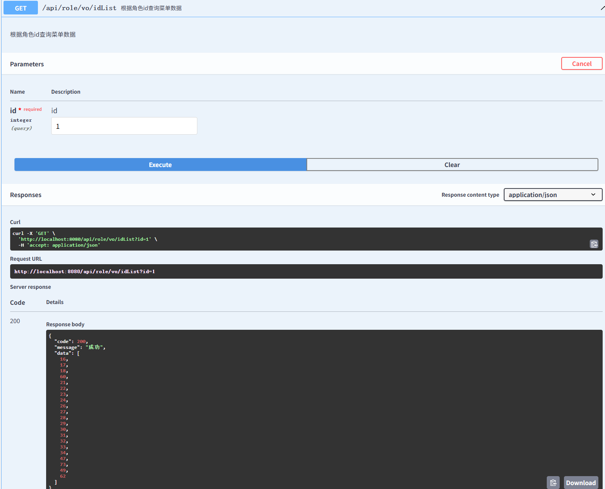

## 7.9 角色权限分配

也就是为用户添加新增菜单、删除菜单等增删改查的功能，也就是修改角色的菜单权限。首先需要创建结构体，包含角色id和菜单id。

### 7.9.1 entity

```go
// RoleMenu 角色id和菜单id
type RoleMenu struct {
    Id uint `json:"id" binding:"required"`
    MenuIds []uint `json:"menuIds" binding:"required"`
}
```

### 7.9.1 dao层

```go
// AssignPermissions 为用户分配权限
func AssignPermissions(menu entity.RoleMenu) (err error) {
    err = Db.Table("sys_role_menu").Where("role_id = ?", menu.Id).Delete(&entity.SysRoleMenu{}).Error
    if err != nil {
       return err
    }
    for _, value := range menu.MenuIds {
       var entity entity.SysRoleMenu
       entity.RoleId = menu.Id
       entity.MenuId = value
       Db.Create(&entity)
    }
    return err
}
```

### 7.9.2 service

```go
// AssignPermission 为角色分配权限
func (s SysRoleServiceImpl) AssignPermissions(c *gin.Context, menu entity.RoleMenu) {
    result.Success(c, dao.AssignPermissions(menu))
}
```

### 7.9.3 controller

```go
// AssignPermissions 分配权限
// @Summary 分配权限
// @Produce json
// @Description 分配权限
// @Param data body entity.RoleMenu true "data"
// @Success 200 {object} result.Result
// @router /api/role/assignPermissions [put]
func AssignPermissions(c *gin.Context) {
	var RoleMenu entity.RoleMenu
	_ = c.BindJSON(&RoleMenu)
	service.SysRoleService().AssignPermissions(c, RoleMenu)
}
```

### 7.9.4 router

```go
router.PUT("/api/role/assignPermissions", controller.AssignPermissions)
```

### 7.9.5 swagger测试

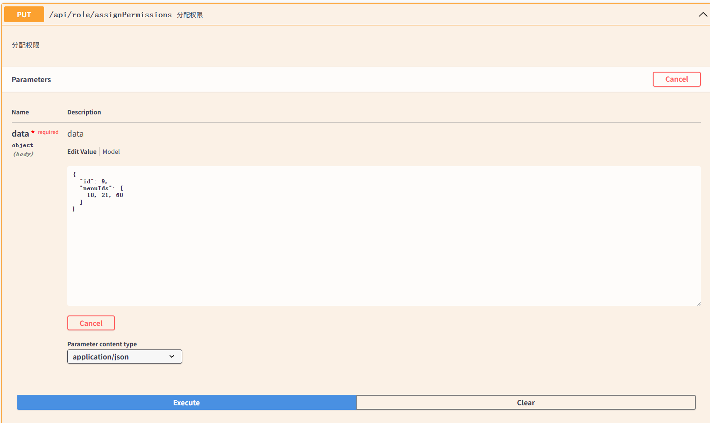

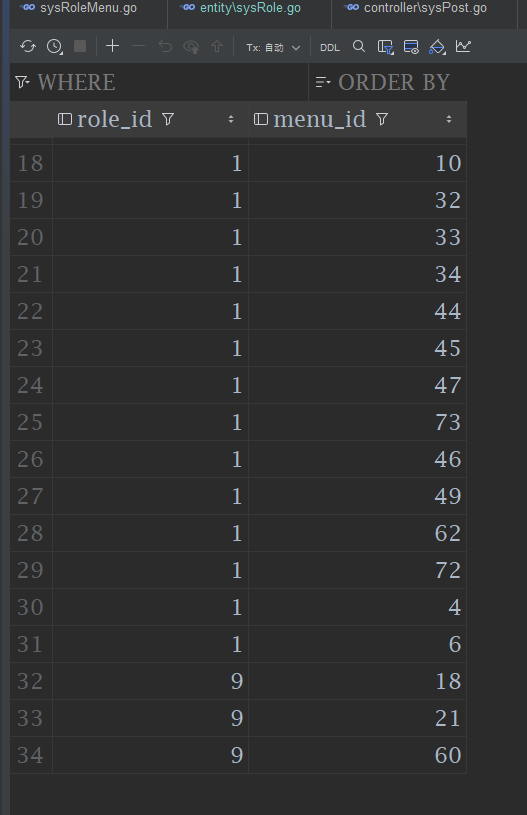

# 8. 用户相关接口

接下来要实现用户的功能。

## 8.1 新增用户

### 8.1.1 entity

新增用户时，需要所有的参数。先封装实体类`sysAdmin.go`。

```go
// AddSysAdminDto 新增用户所需参数
type AddSysAdminDto struct {
    PostId int `validate:"required"`
    RoleId int `validate:"required"`
    DeptId int `validate:"required"`
    Username string `validate:"required"`
    Password string `validate:"required"`
    Nickname string `validate:"required"`
    Phone    string `validate:"required"`
    Email    string `validate:"required"`
    Note     string `validate:"required"`
    Status   int    `validate:"required"`
}
```

同时，需要用一张表来记录用户与角色之间的关系。创建实体类`sysAdminRole.go`。

```go
// Package entity 用户与角色关系模型
package entity

type SysAdminRole struct {
	AdminId uint `gorm:"column:admin_id;comment:'用户ID';NOT NULL" json:"adminId"`
	RoleId  uint `gorm:"column:role_id;comment:'角色ID';NOT NULL" json:"roleId"`
}

func (SysAdminRole) TableName() string {
	return "sys_admin_role"
}
```

### 8.1.2 dao

新增用户时，需要注意用户名不能相同。同时还要对密码进行加密。

```go
// Package dao 用户数据层
package dao

import (
	"Go-Management-System/api/entity"
	"Go-Management-System/common/util"
	. "Go-Management-System/pkg/db"
	"time"
)

// SysAdminDetail 用户详情
func SysAdminDetail(dto entity.LoginDto) (sysAdmin entity.SysAdmin) {
	username := dto.Username
	Db.Where("username = ?", username).First(&sysAdmin)
	return sysAdmin
}

// GetSysAdminByUsername 根据用户名查询用户
func GetSysAdminByUsername(username string) (sysAdmin entity.SysAdmin) {
	Db.Where("username = ?", username).First(&sysAdmin)
	return sysAdmin
}

// CreateSysAdmin 新增用户
func CreateSysAdmin(dto entity.AddSysAdminDto) bool {
	sysAdminByUsername := GetSysAdminByUsername(dto.Username)
	if sysAdminByUsername.ID > 0 {
		return false
	}
	sysAdmin := entity.SysAdmin{
		PostId:     dto.PostId,
		DeptId:     dto.DeptId,
		Username:   dto.Username,
		Nickname:   dto.Nickname,
		Password:   util.EncryptionMd5(dto.Password),
		Phone:      dto.Phone,
		Email:      dto.Email,
		Note:       dto.Note,
		Status:     dto.Status,
		CreateTime: util.HTime{Time: time.Now()},
	}
	tx := Db.Create(&sysAdmin)
	sysAdminExist := GetSysAdminByUsername(dto.Username)
	var e entity.SysAdminRole
	e.AdminId = sysAdminExist.ID
	e.RoleId = sysAdminExist.ID
	Db.Create(&e)
	if tx.RowsAffected > 0 {
		return true
	}
	return false
}
```

### 8.1.3 service层

```go
// CreateSysAdmin 新增用户
func (s SysAdminServiceImpl) CreateSysAdmin(c *gin.Context, dto entity.AddSysAdminDto) {
	err := validator.New().Struct(dto)
	if err != nil {
		result.Failed(c, int(result.ApiCode.MissingNewAdminParameter), result.ApiCode.GetMessage(result.ApiCode.MissingNewAdminParameter))
		return
	}
	ok := dao.CreateSysAdmin(dto)
	if !ok {
		result.Failed(c, int(result.ApiCode.USERNAMEALREADYEXISTS), result.ApiCode.GetMessage(result.ApiCode.USERNAMEALREADYEXISTS))
		return
	}
	result.Success(c, true)
	return
}
```

### 8.1.4 controller层

```go
// CreateSysAdmin 创建用户
// @Summary 创建用户接口
// @Produce json
// @Description 创建用户接口
// @param data body entity.AddSysAdminDto true "data"
// @Success 200 {object} result.Result
// @router /api/admin/add [post]
func CreateSysAdmin(c *gin.Context) {
	var addSysAdminDto entity.AddSysAdminDto
	_ = c.BindJSON(&addSysAdminDto)
	service.SysAdminService().CreateSysAdmin(c, addSysAdminDto)
}
```

### 8.1.5 router

```go
router.POST("/api/admin/add", controller.CreateSysAdmin)
```

### 8.1.6 swagger配置

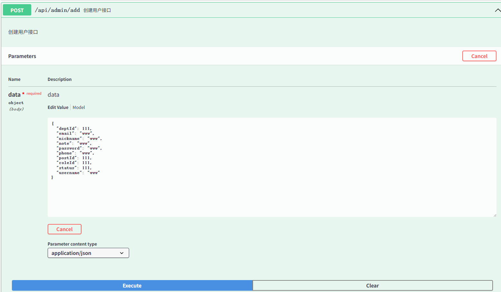

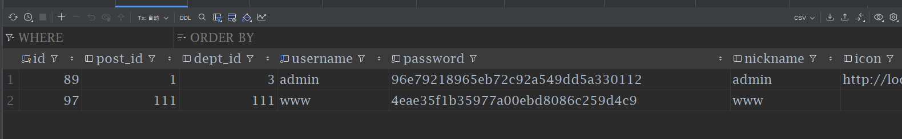

## 8.2 根据id查询用户

### 8.2.1 entity

查询用户时，只需要获取部分数据即可。

```go
// SysAdminInfo 查询用户所需参数
type SysAdminInfo struct {
    ID uint `json:"id"`
    Username string `json:"username"`
    Nickname string `json:"nickname"`
    Status int `json:"status"`
    PostId int `json:"postId"`
    DeptId int `json:"deptId"`
    RoleId int `json:"roleId"`
    Email string `json:"email"`
    Phone string `json:"phone"`
    Note string `json:"note"`
}
```

### 8.2.2 dao

查询时，需要实现从`PostId`, `RoleId`等转为名称的信息，需要实现多表查询。

```go
// GetSysAdminInfo 查询用户详情
func GetSysAdminInfo(Id int) (sysAdminInfo entity.SysAdminInfo) {
	Db.Table("sys_admin").
		Select("sys_admin.*, sys_admin_role.role_id").
		Joins("LEFT JOIN sys_admin_role ON sys_admin.id = sys_admin_role.role_id").
		Joins("LEFT JOIN sys_role ON sys_admin_role.role_id = sys_role.id").
		First(&sysAdminInfo, Id)
	return sysAdminInfo
}
```

### 8.2.3 service

```go
// GetSysAdminInfo 根据id查询用户
func (s SysAdminServiceImpl) GetSysAdminInfo(c *gin.Context, Id int) {
    result.Success(c, dao.GetSysAdminInfo(Id))
}
```

### 8.2.4 controller

```go
// GetSysAdminInfo 根据id查询用户
// @Summary 根据id查询用户
// @Produce json
// @Description 根据id查询用户
// @param id query int true "id"
// @Success 200 {object} result.Result
// @router /api/admin/info [get]
func GetSysAdminInfo (c *gin.Context) {
    Id, _ := strconv.Atoi(c.Query("id"))
    service.SysAdminService().GetSysAdminInfo(c, Id)
}
```

### 8.2.5 router

```go
router.GET("/api/admin/info", controller.GetSysAdminInfo)
```

### 8.2.6 swagger


## 8.3 修改用户

首先构建修改用户的结构体。

### 8.3.1 entity

```go
// UpdateSysAdminDto 修改用户所需参数
type UpdateSysAdminDto struct {
	Id       uint
	PostId   int
	DeptId   int
	RoleId   uint
	Username string
	Nickname string
	Phone    string
	Email    string
	Note      string
	Status   int
}
```

### 8.3.2 dao层

```go
// UpdateSysAdmin 修改用户
func UpdateSysAdmin(dto entity.UpdateSysAdminDto) (sysAdmin entity.SysAdmin) {
    Db.First(&sysAdmin, dto.Id)
    if dto.Username != "" {
       sysAdmin.Username = dto.Username
    }
    sysAdmin.PostId = dto.PostId
    sysAdmin.DeptId = dto.DeptId
    sysAdmin.Status = dto.Status
    if dto.Nickname != "" {
       sysAdmin.Nickname = dto.Nickname
    }
    if dto.Phone != "" {
       sysAdmin.Phone = dto.Phone
    }
    if dto.Email != "" {
       sysAdmin.Email = dto.Email
    }
    if dto.Note != "" {
       sysAdmin.Note = dto.Note
    }
    Db.Save(&sysAdmin)
    // 删除之前的角色，再分配新的角色
    var sysAdminRole entity.SysAdminRole
    Db.Where("admin_id = ?", dto.Id).Delete(&entity.SysAdminRole{})
    sysAdminRole.AdminId = dto.Id
    sysAdminRole.RoleId = dto.RoleId
    Db.Create(&sysAdminRole)
    return sysAdmin
}
```

### 8.3.3 service层

```go
// UpdateSysAdmin 修改用户
func (s SysAdminServiceImpl) UpdateSysAdmin(c *gin.Context, dto entity.UpdateSysAdminDto) {
    result.Success(c, dao.UpdateSysAdmin(dto))
}
```

### 8.3.4 controller

```go
// UpdateSysAdmin 修改用户
// @Summary 修改用户
// @Produce json
// @Description 修改用户
// @param data body entity.UpdateSysAdminDto true "data"
// @Success 200 {object} result.Result
// @router /api/admin/update [put]
func UpdateSysAdmin(c *gin.Context) {
	var dto entity.UpdateSysAdminDto
	_ = c.BindJSON(&dto)
	service.SysAdminService().UpdateSysAdmin(c, dto)
}
```

### 8.3.5 router

```go
router.PUT("/api/admin/update", controller.UpdateSysAdmin)
```

### 8.3.6 swagger

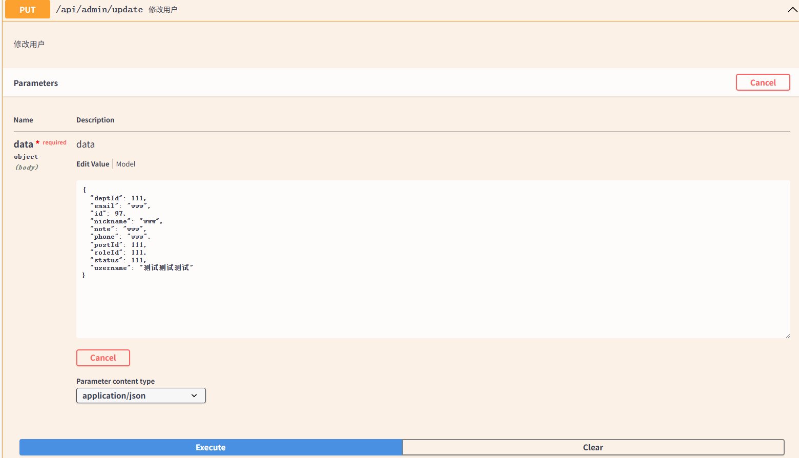

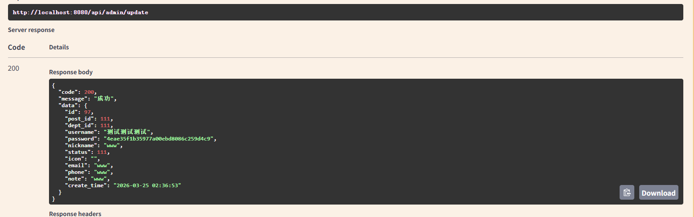

## 8.4 根据id删除用户

### 8.3.1 entity

```go
// SysAdminIdDto 删除用户所需参数
type SysAdminIdDto struct {
    Id uint `json:"id"`
}
```

### 8.3.2 dao

```go
// DeleteSysAdminById 根据id删除用户
func DeleteSysAdminById(dto entity.SysAdminIdDto) {
    Db.First(&entity.SysAdmin{}, dto.Id)
    Db.Delete(&entity.SysAdmin{}, dto.Id)
    Db.Where("admin_id = ?", dto.Id).Delete(&entity.SysAdminRole{})
}
```

### 8.3.3 service

```go
// DeleteSysAdminById 根据id删除用户
func (s SysAdminServiceImpl) DeleteSysAdminById(c *gin.Context, dto entity.SysAdminIdDto) {
    dao.DeleteSysAdminById(dto)
    result.Success(c, true)
}
```

### 8.3.4 controller

```go
// DeleteSysAdminById 根据id删除用户
// @Summary 根据id删除用户
// @Produce json
// @Description 根据id删除用户
// @param data body entity.SysAdminIdDto true "data"
// @Success 200 {object} result.Result
// @router /api/admin/delete [delete]
func DeleteSysAdminById(c *gin.Context) {
	var dto entity.SysAdminIdDto
	_ = c.BindJSON(&dto)
	service.SysAdminService().DeleteSysAdminById(c, dto)
}
```

### 8.3.5 router

```go
router.DELETE("/api/admin/delete", controller.DeleteSysAdminById)
```

### 8.3.6 swagger

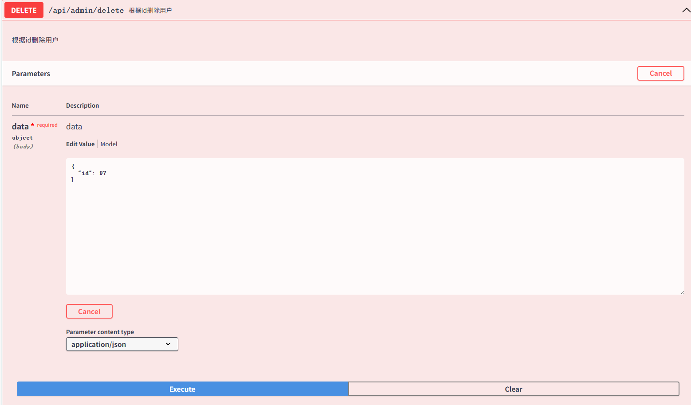

### 8.5 修改用户状态

用户存在启用和禁用的状态，需要提供功能。

### 8.5.1 entity

```go
// UpdateSysAdminStatusDto 设置用户状态所需参数
type UpdateSysAdminStatusDto struct {
    Id uint `json:"id"`
    Status int `json:"status"`
}
```

### 8.5.2 dao

```go
// UpdateSysAdminStatus 修改用户状态
func UpdateSysAdminStatus (dto entity.UpdateSysAdminStatusDto) {
    var sysAdmin entity.SysAdmin
    Db.First(&sysAdmin, dto.Id)
    sysAdmin.Status = dto.Status
    Db.Save(&sysAdmin)
}
```

### 8.5.3 service

```go
// UpdateSysAdminStatus 修改用户状态
func (s SysAdminServiceImpl) UpdateSysAdminStatus(c *gin.Context, dto entity.UpdateSysAdminStatusDto) {
    dao.UpdateSysAdminStatus(dto)
    result.Success(c, true)
}
```

### 8.5.4 controller

```go
// UpdateSysAdminStatus 修改用户状态
// @Summary 修改用户状态
// @Produce json
// @Description 修改用户状态
// @param data body entity.UpdateSysAdminStatus true "data"
// @Success 200 {object} result.Result
// @router /api/admin/updateStatus [put]
func UpdateSysAdminStatus(c *gin.Context) {
    var dto entity.UpdateSysAdminStatusDto
    _ = c.BindJSON(&dto)
    service.SysAdminService().UpdateSysAdminStatus(c, dto)
}
```

### 8.5.5 router

```go
router.PUT("/api/admin/updateStatus", controller.UpdateSysAdminStatus)
```

### 8.5.6 swagger

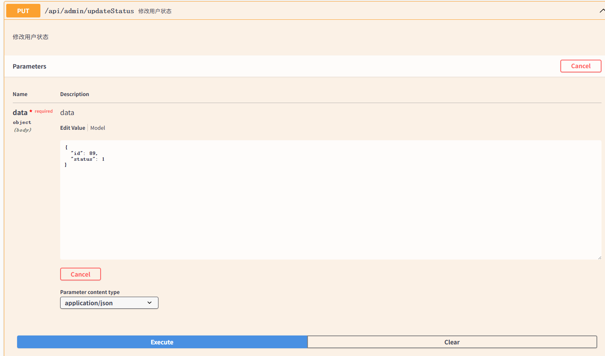

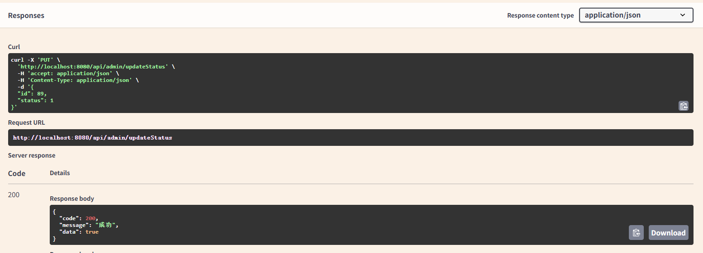

## 8.6 重置密码

### 8.6.1 entity

重置密码只需要id和密码，创建实体类。

```go
// ResetSysAdminPasswordDto 重置密码
type ResetSysAdminPasswordDto struct {
    Id uint
    Password string
}
```

### 8.6.2 dao

```go
// ResetSysAdminPassword 重置密码
func ResetSysAdminPassword(dto entity.ResetSysAdminPasswordDto) {
    var sysAdmin entity.SysAdmin
    Db.First(&sysAdmin, dto.Id)
    sysAdmin.Password = util.EncryptionMd5(dto.Password)
    Db.Save(&sysAdmin)
}
```

### 8.6.3 service

```go
// ResetSysAdminPassword 重置密码
func (s SysAdminServiceImpl) ResetSysAdminPassword(c *gin.Context, dto entity.ResetSysAdminPasswordDto) {
    dao.ResetSysAdminPassword(dto)
    result.Success(c, true)
}
```

### 8.6.4 controller

```go
// ResetSysAdminPassword 重置密码
// @Summary 重置密码
// @Produce json
// @Description 重置密码
// @param data body entity.ResetSysAdminPasswordDto true "data"
// @Success 200 {object} result.Result
// @router /api/admin/updatePassword [put]
func ResetSysAdminPassword(c *gin.Context) {
    var dto entity.ResetSysAdminPasswordDto
    _ = c.BindJSON(&dto)
    service.SysAdminService().ResetSysAdminPassword(c, dto)
}
```

### 8.6.5 router

```go
router.PUT("/api/admin/updatePassword", controller.ResetSysAdminPassword)
```

### 8.6.6 swagger

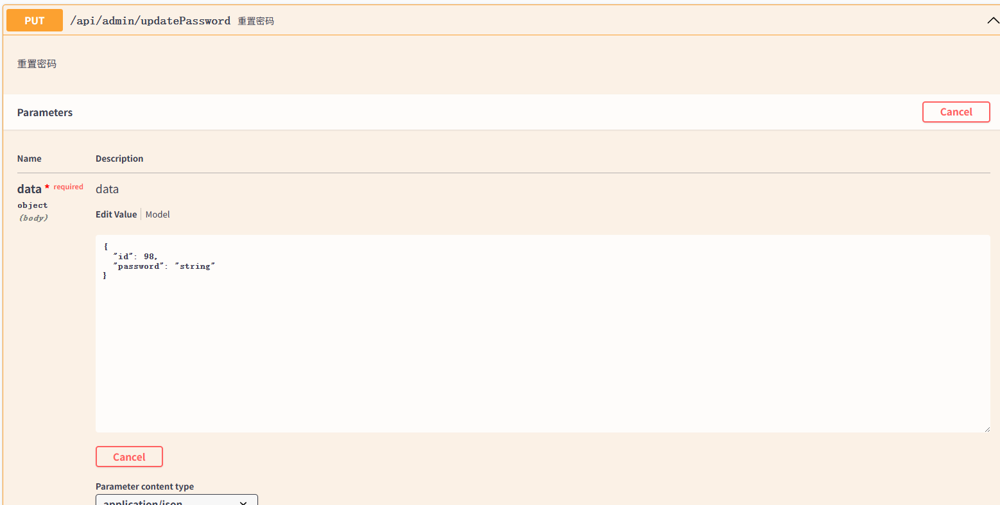

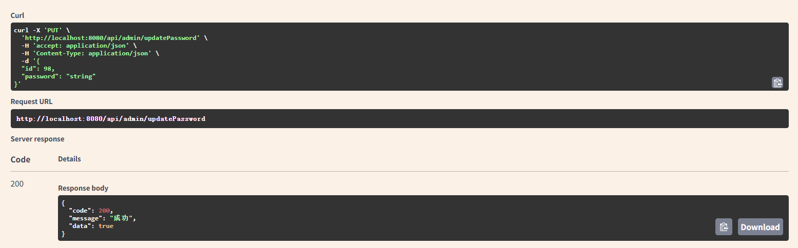

## 8.7 分页查询用户列表

### 8.7.1 entity

首先创建用户展示到前端的VO对象。

```go
// SysAdminVO 用户列表VO对象
type SysAdminVO struct {
    ID uint `json:"id"`
    Username string `json:"username"`
    Nickname string `json:"nickname"`
    Status   int    `json:"status"`
    PostId   int    `json:"postId"`
    DeptId   int    `json:"deptId"`
    RoleId   int    `json:"roleId"`
    PostName string `json:"postName"`
    DeptName string `json:"deptName"`
    RoleName string `json:"roleName"`
    Icon     string `json:"icon"`
    Email    string `json:"email"`
    Phone    string `json:"phone"`
    Note     string `json:"note"`
    CreateTime util.HTime `json:"createTime"`
}
```

### 8.7.2 dao

```go
// GetSysAdminList 查询用户列表
func GetSysAdminList(PageSize, PageNum int, Username, Status, BeginTime, EndTime string) (SysAdmin []entity.SysAdminVO, count int64) {
	curDb := Db.Table("sys_admin").
		Select("sys_admin.*, sys_post.post_name, sys_role.role_name, sys_dept.dept_name").
		Joins("LEFT JOIN sys_post ON sys_admin.post_id = sys_post.id").
		Joins("LEFT JOIN sys_admin_role ON sys_admin.id = sys_admin_role.admin_id").
		Joins("LEFT JOIN sys_dept ON sys_dept.id = sys_admin.dept_id").
		Joins("LEFT JOIN sys_role ON sys_admin_role.role_id = sys_role.id")
	if Username != "" {
		curDb = curDb.Where("sys_admin.username = ?", Username)
	}
	if Status != "" {
		curDb = curDb.Where("sys_admin.status = ?", Status)
	}
	if BeginTime != "" && EndTime != "" {
		curDb = curDb.Where("sys_admin.create_time BETWEEN ? AND ?", BeginTime, EndTime)
	}
	curDb.Count(&count)
	curDb.Offset((PageNum - 1) * PageSize).Limit(PageSize).Order("sys_admin.create_time asc").Find(&SysAdmin)
	return SysAdmin, count
}
```

### 8.7.3 service

```go
// GetSysAdminList 查询用户列表
func (s SysAdminServiceImpl) GetSysAdminList(c *gin.Context, PageSize, PageNum int, Username, Status, BeginTime, EndTime string) {
    if PageSize < 1 {
       PageSize = 10
    }
    if PageNum < 1 {
       PageNum = 1
    }
     SysAdmin, count := dao.GetSysAdminList(PageSize, PageNum, Username, Status, BeginTime, EndTime)
      result.Success(c, map[string]any{"total": count, "pageSize": PageSize, "pageNum": PageNum, "list": SysAdmin})
}
```

### 8.7.4 controller

```go
// GetSysAdminList 分页查询用户
// @Summary 分页查询用户
// @Produce json
// @Description 分页查询用户
// @param pageNum query int false "分页数"
// @Param pageSize query int false "每页数"
// @Param username query string false "用户名"
// @Param Status query string false "账号启用状态：1->启用，2->禁用"
// @Param beginTime query string false "开始时间"
// @Param endTime query string false "结束时间"
// @Success 200 {object} result.Result
// @router /api/admin/list [get]
func GetSysAdminList(c *gin.Context) {
    pageNum, _ := strconv.Atoi(c.Query("pageNum"))
    pageSize, _ := strconv.Atoi(c.Query("pageSize"))
    Username := c.Query("username")
    Status := c.Query("status")
    BeginTime := c.Query("beginTime")
    EndTime := c.Query("endTime")
    service.SysAdminService().GetSysAdminList(c, pageSize, pageNum, Username, Status, BeginTime, EndTime)
}
```

### 8.7.5 router

```go
router.GET("/api/admin/list", controller.GetSysAdminList)
```

### 8.7.6 swagger

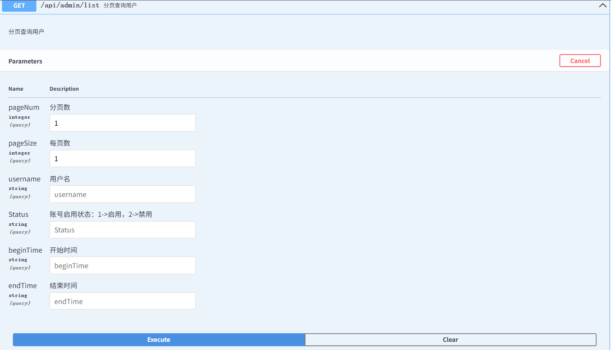

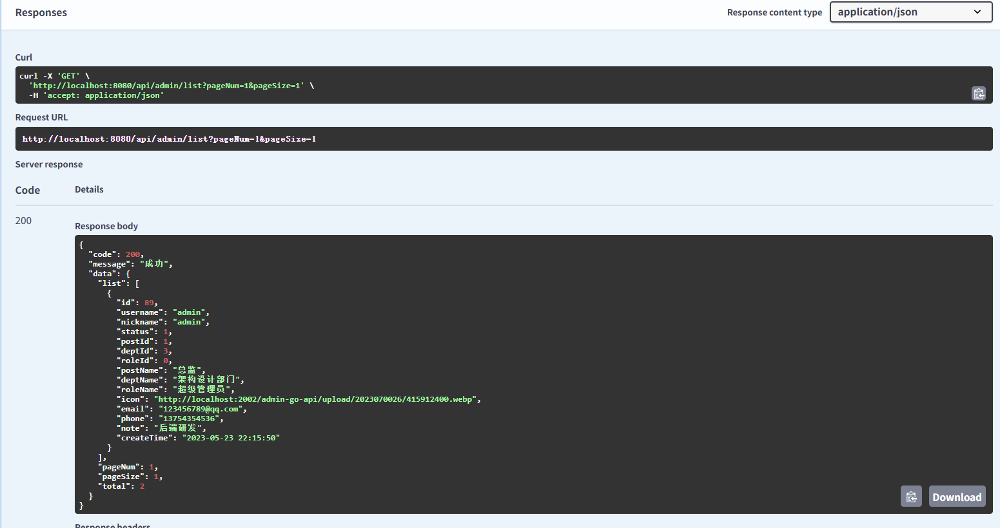

## 8.8 图片上传

### 8.8.1 util

新增用户时需要上传图片作为头像。这样需要新建工具类。在util下创建`uploadTool.go`。

```go
// Package util 图片上传工具
package util

import "os"

// CreateDir 创建目录
func CreateDir(filePath string) error {
    if !IsExist(filePath) {
       err := os.MkdirAll(filePath, os.ModePerm)
       return err
    }
    return nil
}

// IsExist 判断是否存在
func IsExist(path string) bool {
    _, err := os.Stat(path)
    if err != nil {
       if os.IsExist(err) {
          return true
       }
       return false
    }
    return true
}
```

### 8.8.2 service

```go
// Upload 图片上传
func (u *UploadServiceImpl) Upload(c *gin.Context) {
	file, err := c.FormFile("file")
	if err != nil {
		result.Failed(c, int(result.ApiCode.FileUploadError), result.ApiCode.GetMessage(result.ApiCode.FileUploadError))
		return
	}
	now := time.Now()
	ext := path.Ext(file.Filename)
	fileName := strconv.Itoa(now.Nanosecond()) + ext
	filePath := fmt.Sprintf("%s%s%s%s", config.Config.ImageSettings.UploadDir,
		fmt.Sprintf("%04d", now.Year()),
		fmt.Sprintf("%02d", now.Month()),
		fmt.Sprintf("%04d", now.Day()))
	err = util.CreateDir(filePath)
	if err != nil {
		result.Failed(c, int(result.ApiCode.FileUploadError), result.ApiCode.GetMessage(result.ApiCode.FileUploadError))
		return
	}
	fullPath := filePath + "/" + fileName
	err = c.SaveUploadedFile(file, fullPath)
	if err != nil {
		result.Failed(c, int(result.ApiCode.FileUploadError), result.ApiCode.GetMessage(result.ApiCode.FileUploadError))
		return
	}
	result.Success(c, config.Config.ImageSettings.ImageHost+fullPath)
}
```

### 8.8.3 controller

```go
// Upload 单图片上传
// @Summary 单图片上传接口
// @Produce json
// @Description 单图片上传接口
// @Accept multipart/form-data
// @Param file formData file true "file"
// @Success 200 {object} result.Result
// @Router /api/upload [post]
func Upload(c *gin.Context) {
    service.UploadService().Upload(c)
}
```

### 8.8.4 router

```go
router.POST("/api/upload", controller.Upload)
```

### 8.8.5 swagger

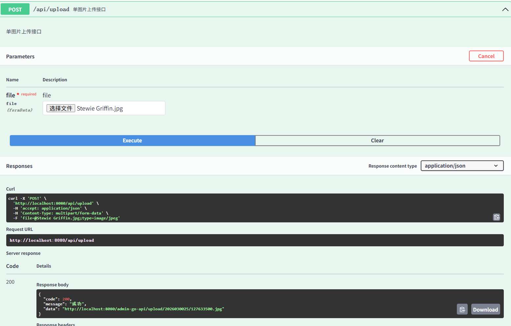

访问这里的地址即可读取到图片。

## 8.9 修改个人信息

### 8.9.1 entity

首先是需要获取修改个人信息参数的结构体。

```go
// UpdatePersonalDto 修改个人信息所需参数
type UpdatePersonalDto struct {
	Id       uint
	Icon     string
	Username string `validate:"required"`
	Nickname string `validate:"required"`
	Phone    string `validate:"required"`
	Email    string `validate:"required"`
	Note     string `validate:"required"`
}
```

### 8.9.2 dao

```go
// UpdatePersonal 修改个人信息
func UpdatePersonal(dto entity.UpdatePersonalDto) (sysAdmin entity.SysAdmin) {
	Db.First(&sysAdmin, dto.Id)
	if dto.Icon != "" {
		sysAdmin.Icon = dto.Icon
	}
	if dto.Username != "" {
		sysAdmin.Username = dto.Username
	}
	if dto.Nickname != "" {
		sysAdmin.Nickname = dto.Nickname
	}
	if dto.Phone != "" {
		sysAdmin.Phone = dto.Phone
	}
	if dto.Email != "" {
		sysAdmin.Email = dto.Email
	}
	if dto.Note != "" {
		sysAdmin.Note = dto.Note
	}
	Db.Save(&sysAdmin)
	return sysAdmin
}
```

### 8.9.3 service

```go
// UpdatePersonal 修改个人信息
func (s SysAdminServiceImpl) UpdatePersonal(c *gin.Context, dto entity.UpdatePersonalDto) {
	err := validator.New().Struct(dto)
	if err != nil {
		result.Failed(c, int(result.ApiCode.MissingModificationOfPersonalParameters), result.ApiCode.GetMessage(result.ApiCode.MissingModificationOfPersonalParameters))
		return
	}
	id, _ := jwt.GetAdminId(c)
	dto.Id = id
	result.Success(c, dao.UpdatePersonal(dto))
}
```

### 8.9.4 controller

```go
// UpdatePersonal 修改个人信息
// @Summary 修改个人信息
// @Produce json
// @Description 修改个人信息
// @param data body entity.UpdatePersonalDto true "data"
// @Success 200 {object} result.Result
// @router /api/admin/updatePersonal [put]
func UpdatePersonal (c *gin.Context) {
    var dto entity.UpdatePersonalDto
    _ = c.BindJSON(&dto)
    service.SysAdminService().UpdatePersonal(c, dto)
}
```

### 8.9.5 router

```go
router.PUT("/api/admin/updatePersonal", controller.UpdatePersonal)
```

### 8.9.6 swagger

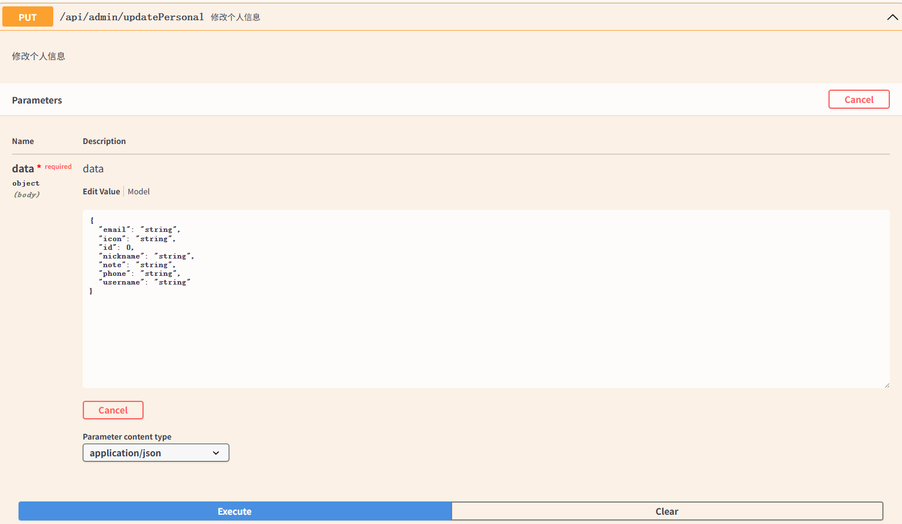

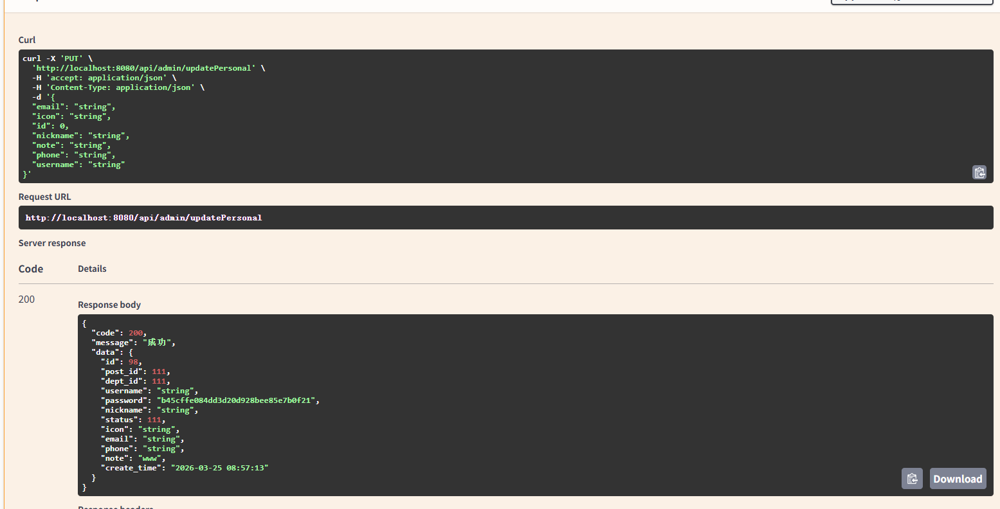

## 8.10 修改个人密码

### 8.10.1 entity

首先创建结构体，需要包含旧密码、新密码和重复密码。

```go
//UpdatePersonalPasswordDto 修改密码
type UpdatePersonalPasswordDto struct {
    Id uint
    Password string `validate:"required"`
    NewPassword string  `validate:"required"`
    ResetPassword string `validate:"required"`
}
```

### 8.10.2 dao

```go
// UpdatePersonalPassword 修改密码
func UpdatePersonalPassword(dto entity.UpdatePersonalPasswordDto) (sysAdmin entity.SysAdmin) {
    Db.First(&sysAdmin, dto.Id)
    sysAdmin.Password = dto.NewPassword
    Db.Save(&sysAdmin)
    return sysAdmin
}
```

### 8.10.3 service

```go
// UpdatePersonalPassword 修改密码
func (s SysAdminServiceImpl) UpdatePersonalPassword(c *gin.Context, dto entity.UpdatePersonalPasswordDto) {
	err := validator.New().Struct(dto)
	if err != nil {
		result.Failed(c, int(result.ApiCode.MissingChangePasswordParameter), result.ApiCode.GetMessage(result.ApiCode.MissingChangePasswordParameter))
		return
	}
	sysAdmin, _ := jwt.GetAdmin(c)
	dto.Id = sysAdmin.Id
	//dto.Id = 98
	//username := "string"
	sysAdminExist := dao.GetSysAdminByUsername(sysAdmin.Username)
	//sysAdminExist := dao.GetSysAdminByUsername(username)
	if sysAdminExist.Password != util.EncryptionMd5(dto.Password) {
		result.Failed(c, int(result.ApiCode.PASSWORDNOTTRUE), result.ApiCode.GetMessage(result.ApiCode.PASSWORDNOTTRUE))
		return
	}
	if dto.NewPassword != dto.ResetPassword {
		result.Failed(c, int(result.ApiCode.ResetPassword), result.ApiCode.GetMessage(result.ApiCode.ResetPassword))
		return
	}
	dto.NewPassword = util.EncryptionMd5(dto.NewPassword)
	sysAdminUpdatePwd := dao.UpdatePersonalPassword(dto)
	tokenString, _ := jwt.GenerateTokenByAdmin(sysAdminUpdatePwd)
	result.Success(c, map[string]any{"token": tokenString, "sysAdmin": sysAdminUpdatePwd})
	return
}
```

这里更换了密码后，需要注意更新token。

### 8.10.3 controller

```go
// UpdatePersonalPassword 修改密码
// @Summary 修改密码
// @Produce json
// @Description 修改密码
// @param data body entity.UpdatePersonalPasswordDto true "data"
// @Success 200 {object} result.Result
// @router /api/admin/updatePersonalPassword [put]
func UpdatePersonalPassword(c *gin.Context) {
    var dto entity.UpdatePersonalPasswordDto
    _ = c.BindJSON(&dto)
    service.SysAdminService().UpdatePersonalPassword(c, dto)
}
```

### 8.10.4 router

```go
router.PUT("/api/admin/updatePersonalPassword", controller.UpdatePersonalPassword)
```

### 8.10.5 swagger

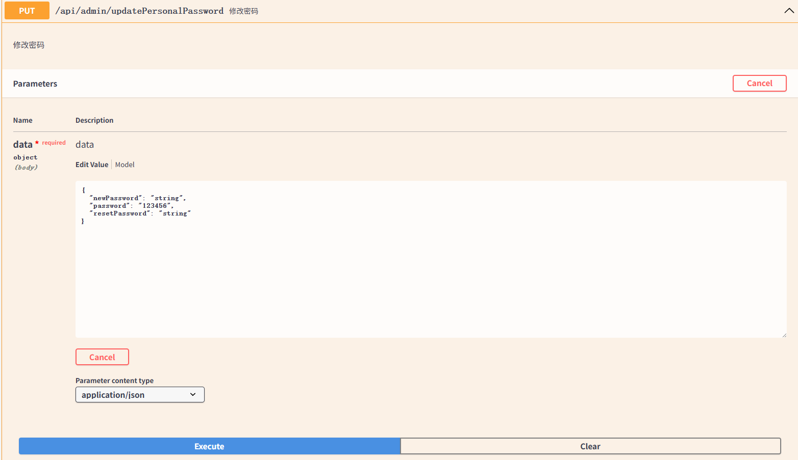

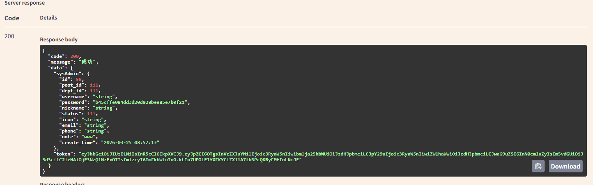

## 8.11 获取菜单信息

在登录成功后，需要获取对应的菜单栏信息。在`sysMenu`中实现。

### 8.11.1 entity

```go
// MenuSVo 菜单Vo
type MenuSVo struct {
	MenuName string `json:"menuName"`
	Icon     string `json:"icon"`
	Url      string `json:"url"`
}

// LeftMenuVo 左侧菜单Vo
type LeftMenuVo struct {
	Id          uint      `json:"id"`
	MenuName    string    `json:"menuName"`
	Icon        string    `json:"icon"`
	Url         string    `json:"url"`
	MenuSVoList []MenuSVo `gorm:"-" json:"menuSVoList"`
}

// ValueVo 权限Vo
type ValueVo struct {
	Value string `json:"value"`
}
```

### 8.11.2 dao

```go
// QueryMenuVoList 当前登录用户左侧菜单
func QueryMenuVoList(AdminId, MenuId uint) (menuSVo []entity.MenuSVo) {
	const status, menuStatus, menuType = 1, 2, 2
	Db.Table("sys_menu sm").
		Select("sm.menu_name, sm.icon, sm.url").
		Joins("LEFT JOIN sys_role_menu srm ON sm.id = srm.menu_id").
		Joins("LEFT JOIN sys_role sr ON sr.id = srm.role_id").
		Joins("LEFT JOIN sys_admin_role sar ON sar.role_id = sr.id").
		Joins("LEFT JOIN sys_admin sa ON sa.id = sar.admin_id").
		Where("sr.status = ?", status).
		Where("sm.menu_status = ?", menuStatus).
		Where("sm.menu_type = ?", menuType).
		Where("sm.parent_id = ?", MenuId).
		Where("sa.id = ?", AdminId).
		Order("sm.sort").
		Scan(&menuSVo)
	return menuSVo
}

// QueryLeftMenuList 当前登录用户左侧菜单列表
func QueryLeftMenuList(Id uint) (leftMenuVo []entity.LeftMenuVo) {
	const status, menuStatus, menuType uint = 1, 2, 1
	Db.Table("sys_menu sm").
		Select("sm.id, sm.menu_name, sm.url, sm.icon").
		Joins("LEFT JOIN sys_role_menu srm ON srm.menu_id = sm.id").
		Joins("LEFT JOIN sys_role sr ON sr.id = srm.role_id").
		Joins("LEFT JOIN sys_admin_role sar ON sar.role_id = sr.id").
		Joins("LEFT JOIN sys_admin sa ON sa.id = sar.admin_id").
		Where("sr.status = ?", status).
		Where("sm.menu_status = ?", menuStatus).
		Where("sm.menu_type = ?", menuType).
		Where("sa.id = ?", Id).
		Order("sm.sort").
		Scan(&leftMenuVo)
	return leftMenuVo
}
```

### 8.11.3 service

在`sysAdmin.go`中的用户登录添加部分逻辑。

```go
// Login 用户登录
func (s SysAdminServiceImpl) Login(c *gin.Context, dto entity.LoginDto) {
	// 登录参数校验，根据结构体的validate标签校验属性值是否合法
	err := validator.New().Struct(dto)
	if err != nil {
		result.Failed(c, int(result.ApiCode.MissingLoginParameter), result.ApiCode.GetMessage(result.ApiCode.MissingLoginParameter))
		return
	}
	// 验证码是否过期
	code := util.RedisStore{}.Get(dto.IdKey, true)
	if len(code) == 0 {
		result.Failed(c, int(result.ApiCode.VerificationCodeHasExpired), result.ApiCode.GetMessage(result.ApiCode.VerificationCodeHasExpired))
		return
	}
	// 校验验证码
	verifyRes := CaptVerify(dto.IdKey, dto.Image)
	if !verifyRes {
		result.Failed(c, int(result.ApiCode.CAPTCHANOTTRUE), result.ApiCode.GetMessage(result.ApiCode.CAPTCHANOTTRUE))
		return
	}
	//校验密码
	sysAdmin := dao.SysAdminDetail(dto)
	if sysAdmin.Password != util.EncryptionMd5(dto.Password) {
		result.Failed(c, int(result.ApiCode.PASSWORDNOTTRUE), result.ApiCode.GetMessage(result.ApiCode.PASSWORDNOTTRUE))
		return
	}
	// 判断用户是否被禁用
	const status int = 2
	if sysAdmin.Status == status {
		result.Failed(c, int(result.ApiCode.STATUSISENABLE), result.ApiCode.GetMessage(result.ApiCode.STATUSISENABLE))
		return
	}
	// 生成token
	tokenString, _ := jwt.GenerateTokenByAdmin(sysAdmin)
	// 左侧菜单列表
	var leftMenuVo []entity.LeftMenuVo
	leftMenuList := dao.QueryLeftMenuList(sysAdmin.ID)
	for _, value := range leftMenuList {
		menuSVoList := dao.QueryMenuVoList(sysAdmin.ID, value.Id)
		item := entity.LeftMenuVo{}
		item.MenuSVoList = menuSVoList
		item.Id = value.Id
		item.MenuName = value.MenuName
		item.Icon = value.Icon
		item.Url = value.Url
		leftMenuVo = append(leftMenuVo, item)
	}
	result.Success(c, map[string]any{
		"token":    tokenString,
		"sysAdmin": sysAdmin,
		"leftMenu": leftMenuVo,
	})
}
```

### swagger

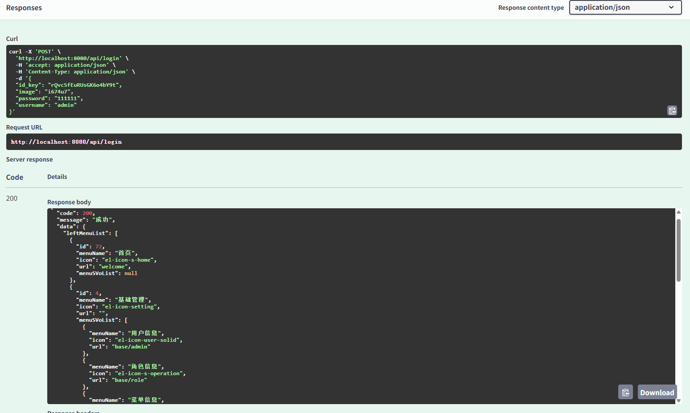

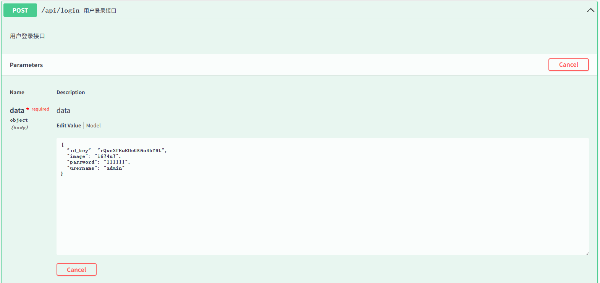

## 8.12 左侧菜单权限设置

### 8.12.1 dao

```go
// QueryPermissionList 当前登录用户权限列表
func QueryPermissionList(Id uint) (valueVo []entity.ValueVo) {
	const status, menuStatus, menuType uint = 1, 2, 1
	Db.Table("sys_menu sm").
		Select("sm.value").
		Joins("LEFT JOIN sys_role_menu srm ON sm.id = srm.menu_id").
		Joins("LEFT JOIN sys_role sr ON sr.id = srm.role_id").
		Joins("LEFT JOIN sys_admin_role sar ON sar.role_id = sr.id").
		Joins("LEFT JOIN sys_admin sa ON sa.id = sar.admin_id").
		Where("sr.status = ?", status).
		Where("sm.menu_status = ?", menuStatus).
		Not("sm.menu_type = ?", menuType).
		Where("sa.id = ?", Id).
		Scan(&valueVo)
	return valueVo
}
```

### 8.12.2 service

同样的，在`sysAdmin.go`的登录功能上添加查询权限功能。

```go
// Login 用户登录
func (s SysAdminServiceImpl) Login(c *gin.Context, dto entity.LoginDto) {
    // 登录参数校验，根据结构体的validate标签校验属性值是否合法
    err := validator.New().Struct(dto)
    if err != nil {
       result.Failed(c, int(result.ApiCode.MissingLoginParameter), result.ApiCode.GetMessage(result.ApiCode.MissingLoginParameter))
       return
    }
    // 验证码是否过期
    code := util.RedisStore{}.Get(dto.IdKey, true)
    if len(code) == 0 {
       result.Failed(c, int(result.ApiCode.VerificationCodeHasExpired), result.ApiCode.GetMessage(result.ApiCode.VerificationCodeHasExpired))
       return
    }
    // 校验验证码
    verifyRes := CaptVerify(dto.IdKey, dto.Image)
    if !verifyRes {
       result.Failed(c, int(result.ApiCode.CAPTCHANOTTRUE), result.ApiCode.GetMessage(result.ApiCode.CAPTCHANOTTRUE))
       return
    }
    //校验密码
    sysAdmin := dao.SysAdminDetail(dto)
    if sysAdmin.Password != util.EncryptionMd5(dto.Password) {
       result.Failed(c, int(result.ApiCode.PASSWORDNOTTRUE), result.ApiCode.GetMessage(result.ApiCode.PASSWORDNOTTRUE))
       return
    }
    // 判断用户是否被禁用
    const status int = 2
    if sysAdmin.Status == status {
       result.Failed(c, int(result.ApiCode.STATUSISENABLE), result.ApiCode.GetMessage(result.ApiCode.STATUSISENABLE))
       return
    }
    // 生成token
    tokenString, _ := jwt.GenerateTokenByAdmin(sysAdmin)
    // 左侧菜单列表
    var leftMenuVo []entity.LeftMenuVo
    leftMenuList := dao.QueryLeftMenuList(sysAdmin.ID)
    for _, value := range leftMenuList {
       menuSVoList := dao.QueryMenuVoList(sysAdmin.ID, value.Id)
       item := entity.LeftMenuVo{}
       item.MenuSVoList = menuSVoList
       item.Id = value.Id
       item.MenuName = value.MenuName
       item.Icon = value.Icon
       item.Url = value.Url
       leftMenuVo = append(leftMenuVo, item)
    }
    // 权限列表
    permissionList := dao.QueryPermissionList(sysAdmin.ID)
    var stringList = make([]string, 0)
    for _, value := range permissionList {
       stringList = append(stringList, value.Value)
    }
    result.Success(c, map[string]any{
       "token":        tokenString,
       "sysAdmin":     sysAdmin,
       "leftMenuList": leftMenuVo,
       "permissionList": stringList,
    })
}
```

### 8.12.3 swagger

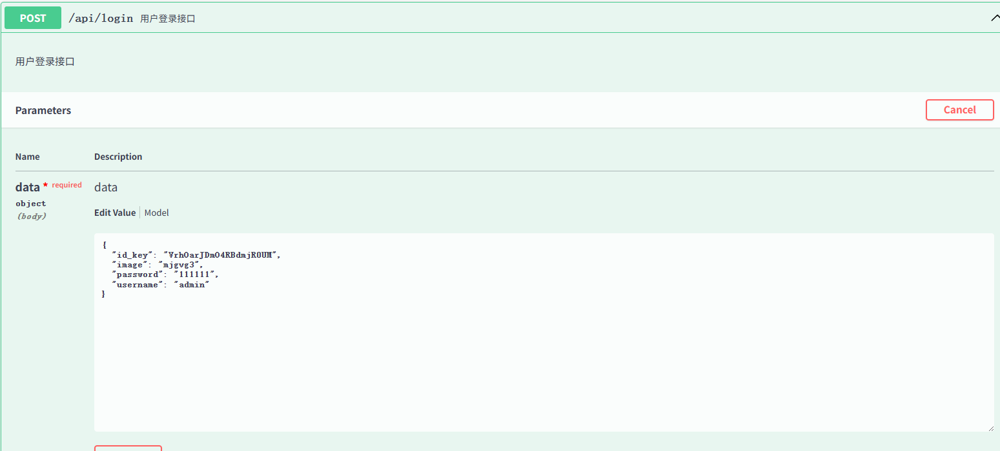

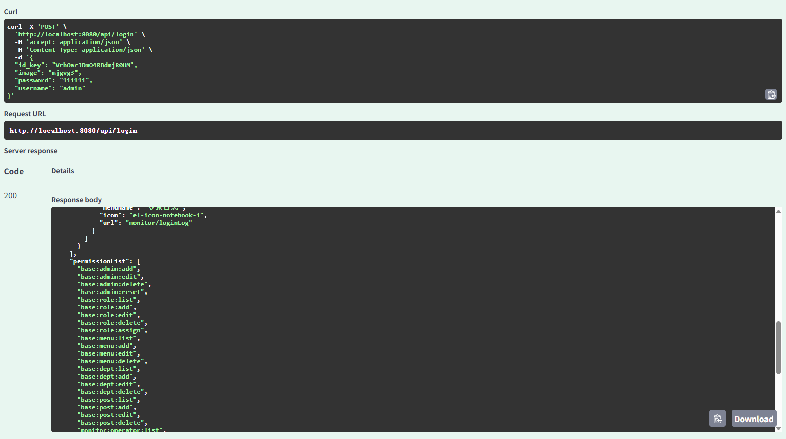

## 8.13 JWT鉴权

### 8.13.1 router

鉴权需要在进入路由之前添加中间件。

```go
package router

import (
	"Go-Management-System/api/controller"
	"Go-Management-System/common/config"
	"Go-Management-System/middleware"
	"net/http"

	"github.com/gin-gonic/gin"
	swaggerFiles "github.com/swaggo/files"
	ginSwagger "github.com/swaggo/gin-swagger"
)

// InitRouter 初始化路由
func InitRouter() *gin.Engine {
	// 创建初始的Engine
	router := gin.New()
	// 配置中间件
	// 1. 配置Recovery
	router.Use(gin.Recovery())
	// 2. 配置跨域请求
	router.Use(middleware.Cors())
	// 3. 配置文件上传服务
	router.StaticFS(config.Config.ImageSettings.UploadDir, http.Dir(config.Config.ImageSettings.UploadDir))
	// 4. 配置日志中间件
	router.Use(middleware.Logger())

	// 5. 注册路由
	register(router)

	return router
}

// register 路由注册
func register(router *gin.Engine) {
	// todo 添加接口url
	router.GET("/api/captcha", controller.Captcha)
	router.GET("/swagger/*any", ginSwagger.WrapHandler(swaggerFiles.Handler))
	router.POST("/api/login", controller.Login)
	// jwt鉴权
	jwt := router.Group("/api", middleware.AuthMiddleware())
	{
		jwt.POST("/post/add", controller.CreateSysPost)
		jwt.GET("/post/list", controller.GetSysPostList)
		jwt.GET("/post/info", controller.GetSysPostById)
		jwt.PUT("/post/update", controller.UpdateSysPost)
		jwt.DELETE("/post/delete", controller.DeleteSysPostById)
		jwt.DELETE("/post/batch/delete", controller.BatchDeleteSysPost)
		jwt.PUT("/post/updateStatus", controller.UpdateSysPostStatus)
		jwt.GET("/post/vo/list", controller.QuerySysPostVOList)
		jwt.GET("/dept/list", controller.GetSysDeptList)
		jwt.POST("/dept/add", controller.CreateSysDept)
		jwt.GET("/dept/info", controller.GetSysDeptById)
		jwt.PUT("/dept/update", controller.UpdateSysDept)
		jwt.DELETE("/dept/delete", controller.DeleteSysDeptById)
		jwt.GET("/dept/vo/list", controller.QuerySysDeptVOList)
		jwt.POST("/menu/add", controller.CreateSysMenu)
		jwt.GET("/menu/vo/list", controller.QuerySysMenuVOList)
		jwt.GET("/menu/info", controller.GetSysMenuById)
		jwt.PUT("/menu/update", controller.UpdateSysMenu)
		jwt.DELETE("/menu/delete", controller.DeleteSysMenuById)
		jwt.GET("/menu/list", controller.GetSysMenuList)
		jwt.POST("/role/add", controller.CreateSysRole)
		jwt.GET("/role/info", controller.GetSysRoleById)
		jwt.PUT("/role/update", controller.UpdateSysRole)
		jwt.DELETE("/role/delete", controller.DeleteSysRoleById)
		jwt.PUT("/role/updateStatus", controller.UpdateSysRoleStatus)
		jwt.GET("/role/list", controller.GetSysRoleList)
		jwt.GET("/role/vo/list", controller.QuerySysRoleVOList)
		jwt.GET("/role/vo/idList", controller.QueryRoleMenuIdList)
		jwt.PUT("/role/assignPermissions", controller.AssignPermissions)
		jwt.POST("/admin/add", controller.CreateSysAdmin)
		jwt.GET("/admin/info", controller.GetSysAdminInfo)
		jwt.PUT("/admin/update", controller.UpdateSysAdmin)
		jwt.DELETE("/admin/delete", controller.DeleteSysAdminById)
		jwt.PUT("/admin/updateStatus", controller.UpdateSysAdminStatus)
		jwt.PUT("/admin/updatePassword", controller.ResetSysAdminPassword)
		jwt.GET("/admin/list", controller.GetSysAdminList)
		jwt.POST("/upload", controller.Upload)
		jwt.PUT("/admin/updatePersonal", controller.UpdatePersonal)
		jwt.PUT("/admin/updatePersonalPassword", controller.UpdatePersonalPassword)
	}
}
```

### 8.13.2 auth

接下来在middleware的`auth.go`实现校验token。

```go
package middleware

import (
    "Go-Management-System/common/constant"
    "Go-Management-System/common/result"
    "Go-Management-System/pkg/jwt"
    "strings"

    "github.com/gin-gonic/gin"
)

func AuthMiddleware() func(c *gin.Context) {
    return func(c *gin.Context) {
       authHeader := c.Request.Header.Get("Authorization")
       if authHeader == "" {
          // 未授权
          result.Failed(c, int(result.ApiCode.NOAUTH), result.ApiCode.GetMessage(result.ApiCode.NOAUTH))
          c.Abort()
          return
       }
       // 长度不等于2，格式错误
       parts := strings.SplitN(authHeader, " ", 2)
       if !(len(parts) == 2 && parts[0] == "Bearer") {
          result.Failed(c, int(result.ApiCode.AUTHFORMATERROR), result.ApiCode.GetMessage(result.ApiCode.AUTHFORMATERROR))
          c.Abort()
          return
       }
       // 验证token
       mc, err := jwt.ValidateToken(parts[1])
       if err != nil {
          result.Failed(c, int(result.ApiCode.INVALIDTOKEN), result.ApiCode.GetMessage(result.ApiCode.INVALIDTOKEN))
          c.Abort()
          return
       }

       c.Set(constant.ContextKeyUserObj, mc)
       c.Next()
    }
}
```

### 8.13.3 controller

接下来将除了登录接口的其他接口都添加安全校验。

```go
// Package controller 用户控制层
package controller

import (
    "Go-Management-System/api/entity"
    "Go-Management-System/api/service"
    "strconv"

    "github.com/gin-gonic/gin"
)

// Login 登录
// @Summary 用户登录接口
// @Produce json
// @Description 用户登录接口
// @param data body entity.LoginDto true "data"
// @Success 200 {object} result.Result
// @router /api/login [post]
func Login(c *gin.Context) {
    var dto entity.LoginDto
    _ = c.BindJSON(&dto)
    service.SysAdminService().Login(c, dto)
}

// CreateSysAdmin 创建用户
// @Summary 创建用户接口
// @Produce json
// @Description 创建用户接口
// @param data body entity.AddSysAdminDto true "data"
// @Success 200 {object} result.Result
// @router /api/admin/add [post]
// @Security ApiKeyAuth
func CreateSysAdmin(c *gin.Context) {
    var addSysAdminDto entity.AddSysAdminDto
    _ = c.BindJSON(&addSysAdminDto)
    service.SysAdminService().CreateSysAdmin(c, addSysAdminDto)
}

// GetSysAdminInfo 根据id查询用户
// @Summary 根据id查询用户
// @Produce json
// @Description 根据id查询用户
// @param id query int true "id"
// @Success 200 {object} result.Result
// @router /api/admin/info [get]
// @Security ApiKeyAuth
func GetSysAdminInfo(c *gin.Context) {
    Id, _ := strconv.Atoi(c.Query("id"))
    service.SysAdminService().GetSysAdminInfo(c, Id)
}

// UpdateSysAdmin 修改用户
// @Summary 修改用户
// @Produce json
// @Description 修改用户
// @param data body entity.UpdateSysAdminDto true "data"
// @Success 200 {object} result.Result
// @router /api/admin/update [put]
// @Security ApiKeyAuth
func UpdateSysAdmin(c *gin.Context) {
    var dto entity.UpdateSysAdminDto
    _ = c.BindJSON(&dto)
    service.SysAdminService().UpdateSysAdmin(c, dto)
}

// DeleteSysAdminById 根据id删除用户
// @Summary 根据id删除用户
// @Produce json
// @Description 根据id删除用户
// @param data body entity.SysAdminIdDto true "data"
// @Success 200 {object} result.Result
// @router /api/admin/delete [delete]
// @Security ApiKeyAuth
func DeleteSysAdminById(c *gin.Context) {
    var dto entity.SysAdminIdDto
    _ = c.BindJSON(&dto)
    service.SysAdminService().DeleteSysAdminById(c, dto)
}

// UpdateSysAdminStatus 修改用户状态
// @Summary 修改用户状态
// @Produce json
// @Description 修改用户状态
// @param data body entity.UpdateSysAdminStatusDto true "data"
// @Success 200 {object} result.Result
// @router /api/admin/updateStatus [put]
// @Security ApiKeyAuth
func UpdateSysAdminStatus(c *gin.Context) {
    var dto entity.UpdateSysAdminStatusDto
    _ = c.BindJSON(&dto)
    service.SysAdminService().UpdateSysAdminStatus(c, dto)
}

// ResetSysAdminPassword 重置密码
// @Summary 重置密码
// @Produce json
// @Description 重置密码
// @param data body entity.ResetSysAdminPasswordDto true "data"
// @Success 200 {object} result.Result
// @router /api/admin/updatePassword [put]
// @Security ApiKeyAuth
func ResetSysAdminPassword(c *gin.Context) {
    var dto entity.ResetSysAdminPasswordDto
    _ = c.BindJSON(&dto)
    service.SysAdminService().ResetSysAdminPassword(c, dto)
}

// GetSysAdminList 分页查询用户
// @Summary 分页查询用户
// @Produce json
// @Description 分页查询用户
// @param pageNum query int false "分页数"
// @Param pageSize query int false "每页数"
// @Param username query string false "用户名"
// @Param Status query string false "账号启用状态：1->启用，2->禁用"
// @Param beginTime query string false "开始时间"
// @Param endTime query string false "结束时间"
// @Success 200 {object} result.Result
// @router /api/admin/list [get]
// @Security ApiKeyAuth
func GetSysAdminList(c *gin.Context) {
    pageNum, _ := strconv.Atoi(c.Query("pageNum"))
    pageSize, _ := strconv.Atoi(c.Query("pageSize"))
    Username := c.Query("username")
    Status := c.Query("status")
    BeginTime := c.Query("beginTime")
    EndTime := c.Query("endTime")
    service.SysAdminService().GetSysAdminList(c, pageSize, pageNum, Username, Status, BeginTime, EndTime)
}

// UpdatePersonal 修改个人信息
// @Summary 修改个人信息
// @Produce json
// @Description 修改个人信息
// @param data body entity.UpdatePersonalDto true "data"
// @Success 200 {object} result.Result
// @router /api/admin/updatePersonal [put]
// @Security ApiKeyAuth
func UpdatePersonal(c *gin.Context) {
    var dto entity.UpdatePersonalDto
    _ = c.BindJSON(&dto)
    service.SysAdminService().UpdatePersonal(c, dto)
}

// UpdatePersonalPassword 修改密码
// @Summary 修改密码
// @Produce json
// @Description 修改密码
// @param data body entity.UpdatePersonalPasswordDto true "data"
// @Success 200 {object} result.Result
// @router /api/admin/updatePersonalPassword [put]
// @Security ApiKeyAuth
func UpdatePersonalPassword(c *gin.Context) {
    var dto entity.UpdatePersonalPasswordDto
    _ = c.BindJSON(&dto)
    service.SysAdminService().UpdatePersonalPassword(c, dto)
}
```

### 8.13.4 swagger

现在，只要没有登录获取token，就无法使用接口。

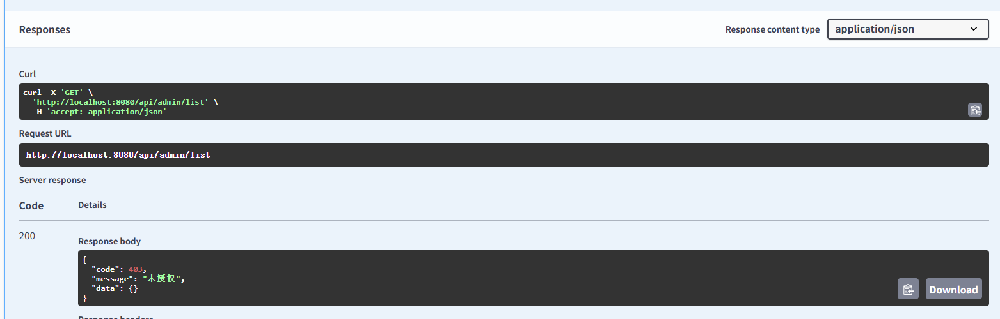

但是如果进行登录，然后将`Bearer [token]`写入到Authorization中，就可以使用接口。

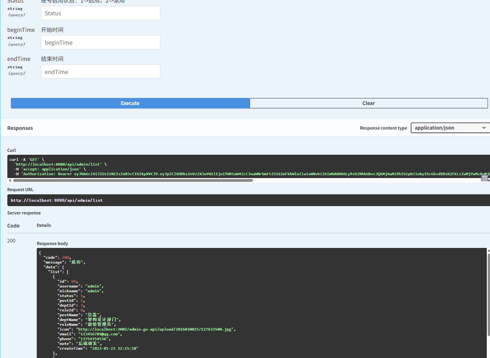

# 9. 登录日志相关接口

用户每次登录，都需要记录登录的账号、时间、地点、ip地址等。

## 9.1 util

首先要创建工具类`osAndBrowser.go`，用来获取浏览器和os。

```go
package util

import (
    "github.com/gin-gonic/gin"
    useragent "github.com/wenlng/go-user-agent"
)

func GetOs(c *gin.Context) string{
    userAgent := c.Request.Header.Get("User-Agent")
    return useragent.GetOsName(userAgent)
}

func GetBrowser(c *gin.Context) string{
    userAgent := c.Request.Header.Get("User-Agent")
    return useragent.GetBrowserName(userAgent)
}
```

然后创建工具类`ipUtil.go`，用来获取ip地址。

```go
package util

import (
    "fmt"
    "net"
    "strings"

    "github.com/gogf/gf/encoding/gcharset"
    "github.com/gogf/gf/encoding/gjson"
    "github.com/gogf/gf/net/ghttp"
    "github.com/gogf/gf/util/gconv"
)

func GetRealAddressById(ip string) string {
    toByteIp := ipToByte(ip)
    if isLocalIp(toByteIp) {
       return "服务器登录"
    }
    if isLANIp(toByteIp) {
       return "局域网"
    }
    return getLocation(ip)
}

func ipToByte(ipStr string) []byte {
    ips := strings.Split(ipStr, ".")
    ip := make([]byte, 0, len(ips))
    for _, s := range ips {
       u := gconv.Uint8(s)
       ip = append(ip, u)
    }
    return ip
}

func isLANIp(IP net.IP) bool {
    fmt.Println(IP.To4())
    if ip4 := IP.To4(); ip4 != nil {
       switch true {
       case ip4[0] == 10:
          return true
       case ip4[0] == 172 && ip4[1] >= 16 && ip4[1] <= 31:
          return true
       case ip4[0] == 192 && ip4[1] == 168:
          return true
       default:
          return false
       }
    }
    return false
}
func isLocalIp(IP net.IP) bool {
    if IP.IsLoopback() || IP.IsLinkLocalMulticast() || IP.IsLinkLocalUnicast() {
       return true
    }
    return false
}

func getLocation(ip string) string {
    url := "https://whois.pconline.com.cn/ipJson.jsp?json=true&ip=" + ip
    bytes := ghttp.GetBytes(url)
    src := string(bytes)
    srcCharset := "GBK"
    tmp, _ := gcharset.ToUTF8(srcCharset, src)
    json, err := gjson.DecodeToJson(tmp)
    if err != nil {
       fmt.Println(err)
    }
    if json.GetInt("code") == 0 {
       addr := json.GetString("addr")
       return addr
    }
    return "未知地址"
}

func GetLocalIP() (ip string, err error) {
    addrList, err := net.InterfaceAddrs()
    if err != nil {
       return
    }
    for _, addr := range addrList {
       ipAddr, ok := addr.(*net.IPNet)
       if !ok {
          continue
       }
       if ipAddr.IP.IsLoopback() {
          continue
       }
       if !ipAddr.IP.IsGlobalUnicast() {
          continue
       }
       return ipAddr.IP.String(), nil
    }
    return
}
```

## 9.2 新增日志

### 9.2.1 entity

```go
// Package entity 登陆日志模型
package entity

import "Go-Management-System/common/util"

// SysLoginInfo 登录日志
type SysLoginInfo struct {
	ID            uint       `gorm:"column:id;comment:'主键';primaryKey;NOT NULL" json:"id"`                   // ID
	Username      string     `gorm:"column:username;varchar(50);comment:'用户账号'" json:"username"`             // 用户账号
	IpAddress     string     `gorm:"column:ip_address;varchar(128);comment:'登录IP地址'" json:"ipAddress"`       // 登录IP地址
	LoginLocation string     `gorm:"column:login_location;varchar(255);comment:'登录地点'" json:"loginLocation"` // 登录地点
	Browser       string     `gorm:"column:browser;varchar(50);comment:'浏览器类型'" json:"browser"`              // 浏览器类型
	Os            string     `gorm:"column:os;varchar(50);comment:'操作系统'" json:"os"`                         // 操作系统
	LoginStatus   int        `gorm:"column:login_status;comment:'登录状态（1-成功 2-失败）'" json:"loginStatus"`        // 登录状态（1-成功 2-失败）
	Message       string     `gorm:"column:message;varchar(255);comment:'提示消息'" json:"message"`              // 提示消息
	LoginTime     util.HTime `gorm:"column:login_time;comment:'访问时间'" json:"loginTime"`                      // 访问时间
}

func (SysLoginInfo) TableName() string {
	return "sys_login_info"
}
```

### 9.2.2 dao

```go
// Package dao 登陆日志dao层
package dao

import (
    "Go-Management-System/api/entity"
    "Go-Management-System/common/util"
    . "Go-Management-System/pkg/db"
    "time"
)

// CreateSysLoginInfo 新增登录日志
func CreateSysLoginInfo(username, ipAddress, loginLocation, browser, os, message string, loginStatus int) {
    sysLoginInfo := entity.SysLoginInfo{
       Username:      username,
       IpAddress:     ipAddress,
       LoginLocation: loginLocation,
       Browser:       browser,
       Os:            os,
       Message:       message,
       LoginStatus:   loginStatus,
       LoginTime:     util.HTime{Time: time.Now()},
    }
    Db.Save(&sysLoginInfo)
}
```

### 9.2.3 service

日志记录在用户登录时实现，因此需要在用户登录逻辑上添加日志。验证码失败、登录失败、登录成功等都需要进行记录。

```go
// Login 用户登录
func (s SysAdminServiceImpl) Login(c *gin.Context, dto entity.LoginDto) {
    // 登录参数校验，根据结构体的validate标签校验属性值是否合法
    err := validator.New().Struct(dto)
    if err != nil {
       result.Failed(c, int(result.ApiCode.MissingLoginParameter), result.ApiCode.GetMessage(result.ApiCode.MissingLoginParameter))
       return
    }
    // 获取ip地址
    ip := c.ClientIP()
    // 验证码是否过期
    code := util.RedisStore{}.Get(dto.IdKey, true)
    if len(code) == 0 {
       dao.CreateSysLoginInfo(dto.Username, ip, util.GetRealAddressById(ip), util.GetBrowser(c), util.GetOs(c), "验证码已过期", 2)
       result.Failed(c, int(result.ApiCode.VerificationCodeHasExpired), result.ApiCode.GetMessage(result.ApiCode.VerificationCodeHasExpired))
       return
    }
    // 校验验证码
    verifyRes := CaptVerify(dto.IdKey, dto.Image)
    if !verifyRes {
       dao.CreateSysLoginInfo(dto.Username, ip, util.GetRealAddressById(ip), util.GetBrowser(c), util.GetOs(c), "验证码不正确", 2)
       result.Failed(c, int(result.ApiCode.CAPTCHANOTTRUE), result.ApiCode.GetMessage(result.ApiCode.CAPTCHANOTTRUE))
       return
    }
    //校验密码
    sysAdmin := dao.SysAdminDetail(dto)
    if sysAdmin.Password != util.EncryptionMd5(dto.Password) {
       dao.CreateSysLoginInfo(dto.Username, ip, util.GetRealAddressById(ip), util.GetBrowser(c), util.GetOs(c), "密码错误", 2)
       result.Failed(c, int(result.ApiCode.PASSWORDNOTTRUE), result.ApiCode.GetMessage(result.ApiCode.PASSWORDNOTTRUE))
       return
    }
    // 判断用户是否被禁用
    const status int = 2
    if sysAdmin.Status == status {
       dao.CreateSysLoginInfo(dto.Username, ip, util.GetRealAddressById(ip), util.GetBrowser(c), util.GetOs(c), "账号已停用", 2)
       result.Failed(c, int(result.ApiCode.STATUSISENABLE), result.ApiCode.GetMessage(result.ApiCode.STATUSISENABLE))
       return
    }
    // 生成token
    tokenString, _ := jwt.GenerateTokenByAdmin(sysAdmin)
    dao.CreateSysLoginInfo(dto.Username, ip, util.GetRealAddressById(ip), util.GetBrowser(c), util.GetOs(c), "登录成功", 1)
    // 左侧菜单列表
    var leftMenuVo []entity.LeftMenuVo
    leftMenuList := dao.QueryLeftMenuList(sysAdmin.ID)
    for _, value := range leftMenuList {
       menuSVoList := dao.QueryMenuVoList(sysAdmin.ID, value.Id)
       item := entity.LeftMenuVo{}
       item.MenuSVoList = menuSVoList
       item.Id = value.Id
       item.MenuName = value.MenuName
       item.Icon = value.Icon
       item.Url = value.Url
       leftMenuVo = append(leftMenuVo, item)
    }
    // 权限列表
    permissionList := dao.QueryPermissionList(sysAdmin.ID)
    var stringList = make([]string, 0)
    for _, value := range permissionList {
       stringList = append(stringList, value.Value)
    }
    result.Success(c, map[string]any{
       "token":          tokenString,
       "sysAdmin":       sysAdmin,
       "leftMenuList":   leftMenuVo,
       "permissionList": stringList,
    })
}
```

### 9.2.4 swagger

只要登录成功，就会在`sys_login_info`表中添加日志信息。

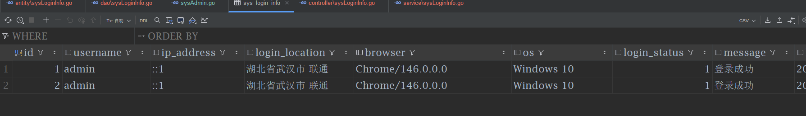

密码错误也会被记录。

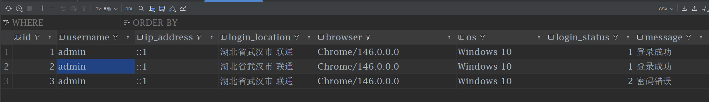

## 9.3 分页查询登录日志

### 9.3.1 dao

```go
// GetSysLoginInfoList 分页获取登陆日志列表
func GetSysLoginInfoList(Username, LoginStatus, BeginTime, EndTime string, PageSize, PageNum int) (sysLoginInfo []entity.SysLoginInfo, count int64) {
    curDb := Db.Table("sys_login_info")
    if Username != "" {
       curDb = curDb.Where("username = ?", Username)
    }
    if LoginStatus != "" {
       curDb = curDb.Where("login_status = ?", LoginStatus)
    }
    if BeginTime != "" && EndTime != "" {
       curDb = curDb.Where("`login_time` BETWEEN ? AND ?", BeginTime, EndTime)
    }
    curDb.Count(&count)
    curDb.Limit(PageSize).Offset((PageNum - 1) * PageSize).Order("`login_time` desc").Find(&sysLoginInfo)
    return sysLoginInfo, count
}
```

### 9.3.2 service

```go
// GetSysLoginInfoList 分页获取登录日志
func (s SysLoginInfoServiceImpl)GetSysLoginInfoList (c *gin.Context, Username, LoginStatus, BeginTime, EndTime string, PageSize, PageNum int) {
    if PageSize < 1 {
       PageSize = 10
    }
    if PageNum < 1 {
       PageNum = 1
    }
    sysLoginInfo, count := dao.GetSysLoginInfoList(Username, LoginStatus, BeginTime, EndTime, PageSize, PageNum)
    result.Success(c, map[string]any{"total": count, "pageSize": PageSize, "pageNum": PageNum, "list": sysLoginInfo})
}
```

### 9.3.3 controller

```go
// GetSysLoginInfo 分页获取登录日志
// @Summary 分页获取登录日志接口
// @Produce json
// @Description 分页获取登录日志接口
// @Param pageNum query int false "分页数"
// @Param pageSize query int false "每页数"
// @Param loginStatus query string false "登录状态：1 ->成功 2 ->失败"
// @Param beginTime query string false "开始时间"
// @Param endTime query string false "结束时间"
// @Success 200 {object} result.Result
// @router /api/sysLoginInfo/list [get]
// @Security ApiKeyAuth
func GetSysLoginInfo(c *gin.Context) {
	PageSize, _ := strconv.Atoi(c.Query("pageSize"))
	PageNum, _ := strconv.Atoi(c.Query("pageNum"))
	Username := c.Query("username")
	LoginStatus := c.Query("loginStatus")
	BeginTime := c.Query("beginTime")
	EndTime := c.Query("endTime")
	service.SysLoginInfoService().GetSysLoginInfoList(c, Username, LoginStatus, BeginTime, EndTime, PageSize, PageNum)
}
```

### 9.3.4 router

```go
jwt.GET("/sysLoginInfo/list", controller.GetSysLoginInfo)
```

### 9.3.5 swagger

这里登录并通过`Bearer [token]`授权后，就能分页查询登录日志。

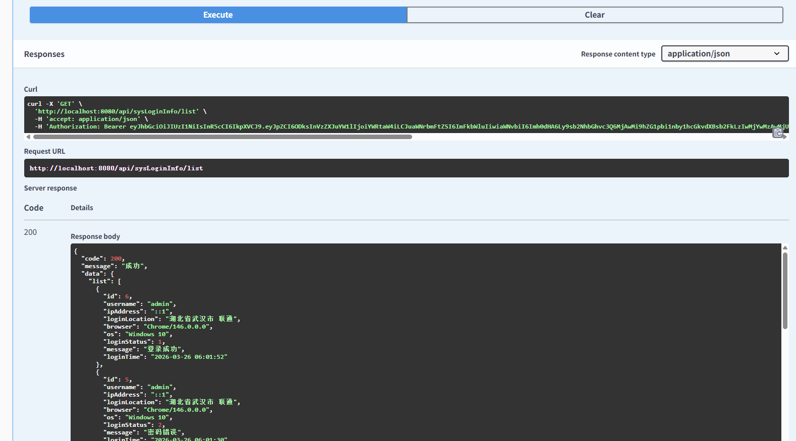

## 9.4 删除日志信息

### 9.4.1 entity

```go
// SysLoginInfoIdDto 删除日志所需参数
type SysLoginInfoIdDto struct {
	Id uint `json:"id"`
}

// DelSysLoginInfoDto 批量删除日志所需参数
type DelSysLoginInfoDto struct {
	Ids []uint `json:"ids"`
}

// CleanSysLoginInfo 清空登录日志
func CleanSysLoginInfo() {
	Db.Exec("TRUNCATE TABLE sys_login_info")
}
```

### 9.4.2 dao

```go
// DeleteSysLoginInfoById 根据id删除日志
func DeleteSysLoginInfoById(dto entity.SysLoginInfoIdDto) {
    Db.Delete(&entity.SysLoginInfo{}, dto.Id)
}

// BatchDeleteSysLoginInfo 批量删除日志
func BatchDeleteSysLoginInfo(dto entity.DelSysLoginInfoDto) {
    Db.Where("id in (?)", dto.Ids).Delete(&entity.SysLoginInfo{})
}

// CleanSysLoginInfo 清空登录日志
func (s SysLoginInfoServiceImpl) CleanSysLoginInfo(c *gin.Context) {
	dao.CleanSysLoginInfo()
	result.Success(c, true)
}
```

### 9.4.3 service

```go
// DeleteSysLoginInfo 根据id删除日志
func (s SysLoginInfoServiceImpl) DeleteSysLoginInfo(c *gin.Context, dto entity.SysLoginInfoIdDto) {
    dao.DeleteSysLoginInfoById(dto)
    result.Success(c, true)
}

// BatchDeleteSysLoginInfo 批量删除日志
func (s SysLoginInfoServiceImpl) BatchDeleteSysLoginInfo(c *gin.Context, dto entity.DelSysLoginInfoDto) {
    dao.BatchDeleteSysLoginInfo(dto)
    result.Success(c, true)
}

// CleanSysLoginInfo 清空登录日志
func (s SysLoginInfoServiceImpl) CleanSysLoginInfo(c *gin.Context) {
	dao.CleanSysLoginInfo()
	result.Success(c, true)
}
```

### 9.4.4 controller

```go
// DeleteSysLoginInfoById 根据id删除登录日志
// @Summary 根据id删除登录日志
// @Produce json
// @Description 根据id删除登录日志
// @Param data body entity.SysLoginInfoIdDto true "data"
// @Success 200 {object} result.Result
// @router /api/sysLoginInfo/delete [delete]
// @Security ApiKeyAuth
func DeleteSysLoginInfoById(c *gin.Context) {
    var sysLoginInfoIdDto entity.SysLoginInfoIdDto
    _ = c.ShouldBindJSON(&sysLoginInfoIdDto)
    service.SysLoginInfoService().DeleteSysLoginInfo(c, sysLoginInfoIdDto)
}

// BatchDeleteSysLoginInfo 批量删除登录日志
// @Summary 批量删除登录日志
// @Produce json
// @Description 批量删除登录日志
// @Param data body entity.DelSysLoginInfoDto true "data"
// @Success 200 {object} result.Result
// @router /api/sysLoginInfo/batch/delete [delete]
// @Security ApiKeyAuth
func BatchDeleteSysLoginInfo(c *gin.Context) {
    var delSysLoginInfoDto entity.DelSysLoginInfoDto
    _ = c.ShouldBindJSON(&delSysLoginInfoDto)
    service.SysLoginInfoService().BatchDeleteSysLoginInfo(c, delSysLoginInfoDto)
}

// CleanSysLoginInfo 清空操作日志
// @Summary 清空操作日志
// @Produce json
// @Description 清空操作日志
// @Success 200 {object} result.Result
// @router /api/sysLoginInfo/clean [delete]
// @Security ApiKeyAuth
func CleanSysLoginInfo(c *gin.Context) {
	service.SysLoginInfoService().CleanSysLoginInfo(c)
}
```

### 9.4.5 router

```go
jwt.DELETE("/sysLoginInfo/delete", controller.DeleteSysLoginInfoById)
jwt.DELETE("/sysLoginInfo/batch/delete", controller.BatchDeleteSysLoginInfo)
jwt.DELETE("/sysLoginInfo/clean", controller.CleanSysLoginInfo)
```

### 9.4.6 swagger

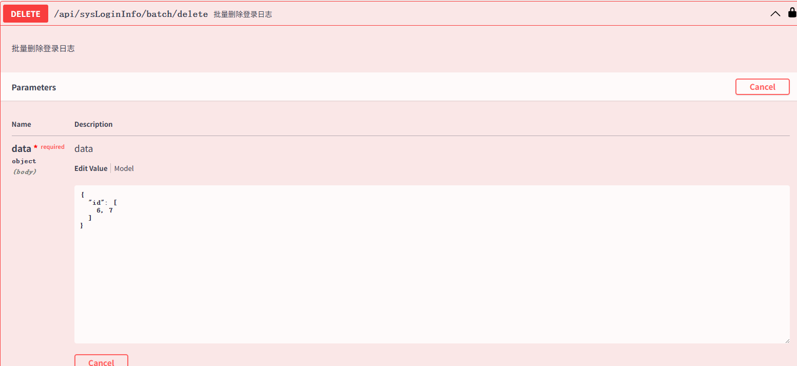

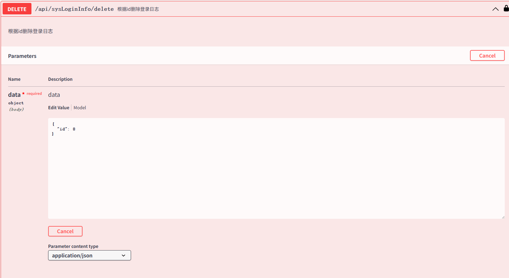

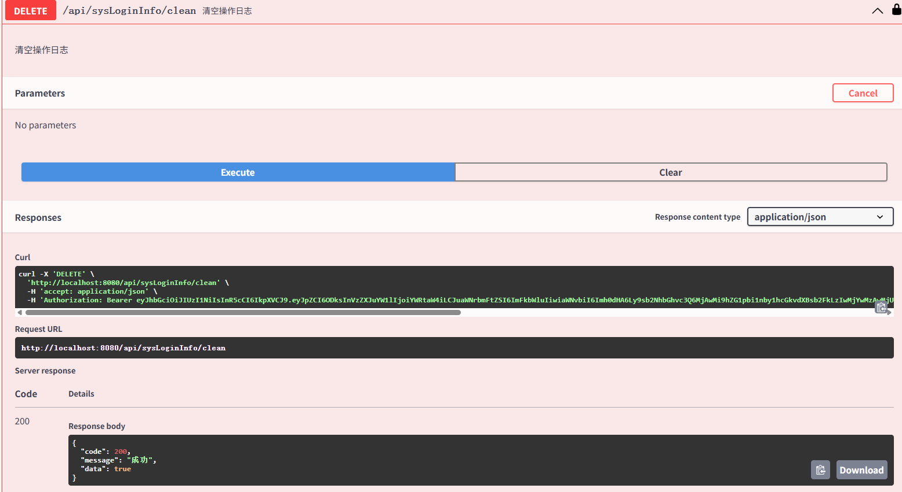

能够成功删除日志。

# 10. 操作日志相关接口

用户每进行的一次操作，都需要进行日志记录。

首先创建实体类`sysOperationLog.go`。

```go
// Package entity 操作日志模型
package entity

import "Go-Management-System/common/util"

// SysOperationLog 操作日志
type SysOperationLog struct {
    ID         uint       `gorm:"column:id;comment:'主键';primaryKey;NOT NULL" json:"id"`                 // ID
    AdminId    uint       `gorm:"column:admin_id;comment:'管理员id';NOT NULL" json:"adminId"`              // 管理员id
    Username   string     `gorm:"column:username;varchar(64);comment:'管理员账号';NOT NULL" json:"username"` // 管理员账号
    Method     string     `gorm:"column:method;varchar(64);comment:'请求方式';NOT NULL" json:"method"`      // 请求方式
    Ip         string     `gorm:"column:ip;varchar(64);comment:'IP'; json:"ip"`                         // IP
    Url        string     `gorm:"column:url;varchar(500);comment:'URL'; json:"url"`                     // URL
    CreateTime util.HTime `gorm:"column:create_time;comment:'创建时间';NOT NULL" json:"createTime"`         // 创建时间
}

func (SysOperationLog) TableName() string {
    return "sys_operation_log"
}

// SysOperationLogIdDto 根据id删除日志所需参数
type SysOperationLogIdDto struct {
	Id uint `json:"id"`
}

// BatchDeleteSysOperationLogDto 批量删除日志所需参数
type BatchDeleteSysOperationLogDto struct {
	Ids []uint `json:"ids"`
}
```

这样的话，需要添加新的中间件`LogMiddleware.go`来监控行为。

```go
// Package middleware 操作日志中间件
package middleware

import (
	"Go-Management-System/api/dao"
	"Go-Management-System/api/entity"
	"Go-Management-System/common/util"
	"Go-Management-System/pkg/jwt"
	"strings"
	"time"

	"github.com/gin-gonic/gin"
)

func LogMiddleware() gin.HandlerFunc {
	return func(c *gin.Context) {
		method := strings.ToLower(c.Request.Method)
		sysAdmin, _ := jwt.GetAdmin(c)
		if method != "get" {
			log := entity.SysOperationLog{
				AdminId:    sysAdmin.Id,
				Username:   sysAdmin.Username,
				Method:     method,
				Ip:         c.ClientIP(),
				Url:        c.Request.URL.Path,
				CreateTime: util.HTime{Time: time.Now()},
			}
			dao.CreateSysOperationLog(log)
		}
	}
}
```

## 10.1 新增日志

### 10.1.1 dao

```go
// Package dao 操作日志dao
package dao

import (
    "Go-Management-System/api/entity"
    ."Go-Management-System/pkg/db"
)

// CreateSysOperationLog 新增操作日志
func CreateSysOperationLog(log entity.SysOperationLog) {
    Db.Create(&log)
}
```

### 10.1.1 router

在jwt鉴权的router后添加这个日志即可。

```go
jwt := router.Group("/api", middleware.AuthMiddleware(), middleware.LogMiddleware())
```

### 10.1.2 swagger

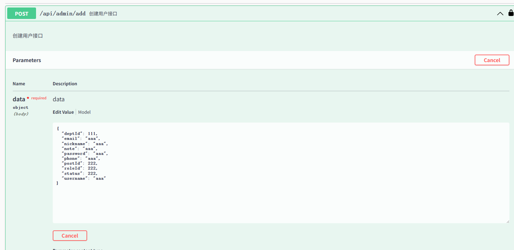

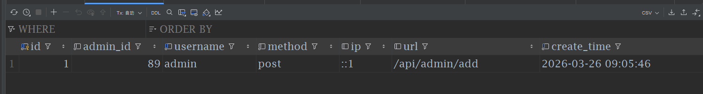

这里只要进行了非get请求，就都会记录。

## 10.2 分页查询操作日志、按id删除日志、批量删除日志、清空日志

### 10.2.1 dao

```go
// GetSysOperationLogList 分页查询操作日志
func GetSysOperationLogList(Username, BeginTime, EndTime string, PageSize, PageNum int) (sysOperationLog []entity.SysOperationLog, count int64) {
    curDb := Db.Table("sys_operation_log")
    if Username != "" {
       curDb = curDb.Where("username LIKE ?", "%"+Username+"%")
    }
    if BeginTime != "" && EndTime != "" {
       curDb = curDb.Where("create_time between ? and ?", BeginTime, EndTime)
    }
    curDb.Count(&count)
    curDb.Limit(PageSize).Offset((PageNum - 1) * PageSize).Order("create_time desc").Find(&sysOperationLog)
    return sysOperationLog, count
}


// DeleteSysOperationLogById 根据id删除操作日志
func DeleteSysOperationLogById(dto entity.SysOperationLogIdDto) {
	Db.Delete(&entity.SysOperationLog{}, dto.Id)
}

// BatchDeleteSysOperationLog 批量删除操作日志
func BatchDeleteSysOperationLog(dto entity.BatchDeleteSysOperationLogDto) {
	Db.Where("id in (?)", dto.Ids).Delete(&entity.SysOperationLog{})
}

// CleanSysOperationLog 清空操作日志
func CleanSysOperationLog() {
	Db.Exec("TRUNCATE TABLE sys_operation_log")
}
```

### 10.2.2 service

```go
// Package service 操作日志service
package service

import (
	"Go-Management-System/api/dao"
	"Go-Management-System/common/result"

	"github.com/gin-gonic/gin"
)

type ISysOperationLogService interface {
	GetSysOperationLogList (c *gin.Context, Username, BeginTime, EndTime string, PageSize, PageNum int)
}
type SysOperationLogServiceImpl struct{}

var sysOperationLogService = SysOperationLogServiceImpl{}

func SysOperationLogService() ISysOperationLogService {
	return &sysOperationLogService
}

// GetSysOperationLogList 分页查询操作日志
func (s SysOperationLogServiceImpl)GetSysOperationLogList (c *gin.Context, Username, BeginTime, EndTime string, PageSize, PageNum int) {
	if PageSize < 1 {
		PageSize = 10
	}
	if PageNum < 1 {
		PageNum = 1
	}
	sysOperationLogList, count := dao.GetSysOperationLogList(Username, BeginTime, EndTime, PageSize, PageNum)
	result.Success(c, map[string]any{"total": count, "pageSize": PageSize, "pageNum": PageNum, "list": sysOperationLogList})
}

// DeleteSysOperationLogById 根据id删除操作日志
func (s SysOperationLogServiceImpl) DeleteSysOperationLogById(c *gin.Context, dto entity.SysOperationLogIdDto) {
	dao.DeleteSysOperationLogById(dto)
	result.Success(c, true)
}

// BatchDeleteSysOperationLog 批量删除操作日志
func (s SysOperationLogServiceImpl) BatchDeleteSysOperationLog(c *gin.Context, dto entity.BatchDeleteSysOperationLogDto) {
	dao.BatchDeleteSysOperationLog(dto)
	result.Success(c, true)
}

// CleanSysOperationLog 清空操作日志
func (s SysOperationLogServiceImpl) CleanSysOperationLog(c *gin.Context) {
	dao.CleanSysOperationLog()
	result.Success(c, true)
}
```

### 10.2.3 controller

```go
// GetSysOperationLogList 分页查询操作日志
// @Summary 分页查询操作日志
// @Produce json
// @Description 分页查询操作日志
// @Param PageSize query int false "每页数"
// @Param PageNum query int false "分页数"
// @Param BeginTime query string false "开始时间"
// @Param EndTime query string false "结束时间"
// @Success 200 {object} result.Result
// @router /api/sysOperationLog/list [get]
// @Security ApiKeyAuth
func GetSysOperationLogList(c *gin.Context) {
    Username := c.Query("username")
    BeginTime := c.Query("beginTime")
    EndTime := c.Query("endTime")
    PageSize, _ := strconv.Atoi(c.Query("pageSize"))
    PageNum, _ := strconv.Atoi(c.Query("pageNum"))
    service.SysOperationLogService().GetSysOperationLogList(c, Username, BeginTime, EndTime, PageSize, PageNum)
}

// DeleteSysOperationLogById 根据id删除操作日志
// @Summary 根据id删除操作日志
// @Produce json
// @Description 根据id删除操作日志
// @Param data body entity.SysOperationLogIdDto true "data"
// @Success 200 {object} result.Result
// @router /api/sysOperationLog/delete [delete]
// @Security ApiKeyAuth
func DeleteSysOperationLogById(c *gin.Context) {
	var dto entity.SysOperationLogIdDto
	_ = c.ShouldBindJSON(&dto)
	service.SysOperationLogService().DeleteSysOperationLogById(c, dto)
}

// BatchDeleteSysOperationLog 批量删除操作日志
// @Summary 批量删除操作日志
// @Produce json
// @Description 批量删除操作日志
// @Param data body entity.BatchDeleteSysOperationLogDto true "data"
// @Success 200 {object} result.Result
// @router /api/sysOperationLog/batch/delete [delete]
// @Security ApiKeyAuth
func BatchDeleteSysOperationLog(c *gin.Context) {
	var dto entity.BatchDeleteSysOperationLogDto
	_ = c.ShouldBindJSON(&dto)
	service.SysOperationLogService().BatchDeleteSysOperationLog(c, dto)
}

// CleanSysOperationLog 清空操作日志
// @Summary 清空操作日志
// @Produce json
// @Description 清空操作日志
// @Success 200 {object} result.Result
// @router /api/sysOperationLog/clean [delete]
// @Security ApiKeyAuth
func CleanSysOperationLog(c *gin.Context) {
	service.SysOperationLogService().CleanSysOperationLog(c)
} 
```

### 10.2.4 router

```go
jwt.GET("/sysOperationLog/list", controller.GetSysOperationLogList)
jwt.DELETE("/sysOperationLog/batch/delete", controller.BatchDeleteSysOperationLog)
jwt.DELETE("/sysOperationLog/clean", controller.CleanSysOperationLog)
```

### 10.2.5 swagger

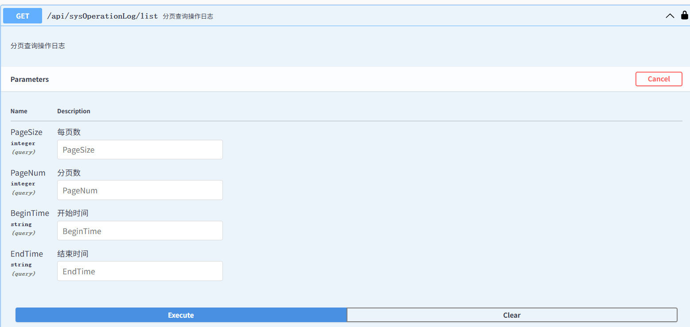

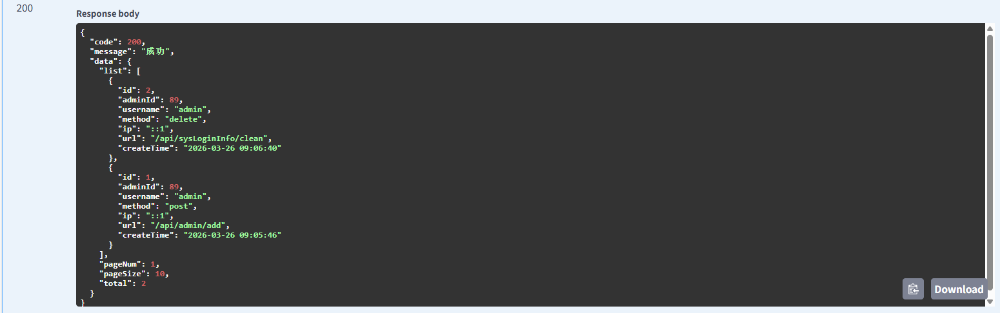

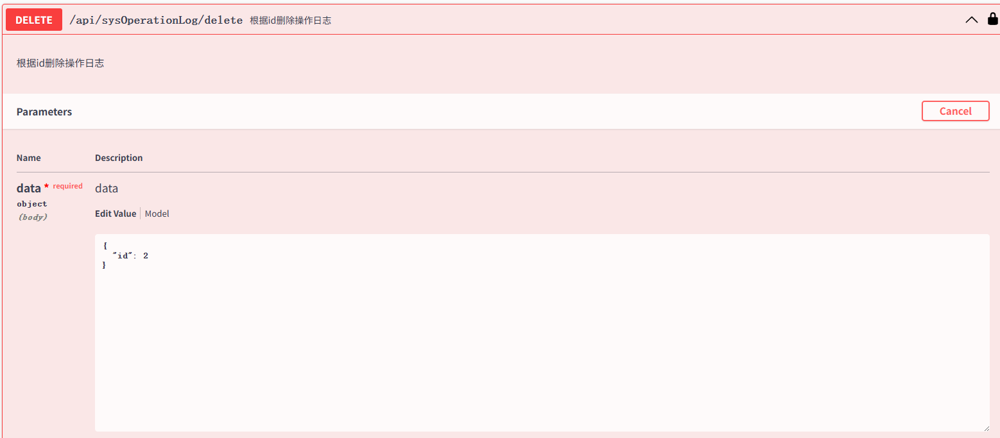

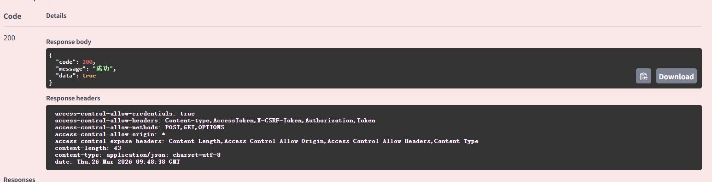

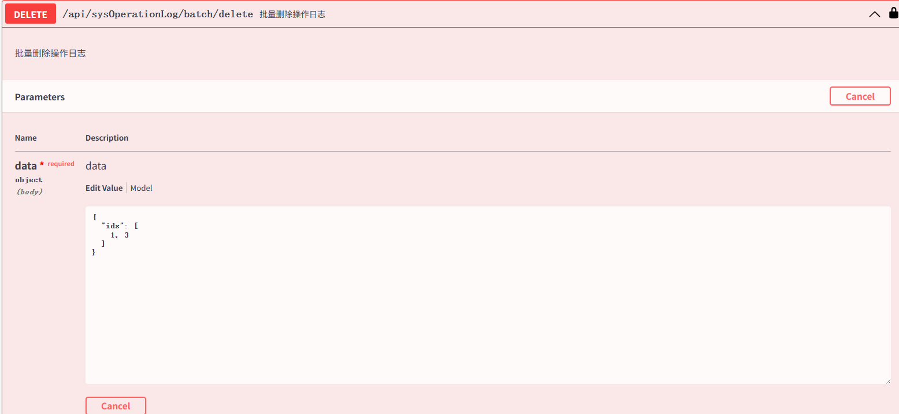

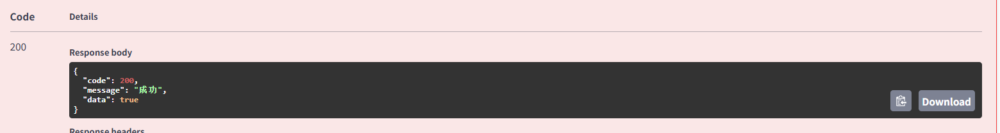

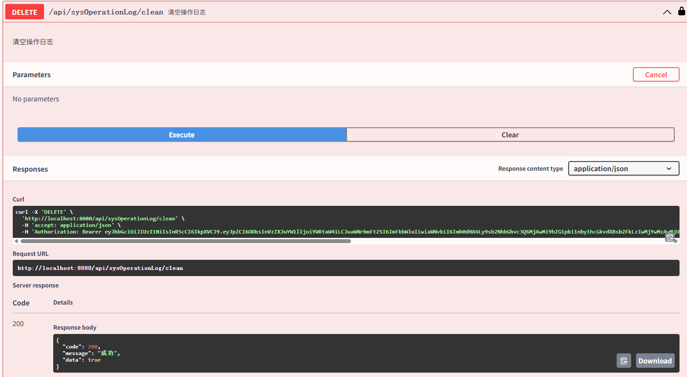

# 11. 前端初始化

前端为vue项目，使用的技术为vue2 + axios + element-ui + echarts + vue-router + vuex + vue-treeselect。

由于现在项目根目录就是后端，因此在当前目录下通过`vue create admin-vue`来创建前端。

**为了实现前后端分离，这里将项目根目录下的文件搬到`server`目录中作为后端，然后在当前根目录创建`admin-vue`来作为前端。唯一需要更改的是配置文件`config.go`中设置的路径需要改为`./server/config.yaml`。**

然后在`admin-vue`目录下运行`npm install`，`npm run serve`后，就能在`http://localhost:8081/`访问到主页。

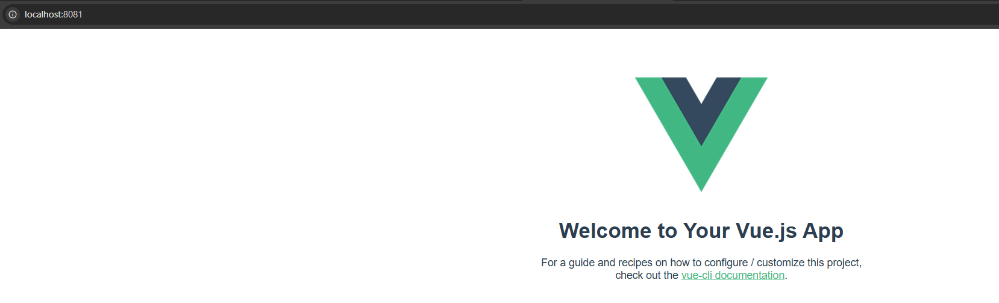

## 11.1 创建基础目录结构

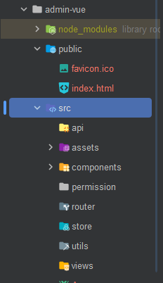

这里api存放的是后端调用的接口，assets存放静态文件，components放置组件，permission放置权限，touer控制vue跳转，store存储数据，utils工具类，views存放页面。

## 11.2 依赖并配置config文件

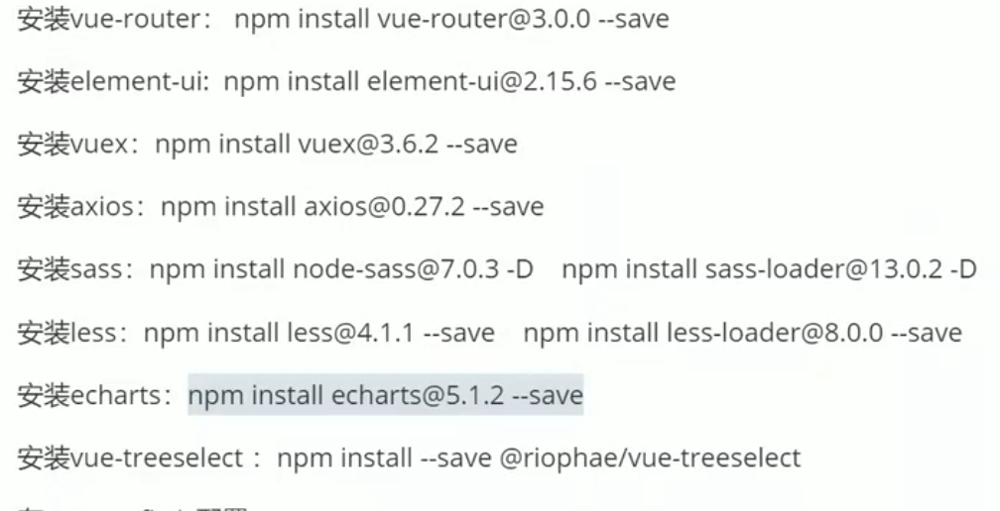

接下来需要在`vue.config.js`中配置文件信息。

```js
const { defineConfig } = require('@vue/cli-service')
module.exports = defineConfig({
  lintOnSave: false, // 关闭校验
  productionSourceMap: false, // 选择是否生成source map
  publicPath: '/', // 部署应用时的基本url
  outputDir: 'dist', // build输出的文件目录
  assetsDir: 'assets', // 放置静态文件夹目录
  devServer: {
    port: 8081,
    host: '0.0.0.0', // 运行域名
    https: false, // 不需要https
    open: false, // 是否直接打开浏览器
    proxy: {
      "/api": {
        target:"http://localhost:8080", // 配置后端服务地址
        changeOrigin: true,
      }
    },
    client: {
      overlay: false // 关闭全屏报错
    }
  },
})
```

## 11.3 路由封装

在router下创建`router.js`。

为了指定路由地址，先创建三个简单页面，只需要在template中写好对应页面内容即可。

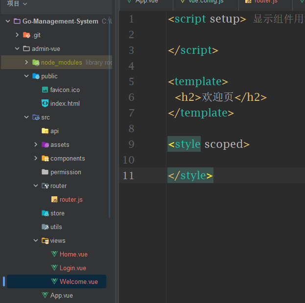

接下来配置基础的路由`router.js`。

```js
// 封装路由

import Vue from 'vue'
import Router from 'vue-router'
import Login from '@/views/Login.vue'
import Home from '@/views/Home.vue'
import Welcome from '@/views/Welcome.vue'

const router = new Router({
    routes: [
        {path: '/', redirect: 'login'},
        {path: '/login', component: Login },
        {
            path: 'home',
            component: Home,
            redirect: '/welcome',
            children: [
                {
                path: '/welcome',
                component: Welcome
                }
            ]
        }
    ]
})
export default router
```

在`App.vue`中添加`router-view`来给定路由转发后的渲染位置。

这样就成功初始化了一个前端项目。

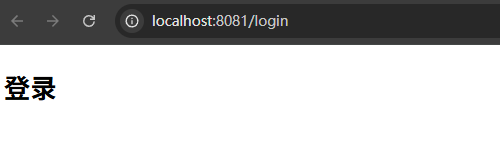

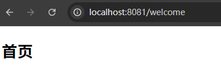

## 11.4 环境配置

环境需要配置为开发环境、测试环境和生产环境，分别为`.env.dev`, `.env.test`, `.env.pro`三个文件。

```
NODE_ENV = dev
VUE_APP_BASE_API = '/api'
```

```
NODE_ENV = test
VUE_APP_BASE_API = '/test-api'
```

```
NODE_ENV = pro
VUE_APP_BASE_API = '/pro-api'
```

然后在`package.json`中将serve的启动代码添加上`--mode dev`，这样就改为在开发环境下使用。

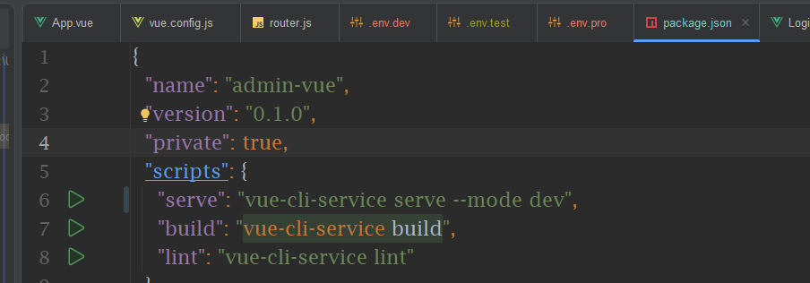

在`main.js`中能够通过`process.env["VUE_APP_BASE_API"]`来获取环境。

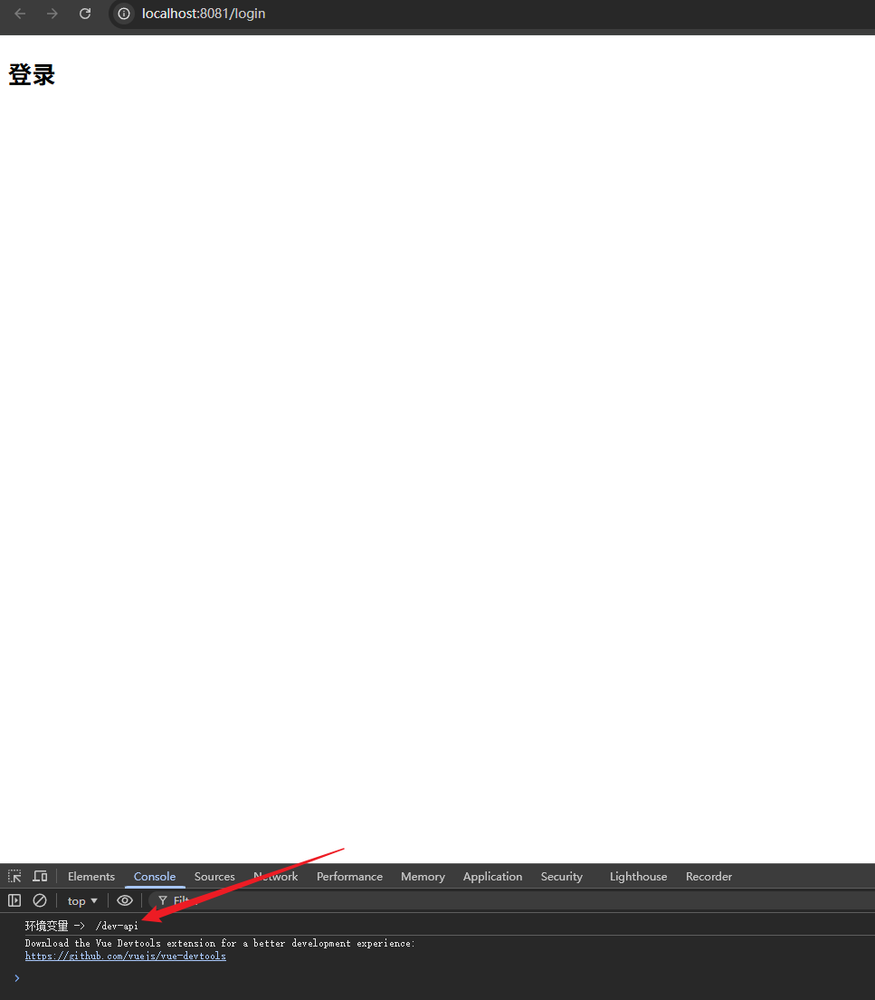

## 11.5 axios统一封装

由于后面需要多次调用网络请求，因此需要将axios进行封装，让其他地方能够调用结构化方法。在utils下创建`request.js`。

```js
/*
封装axios
 */
import {Message} from "element-ui"
import axios from 'axios'
import router from "@/router/router";

// 创建axios对象
const service = axios.create({
    baseURL: process.env["VUE_APP_BASE_API"],
    timeout: 8000
})

// 请求拦截，加上token
service.interceptors.request.use((req) => {
    const headers = req.headers
    // todo token
    if (!headers.Authorization) {
        headers.Authorization = 'Bearer + Lu'
    }
    return req
})

// 响应拦截
service.interceptors.response.use((res) => {
    // 与后端的result结构体对应
    const {code, data, message} = res.data
    // 403 无权限
    if (code === 403) {
        Message.error(message)
        setTimeout(() => {
            // todo 清除存储信息
            router.push("/login")
        }, 1500)
    }else if (code === 406) {
        // token过期
        Message.error(message)
        setTimeout(() => {
            router.push("/login")
        }, 1500)
    }else {
        return res
    }
})

// 请求核心函数
function request(options) {
    options.method = options.method || 'get'
    if (options.method.toLowerCase() === 'get') {
        options.params = options.data
    }
    service.defaults.baseURL = process.env["VUE_APP_BASE_API"]
    return service(options)
}

export default request
```

使用service初始化了一个axios对象，同时设置了请求拦截和相应拦截方法，在通过request方法将service封装并进行返回，这样就能使用request，输入options参数来创建一个axios实例了。

## 11.6 storage封装

后端向前端返回数据后，前端需要有容器能够保存数据。在utils下的`storage.js`中实现。

```js
/*
 * storage 封装
 */

export default {
    getStorage(){
        return JSON.parse(window.localStorage.getItem(process.env["VUE_APP_NAME_SPACE"]) || "{}")
    },
    setItem(key, val) {
        let storage = this.getStorage()
        storage[key] = val
        window.localStorage.setItem(process.env["VUE_APP_NAME_SPACE"], JSON.stringify(storage))
    },
    getItem(key) {
        return this.getStorage()[key]
    },
    clearItem(key) {
        let storage = this.getStorage()
        delete storage[key]
        window.localStorage.setItem(process.env["VUE_APP_NAME_SPACE"], JSON.stringify(storage))
    },
    clearAll() {
        window.localStorage.clear()
    }
}
```

同时需要在`.env.dev`中添加`VUE_APP_NAME_SPACE`。

```js
NODE_ENV = dev
VUE_APP_BASE_API = '/api'
VUE_APP_NAME_SPACE = 'admin-go-vue'
```

这样，就能在`VUE_APP_BASE_API`环境的localStorage下使用setItem和getItem来读写数据。

然后在store中构建`mutations.js`和`index.js`，供后面的数据管理使用。

```js
// 处理业务数据提交

export default {
    // todo
}
```

```js
// vuex状态管理
import Vue from 'vue'
import Vuex from 'vuex'
import mutations from './mutations'

Vue.use(Vuex)
const state = new Vuex.Store({
    // todo
    mutations
})

export default state
```

然后在`main.js`中进行全局配置。

```js
import Vue from 'vue'
import App from './App.vue'
import router from "@/router/router"
import store from "@/store"
import ElementUI from 'element-ui'
import 'element-ui/lib/theme-chalk/index.css'
import request from '@/utils/request'
import storage from '@/utils/storage'

Vue.prototype.$storage = storage
Vue.prototype.$request = request
Vue.prototype.$store = store

Vue.use(ElementUI)

Vue.config.productionTip = false

console.log("环境变量 -> ", process.env["VUE_APP_BASE_API"])

new Vue({
  router,
  render: h => h(App),
}).$mount('#app')
```

# 12. 登录交互开发

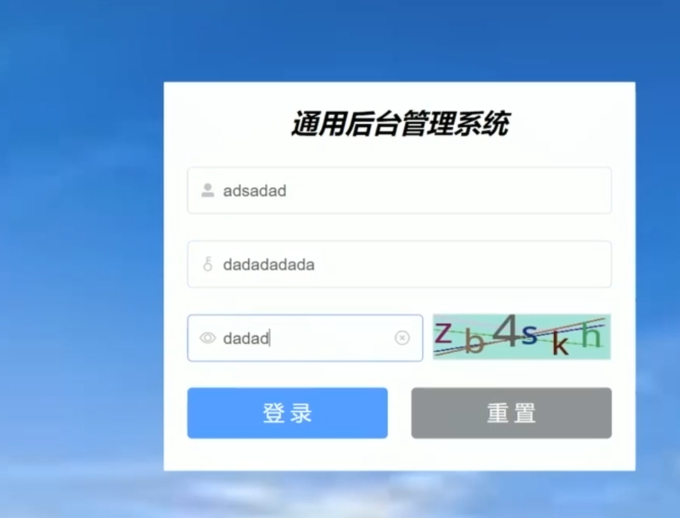

首先设置全局样式，在`assets/css/global.css`中实现。

```css
/*全局样式*/
html, body, #app {
    height: 100%;
    margin: 0;
    padding: 0;
}
```

这样，能够保证页面组件不会跑出屏幕。

在`main.js`中引入即可。

```js
import './assets/css/global.css'
```

## 12.1 页面开发

登录页面使用Element-UI来进行开发。需要找两张图片放到`assets/image`文件夹下，用来作为logo`logo.png`和登录页面背景`login-background.jpg`。

```vue

<template>
  <div class="login_container">
    <div class="login_box">
      <el-form class="login_form">
        <div class="title">
          通用后台管理系统
        </div>
        <el-form-item prop="username">
          <el-input placeholder="账号" prefix-icon="el-icon-user-solid"></el-input>
        </el-form-item>
        <el-form-item prop="password">
          <el-input placeholder="密码" prefix-icon="el-icon-key"></el-input>
        </el-form-item>
        <el-form-item prop="验证码">
          <el-input placeholder="验证码" prefix-icon="el-icon-view" style="width: 200px; float: left; " maxlength="6"/>
          <el-image class="captchaImg" style="width: 150px; float: left;"/>
        </el-form-item>
        <el-form-item>
          <el-row :gutter="20">
            <el-col :span="12" :offset="0">
              <el-button type="primary" style="width: 100%; font-size: large;">登录</el-button>
            </el-col>
            <el-col :span="12" :offset="0">
              <el-button type="info" style="width: 100%; font-size: large;">重置</el-button>
            </el-col>
          </el-row>
        </el-form-item>
      </el-form>
    </div>
  </div>
</template>

<script>
export default {
  name: "Login"
}

</script>

<style lang="less" scoped>
  .login_container {
    background-image: url("../assets/image/login-background.jpg");
    // 拉伸背景图片
    background-size: cover;
    height: 100%;
    .login_box {
      width: 400px;
      height: 330px;
      background: #fff;
      border-radius: 1px;
      position: absolute;
      left: 50%;
      top: 50%;
      transform: translate(-50%, -50%);
      .login_form {
        position: absolute;
        bottom: 0;
        width: 100%;
        padding: 0 20px;
        box-sizing: border-box;
        .title {
            font-size: 23px;
            line-height: 1.5;
            text-align: center;
            margin-bottom: 20px;
            font-weight: bold;
            font-style: italic;
        }
        .captchaImg {
          height: 38px;
          width: 100%;
          border: 1px solid #e6e6e6;
          margin-left: 8px;
        }
      }
    }
  }
</style>
```

这里创建了一个静态页面。

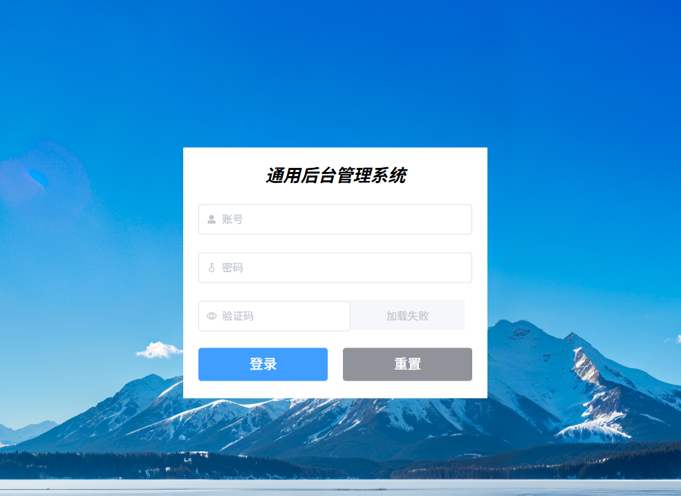

## 12.2 验证码前后端对接

现在需要实现从后端获取验证码图片放到登录页面上。

在api下创建`index.js`，创建获取验证码的请求。

```js
/*
后端api接口管理
 */

import request from '@/utils/request'

export default {
    captcha() {
        return request ({
            url: '/captcha',
            method: 'get'
        })
    }
}
```

然后在`main.js`中引用这个api文件。

```js
import api from './api'

Vue.prototype.$api = api
```

这样就能通过`this`指针来使用api。

然后在`Login.vue`中的script部分创建`getCaptcha`函数，并在`created`勾子函数中使用，在页面初始化时就发送请求，就能获取到验证码数据。

```vue
<script>
export default {
  name: "Login",
  data() {
    return {

    }
  },
  methods: {
    // 获取验证码
    async getCaptcha() {
      const {data: res} = await this.$api.captcha()
      console.log("获取验证码成功：", res)
    }
  },
  created() {
    this.getCaptcha()
  }
}

</script>
```

然后创建image字符串接收`getCaptcha`返回的`image`地址，在验证码image标签中设置src为该image即可展示图片。

```vue

<template>
  <div class="login_container">
    <div class="login_box">
      <el-form class="login_form" ref="loginFormRef" :rules="rules">
        <div class="title">
          通用后台管理系统
        </div>
        <el-form-item prop="username">
          <el-input placeholder="账号" prefix-icon="el-icon-user-solid"></el-input>
        </el-form-item>
        <el-form-item prop="password">
          <el-input placeholder="密码" prefix-icon="el-icon-key"></el-input>
        </el-form-item>
        <el-form-item prop="image">
          <el-input placeholder="验证码" prefix-icon="el-icon-view" style="width: 200px; float: left; " maxlength="6"/>
          <el-image class="captchaImg" style="width: 150px; float: left;" :src="image" @click="getCaptcha()"/>
        </el-form-item>
        <el-form-item>
          <el-row :gutter="20">
            <el-col :span="12" :offset="0">
              <el-button type="primary" style="width: 100%; font-size: large;">登录</el-button>
            </el-col>
            <el-col :span="12" :offset="0">
              <el-button type="info" style="width: 100%; font-size: large;">重置</el-button>
            </el-col>
          </el-row>
        </el-form-item>
      </el-form>
    </div>
  </div>
</template>

<script>
export default {
  name: "Login",
  data() {
    return {
      image: '',
      rules: {
        username: [
          {
            required: true, message:"请输入账号", trigger: "blur"
          }
        ],
        password: [
          {
            required: true, message:"请输入密码", trigger: "blur"
          }
        ],
        image: [
          {
            required: true, message:"请输入验证码", trigger: "blur"
          }
        ]
      }
    }
  },
  methods: {
    // 获取验证码
    async getCaptcha() {
      const {data: res} = await this.$api.captcha()
      if (res.code !== 200) {
        this.$message.error(res.message)
      }else {
        this.image = res.data.image
      }
    }
    // 登录

  },
  created() {
    this.getCaptcha()
  }
}

</script>

<style lang="less" scoped>
  .login_container {
    background-image: url("../assets/image/login-background.jpg");
    // 拉伸背景图片
    background-size: cover;
    height: 100%;
    .login_box {
      width: 400px;
      height: 330px;
      background: #fff;
      border-radius: 1px;
      position: absolute;
      left: 50%;
      top: 50%;
      transform: translate(-50%, -50%);
      .login_form {
        position: absolute;
        bottom: 0;
        width: 100%;
        padding: 0 20px;
        box-sizing: border-box;
        .title {
            font-size: 23px;
            line-height: 1.5;
            text-align: center;
            margin-bottom: 20px;
            font-weight: bold;
            font-style: italic;
        }
        .captchaImg {
          height: 38px;
          width: 100%;
          border: 1px solid #e6e6e6;
          margin-left: 8px;
        }
      }
    }
  }

</style>
```

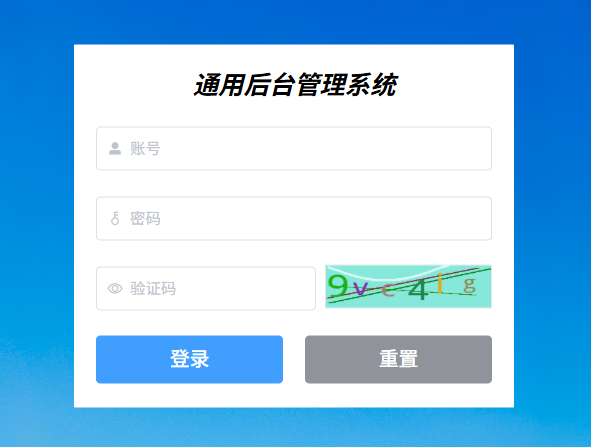

## 12.3 登录接口开发

与后端联系的，基本上都写到`api/index.js`中。新增登录请求方法。

```js
login(params) {
    return request({
        url: '/login',
        method: 'post',
        data: params
    })
}
```

`Login.vue`中，为了将数据结构化，需要创建`loginForm`表单，交给前端表单来获取数据。

```vue

<template>
  <div class="login_container">
    <div class="login_box">
      <el-form class="login_form" ref="loginFormRef" :rules="rules" :model="loginForm">
        <div class="title">
          通用后台管理系统
        </div>
        <el-form-item prop="username">
          <el-input placeholder="账号" prefix-icon="el-icon-user-solid" v-model="loginForm.username" clearable></el-input>
        </el-form-item>
        <el-form-item prop="password">
          <el-input placeholder="密码" prefix-icon="el-icon-key" v-model="loginForm.password" clearable></el-input>
        </el-form-item>
        <el-form-item prop="image">
          <el-input placeholder="验证码" prefix-icon="el-icon-view" style="width: 200px; float: left; " maxlength="6" v-model="loginForm.image" clearable/>
          <el-image class="captchaImg" style="width: 150px; float: left;" :src="image" @click="getCaptcha"/>
        </el-form-item>
        <el-form-item>
          <el-row :gutter="20">
            <el-col :span="12" :offset="0">
              <el-button type="primary" style="width: 100%; font-size: large;" @click="loginBtn">登录</el-button>
            </el-col>
            <el-col :span="12" :offset="0">
              <el-button type="info" style="width: 100%; font-size: large;" @click="resetForm">重置</el-button>
            </el-col>
          </el-row>
        </el-form-item>
      </el-form>
    </div>
  </div>
</template>

<script>
export default {
  name: "Login",
  data() {
    return {
      image: '',
      rules: {
        username: [
          {
            required: true, message:"请输入账号", trigger: "blur"
          }
        ],
        password: [
          {
            required: true, message:"请输入密码", trigger: "blur"
          }
        ],
        image: [
          {
            required: true, message:"请输入验证码", trigger: "blur"
          }
        ]
      },
      loginForm: {
        username: '',
        password: '',
        image: '',
        id_key: ''
      }
    }
  },
  methods: {
    // 获取验证码
    async getCaptcha() {
      const {data: res} = await this.$api.captcha()
      if (res.code !== 200) {
        this.$message.error(res.message)
      }else {
        this.image = res.data.image
        // 封装验证码id
        this.loginForm.id_key = res.data.idKey
      }
    },
    // 重置表单
    resetForm() {
      this.$refs.loginFormRef.resetFields()
    },
    // 登录
    loginBtn() {
      this.$refs.loginFormRef.validate(async valid => {
        // console.log("传输参数：", this.loginForm)
        if (valid) {
          const {data: res} = await this.$api.login(this.loginForm)
          // console.log("获取登录的res数据：", res)
          if (res.code !== 200) {
            this.$message.error(res.message)
          } else {
            this.$message.success("登录成功")
            this.$router.push("/home")
          }
        } else {
          return false
        }
      })
    }
  },

  created() {
    this.getCaptcha()
  }
}

</script>

<style lang="less" scoped>
  .login_container {
    background-image: url("../assets/image/login-background.jpg");
    // 拉伸背景图片
    background-size: cover;
    height: 100%;
    .login_box {
      width: 400px;
      height: 330px;
      background: #fff;
      border-radius: 1px;
      position: absolute;
      left: 50%;
      top: 50%;
      transform: translate(-50%, -50%);
      .login_form {
        position: absolute;
        bottom: 0;
        width: 100%;
        padding: 0 20px;
        box-sizing: border-box;
        .title {
            font-size: 23px;
            line-height: 1.5;
            text-align: center;
            margin-bottom: 20px;
            font-weight: bold;
            font-style: italic;
        }
        .captchaImg {
          height: 38px;
          width: 100%;
          border: 1px solid #e6e6e6;
          margin-left: 8px;
        }
      }
    }
  }

</style>
```

其中，`loginForm`中的变量名需要与后端需要接收的json名保持一致。

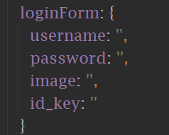

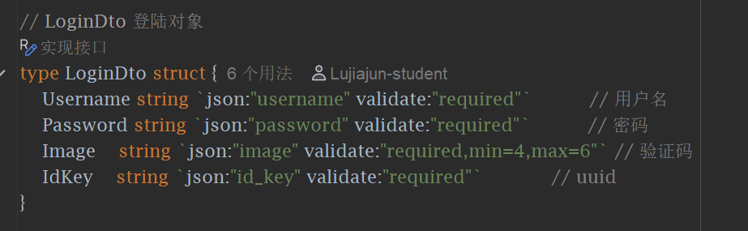

而在钩子函数中封装`loginForm`的`idKey`需要与后端controller`captcha.go`中的返回结果的变量名保持一致。

```vue
this.loginForm.id_key = res.data.idKey
```

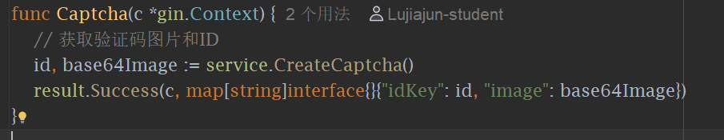

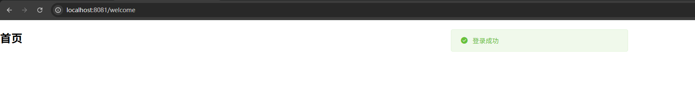

## 12.4 数据存储

登录后，需要将用户的信息存储在localStorage中。可以在前端的登录方法中实现。

```js
// 登录
loginBtn() {
  this.$refs.loginFormRef.validate(async valid => {
    // console.log("传输参数：", this.loginForm)
    if (valid) {
      const {data: res} = await this.$api.login(this.loginForm)
      // console.log("获取登录的res数据：", res)
      if (res.code !== 200) {
        this.$message.error(res.message)
      } else {
        this.$message.success("登录成功")
        this.$store.commit('saveSysAdmin', res.data.sysAdmin)
        this.$store.commit('saveToken', res.data.token)
        this.$store.commit('saveLeftMenuList', res.data.leftMenuList)
        this.$store.commit('savePermissionList', res.data.permissionList)
        this.$router.push("/home")
      }
    } else {
      return false
    }
  })
}
```

然后在store的`mutations.js`中写好对应的方法。

```js
// 处理业务数据提交

import storage from "@/utils/storage";

export default {
    // todo
    saveSysAdmin(state, sysAdmin) {
        state.sysAdmin = sysAdmin
        storage.setItem('sysAdmin', sysAdmin)
    },
    saveToken(state, token) {
        state.token = token
        storage.setItem('token', token)
    },
    saveLeftMenuList(state, leftMenuList) {
        state.leftMenuList = leftMenuList
        storage.setItem('leftMenuList', leftMenuList)
    },
    savePermissionList(state, permissionList) {
        state.permissionList = permissionList
        storage.setItem('permissionList', permissionList)
    }
}
```

然后在同级的`index.js`中初始化变量，如果storage存在则使用里面的数据进行初始化，否则初始为空。

```js
// vuex状态管理
import Vue from 'vue'
import Vuex from 'vuex'
import mutations from './mutations'
import storage from "@/utils/storage";

Vue.use(Vuex)

const state = new Vuex.Store({
    sysAdmin: "" || storage.getItem("sysAdmin"),
    token: "" || storage.getItem("token"),
    leftMenuList: "" || storage.getItem("leftMenuList"),
    permissionList: "" || storage.getItem("permissionList"),
    mutations
})

export default state
```

这样，登录后，就能在localStorage中保存用户信息。

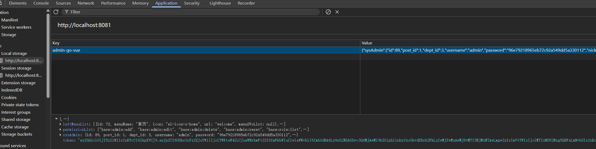

## 12.5 路由导航

部分页面可能不会向未登录用户开放，因此需要在访问页面前，先进行路由导航。如果在localStorage中存在token，就能访问，否则跳转到login页面进行登录。在router的`router.js`中实现。

```js
// 封装路由

import Vue from 'vue'
import Router from 'vue-router'
import Login from '@/views/Login.vue'
import Home from '@/views/Home.vue'
import Welcome from '@/views/Welcome.vue'
import storage from "@/utils/storage";

Vue.use(Router)

const router = new Router({
    // 去掉路径的#
    mode: 'history',
    routes: [
        {path: '/', redirect: '/login'},
        {path: '/login', component: Login },
        {
            path: '/home',
            component: Home,
            redirect: '/welcome',
            children: [
                {
                path: '/welcome',
                component: Welcome
                }
            ]
        }
    ]
})

// 挂载路由导航数据
router.beforeEach((to, from, next) => {
    if (to.path === '/login') {
        return next
    }
    const tokenStr = storage.getItem("token")
    if (!tokenStr) {
        return next('/login')
    }
    next()
})

export default router
```

现在如果不登录，就无法访问`/welcome`和`/home`页面，会强制跳转到login页面。

接下来完善utils的`request.js`，实现获取token、过期时清空localStorage等功能。

```js
/*
封装axios
 */
import {Message} from "element-ui"
import axios from 'axios'
import router from "@/router/router";
import storage from "@/utils/storage";

// 创建axios对象
const service = axios.create({
    baseURL: process.env["VUE_APP_BASE_API"],
    timeout: 8000
})

// 请求拦截，加上token
service.interceptors.request.use((req) => {
    const headers = req.headers
    // 从localStorage中获取token
    const token = storage.getItem("token") || {}

    if (!headers.Authorization) {
        headers.Authorization = 'Bearer ' + token
    }
    return req
})

// 响应拦截
service.interceptors.response.use((res) => {
    // 与后端的result结构体对应
    const {code, data, message} = res.data
    // 403 无权限
    if (code === 403) {
        Message.error(message)
        setTimeout(() => {
            // 清除localStorage
            storage.clearAll()
            router.push("/login")
        }, 1500)
    }else if (code === 406) {
        // token过期
        Message.error(message)
        setTimeout(() => {
            // 清空localStorage
            storage.clearAll()
            router.push("/login")
        }, 1500)
    }else {
        return res
    }
})

// 请求核心函数
function request(options) {
    options.method = options.method || 'get'
    if (options.method.toLowerCase() === 'get') {
        options.params = options.data
    }
    service.defaults.baseURL = process.env["VUE_APP_BASE_API"]
    return service(options)
}

export default request
```

# 13. 首页开发

首页分为左侧菜单栏、顶部导航栏和中间的内容。现在首先开发左侧的菜单栏。

## 13.1 左侧菜单栏

使用`element-UI`来构建布局，先实现初始布局。

```vue
<script>
import storage from "@/utils/storage";

export default {
  name: "Home",
  data() {
    return {
      leftMenuList: storage.getItem("leftMenuList")
    }
},
  computed: {
    // 无子集
    noChildren() {
      return this.leftMenuList.filter(item => !item.menuSVoList)
    },
    // 有子集
    hasChildren() {
      return this.leftMenuList.filter(item => item.menuSVoList)
    }
  }
}
</script>
run
<template>
  <el-container class="home-container">
    <el-aside class="el-aside">
      <div class="logo">
        
        <h3>通用后台管理系统</h3>
      </div>
      <el-menu class="el-menu" background-color="#304156" text-color="#fff" unique-opened>
<!--        无子集菜单-->
        <el-menu-item :index="'/' + item.url" v-for="item in noChildren" :key="item.menuName">
          <i :class="item.icon"></i>
          <template slot="title">
            <span>{{item.menuName}}</span>
          </template>
        </el-menu-item>
<!--        有子集菜单-->
        <el-submenu :index="item.id + ''" v-for="item in hasChildren" :key="item.id">
          <template slot="title">
            <i :class="item.icon"></i>
            <span>{{ item.menuName }}</span>
          </template>
          <el-menu-item :index="'/' + subItem.url" v-for="subItem in item.menuSVoList" :key="subItem.id">
            <template slot="title">
              <i :class="subItem.icon"></i>
              <span>{{subItem.menuName}}</span>
            </template>
          </el-menu-item>

        </el-submenu>
      </el-menu>
    </el-aside>
    <el-container>
      <el-header class="el-header">Header</el-header>
      <el-main class="el-main">Main</el-main>
    </el-container>
  </el-container>
</template>

<style lang = "less" scoped>
  .home-container {
    height: 100%;
    .el-aside {
      background-color: #304156;
      .logo {
        margin-top: 5px;
        display: flex;
        align-items: center;
        font-size: 13px;
        height: 50px;
        color: #fff;
        font-style: italic;
        .sidebar-logo {
          width: 32px;
          height: 32px;
          margin: 0 16px;
        }
      }
      .el-menu {
        border-right: none;
      }
    }
    .el-header {
      background-color: #f9fafc;
    }
    .el-main {
      background-color: #eaedf1;
    }
  }
</style>
```

这样，就能够在localStorage中获取到后端传过来的`menuSVoList`数据，在这里作为左侧列表展示。


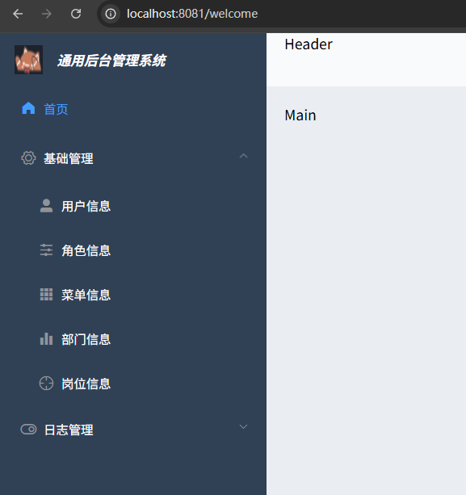

## 13.2 路由转发

实现路由转发前，首先创建对应的基础页面。

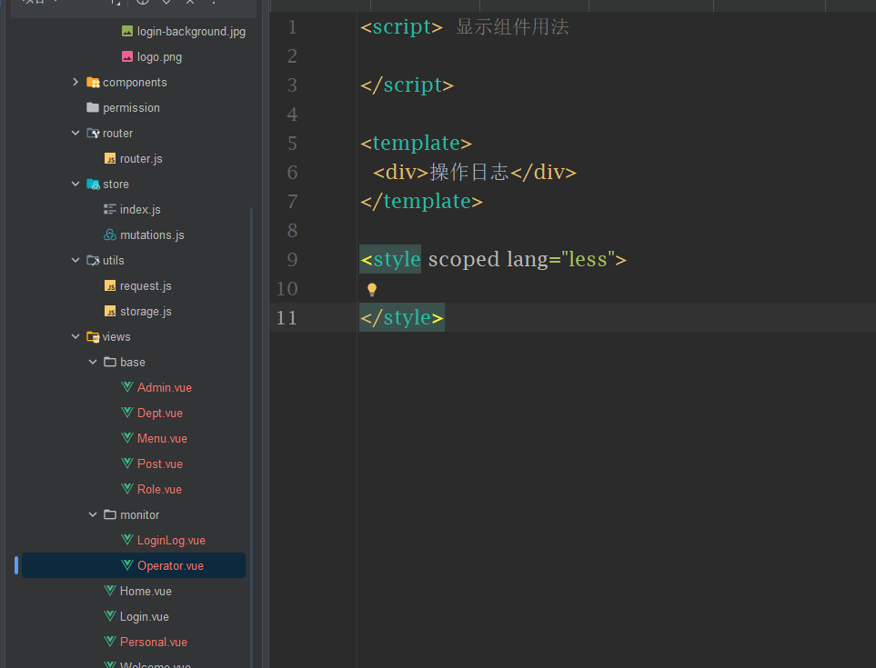

然后就能进行路由转发。在router的`router.js`中实现。

```js
// 封装路由

import Vue from 'vue'
import Router from 'vue-router'
import Login from '@/views/Login.vue'
import Home from '@/views/Home.vue'
import Welcome from '@/views/Welcome.vue'
import storage from "@/utils/storage";
import Personal from '@/views/Personal'
import Admin from '@/views/base/Admin'
import Role from '@/views/base/Role'
import Dept from '@/views/base/Dept'
import Post from '@/views/base/Post'
import LoginLog from '@/views/monitor/LoginLog'
import Operator from '@/views/monitor/Operator'
import Menu from '@/views/base/Menu'

Vue.use(Router)

const router = new Router({
    // 去掉路径的#
    mode: 'history',
    routes: [
        {path: '/', redirect: '/login'},
        {path: '/login', component: Login },
        {
            path: '/home',
            component: Home,
            redirect: '/welcome',
            children: [
                {
                path: '/welcome',
                component: Welcome
                },
                {
                    path: '/personal',
                    component: Personal
                },
                {
                    path: '/base/admin',
                    component: Admin
                },
                {
                    path: '/base/role',
                    component: Role
                },
                {
                    path: '/base/menu',
                    component: Menu
                },
                {
                    path: '/base/dept',
                    component: Dept
                },
                {
                    path: '/base/post',
                    component: Post
                },
                {
                    path: '/monitor/loginLog',
                    component: LoginLog
                },
                {
                    path: '/monitor/operator',
                    component: Operator
                }
            ]
        }
    ]
})

// 挂载路由导航数据
router.beforeEach((to, from, next) => {
    if (to.path === '/login') {
        return next()
    }
    const tokenStr = storage.getItem("token")
    if (!tokenStr) {
        return next('/login')
    }
    next()
})

export default router
```

这样，只要访问对应的地址，就能获取组件。

在`Home.vue`中添加路由功能，就能让`menu-item`根据index拼接的地址来进行跳转，跳转后根据router里的配置打开组件。

```vue
<script>
import storage from "@/utils/storage";

export default {
  name: "Home",
  data() {
    return {
      leftMenuList: storage.getItem("leftMenuList")
    }
},
  computed: {
    // 无子集
    noChildren() {
      return this.leftMenuList.filter(item => !item.menuSVoList)
    },
    // 有子集
    hasChildren() {
      return this.leftMenuList.filter(item => item.menuSVoList)
    }
  }
}
</script>
run
<template>
  <el-container class="home-container">
    <el-aside class="el-aside">
      <div class="logo">
        
        <h3>通用后台管理系统</h3>
      </div>
      <el-menu class="el-menu" background-color="#304156" text-color="#fff" unique-opened router>
<!--        无子集菜单-->
        <el-menu-item :index="'/' + item.url" v-for="item in noChildren" :key="item.menuName">
          <i :class="item.icon"></i>
          <template slot="title">
            <span>{{item.menuName}}</span>
          </template>
        </el-menu-item>
<!--        有子集菜单-->
        <el-submenu :index="item.id + ''" v-for="item in hasChildren" :key="item.id">
          <template slot="title">
            <i :class="item.icon"></i>
            <span>{{ item.menuName }}</span>
          </template>
          <el-menu-item :index="'/' + subItem.url" v-for="subItem in item.menuSVoList" :key="subItem.id">
            <template slot="title">
              <i :class="subItem.icon"></i>
              <span>{{subItem.menuName}}</span>
            </template>
          </el-menu-item>

        </el-submenu>
      </el-menu>
    </el-aside>
    <el-container>
      <el-header class="el-header">Header</el-header>
      <el-main class="el-main">
        <router-view/>
      </el-main>
    </el-container>
  </el-container>
</template>

<style lang = "less" scoped>
  .home-container {
    height: 100%;
    .el-aside {
      background-color: #304156;
      .logo {
        margin-top: 5px;
        display: flex;
        align-items: center;
        font-size: 13px;
        height: 50px;
        color: #fff;
        font-style: italic;
        .sidebar-logo {
          width: 32px;
          height: 32px;
          margin: 0 16px;
        }
      }
      .el-menu {
        border-right: none;
      }
    }
    .el-header {
      background-color: #f9fafc;
    }
    .el-main {
      background-color: #eaedf1;
    }
  }
</style>
```

## 13.3 保持路由激活

现在虽然实现了路由跳转，但这是临时的跳转，如果刷新，就会回到首页。因此需要想办法将路由保持激活。

首先，在store的`mutations.js`中创建保存方法，将当前路径保存到localStorage中。

```js
    saveActivePath(state, activePath) {
        state.setItem = activePath
        storage.setItem('activePath', activePath)
    }
}
```

然后在`index.js`中激活。

```js
// vuex状态管理
import Vue from 'vue'
import Vuex from 'vuex'
import mutations from './mutations'
import storage from "@/utils/storage";

Vue.use(Vuex)

const state = new Vuex.Store({
    sysAdmin: "" || storage.getItem("sysAdmin"),
    token: "" || storage.getItem("token"),
    leftMenuList: "" || storage.getItem("leftMenuList"),
    permissionList: "" || storage.getItem("permissionList"),
    activePath: '' || storage.getItem("activePath"),
    mutations
})

export default state
```

 接下来在`Home.vue`中，通过设定点击事件来保存当前的url，然后设置默认激活的菜单`:default-active`来从地址映射到需要激活的菜单栏。

```vue
<script>
import storage from "@/utils/storage";

export default {
  name: "Home",
  data() {
    return {
      leftMenuList: storage.getItem("leftMenuList"),
      activePath: '',
    }
},
  computed: {
    // 无子集
    noChildren() {
      return this.leftMenuList.filter(item => !item.menuSVoList)
    },
    // 有子集
    hasChildren() {
      return this.leftMenuList.filter(item => item.menuSVoList)
    }
  },
  methods: {
    saveNavState(activePath) {
      storage.setItem('activePath', activePath)
      this.activePath = activePath
    }
  }
}
</script>
run
<template>
  <el-container class="home-container">
    <el-aside class="el-aside">
      <div class="logo">
        
        <h3>通用后台管理系统</h3>
      </div>
      <el-menu class="el-menu" background-color="#304156" text-color="#fff" unique-opened router :default-active="$route.path">
<!--        无子集菜单-->
        <el-menu-item :index="'/' + item.url" v-for="item in noChildren" :key="item.menuName"
        @click="saveNavState('/' + item.url)">
          <i :class="item.icon"></i>
          <template slot="title">
            <span>{{item.menuName}}</span>
          </template>
        </el-menu-item>
<!--        有子集菜单-->
        <el-submenu :index="item.id + ''" v-for="item in hasChildren" :key="item.id"
                    @click="saveNavState('/' + item.url)">
          <template slot="title">
            <i :class="item.icon"></i>
            <span>{{ item.menuName }}</span>
          </template>
          <el-menu-item :index="'/' + subItem.url" v-for="subItem in item.menuSVoList" :key="subItem.id">
            <template slot="title">
              <i :class="subItem.icon"></i>
              <span>{{subItem.menuName}}</span>
            </template>
          </el-menu-item>

        </el-submenu>
      </el-menu>
    </el-aside>
    <el-container>
      <el-header class="el-header">Header</el-header>
      <el-main class="el-main">
        <router-view/>
      </el-main>
    </el-container>
  </el-container>
</template>

<style lang = "less" scoped>
  .home-container {
    height: 100%;
    .el-aside {
      background-color: #304156;
      .logo {
        margin-top: 5px;
        display: flex;
        align-items: center;
        font-size: 13px;
        height: 50px;
        color: #fff;
        font-style: italic;
        .sidebar-logo {
          width: 32px;
          height: 32px;
          margin: 0 16px;
        }
      }
      .el-menu {
        border-right: none;
      }
    }
    .el-header {
      background-color: #f9fafc;
    }
    .el-main {
      background-color: #eaedf1;
    }
  }
</style>
```

## 13.4 顶部栏的展开折叠图标

使用`element-UI`库能够实现这个图标。在原本的Header的标签内实现。

```vue
<script>
import storage from "@/utils/storage";

export default {
  name: "Home",
  data() {
    return {
      leftMenuList: storage.getItem("leftMenuList"),
      activePath: '',
      collapseBtnClass: "el-icon-s-fold"
    }
},
  computed: {
    // 无子集
    noChildren() {
      return this.leftMenuList.filter(item => !item.menuSVoList)
    },
    // 有子集
    hasChildren() {
      return this.leftMenuList.filter(item => item.menuSVoList)
    }
  },
  methods: {
    saveNavState(activePath) {
      storage.setItem('activePath', activePath)
      this.activePath = activePath
    }
  }
}
</script>
run
<template>
  <el-container class="home-container">
    <el-aside class="el-aside">
      <div class="logo">
        
        <h3>通用后台管理系统</h3>
      </div>
      <el-menu class="el-menu" background-color="#304156" text-color="#fff" unique-opened router :default-active="$route.path">
<!--        无子集菜单-->
        <el-menu-item :index="'/' + item.url" v-for="item in noChildren" :key="item.menuName"
        @click="saveNavState('/' + item.url)">
          <i :class="item.icon"></i>
          <template slot="title">
            <span>{{item.menuName}}</span>
          </template>
        </el-menu-item>
<!--        有子集菜单-->
        <el-submenu :index="item.id + ''" v-for="item in hasChildren" :key="item.id"
                    @click="saveNavState('/' + item.url)">
          <template slot="title">
            <i :class="item.icon"></i>
            <span>{{ item.menuName }}</span>
          </template>
          <el-menu-item :index="'/' + subItem.url" v-for="subItem in item.menuSVoList" :key="subItem.id">
            <template slot="title">
              <i :class="subItem.icon"></i>
              <span>{{subItem.menuName}}</span>
            </template>
          </el-menu-item>
        </el-submenu>
      </el-menu>
    </el-aside>
    <el-container>
      <el-header class="el-header">
<!--        顶部栏设置-->
        <div class="fold-btn">
          <i :class="collapseBtnClass"></i>
        </div>
      </el-header>
      <el-main class="el-main">
        <router-view/>
      </el-main>
    </el-container>
  </el-container>
</template>

<style lang = "less" scoped>
  .home-container {
    height: 100%;
    .el-aside {
      background-color: #304156;
      .logo {
        margin-top: 5px;
        display: flex;
        align-items: center;
        font-size: 13px;
        height: 50px;
        color: #fff;
        font-style: italic;
        .sidebar-logo {
          width: 32px;
          height: 32px;
          margin: 0 16px;
        }
      }
      .el-menu {
        border-right: none;
      }
    }
    .el-header {
      background-color: #f9fafc;
      align-items: center;
      justify-content: space-between;
      display: flex;
      .fold-btn {
        padding-top: 2px;
        font-size: 23px;
        cursor: pointer;
      }
    }
    .el-main {
      background-color: #eaedf1;
    }
  }
</style>
```

## 13.5 实现侧边栏的展开与折叠

侧边栏展开的class为`el-icon-s-unfold`，折叠的class为`el-icon-s-fold`。

在顶部的展开折叠标签上设置点击事件，让menu标签的`:collapse`更新为true或false即可实现折叠或展开的功能。

```vue
<script>
import storage from "@/utils/storage";

export default {
  name: "Home",
  data() {
    return {
      leftMenuList: storage.getItem("leftMenuList"),
      activePath: '',
      collapseBtnClass: "el-icon-s-fold",
      isCollapse: false,
    }
},
  computed: {
    // 无子集
    noChildren() {
      return this.leftMenuList.filter(item => !item.menuSVoList)
    },
    // 有子集
    hasChildren() {
      return this.leftMenuList.filter(item => item.menuSVoList)
    }
  },
  methods: {
    // 保持路由激活
    saveNavState(activePath) {
      storage.setItem('activePath', activePath)
      this.activePath = activePath
    },
    // 顶部栏展开和折叠
    toggleCollapse() {
      this.isCollapse = !this.isCollapse
      if (this.isCollapse) {
        this.collapseBtnClass = 'el-icon-s-unfold'
      } else {
        this.collapseBtnClass = 'el-icon-s-fold'
      }
    }
  }
}
</script>
run
<template>
  <el-container class="home-container">
    <el-aside class="el-aside" :width="isCollapse? '64px' : '200px' ">
      <div class="logo">
        
        <h3 v-show="!isCollapse">通用后台管理系统</h3>
      </div>
      <el-menu class="el-menu" background-color="#304156" text-color="#fff" unique-opened router :default-active="$route.path"
               :collapse="isCollapse" :collapse-transition="false">
<!--        无子集菜单-->
        <el-menu-item :index="'/' + item.url" v-for="item in noChildren" :key="item.menuName"
        @click="saveNavState('/' + item.url)">
          <i :class="item.icon"></i>
          <template slot="title">
            <span>{{item.menuName}}</span>
          </template>
        </el-menu-item>
<!--        有子集菜单-->
        <el-submenu :index="item.id + ''" v-for="item in hasChildren" :key="item.id"
                    @click="saveNavState('/' + item.url)">
          <template slot="title">
            <i :class="item.icon"></i>
            <span>{{ item.menuName }}</span>
          </template>
          <el-menu-item :index="'/' + subItem.url" v-for="subItem in item.menuSVoList" :key="subItem.id">
            <template slot="title">
              <i :class="subItem.icon"></i>
              <span>{{subItem.menuName}}</span>
            </template>
          </el-menu-item>
        </el-submenu>
      </el-menu>
    </el-aside>
    <el-container>
      <el-header class="el-header">
<!--        顶部栏设置-->
        <div class="fold-btn">
          <i :class="collapseBtnClass" @click="toggleCollapse"></i>
        </div>
      </el-header>
      <el-main class="el-main">
        <router-view/>
      </el-main>
    </el-container>
  </el-container>
</template>

<style lang = "less" scoped>
  .home-container {
    height: 100%;
    .el-aside {
      background-color: #304156;
      .logo {
        margin-top: 5px;
        display: flex;
        align-items: center;
        font-size: 13px;
        height: 50px;
        color: #fff;
        font-style: italic;
        .sidebar-logo {
          width: 32px;
          height: 32px;
          margin: 0 16px;
        }
      }
      .el-menu {
        border-right: none;
      }
    }
    .el-header {
      background-color: #f9fafc;
      align-items: center;
      justify-content: space-between;
      display: flex;
      .fold-btn {
        padding-top: 2px;
        font-size: 23px;
        cursor: pointer;
      }
    }
    .el-main {
      background-color: #eaedf1;
    }
  }
</style>
```

## 13.6 面包屑

接下来需要实现点击侧边栏展开后，在顶部栏写`首页\XX\XX`的功能。

如果要实现这个功能，需要在路由转发的时候，携带meta数据。在`router.js`中实现。

```js
// 封装路由

import Vue from 'vue'
import Router from 'vue-router'
import Login from '@/views/Login.vue'
import Home from '@/views/Home.vue'
import Welcome from '@/views/Welcome.vue'
import storage from "@/utils/storage";
import Personal from '@/views/Personal'
import Admin from '@/views/base/Admin'
import Role from '@/views/base/Role'
import Dept from '@/views/base/Dept'
import Post from '@/views/base/Post'
import LoginLog from '@/views/monitor/LoginLog'
import Operator from '@/views/monitor/Operator'
import Menu from '@/views/base/Menu'

Vue.use(Router)

const router = new Router({
    // 去掉路径的#
    mode: 'history',
    routes: [
        {path: '/', redirect: '/login'},
        {path: '/login', component: Login },
        {
            path: '/home',
            component: Home,
            redirect: '/welcome',
            children: [
                {
                    path: '/welcome',
                    component: Welcome,
                    meta: {tTitle: '首页'}
                },
                {
                    path: '/personal',
                    component: Personal,
                    meta: {sTitle: '个人中心', tTitle: '个人信息'}
                },
                {
                    path: '/base/admin',
                    component: Admin,
                    meta: {sTitle: '基础管理', tTitle: '用户信息'}
                },
                {
                    path: '/base/role',
                    component: Role,
                    meta: {sTitle: '基础管理', tTitle: '角色信息'}
                },
                {
                    path: '/base/menu',
                    component: Menu,
                    meta: {sTitle: '基础管理', tTitle: '菜单信息'}
                },
                {
                    path: '/base/dept',
                    component: Dept,
                    meta: {sTitle: '基础管理', tTitle: '部门信息'}
                },
                {
                    path: '/base/post',
                    component: Post,
                    meta: {sTitle: '基础管理', tTitle: '岗位信息'}
                },
                {
                    path: '/monitor/loginLog',
                    component: LoginLog,
                    meta: {sTitle: '日志管理', tTitle: '登录日志'}
                },
                {
                    path: '/monitor/operator',
                    component: Operator,
                    meta: {sTitle: '日志管理', tTitle: '操作日志'}
                }
            ]
        }
    ]
})

// 挂载路由导航数据
router.beforeEach((to, from, next) => {
    if (to.path === '/login') {
        return next()
    }
    const tokenStr = storage.getItem("token")
    if (!tokenStr) {
        return next('/login')
    }
    next()
})

export default router
```

这样，在路由转发时，就会携带这里的meta数据。

然后在Home页面的顶部栏使用`el-breadcrumb`来创建面包屑组件，在里面使用`el-breadcrumb-item`来写面包屑内容。

```vue
<script>
import storage from "@/utils/storage";

export default {
  name: "Home",
  data() {
    return {
      leftMenuList: storage.getItem("leftMenuList"),
      activePath: '',
      collapseBtnClass: "el-icon-s-fold",
      isCollapse: false,
    }
},
  computed: {
    // 无子集
    noChildren() {
      return this.leftMenuList.filter(item => !item.menuSVoList)
    },
    // 有子集
    hasChildren() {
      return this.leftMenuList.filter(item => item.menuSVoList)
    }
  },
  methods: {
    // 保持路由激活
    saveNavState(activePath) {
      storage.setItem('activePath', activePath)
      this.activePath = activePath
    },
    // 顶部栏展开和折叠
    toggleCollapse() {
      this.isCollapse = !this.isCollapse
      if (this.isCollapse) {
        this.collapseBtnClass = 'el-icon-s-unfold'
      } else {
        this.collapseBtnClass = 'el-icon-s-fold'
      }
    }
  }
}
</script>
run
<template>
  <el-container class="home-container">
    <el-aside class="el-aside" :width="isCollapse? '64px' : '200px' ">
      <div class="logo">
        
        <h3 v-show="!isCollapse">通用后台管理系统</h3>
      </div>
      <el-menu class="el-menu" background-color="#304156" text-color="#fff" unique-opened router :default-active="$route.path"
               :collapse="isCollapse" :collapse-transition="false">
<!--        无子集菜单-->
        <el-menu-item :index="'/' + item.url" v-for="item in noChildren" :key="item.menuName"
        @click="saveNavState('/' + item.url)">
          <i :class="item.icon"></i>
          <template slot="title">
            <span>{{item.menuName}}</span>
          </template>
        </el-menu-item>
<!--        有子集菜单-->
        <el-submenu :index="item.id + ''" v-for="item in hasChildren" :key="item.id"
                    @click="saveNavState('/' + item.url)">
          <template slot="title">
            <i :class="item.icon"></i>
            <span>{{ item.menuName }}</span>
          </template>
          <el-menu-item :index="'/' + subItem.url" v-for="subItem in item.menuSVoList" :key="subItem.id">
            <template slot="title">
              <i :class="subItem.icon"></i>
              <span>{{subItem.menuName}}</span>
            </template>
          </el-menu-item>
        </el-submenu>
      </el-menu>
    </el-aside>
    <el-container>
      <el-header class="el-header">
<!--        顶部栏设置-->
        <div class="fold-btn">
          <i :class="collapseBtnClass" @click="toggleCollapse"></i>
        </div>
<!--        面包屑功能-->
        <div class="bread-btn">
<!--          当前处于首页，面包屑首个元素为首页-->
          <el-breadcrumb separator="/" v-if="$router.currentRoute.path !== '/welcome'">
            <el-breadcrumb-item :to="{path: '/welcome'}">首页</el-breadcrumb-item>
            <el-breadcrumb-item>{{$route.meta.sTitle}}</el-breadcrumb-item>
            <el-breadcrumb-item>{{$route.meta.tTitle}}</el-breadcrumb-item>
          </el-breadcrumb>
<!--          不在首页，不需要显示首页-->
          <el-breadcrumb separator="/" v-else>
            <el-breadcrumb-item>{{$route.meta.sTitle}}</el-breadcrumb-item>
            <el-breadcrumb-item>{{$route.meta.tTitle}}</el-breadcrumb-item>
          </el-breadcrumb>
        </div>
      </el-header>
      <el-main class="el-main">
        <router-view/>
      </el-main>
    </el-container>
  </el-container>
</template>

<style lang = "less" scoped>
  .home-container {
    height: 100%;
    .el-aside {
      background-color: #304156;
      .logo {
        margin-top: 5px;
        display: flex;
        align-items: center;
        font-size: 13px;
        height: 50px;
        color: #fff;
        font-style: italic;
        .sidebar-logo {
          width: 32px;
          height: 32px;
          margin: 0 16px;
        }
      }
      .el-menu {
        border-right: none;
      }
    }
    .el-header {
      background-color: #f9fafc;
      align-items: center;
      justify-content: space-between;
      display: flex;
      .fold-btn {
        padding-top: 2px;
        font-size: 23px;
        cursor: pointer;
      }
    .bread-btn {
      padding-top: 2px;
      position: fixed;
      margin-left: 40px;
    }
    }
    .el-main {
      background-color: #eaedf1;
    }
  }
</style>
```

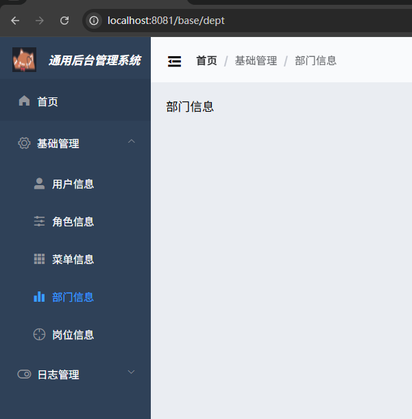

这样，页面左上角就存在面包屑，同时能够点击首页来返回首页。

## 13.7 首页右上方头像

这里需要实现展示用户名、用户头像和下拉列表提供个人信息和退出登录两个按钮。因此最好使用新的vue来实现。在components中创建`HeadImage.vue`。

```vue
<script>
  import storage from "@/utils/storage";

  export default {
    name: "HeadImage",
    data() {
      return  {
        sysAdmin: storage.getItem("sysAdmin")
      }
    }
  }
</script>

<template>
  <div>
    <span class="user-username">{{sysAdmin.username}}</span>
    <el-dropdown>
      
      <image v-else :src="sysAdmin.icon" class="user-avator"/>
      <el-dropdown-menu>
        <el-dropdown-item>
          <span>个人信息</span>
        </el-dropdown-item>
        <el-dropdown-item>
          <span>退出登录</span>
        </el-dropdown-item>
      </el-dropdown-menu>
    </el-dropdown>
  </div>
</template>

<style scoped lang="less">

</style>
```

接下来在`Home.vue`中引入该组件即可。

```vue
<script>
  import storage from "@/utils/storage";

  export default {
    name: "HeadImage",
    data() {
      return  {
        sysAdmin: storage.getItem("sysAdmin")
      }
    }
  }
</script>

<template>
  <div>
    <span class="user-username">{{sysAdmin.username}}</span>
    <el-dropdown>
      
      
      <el-dropdown-menu>
        <el-dropdown-item>
          <span>个人信息</span>
        </el-dropdown-item>
        <el-dropdown-item>
          <span>退出登录</span>
        </el-dropdown-item>
      </el-dropdown-menu>
    </el-dropdown>
  </div>
</template>

<style scoped lang="less">
  .user-username {
    position: fixed;
    right: 70px;
    font-size: medium;
    margin-top: 11px;
  }
  .user-avator {
    cursor: pointer;
    width: 40px;
    height: 40px;
    border-radius: 10px;
  }
</style>
```

这样就实现了右上角的信息展示。

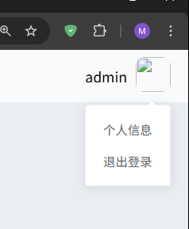

## 13.8 点击退出和个人信息

在`HeadImage.vue`中，需要给个人信息和退出登录两个按键绑定点击事件，个人信息使用`this.$router.push('/personal')`即可，而退出登录则需要先清除localStorage中保存的个人信息`this.storage.clearAll()`，然后转到登录页面`this.$router.push('/login')`即可。

```vue
<script>
  import storage from "@/utils/storage";

  export default {
    name: "HeadImage",
    data() {
      return  {
        sysAdmin: storage.getItem("sysAdmin")
      }
    },
    methods: {
      openPersonal() {
        // 点击跳转个人信息页面
        this.$router.push("/personal")
      },
      // 退出登录
      async logout() {
        const confirmResult = await this.$confirm('确定要退出登录吗？', '提示', {
          confirmButtonText: '确定',
          cancelButtonText: '取消',
          type: 'warning'
        }).catch(err => err)
        if (confirmResult !== 'confirm') {
          return this.$message.info('已取消注销')
        } else {
          this.$storage.clearAll()
          this.$router.push('/login')
          this.$message.success('退出成功')
        }
      }
    }
  }
</script>

<template>
  <div>
    <span class="user-username">{{sysAdmin.username}}</span>
    <el-dropdown>
      
      
      <el-dropdown-menu>
        <el-dropdown-item>
          <span @click="openPersonal">个人信息</span>
        </el-dropdown-item>
        <el-dropdown-item>
          <span @click="logout">退出登录</span>
        </el-dropdown-item>
      </el-dropdown-menu>
    </el-dropdown>
  </div>
</template>

<style scoped lang="less">
  .user-username {
    position: fixed;
    right: 70px;
    font-size: medium;
    margin-top: 11px;
  }
  .user-avator {
    cursor: pointer;
    width: 40px;
    height: 40px;
    border-radius: 10px;
  }
</style>
```

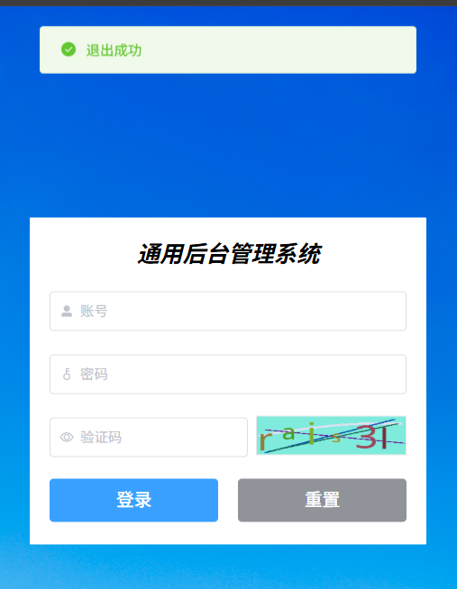

## 13.9 标签页开发

每点击一个左侧菜单栏，都应该打开一个新的页内标签页，这样能够处理多个页面。

在components中的`Tags.vue`实现。

```vue
<script>
  export default {
    name: "Tags",
    data() {
      return {
        tags:[{
          title: "首页",
          path: "/welcome"
        }]
      }
    },
    watch: {
      $route: {
        immediate: true,
        handler(val) {
          // 查看新的页面是否在当前的tags数组下
          const boolean = this.tags.find(item => {
            return val.path === item.path
          })
          // 如果不在，在tags下添加这个新的页面
          if (!boolean) {
            this.tags.push({
              title: val.meta.tTitle,
              path: val.path
            })
          }
        }
      }
    }
  }
</script>

<template>
  <div class="tags">
    <el-tag class="tag" size="medium" closable :effect="item.title === $route.meta.tTitle ? 'dark' : 'plain'" v-for="item in tags" :key="item.path">
      <i class="circular" v-show="item.title === $route.meta.tTitle"></i>
      {{item.title}}
    </el-tag>
  </div>
</template>

<style scoped lang="less">
  .tags {
    padding-left: 20px;
    padding-top: 2px;
    padding-bottom: 2px;
  }
  .tag {
    cursor: pointer;
    margin-right: 3px;
    .circular {
      width: 8px;
      height: 8px;
      margin-right: 4px;
      background-color: #fff;
      border-radius: 50%;
      display: inline-block;
    }
  }
</style>
```

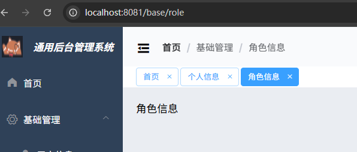

## 13.10 点击实现路由跳转

这里的标签页需要实现点击后跳转。

只需要在`Tags.vue`下的`el-tag`标签添加点击事件，获取item的path，然后在点击事件中通过`this.$router.push(path)`进行跳转即可。

```vue
<template>
  <div class="tags">
    <el-tag class="tag" size="medium" closable :effect="item.title === $route.meta.tTitle ? 'dark' : 'plain'" v-for="item in tags" :key="item.path"
    @click="goTo(item.path)">
      <i class="circular" v-show="item.title === $route.meta.tTitle"></i>
      {{item.title}}
    </el-tag>
  </div>
</template>
```

```vue
<script>
  export default {
    name: "Tags",
    data() {
      return {
        tags:[{
          title: "首页",
          path: "/welcome"
        }]
      }
    },
    watch: {
      $route: {
        immediate: true,
        handler(val) {
          // 查看新的页面是否在当前的tags数组下
          const boolean = this.tags.find(item => {
            return val.path === item.path
          })
          // 如果不在，在tags下添加这个新的页面
          if (!boolean) {
            this.tags.push({
              title: val.meta.tTitle,
              path: val.path
            })
          }
        }
      }
    },
    methods: {
      goTo(path) {
        this.$router.push(path)
      }
    }
  }
</script>
```

这样就可以点击标签页来进行跳转。

## 13.11 关闭标签页

现在需要实现点击标签页的关闭来关闭标签页。

在`Tags.vue`的标签页标签上添加`@close`来添加关闭事件，需要传入在`vl-for`循环中获取的索引`i`。再通过`this.tags.splice(i)`来实现标签页关闭。

```vue
<script>

  export default {
    name: "Tags",
    computed: {
      index() {
        return index
      }
    },
    data() {
      return {
        tags:[{
          title: "首页",
          path: "/welcome"
        }]
      }
    },
    watch: {
      $route: {
        immediate: true,
        handler(val) {
          // 查看新的页面是否在当前的tags数组下
          const boolean = this.tags.find(item => {
            return val.path === item.path
          })
          // 如果不在，在tags下添加这个新的页面
          if (!boolean) {
            this.tags.push({
              title: val.meta.tTitle,
              path: val.path
            })
          }
        }
      }
    },
    methods: {
      // 点击跳转
      goTo(path) {
        this.$router.push(path)
      },
      // 点击关闭
      close(i) {
        this.tags.splice(i, 1)
      }
    }
  }
</script>

<template>
  <div class="tags">
    <el-tag class="tag" size="medium" closable :effect="item.title === $route.meta.tTitle ? 'dark' : 'plain'" v-for="(item, i) in tags" :key="item.path"
    @click="goTo(item.path)" @close="close(i)" :closable="i >0" disable-transitions >
      <i class="circular" v-show="item.title === $route.meta.tTitle"></i>
      {{item.title}}
    </el-tag>
  </div>
</template>

<style scoped lang="less">
  .tags {
    padding-left: 20px;
    padding-top: 2px;
    padding-bottom: 2px;
  }
  .tag {
    cursor: pointer;
    margin-right: 3px;
    .circular {
      width: 8px;
      height: 8px;
      margin-right: 4px;
      background-color: #fff;
      border-radius: 50%;
      display: inline-block;
    }
  }
</style>
```

同时，设置`:closable="i > 0"`让只有索引大于0的页面能够被关闭，保证了首页不会被关闭。而`disable-transitions`能够关闭动画效果，能够瞬间关闭。

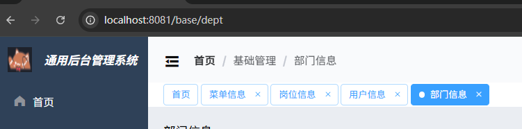

## 13.12 关闭标签页后跳转

如果直接关闭了当前标签页，就会变成空页面。现在需要实现关闭页面后，跳转到最后一个标签页。也就是在关闭事件中实现，根据索引来判断，如果关闭的是当前的标签页，且当前标签页不是最后一个，那么先跳转到最后一个标签页再关闭；如果关闭当前标签页，且当前标签页是最后一个，那么先跳转到倒数第二个标签页，然后关闭最后一个标签页即可。

```vue
<script>

  export default {
    name: "Tags",
    computed: {
      index() {
        return index
      }
    },
    data() {
      return {
        tags:[{
          title: "首页",
          path: "/welcome"
        }]
      }
    },
    watch: {
      $route: {
        immediate: true,
        handler(val) {
          // 查看新的页面是否在当前的tags数组下
          const boolean = this.tags.find(item => {
            return val.path === item.path
          })
          // 如果不在，在tags下添加这个新的页面
          if (!boolean) {
            this.tags.push({
              title: val.meta.tTitle,
              path: val.path
            })
          }
        }
      }
    },
    methods: {
      // 点击跳转
      goTo(path) {
        this.$router.push(path)
      },
      // 点击关闭
      close(i) {
        // 如果关闭当前激活的页面，且当前页面不是最后一个，那么关闭后会跳转到最后一个页面
        if (this.tags[i].path === this.$route.meta.path && i !== this.tags.length - 1) {
          this.$router.push(this.tags[this.tags.length - 1].path)
        }else if (i === this.tags.length - 1) {
          // 如果当前激活的页面是最后一个，关闭的是最后一个页面，那么关闭后会跳转到原本倒数第二个页面
          this.$router.push(this.tags[this.tags.length - 2].path)
        }
        this.tags.splice(i, 1)
      }
    }
  }
</script>

<template>
  <div class="tags">
    <el-tag class="tag" size="medium" closable :effect="item.title === $route.meta.tTitle ? 'dark' : 'plain'" v-for="(item, i) in tags" :key="item.path"
    @click="goTo(item.path)" @close="close(i)" :closable="i >0" disable-transitions >
      <i class="circular" v-show="item.title === $route.meta.tTitle"></i>
      {{item.title}}
    </el-tag>
  </div>
</template>

<style scoped lang="less">
  .tags {
    padding-left: 20px;
    padding-top: 2px;
    padding-bottom: 2px;
  }
  .tag {
    cursor: pointer;
    margin-right: 3px;
    .circular {
      width: 8px;
      height: 8px;
      margin-right: 4px;
      background-color: #fff;
      border-radius: 50%;
      display: inline-block;
    }
  }
</style>
```

# 14. 岗位开发

接下来要实现这里的岗位信息。

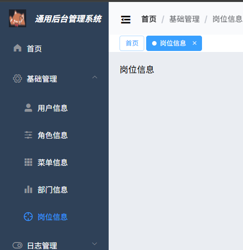

为了统一里面展示的数据样式，在css的`global.css`中准备全局样式。

```css
/*全局样式*/
html, body, #app {
    height: 100%;
    margin: 0;
    padding: 0;
}

.el-card {
    box-shadow: 0 1px 1px rgba(0, 0, 0, 0.15) !important;
}

.el-row {
    margin-bottom: 5px;
}
.el-pagination {
    margin-top: 10px;
}
```

然后在api的`index.js`中添加前端向后端要求增删改查的函数。

```js
/*
后端api接口管理
 */

import request from '@/utils/request'

export default {
    // 验证码接口
    captcha() {
        return request ({
            url: '/captcha',
            method: 'get'
        })
    },
    // 登录接口
    login(params) {
        return request({
            url: '/login',
            method: 'post',
            data: params
        })
    },
    // post岗位
    queryPostList(params) {
        return request({
            url: '/post/list',
            method: 'get',
            data: params
        })
    },
    // 批量删除岗位
    batchDeleteSysPost(ids) {
        const data = {
            ids
        }
        return request({
            url: '/post/batch/delete',
            method: 'delete',
            data: data
        })
    },
    // 根据id删除岗位
    deleteSysPost(id) {
        const data = {
            id
        }
        return request({
            url: '/post/delete',
            method: 'delete',
            data: data
        })
    },
    // 获取岗位列表
    querySysPostVOList() {
        return request({
            url: '/post/vo/list',
            method: 'get'
        })
    },
    // 添加岗位
    addPost(data) {
        return request({
            url: '/post/add',
            method: 'post',
            data: data
        })
    },
    // 根据id获取岗位信息
    postInfo(id) {
        const data = {
            id
        }
        return request({
            url: '/post/info',
            method: 'get',
            data: data
        })
    },
    // 更新岗位
    updatePost(data) {
        return request({
            url: '/post/update',
            method: 'put',
            data: data
        })
    },
    // 更新岗位状态
    updatePostStatus(id, postStatus) {
        const data = {
            id,
            postStatus
        }
        return request({
            url: '/post/updateStatus',
            method: 'put',
            data: data
        })
    }
}
```

接下来，在`Post.vue`中实现即可。

```vue
<script>
  export default {
    data() {
      return {
        loading: true,
        queryParams: {},
        postStatusList: [{
          value: '1',
          label: '启用',
        },
          {
            value: '2',
            label: '停用',
          }],
        postList: [],
        total: 0,

      }
    },
    methods: {
      // 获取列表
      async getPostList() {
        this.loading = true
        const {data: res} = await this.$api.queryPostList(this.queryParams)
        console.log("res数据：", res)
        if (res.code !== 200) {
          this.$message.error(res.message)
        } else {
          this.postList = res.data.list
          this.total = res.data.total
          this.loading = false
        }
      },
      // 搜索
      handleQuery() {
        this.getPostList()
      },
      // 重置
      resetQuery() {
        this.queryParams = {}
        this.getPostList()
        this.$message.success("重置成功")
      },
      // 页面
      handleSizeChange(newSize) {
        this.queryParams.pageSize = newSize
        this.getPostList()
      },
      // 页数
      handleCurrentChange(newPage) {
        this.queryParams.pageNum = newPage
        this.getPostList()
      }
    },
    created() {
      this.getPostList()
    }
  }
</script>

<template>
  <el-card>
<!--    条件搜索-->
    <el-form :model="queryParams" :inline="true">
      <el-form-item label="岗位名称" prop="postName">
        <el-input placeholder="请输入岗位名称" clearable size="mini" v-model="queryParams.postName"/>
      </el-form-item>
      <el-form-item label="岗位状态" prop="postStatus">
        <el-select size="mini" placeholder="请选择岗位状态" v-model="queryParams.postStatus">
          <el-option v-for="item in queryParams.postStatusList" :key="item.value" :label="item.label" :value="item.value"/>
        </el-select>
      </el-form-item>
      <el-form-item label="开始时间" prop="beginTime">
        <el-date-picker class="input-width" size="mini" type="date" style="width: 190px;"
                        value-format="yyyy-MM-dd" placeholder="请选择开始时间" v-model="queryParams.beginTime"/>
      </el-form-item>
      <el-form-item label="结束时间" prop="endTime">
        <el-date-picker class="input-width" size="mini" type="date" style="width: 190px;"
                        value-format="yyyy-MM-dd" placeholder="请选择结束时间" v-model="queryParams.endTime"/>
      </el-form-item>
      <el-form-item>
        <el-button type="primary" icon="el-icon-search" size="mini" @click="handleQuery">搜索</el-button>
        <el-button type="primary" icon="el-icon-refresh" size="mini" @click="resetQuery">重置</el-button>
      </el-form-item>
    </el-form>
<!--    操作按钮-->
    <el-row :gutter="10" class="mb8">
      <el-col :span="1.5">
        <el-button plain type="primary" icon="el-icon-plus">新增</el-button>
      </el-col>
      <el-col :span="1.5">
        <el-button plain type="danger" icon="el-icon-delete">删除</el-button>
      </el-col>
    </el-row>
<!--    列表-->
    <el-table border stripe style="width: 100%;" :header-cell-style="{background: '#eeflf6', color: '#606266' }"
              v-loading="loading" :data="this.postList">
      <el-table-column type="selection"/>
      <el-table-column label="ID" v-if="false" prop="id"/>
      <el-table-column label="岗位名称" v-if="true" prop="postName"/>
      <el-table-column label="岗位编码" v-if="true" prop="postCode"/>
      <el-table-column label="岗位状态" v-if="true" prop="postStatus"/>
      <el-table-column label="创建时间" v-if="true" prop="createTime"/>
      <el-table-column label="描述" v-if="true" prop="remark"/>
      <el-table-column label="更多操作">
        <template slot-scope="scope">
          <el-button type="text" size="small" icon="el-icon-edit">编辑</el-button>
          <el-button type="text" size="small" icon="el-icon-delete">删除</el-button>
        </template>
      </el-table-column>
    </el-table>
<!--    分页-->
    <el-pagination @size-change="handleSizeChange" @current-change="handleCurrentChange"
    :current-page="queryParams.pageNum" :page-sizes="[10, 50, 100, 500, 1000]" :page-size="queryParams.pageSize"
    layout="total, sizes, prev, pager, next, jumper" :total="this.total">

    </el-pagination>
  </el-card>
</template>

<style lang="less" scoped>

</style>
```

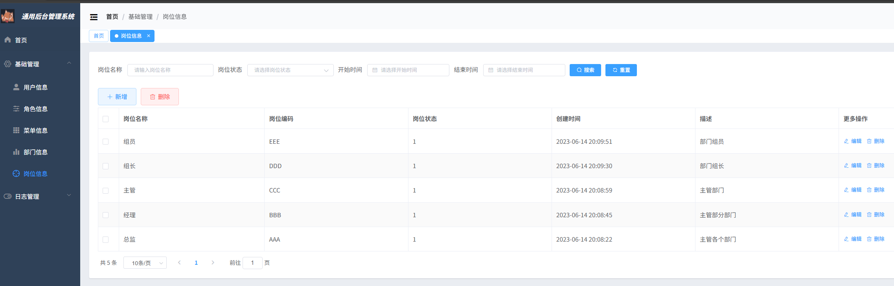

## 14.1 修改岗位状态

这里需要为岗位状态添加按钮，能够点击后实现岗位的停用和启用。

在岗位状态处添加按钮，然后添加点击事件`postUpdateStatus`，在事件中调用api的`updatePostStatus`方法即可。

```vue
<script>
  export default {
    data() {
      return {
        loading: true,
        queryParams: {},
        postStatusList: [{
          value: '1',
          label: '启用',
        },
          {
            value: '2',
            label: '停用',
          }],
        postList: [],
        total: 0,

      }
    },
    methods: {
      // 获取列表
      async getPostList() {
        this.loading = true
        const {data: res} = await this.$api.queryPostList(this.queryParams)
        console.log("res数据：", res)
        if (res.code !== 200) {
          this.$message.error(res.message)
        } else {
          this.postList = res.data.list
          this.total = res.data.total
          this.loading = false
        }
      },
      // 搜索
      handleQuery() {
        this.getPostList()
      },
      // 重置
      resetQuery() {
        this.queryParams = {}
        this.getPostList()
        this.$message.success("重置成功")
      },
      // 页面
      handleSizeChange(newSize) {
        this.queryParams.pageSize = newSize
        this.getPostList()
      },
      // 页数
      handleCurrentChange(newPage) {
        this.queryParams.pageNum = newPage
        this.getPostList()
      },
      // 岗位状态修改
      async postUpdateStatus(row) {
        let text = row.postStatus === 2 ? '停用' : '启用'
        const confirmResult = await this.$confirm('确定要' + text + row.postName + '岗位吗？', "警告", {
          confirmButtonText: "确定",
          cancelButtonText: "取消",
          type: "warning",
        }).catch(err => err)
        if (confirmResult !== 'confirm') {
          await this.getPostList()
          return this.$message.info("已取消修改")
        }
        await this.$api.updatePostStatus(row.id, row.postStatus)
        await this.getPostList()
        return this.$message.success(text + "成功")
      }
    },
    created() {
      this.getPostList()
    }
  }
</script>

<template>
  <el-card>
<!--    条件搜索-->
    <el-form :model="queryParams" :inline="true">
      <el-form-item label="岗位名称" prop="postName">
        <el-input placeholder="请输入岗位名称" clearable size="mini" v-model="queryParams.postName"/>
      </el-form-item>
      <el-form-item label="岗位状态" prop="postStatus">
        <el-select size="mini" placeholder="请选择岗位状态" v-model="queryParams.postStatus">
          <el-option v-for="item in queryParams.postStatusList" :key="item.value" :label="item.label" :value="item.value"/>
        </el-select>
      </el-form-item>
      <el-form-item label="开始时间" prop="beginTime">
        <el-date-picker class="input-width" size="mini" type="date" style="width: 190px;"
                        value-format="yyyy-MM-dd" placeholder="请选择开始时间" v-model="queryParams.beginTime"/>
      </el-form-item>
      <el-form-item label="结束时间" prop="endTime">
        <el-date-picker class="input-width" size="mini" type="date" style="width: 190px;"
                        value-format="yyyy-MM-dd" placeholder="请选择结束时间" v-model="queryParams.endTime"/>
      </el-form-item>
      <el-form-item>
        <el-button type="primary" icon="el-icon-search" size="mini" @click="handleQuery">搜索</el-button>
        <el-button type="primary" icon="el-icon-refresh" size="mini" @click="resetQuery">重置</el-button>
      </el-form-item>
    </el-form>
<!--    操作按钮-->
    <el-row :gutter="10" class="mb8">
      <el-col :span="1.5">
        <el-button plain type="primary" icon="el-icon-plus">新增</el-button>
      </el-col>
      <el-col :span="1.5">
        <el-button plain type="danger" icon="el-icon-delete">删除</el-button>
      </el-col>
    </el-row>
<!--    列表-->
    <el-table border stripe style="width: 100%;" :header-cell-style="{background: '#eeflf6', color: '#606266' }"
              v-loading="loading" :data="this.postList">
      <el-table-column type="selection"/>
      <el-table-column label="ID" v-if="false" prop="id"/>
      <el-table-column label="岗位名称" v-if="true" prop="postName"/>
      <el-table-column label="岗位编码" v-if="true" prop="postCode"/>
      <el-table-column label="岗位状态" v-if="true" prop="postStatus">
        <template slot-scope="scope">
          <el-switch v-model="scope.row.postStatus" :active-value="1" :inactive-value="2" active-color="#13ce66"
                     inactive-color="#F5222D" active-text="启用" inactive-text="停用" @change="postUpdateStatus(scope.row)">

          </el-switch>
        </template>
      </el-table-column>
      <el-table-column label="创建时间" v-if="true" prop="createTime"/>
      <el-table-column label="描述" v-if="true" prop="remark"/>
      <el-table-column label="更多操作">
        <template slot-scope="scope">
          <el-button type="text" size="small" icon="el-icon-edit">编辑</el-button>
          <el-button type="text" size="small" icon="el-icon-delete">删除</el-button>
        </template>
      </el-table-column>
    </el-table>
<!--    分页-->
    <el-pagination @size-change="handleSizeChange" @current-change="handleCurrentChange"
    :current-page="queryParams.pageNum" :page-sizes="[10, 50, 100, 500, 1000]" :page-size="queryParams.pageSize"
    layout="total, sizes, prev, pager, next, jumper" :total="this.total">

    </el-pagination>
  </el-card>
</template>

<style lang="less" scoped>

</style>
```

这样就能修改岗位状态。

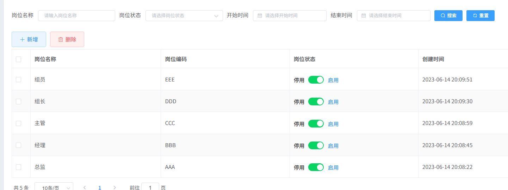

## 14.2 新增岗位

给新增按钮绑定`el-dialog`窗口，在里面构建四条字段，填充后使用`this.$api.addPost`将字段传入即可。

```vue
<script>
  export default {
    data() {
      return {
        loading: true,
        queryParams: {},
        postStatusList: [{
          value: '1',
          label: '启用',
        },
          {
            value: '2',
            label: '停用',
          }],
        postList: [],
        total: 0,
        addPostDialogVisible: false,
        addPostFormRules: {
          postName: [{required: true, message: '请输入岗位名称', trigger: 'blur'}],
          postCode: [{required: true, message: '请输入岗位标识', trigger: 'blur'}],
          postStatus: [{required: true, message: '请输入岗位状态', trigger: 'blur'}]
        },
        addPostForm: {
          postName: '',
          postCode: '',
          postStatus: 1,
          remark: ''
        }

      }
    },
    methods: {
      // 获取列表
      async getPostList() {
        this.loading = true
        const {data: res} = await this.$api.queryPostList(this.queryParams)
        console.log("res数据：", res)
        if (res.code !== 200) {
          this.$message.error(res.message)
        } else {
          this.postList = res.data.list
          this.total = res.data.total
          this.loading = false
        }
      },
      // 搜索
      handleQuery() {
        this.getPostList()
      },
      // 重置
      resetQuery() {
        this.queryParams = {}
        this.getPostList()
        this.$message.success("重置成功")
      },
      // 页面
      handleSizeChange(newSize) {
        this.queryParams.pageSize = newSize
        this.getPostList()
      },
      // 页数
      handleCurrentChange(newPage) {
        this.queryParams.pageNum = newPage
        this.getPostList()
      },
      // 岗位状态修改
      async postUpdateStatus(row) {
        let text = row.postStatus === 2 ? '停用' : '启用'
        const confirmResult = await this.$confirm('确定要' + text + row.postName + '岗位吗？', "警告", {
          confirmButtonText: "确定",
          cancelButtonText: "取消",
          type: "warning",
        }).catch(err => err)
        if (confirmResult !== 'confirm') {
          await this.getPostList()
          return this.$message.info("已取消修改")
        }
        await this.$api.updatePostStatus(row.id, row.postStatus)
        await this.getPostList()
        return this.$message.success(text + "成功")
      },
      // 监听对话框关闭
      addPostDialogClosed() {
        this.$refs.addPostFormRefForm.resetFields()
      },
      // 新增操作
      addPost() {
        this.$refs.addPostFormRefForm.validate(async valid => {
          if (!valid) {
            return
          }
          const {data: res} = await this.$api.addPost(this.addPostForm)
          if (res.code !== 200) {
            this.$message.error(res.message)
          } else {
            this.$message.success('新增岗位成功')
            this.addPostDialogVisible = false
            await this.getPostList()
          }
        })
      }
    },
    created() {
      this.getPostList()
    }
  }
</script>

<template>
  <el-card>
<!--    条件搜索-->
    <el-form :model="queryParams" :inline="true">
      <el-form-item label="岗位名称" prop="postName">
        <el-input placeholder="请输入岗位名称" clearable size="mini" v-model="queryParams.postName"/>
      </el-form-item>
      <el-form-item label="岗位状态" prop="postStatus">
        <el-select size="mini" placeholder="请选择岗位状态" v-model="queryParams.postStatus">
          <el-option v-for="item in queryParams.postStatusList" :key="item.value" :label="item.label" :value="item.value"/>
        </el-select>
      </el-form-item>
      <el-form-item label="开始时间" prop="beginTime">
        <el-date-picker class="input-width" size="mini" type="date" style="width: 190px;"
                        value-format="yyyy-MM-dd" placeholder="请选择开始时间" v-model="queryParams.beginTime"/>
      </el-form-item>
      <el-form-item label="结束时间" prop="endTime">
        <el-date-picker class="input-width" size="mini" type="date" style="width: 190px;"
                        value-format="yyyy-MM-dd" placeholder="请选择结束时间" v-model="queryParams.endTime"/>
      </el-form-item>
      <el-form-item>
        <el-button type="primary" icon="el-icon-search" size="mini" @click="handleQuery">搜索</el-button>
        <el-button type="primary" icon="el-icon-refresh" size="mini" @click="resetQuery">重置</el-button>
      </el-form-item>
    </el-form>
<!--    操作按钮-->
    <el-row :gutter="10" class="mb8">
      <el-col :span="1.5">
        <el-button plain type="primary" icon="el-icon-plus" @click="addPostDialogVisible = true">新增</el-button>
      </el-col>
      <el-col :span="1.5">
        <el-button plain type="danger" icon="el-icon-delete">删除</el-button>
      </el-col>
    </el-row>
<!--    列表-->
    <el-table border stripe style="width: 100%;" :header-cell-style="{background: '#eeflf6', color: '#606266' }"
              v-loading="loading" :data="this.postList">
      <el-table-column type="selection"/>
      <el-table-column label="ID" v-if="false" prop="id"/>
      <el-table-column label="岗位名称" v-if="true" prop="postName"/>
      <el-table-column label="岗位编码" v-if="true" prop="postCode"/>
      <el-table-column label="岗位状态" v-if="true" prop="postStatus">
        <template slot-scope="scope">
          <el-switch v-model="scope.row.postStatus" :active-value="1" :inactive-value="2" active-color="#13ce66"
                     inactive-color="#F5222D" active-text="启用" inactive-text="停用" @change="postUpdateStatus(scope.row)">

          </el-switch>
        </template>
      </el-table-column>
      <el-table-column label="创建时间" v-if="true" prop="createTime"/>
      <el-table-column label="描述" v-if="true" prop="remark"/>
      <el-table-column label="更多操作">
        <template slot-scope="scope">
          <el-button type="text" size="small" icon="el-icon-edit">编辑</el-button>
          <el-button type="text" size="small" icon="el-icon-delete">删除</el-button>
        </template>
      </el-table-column>
    </el-table>
<!--    分页-->
    <el-pagination @size-change="handleSizeChange" @current-change="handleCurrentChange"
    :current-page="queryParams.pageNum" :page-sizes="[10, 50, 100, 500, 1000]" :page-size="queryParams.pageSize"
    layout="total, sizes, prev, pager, next, jumper" :total="this.total">

    </el-pagination>
    <!--  新增对话框-->
    <el-dialog title="新增岗位" :visible.async="addPostDialogVisible" width="30%" @close="addPostDialogClosed">
      <el-form label-width="80px" ref="addPostFormRefForm" :rules="addPostFormRules" :model="addPostForm">
        <el-form-item label="岗位名称" prop="postName">
          <el-input placeholder="请输入岗位名称" v-model="addPostForm.postName"/>
        </el-form-item>
        <el-form-item label="岗位编码" prop="postCode">
          <el-input placeholder="请输入岗位编码" v-model="addPostForm.postCode"/>
        </el-form-item>
        <el-form-item label="岗位状态" prop="postStatus">
          <el-radio-group v-model="addPostForm.postStatus">
            <el-radio :label="1">启用</el-radio>
            <el-radio :label="2">停用</el-radio>
          </el-radio-group>
        </el-form-item>
        <el-form-item label="岗位描述" prop="remark">
          <el-input placeholder="请输入岗位描述" v-model="addPostForm.remark"/>
        </el-form-item>
      </el-form>
      <span slot="footer" class="dialog-footer">
      <el-button type="primary" @click="addPost">确定</el-button>
      <el-button type="primary" @click="addPostDialogVisible = false">取消</el-button>
    </span>
    </el-dialog>
  </el-card>
</template>

<style lang="less" scoped>

</style>
```

## 14.3 修改岗位

修改岗位和新增岗位类似，只不过调用的接口从`addPost`变为了`updatePost`。

```vue
<script>
  export default {
    data() {
      return {
        loading: true,
        queryParams: {},
        postStatusList: [{
          value: '1',
          label: '启用',
        },
          {
            value: '2',
            label: '停用',
          }],
        postList: [],
        total: 0,
        addPostDialogVisible: false,
        addPostFormRules: {
          postName: [{required: true, message: '请输入岗位名称', trigger: 'blur'}],
          postCode: [{required: true, message: '请输入岗位标识', trigger: 'blur'}],
          postStatus: [{required: true, message: '请输入岗位状态', trigger: 'blur'}]
        },
        addPostForm: {
          postName: '',
          postCode: '',
          postStatus: 1,
          remark: ''
        },
        editPostDialogVisible: false,
        editPostForm: {
          postName: '',
          postCode: '',
          postStatus: 1,
          remark: ''
        },
        editPostFormRules: {
          postName: [{required: true, message: '请输入岗位名称', trigger: 'blur'}],
          postCode: [{required: true, message: '请输入岗位标识', trigger: 'blur'}],
          postStatus: [{required: true, message: '请输入岗位状态', trigger: 'blur'}]
        }

      }
    },
    methods: {
      // 获取列表
      async getPostList() {
        this.loading = true
        const {data: res} = await this.$api.queryPostList(this.queryParams)
        console.log("res数据：", res)
        if (res.code !== 200) {
          this.$message.error(res.message)
        } else {
          this.postList = res.data.list
          this.total = res.data.total
          this.loading = false
        }
      },
      // 搜索
      handleQuery() {
        this.getPostList()
      },
      // 重置
      resetQuery() {
        this.queryParams = {}
        this.getPostList()
        this.$message.success("重置成功")
      },
      // 页面
      handleSizeChange(newSize) {
        this.queryParams.pageSize = newSize
        this.getPostList()
      },
      // 页数
      handleCurrentChange(newPage) {
        this.queryParams.pageNum = newPage
        this.getPostList()
      },
      // 岗位状态修改
      async postUpdateStatus(row) {
        let text = row.postStatus === 2 ? '停用' : '启用'
        const confirmResult = await this.$confirm('确定要' + text + row.postName + '岗位吗？', "警告", {
          confirmButtonText: "确定",
          cancelButtonText: "取消",
          type: "warning",
        }).catch(err => err)
        if (confirmResult !== 'confirm') {
          await this.getPostList()
          return this.$message.info("已取消修改")
        }
        await this.$api.updatePostStatus(row.id, row.postStatus)
        await this.getPostList()
        return this.$message.success(text + "成功")
      },
      // 监听对话框关闭
      addPostDialogClosed() {
        this.$refs.addPostFormRefForm.resetFields()
      },
      // 新增操作
      addPost() {
        this.$refs.addPostFormRefForm.validate(async valid => {
          if (!valid) {
            return
          }
          const {data: res} = await this.$api.addPost(this.addPostForm)
          if (res.code !== 200) {
            this.$message.error(res.message)
          } else {
            this.$message.success('新增岗位成功')
            this.addPostDialogVisible = false
            await this.getPostList()
          }
        })
      },
      // 显示编辑页面
      async handleUpdate(id) {
        const {data : res} = await this.$api.postInfo(id);
        if (res.code !== 200) {
          this.$message.error(res.message)
        } else {
          this.editPostForm = res.data
          this.editPostDialogVisible = true
        }
      },
      // 监听编辑岗位对话框
      editPostDialogClosed() {
        this.$refs.editPostFormRefForm.resetFields()
      },
      // 点击确定修改
      editPost() {
        this.$refs.editPostFormRefForm.validate(async valid => {
          if (!valid) {
            return
          }
          const {data: res} = await this.$api.updatePost(this.editPostForm)
          if (res.code !== 200) {
            this.$message.error(res.message)
          } else {
            this.$message.success('编辑岗位成功')
            this.editPostDialogVisible = false
            await this.getPostList()
          }
        })
      }
    },
    created() {
      this.getPostList()
    }
  }
</script>

<template>
  <el-card>
<!--    条件搜索-->
    <el-form :model="queryParams" :inline="true">
      <el-form-item label="岗位名称" prop="postName">
        <el-input placeholder="请输入岗位名称" clearable size="mini" v-model="queryParams.postName"/>
      </el-form-item>
      <el-form-item label="岗位状态" prop="postStatus">
        <el-select size="mini" placeholder="请选择岗位状态" v-model="queryParams.postStatus">
          <el-option v-for="item in queryParams.postStatusList" :key="item.value" :label="item.label" :value="item.value"/>
        </el-select>
      </el-form-item>
      <el-form-item label="开始时间" prop="beginTime">
        <el-date-picker class="input-width" size="mini" type="date" style="width: 190px;"
                        value-format="yyyy-MM-dd" placeholder="请选择开始时间" v-model="queryParams.beginTime"/>
      </el-form-item>
      <el-form-item label="结束时间" prop="endTime">
        <el-date-picker class="input-width" size="mini" type="date" style="width: 190px;"
                        value-format="yyyy-MM-dd" placeholder="请选择结束时间" v-model="queryParams.endTime"/>
      </el-form-item>
      <el-form-item>
        <el-button type="primary" icon="el-icon-search" size="mini" @click="handleQuery">搜索</el-button>
        <el-button type="primary" icon="el-icon-refresh" size="mini" @click="resetQuery">重置</el-button>
      </el-form-item>
    </el-form>
<!--    操作按钮-->
    <el-row :gutter="10" class="mb8">
      <el-col :span="1.5">
        <el-button plain type="primary" icon="el-icon-plus" @click="addPostDialogVisible = true">新增</el-button>
      </el-col>
      <el-col :span="1.5">
        <el-button plain type="danger" icon="el-icon-delete">删除</el-button>
      </el-col>
    </el-row>
<!--    列表-->
    <el-table border stripe style="width: 100%;" :header-cell-style="{background: '#eeflf6', color: '#606266' }"
              v-loading="loading" :data="this.postList">
      <el-table-column type="selection"/>
      <el-table-column label="ID" v-if="false" prop="id"/>
      <el-table-column label="岗位名称" v-if="true" prop="postName"/>
      <el-table-column label="岗位编码" v-if="true" prop="postCode"/>
      <el-table-column label="岗位状态" v-if="true" prop="postStatus">
        <template slot-scope="scope">
          <el-switch v-model="scope.row.postStatus" :active-value="1" :inactive-value="2" active-color="#13ce66"
                     inactive-color="#F5222D" active-text="启用" inactive-text="停用" @change="postUpdateStatus(scope.row)">

          </el-switch>
        </template>
      </el-table-column>
      <el-table-column label="创建时间" v-if="true" prop="createTime"/>
      <el-table-column label="描述" v-if="true" prop="remark"/>
      <el-table-column label="更多操作">
        <template slot-scope="scope">
          <el-button type="text" size="small" icon="el-icon-edit" @click="handleUpdate(scope.row.id)">编辑</el-button>
          <el-button type="text" size="small" icon="el-icon-delete">删除</el-button>
        </template>
      </el-table-column>
    </el-table>
<!--    分页-->
    <el-pagination @size-change="handleSizeChange" @current-change="handleCurrentChange"
    :current-page="queryParams.pageNum" :page-sizes="[10, 50, 100, 500, 1000]" :page-size="queryParams.pageSize"
    layout="total, sizes, prev, pager, next, jumper" :total="this.total">

    </el-pagination>
    <!--  新增对话框-->
    <el-dialog title="新增岗位" :visible.async="addPostDialogVisible" width="30%" @close="addPostDialogClosed">
      <el-form label-width="80px" ref="addPostFormRefForm" :rules="addPostFormRules" :model="addPostForm">
        <el-form-item label="岗位名称" prop="postName">
          <el-input placeholder="请输入岗位名称" v-model="addPostForm.postName"/>
        </el-form-item>
        <el-form-item label="岗位编码" prop="postCode">
          <el-input placeholder="请输入岗位编码" v-model="addPostForm.postCode"/>
        </el-form-item>
        <el-form-item label="岗位状态" prop="postStatus">
          <el-radio-group v-model="addPostForm.postStatus">
            <el-radio :label="1">启用</el-radio>
            <el-radio :label="2">停用</el-radio>
          </el-radio-group>
        </el-form-item>
        <el-form-item label="岗位描述" prop="remark">
          <el-input placeholder="请输入岗位描述" v-model="addPostForm.remark"/>
        </el-form-item>
      </el-form>
      <span slot="footer" class="dialog-footer">
      <el-button type="primary" @click="addPost">确定</el-button>
      <el-button type="primary" @click="addPostDialogVisible = false">取消</el-button>
    </span>
    </el-dialog>
    <!--  编辑对话框-->
    <el-dialog title="编辑岗位" :visible.async="editPostDialogVisible" width="30%" @close="editPostDialogClosed">
      <el-form label-width="80px" ref="editPostFormRefForm" :rules="editPostFormRules" :model="editPostForm">
        <el-form-item label="岗位名称" prop="postName">
          <el-input placeholder="请输入岗位名称" v-model="editPostForm.postName"/>
        </el-form-item>
        <el-form-item label="岗位编码" prop="postCode">
          <el-input placeholder="请输入岗位编码" v-model="editPostForm.postCode"/>
        </el-form-item>
        <el-form-item label="岗位状态" prop="postStatus">
          <el-radio-group v-model="editPostForm.postStatus">
            <el-radio :label="1">启用</el-radio>
            <el-radio :label="2">停用</el-radio>
          </el-radio-group>
        </el-form-item>
        <el-form-item label="岗位描述" prop="remark">
          <el-input placeholder="请输入岗位描述" v-model="editPostForm.remark"/>
        </el-form-item>
      </el-form>
      <span slot="footer" class="dialog-footer">
      <el-button type="primary" @click="editPost">确定</el-button>
      <el-button type="primary" @click="editPostDialogVisible = false">取消</el-button>
    </span>
    </el-dialog>
  </el-card>
</template>

<style lang="less" scoped>

</style>
```

## 14.4 单删除和批量删除岗位

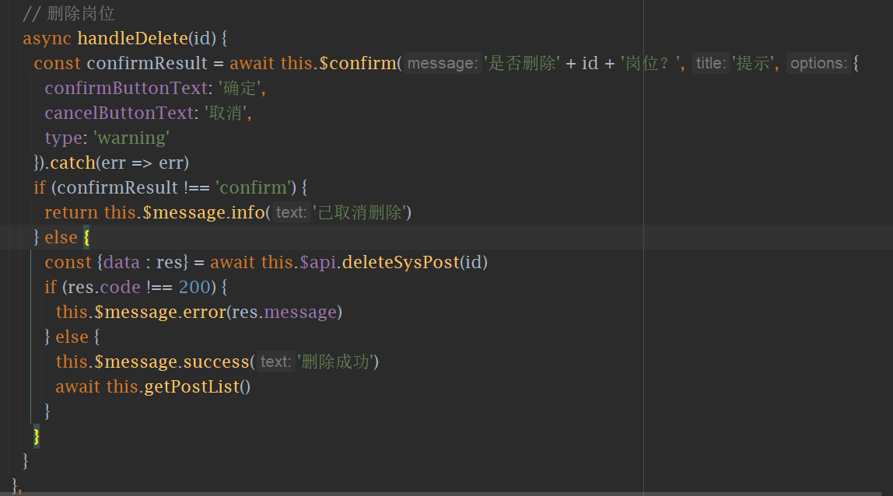

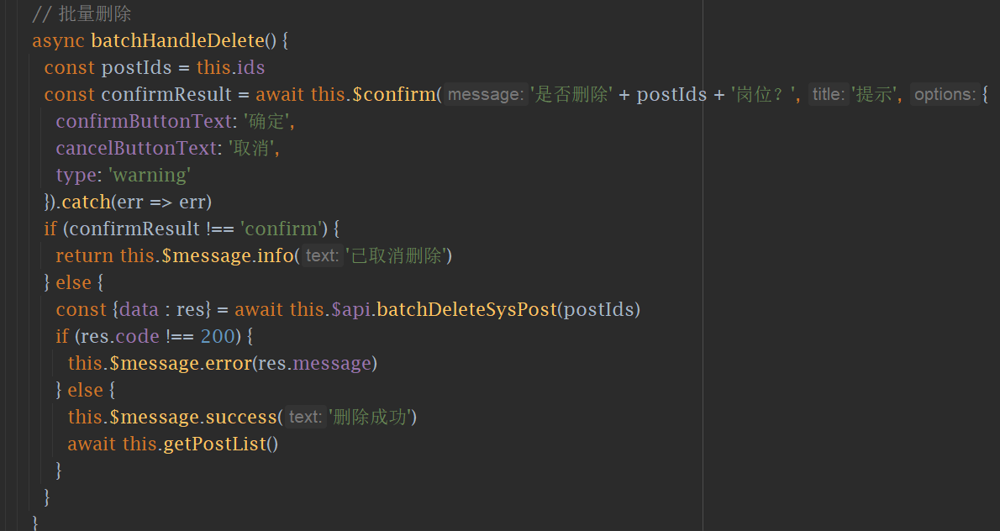

```vue
<script>

  export default {
    data() {
      return {
        loading: true,
        queryParams: {},
        postStatusList: [{
          value: '1',
          label: '启用',
        },
          {
            value: '2',
            label: '停用',
          }],
        postList: [],
        total: 0,
        addPostDialogVisible: false,
        addPostFormRules: {
          postName: [{required: true, message: '请输入岗位名称', trigger: 'blur'}],
          postCode: [{required: true, message: '请输入岗位标识', trigger: 'blur'}],
          postStatus: [{required: true, message: '请输入岗位状态', trigger: 'blur'}]
        },
        addPostForm: {
          postName: '',
          postCode: '',
          postStatus: 1,
          remark: ''
        },
        editPostDialogVisible: false,
        editPostForm: {
          postName: '',
          postCode: '',
          postStatus: 1,
          remark: ''
        },
        editPostFormRules: {
          postName: [{required: true, message: '请输入岗位名称', trigger: 'blur'}],
          postCode: [{required: true, message: '请输入岗位标识', trigger: 'blur'}],
          postStatus: [{required: true, message: '请输入岗位状态', trigger: 'blur'}]
        },
        ids: [],
        single: true,
        multiple: true,

      }
    },
    methods: {
      // 获取列表
      async getPostList() {
        this.loading = true
        const {data: res} = await this.$api.queryPostList(this.queryParams)
        console.log("res数据：", res)
        if (res.code !== 200) {
          this.$message.error(res.message)
        } else {
          this.postList = res.data.list
          this.total = res.data.total
          this.loading = false
        }
      },
      // 搜索
      handleQuery() {
        this.getPostList()
      },
      // 重置
      resetQuery() {
        this.queryParams = {}
        this.getPostList()
        this.$message.success("重置成功")
      },
      // 页面
      handleSizeChange(newSize) {
        this.queryParams.pageSize = newSize
        this.getPostList()
      },
      // 页数
      handleCurrentChange(newPage) {
        this.queryParams.pageNum = newPage
        this.getPostList()
      },
      // 岗位状态修改
      async postUpdateStatus(row) {
        let text = row.postStatus === 2 ? '停用' : '启用'
        const confirmResult = await this.$confirm('确定要' + text + row.postName + '岗位吗？', "警告", {
          confirmButtonText: "确定",
          cancelButtonText: "取消",
          type: "warning",
        }).catch(err => err)
        if (confirmResult !== 'confirm') {
          await this.getPostList()
          return this.$message.info("已取消修改")
        }
        await this.$api.updatePostStatus(row.id, row.postStatus)
        await this.getPostList()
        return this.$message.success(text + "成功")
      },
      // 监听对话框关闭
      addPostDialogClosed() {
        this.$refs.addPostFormRefForm.resetFields()
      },
      // 新增操作
      addPost() {
        this.$refs.addPostFormRefForm.validate(async valid => {
          if (!valid) {
            return
          }
          const {data: res} = await this.$api.addPost(this.addPostForm)
          if (res.code !== 200) {
            this.$message.error(res.message)
          } else {
            this.$message.success('新增岗位成功')
            this.addPostDialogVisible = false
            await this.getPostList()
          }
        })
      },
      // 显示编辑页面
      async handleUpdate(id) {
        const {data : res} = await this.$api.postInfo(id);
        if (res.code !== 200) {
          this.$message.error(res.message)
        } else {
          this.editPostForm = res.data
          this.editPostDialogVisible = true
        }
      },
      // 监听编辑岗位对话框
      editPostDialogClosed() {
        this.$refs.editPostFormRefForm.resetFields()
      },
      // 点击确定修改
      editPost() {
        this.$refs.editPostFormRefForm.validate(async valid => {
          if (!valid) {
            return
          }
          const {data: res} = await this.$api.updatePost(this.editPostForm)
          if (res.code !== 200) {
            this.$message.error(res.message)
          } else {
            this.$message.success('编辑岗位成功')
            this.editPostDialogVisible = false
            await this.getPostList()
          }
        })
      },
      // 删除岗位
      async handleDelete(id) {
        const confirmResult = await this.$confirm('是否删除' + id + '岗位？', '提示', {
          confirmButtonText: '确定',
          cancelButtonText: '取消',
          type: 'warning'
        }).catch(err => err)
        if (confirmResult !== 'confirm') {
          return this.$message.info('已取消删除')
        } else {
          const {data : res} = await this.$api.deleteSysPost(id)
          if (res.code !== 200) {
            this.$message.error(res.message)
          } else {
            this.$message.success('删除成功')
            await this.getPostList()
          }
        }
      },
      // 批量删除
      async batchHandleDelete() {
        const postIds = this.ids
        const confirmResult = await this.$confirm('是否删除' + postIds + '岗位？', '提示', {
          confirmButtonText: '确定',
          cancelButtonText: '取消',
          type: 'warning'
        }).catch(err => err)
        if (confirmResult !== 'confirm') {
          return this.$message.info('已取消删除')
        } else {
          const {data : res} = await this.$api.batchDeleteSysPost(postIds)
          if (res.code !== 200) {
            this.$message.error(res.message)
          } else {
            this.$message.success('删除成功')
            await this.getPostList()
          }
        }
      },
      // 多选框事件
      handleSelectionChange(selection) {
        this.ids = selection.map(item => item.id);
        this.single = selection.length != 1;
        this.multiple = !selection.length;
      }
    },

    created() {
      this.getPostList()
    }
  }
</script>

<template>
  <el-card>
<!--    条件搜索-->
    <el-form :model="queryParams" :inline="true">
      <el-form-item label="岗位名称" prop="postName">
        <el-input placeholder="请输入岗位名称" clearable size="mini" v-model="queryParams.postName"/>
      </el-form-item>
      <el-form-item label="岗位状态" prop="postStatus">
        <el-select size="mini" placeholder="请选择岗位状态" v-model="queryParams.postStatus">
          <el-option v-for="item in queryParams.postStatusList" :key="item.value" :label="item.label" :value="item.value"/>
        </el-select>
      </el-form-item>
      <el-form-item label="开始时间" prop="beginTime">
        <el-date-picker class="input-width" size="mini" type="date" style="width: 190px;"
                        value-format="yyyy-MM-dd" placeholder="请选择开始时间" v-model="queryParams.beginTime"/>
      </el-form-item>
      <el-form-item label="结束时间" prop="endTime">
        <el-date-picker class="input-width" size="mini" type="date" style="width: 190px;"
                        value-format="yyyy-MM-dd" placeholder="请选择结束时间" v-model="queryParams.endTime"/>
      </el-form-item>
      <el-form-item>
        <el-button type="primary" icon="el-icon-search" size="mini" @click="handleQuery">搜索</el-button>
        <el-button type="primary" icon="el-icon-refresh" size="mini" @click="resetQuery">重置</el-button>
      </el-form-item>
    </el-form>
<!--    操作按钮-->
    <el-row :gutter="10" class="mb8">
      <el-col :span="1.5">
        <el-button plain type="primary" icon="el-icon-plus" @click="addPostDialogVisible = true">新增</el-button>
      </el-col>
      <el-col :span="1.5">
        <el-button plain type="danger" icon="el-icon-delete" :disabled="multiple" @click="batchHandleDelete">删除</el-button>
      </el-col>
    </el-row>
<!--    列表-->
    <el-table border stripe style="width: 100%;" :header-cell-style="{background: '#eeflf6', color: '#606266' }"
              v-loading="loading" :data="this.postList" @selection-change="handleSelectionChange">
      <el-table-column type="selection"/>
      <el-table-column label="ID" v-if="false" prop="id"/>
      <el-table-column label="岗位名称" v-if="true" prop="postName"/>
      <el-table-column label="岗位编码" v-if="true" prop="postCode"/>
      <el-table-column label="岗位状态" v-if="true" prop="postStatus">
        <template slot-scope="scope">
          <el-switch v-model="scope.row.postStatus" :active-value="1" :inactive-value="2" active-color="#13ce66"
                     inactive-color="#F5222D" active-text="启用" inactive-text="停用" @change="postUpdateStatus(scope.row)">

          </el-switch>
        </template>
      </el-table-column>
      <el-table-column label="创建时间" v-if="true" prop="createTime"/>
      <el-table-column label="描述" v-if="true" prop="remark"/>
      <el-table-column label="更多操作">
        <template slot-scope="scope">
          <el-button type="text" size="small" icon="el-icon-edit" @click="handleUpdate(scope.row.id)">编辑</el-button>
          <el-button type="text" size="small" icon="el-icon-delete" @click="handleDelete(scope.row.id)">删除</el-button>
        </template>
      </el-table-column>
    </el-table>
<!--    分页-->
    <el-pagination @size-change="handleSizeChange" @current-change="handleCurrentChange"
    :current-page="queryParams.pageNum" :page-sizes="[10, 50, 100, 500, 1000]" :page-size="queryParams.pageSize"
    layout="total, sizes, prev, pager, next, jumper" :total="this.total">

    </el-pagination>
    <!--  新增对话框-->
    <el-dialog title="新增岗位" :visible.async="addPostDialogVisible" width="30%" @close="addPostDialogClosed">
      <el-form label-width="80px" ref="addPostFormRefForm" :rules="addPostFormRules" :model="addPostForm">
        <el-form-item label="岗位名称" prop="postName">
          <el-input placeholder="请输入岗位名称" v-model="addPostForm.postName"/>
        </el-form-item>
        <el-form-item label="岗位编码" prop="postCode">
          <el-input placeholder="请输入岗位编码" v-model="addPostForm.postCode"/>
        </el-form-item>
        <el-form-item label="岗位状态" prop="postStatus">
          <el-radio-group v-model="addPostForm.postStatus">
            <el-radio :label="1">启用</el-radio>
            <el-radio :label="2">停用</el-radio>
          </el-radio-group>
        </el-form-item>
        <el-form-item label="岗位描述" prop="remark">
          <el-input placeholder="请输入岗位描述" v-model="addPostForm.remark"/>
        </el-form-item>
      </el-form>
      <span slot="footer" class="dialog-footer">
      <el-button type="primary" @click="addPost">确定</el-button>
      <el-button type="primary" @click="addPostDialogVisible = false">取消</el-button>
    </span>
    </el-dialog>
    <!--  编辑对话框-->
    <el-dialog title="编辑岗位" :visible.async="editPostDialogVisible" width="30%" @close="editPostDialogClosed">
      <el-form label-width="80px" ref="editPostFormRefForm" :rules="editPostFormRules" :model="editPostForm">
        <el-form-item label="岗位名称" prop="postName">
          <el-input placeholder="请输入岗位名称" v-model="editPostForm.postName"/>
        </el-form-item>
        <el-form-item label="岗位编码" prop="postCode">
          <el-input placeholder="请输入岗位编码" v-model="editPostForm.postCode"/>
        </el-form-item>
        <el-form-item label="岗位状态" prop="postStatus">
          <el-radio-group v-model="editPostForm.postStatus">
            <el-radio :label="1">启用</el-radio>
            <el-radio :label="2">停用</el-radio>
          </el-radio-group>
        </el-form-item>
        <el-form-item label="岗位描述" prop="remark">
          <el-input placeholder="请输入岗位描述" v-model="editPostForm.remark"/>
        </el-form-item>
      </el-form>
      <span slot="footer" class="dialog-footer">
      <el-button type="primary" @click="editPost">确定</el-button>
      <el-button type="primary" @click="editPostDialogVisible = false">取消</el-button>
    </span>
    </el-dialog>
  </el-card>
</template>

<style lang="less" scoped>

</style>
```

这里的批量删除依赖于数据列表的`selection-change`属性，每当列表选中数据改变时，需要记录这里的id列表，并且选中数据大于1时，才可以进行批量删除。

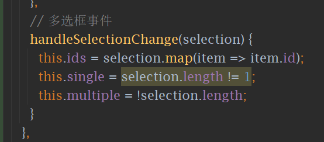

# 15. 部门开发

## 15.1 部门列表

由于部门可能会存在嵌套的情况，上级部门下有其他下级部门，因此需要在`utils`下添加`common.js`方法，用来描述这种树形结构。

```js
/**
 * 通用的方法
 *
 * @author xiaoRui
 */
export default {
    // 展开树形数据方法
    handleTree(data, id, parentId, children) {
        let config = {
            id: id || 'id',
            parentId: parentId || 'parentId',
            childrenList: children || 'children'
        };
        const childrenListMap = {};
        const nodeIds = {};
        const tree = [];
        for (let d of data) {
            let parentId = d[config.parentId];
            if (childrenListMap[parentId] == null) {
                childrenListMap[parentId] = [];
            }
            nodeIds[d[config.id]] = d;
            childrenListMap[parentId].push(d);
        }
        for (let d of data) {
            let parentId = d[config.parentId];
            if (nodeIds[parentId] == null) {
                tree.push(d);
            }
        }
        for (let t of tree) {
            adaptToChildrenList(t);
        }
        function adaptToChildrenList(o) {
            if (childrenListMap[o[config.id]] !== null) {
                o[config.childrenList] = childrenListMap[o[config.id]];
            }
            if (o[config.childrenList]) {
                for (let c of o[config.childrenList]) {
                    adaptToChildrenList(c);
                }
            }
        }
        return tree;
    }
}
```

然后在`main.js`中进行引用。

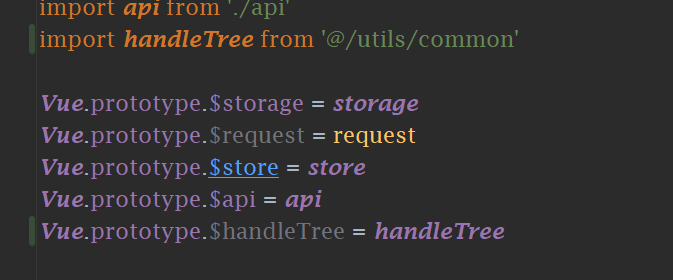

接下来在api中添加前后端连接的接口。

```js
/*
后端api接口管理
 */

import request from '@/utils/request'

export default {
    // 验证码接口
    captcha() {
        return request ({
            url: '/captcha',
            method: 'get'
        })
    },
    // 登录接口
    login(params) {
        return request({
            url: '/login',
            method: 'post',
            data: params
        })
    },
    // post岗位
    queryPostList(params) {
        return request({
            url: '/post/list',
            method: 'get',
            data: params
        })
    },
    // 批量删除岗位
    batchDeleteSysPost(ids) {
        const data = {
            ids
        }
        return request({
            url: '/post/batch/delete',
            method: 'delete',
            data: data
        })
    },
    // 根据id删除岗位
    deleteSysPost(id) {
        const data = {
            id
        }
        return request({
            url: '/post/delete',
            method: 'delete',
            data: data
        })
    },
    // 获取岗位列表
    querySysPostVOList() {
        return request({
            url: '/post/vo/list',
            method: 'get'
        })
    },
    // 添加岗位
    addPost(data) {
        return request({
            url: '/post/add',
            method: 'post',
            data: data
        })
    },
    // 根据id获取岗位信息
    postInfo(id) {
        const data = {
            id
        }
        return request({
            url: '/post/info',
            method: 'get',
            data: data
        })
    },
    // 更新岗位
    updatePost(data) {
        return request({
            url: '/post/update',
            method: 'put',
            data: data
        })
    },
    // 更新岗位状态
    updatePostStatus(id, postStatus) {
        const data = {
            id,
            postStatus
        }
        return request({
            url: '/post/updateStatus',
            method: 'put',
            data: data
        })
    },
    // dept部门
    queryDeptList(params) {
        return request({
            url: "/dept/list",
            method: 'get',
            data: params
        })
    },
    querySysDeptVoList() {
        return request({
            url: '/dept/vo/list',
            method: 'get'
        })
    },
    addDept(data) {
        return request({
            url: '/dept/add',
            method: 'post',
            data: data
        })
    },
    deleteDept(id) {
        const data = {
            id
        }
        return request({
            url: '/dept/delete',
            method: 'delete',
            data: data
        })
    },
    deptInfo(id) {
        const data = {
            id
        }
        return request({
            url: '/dept/info',
            method: 'get',
            data: data
        })
    },
    deptUpdate(data) {
        return request({
            url: '/dept/update',
            method: 'put',
            data: data
        })
    },
}
```

然后在`Dept.vue`中准备搜索栏。

```vue
<script>
  export default {
    data() {
      return {
        deptStatusList: [{
          value: '2',
          label: '停用'
        },
          {
            value: '1',
            label: '正常'
          }],
        queryParams:{},

      }
    }
  }
</script>

<template>
  <el-card>
<!--    搜索区域-->
    <el-form :inline="true" :model="queryParams">
      <el-form-item label="部门名称">
        <el-input placeholder="请输入部门名称" clearable size="mini" v-model="queryParams.deptName"/>
      </el-form-item>
      <el-form-item label="部门状态">
        <el-select size="mini" placeholder="请选择部门状态" v-model="queryParams.deptStatus">
          <el-option v-for="item in deptStatusList" :key="item.value" :label="item.label" :value="item.value">
          </el-option>

        </el-select>
      </el-form-item>
      <el-form-item>
        <el-button type="primary" icon="el-icon-search" size="mini">搜索</el-button>
        <el-button type="primary" icon="el-icon-refresh" size="mini">重置</el-button>
      </el-form-item>
    </el-form>
  </el-card>
</template>

<style lang="less" scoped>

</style>
```

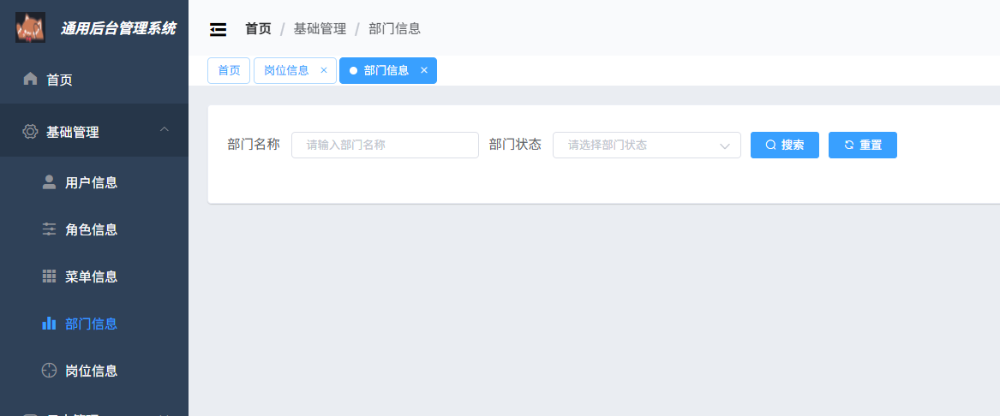

然后使用`vl-table`来实现列表功能。

```vue
<script>
  export default {
    data() {
      return {
        deptStatusList: [{
          value: '2',
          label: '停用'
        },
          {
            value: '1',
            label: '正常'
          }],
        queryParams:{},
        loading: true,
        deptList: [

        ],
        refreshTable: true,
        isExpandAll: true,

      }
    },
    methods: {
      // 获取列表
      async getList() {
        this.loading = true
        const {data : res} = await this.$api.queryDeptList(this.queryParams)
        if (res.code !== 200) {
          this.$message.error(res.$message)
        } else {
          this.deptList = this.$handleTree.handleTree(res.data, "id")
          this.loading = false
        }
      },
      // 搜索
      handleQuery() {
        this.getList()
      },
      // 重置搜索
      resetQuery() {
        this.queryParams = {}
        this.getList()
        this.$message.success("重置成功")
      },
      // 展开折叠
      toggleExpandALL() {
        this.refreshTable = false
        this.isExpandAll = !this.isExpandAll
        this.$nextTick(() => {
          this.refreshTable = true
        })
      }
    },
    created() {
      this.getList()
    }
  }
</script>

<template>
  <el-card>
<!--    搜索区域-->
    <el-form :inline="true" :model="queryParams">
      <el-form-item label="部门名称">
        <el-input placeholder="请输入部门名称" clearable size="mini" v-model="queryParams.deptName" @keyup.enter.native="handleQuery"/>
      </el-form-item>
      <el-form-item label="部门状态">
        <el-select size="mini" placeholder="请选择部门状态" v-model="queryParams.deptStatus">
          <el-option v-for="item in deptStatusList" :key="item.value" :label="item.label" :value="item.value">
          </el-option>

        </el-select>
      </el-form-item>
      <el-form-item>
        <el-button type="primary" icon="el-icon-search" size="mini" @click="handleQuery">搜索</el-button>
        <el-button type="primary" icon="el-icon-refresh" size="mini" @click="resetQuery">重置</el-button>
      </el-form-item>
    </el-form>
<!--    操作按钮-->
    <el-row :gutter="10" class="mb8">
      <el-col :span="1.5">
        <el-button plain type="primary" icon="el-icon-plus">新增</el-button>
      </el-col>
      <el-col :span="1.5">
        <el-button plain type="info" icon="el-icon-sort" @click="toggleExpandALL">展开/折叠</el-button>
      </el-col>
    </el-row>
<!--    列表-->
    <el-table border stripe :header-cell-style="{background: '#eef1f6', color: '#606266'}" v-if="refreshTable"
              v-loading="loading" :data="deptList" row-key="id" :default-expand-all="isExpandAll" :tree-props="{children: 'children'}">
      <el-table-column label="部门名称" prop="deptName"/>
      <el-table-column label="部门类型" prop="deptType">
        <template slot-scope="scope">
          <el-tag v-if="scope.row.deptType === 1">公司</el-tag>
          <el-tag v-if="scope.row.deptType === 2" type="success">中心</el-tag>
          <el-tag v-if="scope.row.deptType === 3" type="danger">部门</el-tag>
        </template>
      </el-table-column>
      <el-table-column label="部门状态" prop="deptStatus">
        <template slot-scope="scope">
          <el-tag v-if="scope.row.deptStatus === 1" type="success">正常</el-tag>
          <el-tag v-if="scope.row.deptStatus === 2" type="danger">停用</el-tag>
        </template>
      </el-table-column>
      <el-table-column label="创建时间" prop="createTime"/>
      <el-table-column label="更多操作" class-name="small-padding fixed-width">
        <template slot-scope="scope">
          <el-button size="mini" type="text" icon="el-icon-edit">
            修改
          </el-button>
          <el-button size="mini" type="text" icon="el-icon-delete">
            删除
          </el-button>
        </template>
      </el-table-column>
    </el-table>
  </el-card>
</template>

<style lang="less" scoped>

</style>
```

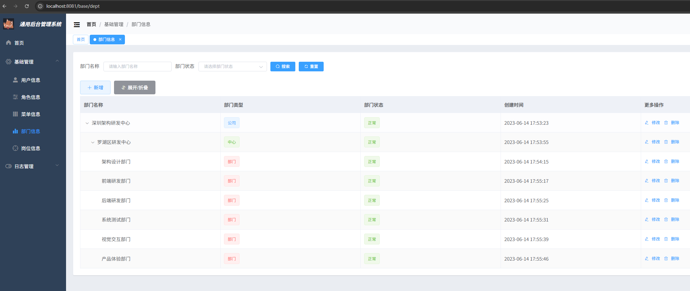

## 15.2 新增部门

在新增按钮上添加时间，根据handleTree来添加这里的部门。

```vue
<script>
import Treeselect from '@riophae/vue-treeselect'
import '@riophae/vue-treeselect/dist/vue-treeselect.css'
  export default {
  components: {
    Treeselect
  },
    data() {
      return {
        deptStatusList: [{
          value: '2',
          label: '停用'
        },
          {
            value: '1',
            label: '正常'
          }],
        queryParams:{},
        loading: true,
        deptList: [

        ],
        refreshTable: true,
        isExpandAll: true,
        optionsDeptList: [],
        addDeptDialogVisible: false,
        addDeptFormRules: {
          deptType: [{required: true, message: "请选择部门类型", trigger: "blur"}],
          deptName: [{required: true, message: "请输入部门名称", trigger: "blur"}]
        },
        addDeptForm: {
          deptStatus: 1
        }
      }
    },
    methods: {
      // 获取列表
      async getList() {
        this.loading = true
        const {data : res} = await this.$api.queryDeptList(this.queryParams)
        if (res.code !== 200) {
          this.$message.error(res.$message)
        } else {
          this.deptList = this.$handleTree.handleTree(res.data, "id")
          this.loading = false
        }
      },
      // 搜索
      handleQuery() {
        this.getList()
      },
      // 重置搜索
      resetQuery() {
        this.queryParams = {}
        this.getList()
        this.$message.success("重置成功")
      },
      // 展开折叠
      toggleExpandALL() {
        this.refreshTable = false
        this.isExpandAll = !this.isExpandAll
        this.$nextTick(() => {
          this.refreshTable = true
        })
      },
      // 部门下拉列表
      async getDeptVoList() {
        const {data : res} = await this.$api.querySysDeptVoList()
        // console.log(res)
        if (res.code !== 200) {
          this.$message.error(res.$message)
        } else {
          this.optionsDeptList = this.$handleTree.handleTree(res.data, "id")
        }
      },
      // 监听新增部门对话框
      addDeptDialogClosed() {
        this.$refs.addDeptFormRefForm.resetFields()
      },
      // 新增部门
      addDept() {
        this.$refs.addDeptFormRefForm.validate(async valid => {
          if (!valid) return
          const {data: res} = await this.$api.addDept(this.addDeptForm);
          if (res.code !== 200) {
            this.$message.error(res.$message)
          } else {
            this.$message.success('新增部门成功')
            this.addDeptDialogVisible = false
            await this.getList()
            await this.getDeptVoList()
          }
        })
      }
    },
    created() {
      this.getList()
      this.getDeptVoList()
    }
  }
</script>

<template>
  <el-card>
<!--    搜索区域-->
    <el-form :inline="true" :model="queryParams">
      <el-form-item label="部门名称">
        <el-input placeholder="请输入部门名称" clearable size="mini" v-model="queryParams.deptName" @keyup.enter.native="handleQuery"/>
      </el-form-item>
      <el-form-item label="部门状态">
        <el-select size="mini" placeholder="请选择部门状态" v-model="queryParams.deptStatus">
          <el-option v-for="item in deptStatusList" :key="item.value" :label="item.label" :value="item.value">
          </el-option>

        </el-select>
      </el-form-item>
      <el-form-item>
        <el-button type="primary" icon="el-icon-search" size="mini" @click="handleQuery">搜索</el-button>
        <el-button type="primary" icon="el-icon-refresh" size="mini" @click="resetQuery">重置</el-button>
      </el-form-item>
    </el-form>
<!--    操作按钮-->
    <el-row :gutter="10" class="mb8">
      <el-col :span="1.5">
        <el-button plain type="primary" icon="el-icon-plus" @click="addDeptDialogVisible = true">新增</el-button>
      </el-col>
      <el-col :span="1.5">
        <el-button plain type="info" icon="el-icon-sort" @click="toggleExpandALL">展开/折叠</el-button>
      </el-col>
    </el-row>
<!--    列表-->
    <el-table border stripe :header-cell-style="{background: '#eef1f6', color: '#606266'}" v-if="refreshTable"
              v-loading="loading" :data="deptList" row-key="id" :default-expand-all="isExpandAll" :tree-props="{children: 'children'}">
      <el-table-column label="部门名称" prop="deptName"/>
      <el-table-column label="部门类型" prop="deptType">
        <template slot-scope="scope">
          <el-tag v-if="scope.row.deptType === 1">公司</el-tag>
          <el-tag v-if="scope.row.deptType === 2" type="success">中心</el-tag>
          <el-tag v-if="scope.row.deptType === 3" type="danger">部门</el-tag>
        </template>
      </el-table-column>
      <el-table-column label="部门状态" prop="deptStatus">
        <template slot-scope="scope">
          <el-tag v-if="scope.row.deptStatus === 1" type="success">正常</el-tag>
          <el-tag v-if="scope.row.deptStatus === 2" type="danger">停用</el-tag>
        </template>
      </el-table-column>
      <el-table-column label="创建时间" prop="createTime"/>
      <el-table-column label="更多操作" class-name="small-padding fixed-width">
        <template slot-scope="scope">
          <el-button size="mini" type="text" icon="el-icon-edit">
            修改
          </el-button>
          <el-button size="mini" type="text" icon="el-icon-delete">
            删除
          </el-button>
        </template>
      </el-table-column>
    </el-table>

    <!--新增部门-->
    <el-dialog title="新增部门" :visible.sync="addDeptDialogVisible" width="30%" @close="addDeptDialogClosed">
      <el-form :model="addDeptForm" :rules="addDeptFormRules" ref="addDeptFormRefForm" label-width="80px">
        <el-form-item label="部门类型" prop="deptType">
          <el-radio-group v-model="addDeptForm.deptType">
            <el-radio :label="1">公司</el-radio>
            <el-radio :label="2">中心</el-radio>
            <el-radio :label="3">部门</el-radio>
          </el-radio-group>
        </el-form-item>
        <el-form-item size="mini" label="上级部门" prop="parentId" v-if="addDeptForm.deptType != 1">
          <treeselect :options="optionsDeptList" placeholder="请选择上级部门" v-model="addDeptForm.parentId" />
        </el-form-item>
        <el-form-item label="部门名称" prop="deptName">
          <el-input v-model="addDeptForm.deptName"></el-input>
        </el-form-item>
        <el-form-item label="部门状态" prop="deptStatus">
          <el-radio-group v-model="addDeptForm.deptStatus">
            <el-radio :label="1">正常</el-radio>
            <el-radio :label="2">停用</el-radio>
          </el-radio-group>
        </el-form-item>
      </el-form>
      <span slot="footer" class="dialog-footer">
              <el-button type="primary" @click="addDept">确 定</el-button>
              <el-button type="primary" @click="addDeptDialogVisible = false">取 消</el-button>
          </span>
    </el-dialog>


  </el-card>
</template>

<style lang="less" scoped>

</style>
```

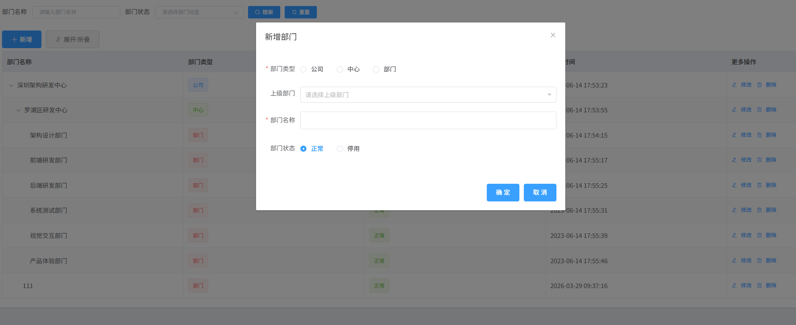

## 15.3 修改部门

要求点击修改按钮时，能够先查询展示当前的信息，然后进行修改。需要做到点击修改按钮时能够展示对话框，同时收集这个窗口的信息，并通过`this.$api.updateDept`来访问后端修改信息。

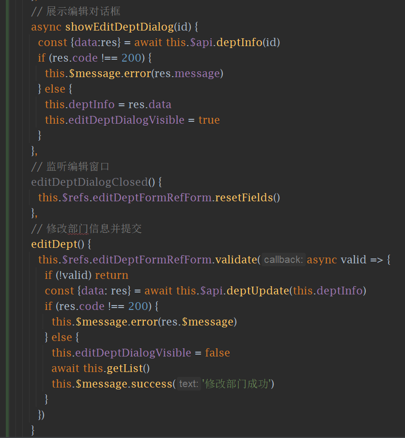

```vue
<script>
import Treeselect from '@riophae/vue-treeselect'
import '@riophae/vue-treeselect/dist/vue-treeselect.css'
  export default {
  components: {
    Treeselect
  },
    data() {
      return {
        deptStatusList: [{
          value: '2',
          label: '停用'
        },
          {
            value: '1',
            label: '正常'
          }],
        queryParams:{},
        loading: true,
        deptList: [

        ],
        refreshTable: true,
        isExpandAll: true,
        optionsDeptList: [],
        addDeptDialogVisible: false,
        addDeptFormRules: {
          deptType: [{required: true, message: "请选择部门类型", trigger: "blur"}],
          deptName: [{required: true, message: "请输入部门名称", trigger: "blur"}]
        },
        addDeptForm: {
          deptStatus: 1
        },
        editDeptDialogVisible: false,
        deptInfo: {},
        editDeptFormRules: {
          deptType: [{required: true, message: "请选择部门类型", trigger: 'blur'}],
          deptName: [{required: true, message: "请输入部门名称", trigger: 'blur'}]
        }
      }
    },
    methods: {
      // 获取列表
      async getList() {
        this.loading = true
        const {data : res} = await this.$api.queryDeptList(this.queryParams)
        if (res.code !== 200) {
          this.$message.error(res.$message)
        } else {
          this.deptList = this.$handleTree.handleTree(res.data, "id")
          this.loading = false
        }
      },
      // 搜索
      handleQuery() {
        this.getList()
      },
      // 重置搜索
      resetQuery() {
        this.queryParams = {}
        this.getList()
        this.$message.success("重置成功")
      },
      // 展开折叠
      toggleExpandALL() {
        this.refreshTable = false
        this.isExpandAll = !this.isExpandAll
        this.$nextTick(() => {
          this.refreshTable = true
        })
      },
      // 部门下拉列表
      async getDeptVoList() {
        const {data : res} = await this.$api.querySysDeptVoList()
        // console.log(res)
        if (res.code !== 200) {
          this.$message.error(res.$message)
        } else {
          this.optionsDeptList = this.$handleTree.handleTree(res.data, "id")
        }
      },
      // 监听新增部门对话框
      addDeptDialogClosed() {
        this.$refs.addDeptFormRefForm.resetFields()
      },
      // 新增部门
      addDept() {
        this.$refs.addDeptFormRefForm.validate(async valid => {
          if (!valid) return
          const {data: res} = await this.$api.addDept(this.addDeptForm);
          if (res.code !== 200) {
            this.$message.error(res.$message)
          } else {
            this.$message.success('新增部门成功')
            this.addDeptDialogVisible = false
            await this.getList()
            await this.getDeptVoList()
          }
        })
      },
      // 展示编辑对话框
      async showEditDeptDialog(id) {
        const {data:res} = await this.$api.deptInfo(id)
        if (res.code !== 200) {
          this.$message.error(res.message)
        } else {
          this.deptInfo = res.data
          this.editDeptDialogVisible = true
        }
      },
      // 监听编辑窗口
      editDeptDialogClosed() {
        this.$refs.editDeptFormRefForm.resetFields()
      },
      // 修改部门信息并提交
      editDept() {
        this.$refs.editDeptFormRefForm.validate(async valid => {
          if (!valid) return
          const {data: res} = await this.$api.deptUpdate(this.deptInfo)
          if (res.code !== 200) {
            this.$message.error(res.$message)
          } else {
            this.editDeptDialogVisible = false
            await this.getList()
            this.$message.success('修改部门成功')
          }
        })
      }
    },
    created() {
      this.getList()
      this.getDeptVoList()
    }
  }
</script>

<template>
  <el-card>
<!--    搜索区域-->
    <el-form :inline="true" :model="queryParams">
      <el-form-item label="部门名称">
        <el-input placeholder="请输入部门名称" clearable size="mini" v-model="queryParams.deptName" @keyup.enter.native="handleQuery"/>
      </el-form-item>
      <el-form-item label="部门状态">
        <el-select size="mini" placeholder="请选择部门状态" v-model="queryParams.deptStatus">
          <el-option v-for="item in deptStatusList" :key="item.value" :label="item.label" :value="item.value">
          </el-option>

        </el-select>
      </el-form-item>
      <el-form-item>
        <el-button type="primary" icon="el-icon-search" size="mini" @click="handleQuery">搜索</el-button>
        <el-button type="primary" icon="el-icon-refresh" size="mini" @click="resetQuery">重置</el-button>
      </el-form-item>
    </el-form>
<!--    操作按钮-->
    <el-row :gutter="10" class="mb8">
      <el-col :span="1.5">
        <el-button plain type="primary" icon="el-icon-plus" @click="addDeptDialogVisible = true">新增</el-button>
      </el-col>
      <el-col :span="1.5">
        <el-button plain type="info" icon="el-icon-sort" @click="toggleExpandALL">展开/折叠</el-button>
      </el-col>
    </el-row>
<!--    列表-->
    <el-table border stripe :header-cell-style="{background: '#eef1f6', color: '#606266'}" v-if="refreshTable"
              v-loading="loading" :data="deptList" row-key="id" :default-expand-all="isExpandAll" :tree-props="{children: 'children'}">
      <el-table-column label="部门名称" prop="deptName"/>
      <el-table-column label="部门类型" prop="deptType">
        <template slot-scope="scope">
          <el-tag v-if="scope.row.deptType === 1">公司</el-tag>
          <el-tag v-if="scope.row.deptType === 2" type="success">中心</el-tag>
          <el-tag v-if="scope.row.deptType === 3" type="danger">部门</el-tag>
        </template>
      </el-table-column>
      <el-table-column label="部门状态" prop="deptStatus">
        <template slot-scope="scope">
          <el-tag v-if="scope.row.deptStatus === 1" type="success">正常</el-tag>
          <el-tag v-if="scope.row.deptStatus === 2" type="danger">停用</el-tag>
        </template>
      </el-table-column>
      <el-table-column label="创建时间" prop="createTime"/>
      <el-table-column label="更多操作" class-name="small-padding fixed-width">
        <template slot-scope="scope">
          <el-button size="mini" type="text" icon="el-icon-edit" @click="showEditDeptDialog(scope.row.id)">
            修改
          </el-button>
          <el-button size="mini" type="text" icon="el-icon-delete">
            删除
          </el-button>
        </template>
      </el-table-column>
    </el-table>

    <!--新增部门-->
    <el-dialog title="新增部门" :visible.sync="addDeptDialogVisible" width="30%" @close="addDeptDialogClosed">
      <el-form :model="addDeptForm" :rules="addDeptFormRules" ref="addDeptFormRefForm" label-width="80px">
        <el-form-item label="部门类型" prop="deptType">
          <el-radio-group v-model="addDeptForm.deptType">
            <el-radio :label="1">公司</el-radio>
            <el-radio :label="2">中心</el-radio>
            <el-radio :label="3">部门</el-radio>
          </el-radio-group>
        </el-form-item>
        <el-form-item size="mini" label="上级部门" prop="parentId" v-if="addDeptForm.deptType != 1">
          <treeselect :options="optionsDeptList" placeholder="请选择上级部门" v-model="addDeptForm.parentId" />
        </el-form-item>
        <el-form-item label="部门名称" prop="deptName">
          <el-input v-model="addDeptForm.deptName"></el-input>
        </el-form-item>
        <el-form-item label="部门状态" prop="deptStatus">
          <el-radio-group v-model="addDeptForm.deptStatus">
            <el-radio :label="1">正常</el-radio>
            <el-radio :label="2">停用</el-radio>
          </el-radio-group>
        </el-form-item>
      </el-form>
      <span slot="footer" class="dialog-footer">
              <el-button type="primary" @click="addDept">确 定</el-button>
              <el-button type="primary" @click="addDeptDialogVisible = false">取 消</el-button>
          </span>
    </el-dialog>
    <!--修改部门-->
    <el-dialog title="编辑部门" :visible.sync="editDeptDialogVisible" width="30%">
      <el-form :model="deptInfo" :rules="editDeptFormRules" ref="editDeptFormRefForm" label-width="80px">
        <el-form-item label="部门类型" prop="deptType">
          <el-radio-group v-model="deptInfo.deptType">
            <el-radio :label="1">公司</el-radio>
            <el-radio :label="2">中心</el-radio>
            <el-radio :label="3">部门</el-radio>
          </el-radio-group>
        </el-form-item>
        <el-form-item size="mini" label="上级部门" prop="parentId" v-if="deptInfo.deptType != 1">
          <treeselect :options="optionsDeptList" placeholder="请选择上级部门" v-model="deptInfo.parentId" />
        </el-form-item>
        <el-form-item label="部门名称" prop="deptName">
          <el-input v-model="deptInfo.deptName"></el-input>
        </el-form-item>
        <el-form-item label="部门状态" prop="deptStatus">
          <el-radio-group v-model="deptInfo.deptStatus">
            <el-radio :label="1">正常</el-radio>
            <el-radio :label="2">停用</el-radio>
          </el-radio-group>
        </el-form-item>
      </el-form>
      <span slot="footer" class="dialog-footer">
                <el-button type="primary" @click="editDept">确 定</el-button>
                <el-button type="primary" @click="editDeptDialogVisible = false">取 消</el-button>
            </span>
    </el-dialog>

  </el-card>
</template>

<style lang="less" scoped>

</style>
```

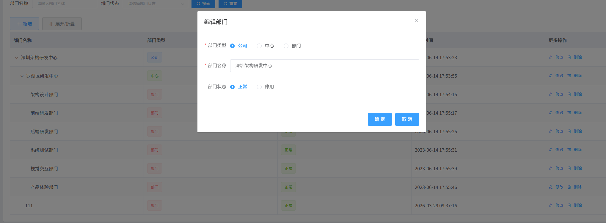

## 15.4 删除部门

这里需要点击列表中的删除来删除部门。也是在删除按钮上绑定点击事件即可。

```vue
<script>
import Treeselect from '@riophae/vue-treeselect'
import '@riophae/vue-treeselect/dist/vue-treeselect.css'
  export default {
  components: {
    Treeselect
  },
    data() {
      return {
        deptStatusList: [{
          value: '2',
          label: '停用'
        },
          {
            value: '1',
            label: '正常'
          }],
        queryParams:{},
        loading: true,
        deptList: [

        ],
        refreshTable: true,
        isExpandAll: true,
        optionsDeptList: [],
        addDeptDialogVisible: false,
        addDeptFormRules: {
          deptType: [{required: true, message: "请选择部门类型", trigger: "blur"}],
          deptName: [{required: true, message: "请输入部门名称", trigger: "blur"}]
        },
        addDeptForm: {
          deptStatus: 1
        },
        editDeptDialogVisible: false,
        deptInfo: {},
        editDeptFormRules: {
          deptType: [{required: true, message: "请选择部门类型", trigger: 'blur'}],
          deptName: [{required: true, message: "请输入部门名称", trigger: 'blur'}]
        }
      }
    },
    methods: {
      // 获取列表
      async getList() {
        this.loading = true
        const {data : res} = await this.$api.queryDeptList(this.queryParams)
        if (res.code !== 200) {
          this.$message.error(res.$message)
        } else {
          this.deptList = this.$handleTree.handleTree(res.data, "id")
          this.loading = false
        }
      },
      // 搜索
      handleQuery() {
        this.getList()
      },
      // 重置搜索
      resetQuery() {
        this.queryParams = {}
        this.getList()
        this.$message.success("重置成功")
      },
      // 展开折叠
      toggleExpandALL() {
        this.refreshTable = false
        this.isExpandAll = !this.isExpandAll
        this.$nextTick(() => {
          this.refreshTable = true
        })
      },
      // 部门下拉列表
      async getDeptVoList() {
        const {data : res} = await this.$api.querySysDeptVoList()
        // console.log(res)
        if (res.code !== 200) {
          this.$message.error(res.$message)
        } else {
          this.optionsDeptList = this.$handleTree.handleTree(res.data, "id")
        }
      },
      // 监听新增部门对话框
      addDeptDialogClosed() {
        this.$refs.addDeptFormRefForm.resetFields()
      },
      // 新增部门
      addDept() {
        this.$refs.addDeptFormRefForm.validate(async valid => {
          if (!valid) return
          const {data: res} = await this.$api.addDept(this.addDeptForm);
          if (res.code !== 200) {
            this.$message.error(res.$message)
          } else {
            this.$message.success('新增部门成功')
            this.addDeptDialogVisible = false
            await this.getList()
            await this.getDeptVoList()
          }
        })
      },
      // 展示编辑对话框
      async showEditDeptDialog(id) {
        const {data:res} = await this.$api.deptInfo(id)
        if (res.code !== 200) {
          this.$message.error(res.message)
        } else {
          this.deptInfo = res.data
          this.editDeptDialogVisible = true
        }
      },
      // 监听编辑窗口
      editDeptDialogClosed() {
        this.$refs.editDeptFormRefForm.resetFields()
      },
      // 修改部门信息并提交
      editDept() {
        this.$refs.editDeptFormRefForm.validate(async valid => {
          if (!valid) return
          const {data: res} = await this.$api.deptUpdate(this.deptInfo)
          if (res.code !== 200) {
            this.$message.error(res.$message)
          } else {
            this.editDeptDialogVisible = false
            await this.getList()
            this.$message.success('修改部门成功')
          }
        })
      },
      async handleDeptDelete(row) {
        const confirmResult = await this.$confirm('是否删除' + row.deptName + '部门？', '提示', {
          confirmButtonText: '确定',
          cancelButtonText: '取消',
          type: 'warning'
        }).catch(err => err)
        if (confirmResult !== 'confirm') {
          return this.$message.info('取消删除')
        }
        const {data: res} = await this.$api.deleteDept(row.id)
        if (res.code !== 200) {
          this.$message.error(res.message)
        } else {
          this.$message.success('删除成功')
          await this.getList()
        }
      }
    },
    created() {
      this.getList()
      this.getDeptVoList()
    }
  }
</script>

<template>
  <el-card>
<!--    搜索区域-->
    <el-form :inline="true" :model="queryParams">
      <el-form-item label="部门名称">
        <el-input placeholder="请输入部门名称" clearable size="mini" v-model="queryParams.deptName" @keyup.enter.native="handleQuery"/>
      </el-form-item>
      <el-form-item label="部门状态">
        <el-select size="mini" placeholder="请选择部门状态" v-model="queryParams.deptStatus">
          <el-option v-for="item in deptStatusList" :key="item.value" :label="item.label" :value="item.value">
          </el-option>

        </el-select>
      </el-form-item>
      <el-form-item>
        <el-button type="primary" icon="el-icon-search" size="mini" @click="handleQuery">搜索</el-button>
        <el-button type="primary" icon="el-icon-refresh" size="mini" @click="resetQuery">重置</el-button>
      </el-form-item>
    </el-form>
<!--    操作按钮-->
    <el-row :gutter="10" class="mb8">
      <el-col :span="1.5">
        <el-button plain type="primary" icon="el-icon-plus" @click="addDeptDialogVisible = true">新增</el-button>
      </el-col>
      <el-col :span="1.5">
        <el-button plain type="info" icon="el-icon-sort" @click="toggleExpandALL">展开/折叠</el-button>
      </el-col>
    </el-row>
<!--    列表-->
    <el-table border stripe :header-cell-style="{background: '#eef1f6', color: '#606266'}" v-if="refreshTable"
              v-loading="loading" :data="deptList" row-key="id" :default-expand-all="isExpandAll" :tree-props="{children: 'children'}">
      <el-table-column label="部门名称" prop="deptName"/>
      <el-table-column label="部门类型" prop="deptType">
        <template slot-scope="scope">
          <el-tag v-if="scope.row.deptType === 1">公司</el-tag>
          <el-tag v-if="scope.row.deptType === 2" type="success">中心</el-tag>
          <el-tag v-if="scope.row.deptType === 3" type="danger">部门</el-tag>
        </template>
      </el-table-column>
      <el-table-column label="部门状态" prop="deptStatus">
        <template slot-scope="scope">
          <el-tag v-if="scope.row.deptStatus === 1" type="success">正常</el-tag>
          <el-tag v-if="scope.row.deptStatus === 2" type="danger">停用</el-tag>
        </template>
      </el-table-column>
      <el-table-column label="创建时间" prop="createTime"/>
      <el-table-column label="更多操作" class-name="small-padding fixed-width">
        <template slot-scope="scope">
          <el-button size="mini" type="text" icon="el-icon-edit" @click="showEditDeptDialog(scope.row.id)">
            修改
          </el-button>
          <el-button size="mini" type="text" icon="el-icon-delete" @click="handleDeptDelete(scope.row)" :disabled="scope.row.deptType === '1'">
            删除
          </el-button>
        </template>
      </el-table-column>
    </el-table>

    <!--新增部门-->
    <el-dialog title="新增部门" :visible.sync="addDeptDialogVisible" width="30%" @close="addDeptDialogClosed">
      <el-form :model="addDeptForm" :rules="addDeptFormRules" ref="addDeptFormRefForm" label-width="80px">
        <el-form-item label="部门类型" prop="deptType">
          <el-radio-group v-model="addDeptForm.deptType">
            <el-radio :label="1">公司</el-radio>
            <el-radio :label="2">中心</el-radio>
            <el-radio :label="3">部门</el-radio>
          </el-radio-group>
        </el-form-item>
        <el-form-item size="mini" label="上级部门" prop="parentId" v-if="addDeptForm.deptType != 1">
          <treeselect :options="optionsDeptList" placeholder="请选择上级部门" v-model="addDeptForm.parentId" />
        </el-form-item>
        <el-form-item label="部门名称" prop="deptName">
          <el-input v-model="addDeptForm.deptName"></el-input>
        </el-form-item>
        <el-form-item label="部门状态" prop="deptStatus">
          <el-radio-group v-model="addDeptForm.deptStatus">
            <el-radio :label="1">正常</el-radio>
            <el-radio :label="2">停用</el-radio>
          </el-radio-group>
        </el-form-item>
      </el-form>
      <span slot="footer" class="dialog-footer">
              <el-button type="primary" @click="addDept">确 定</el-button>
              <el-button type="primary" @click="addDeptDialogVisible = false">取 消</el-button>
          </span>
    </el-dialog>
    <!--修改部门-->
    <el-dialog title="编辑部门" :visible.sync="editDeptDialogVisible" width="30%">
      <el-form :model="deptInfo" :rules="editDeptFormRules" ref="editDeptFormRefForm" label-width="80px">
        <el-form-item label="部门类型" prop="deptType">
          <el-radio-group v-model="deptInfo.deptType">
            <el-radio :label="1">公司</el-radio>
            <el-radio :label="2">中心</el-radio>
            <el-radio :label="3">部门</el-radio>
          </el-radio-group>
        </el-form-item>
        <el-form-item size="mini" label="上级部门" prop="parentId" v-if="deptInfo.deptType != 1">
          <treeselect :options="optionsDeptList" placeholder="请选择上级部门" v-model="deptInfo.parentId" />
        </el-form-item>
        <el-form-item label="部门名称" prop="deptName">
          <el-input v-model="deptInfo.deptName"></el-input>
        </el-form-item>
        <el-form-item label="部门状态" prop="deptStatus">
          <el-radio-group v-model="deptInfo.deptStatus">
            <el-radio :label="1">正常</el-radio>
            <el-radio :label="2">停用</el-radio>
          </el-radio-group>
        </el-form-item>
      </el-form>
      <span slot="footer" class="dialog-footer">
                <el-button type="primary" @click="editDept">确 定</el-button>
                <el-button type="primary" @click="editDeptDialogVisible = false">取 消</el-button>
            </span>
    </el-dialog>

  </el-card>
</template>

<style lang="less" scoped>

</style>
```

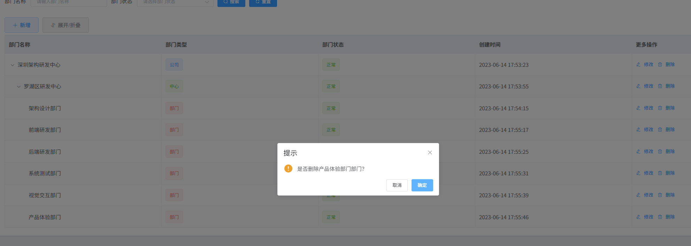

# 16. 菜单开发

菜单用于管理左侧菜单栏的信息，以及编辑菜单栏的功能。例如在部门信息中能够添加新的功能，如添加两位用户，或者删除修改部门的功能等，也能启用停用其他功能。

## 16.1 菜单列表

首先需要实现api的`index.js`，实现前后端连接的接口。

```js
/*
后端api接口管理
 */

import request from '@/utils/request'

export default {
    // 验证码接口
    captcha() {
        return request ({
            url: '/captcha',
            method: 'get'
        })
    },
    // 登录接口
    login(params) {
        return request({
            url: '/login',
            method: 'post',
            data: params
        })
    },
    // post岗位
    queryPostList(params) {
        return request({
            url: '/post/list',
            method: 'get',
            data: params
        })
    },
    // 批量删除岗位
    batchDeleteSysPost(ids) {
        const data = {
            ids
        }
        return request({
            url: '/post/batch/delete',
            method: 'delete',
            data: data
        })
    },
    // 根据id删除岗位
    deleteSysPost(id) {
        const data = {
            id
        }
        return request({
            url: '/post/delete',
            method: 'delete',
            data: data
        })
    },
    // 获取岗位列表
    querySysPostVOList() {
        return request({
            url: '/post/vo/list',
            method: 'get'
        })
    },
    // 添加岗位
    addPost(data) {
        return request({
            url: '/post/add',
            method: 'post',
            data: data
        })
    },
    // 根据id获取岗位信息
    postInfo(id) {
        const data = {
            id
        }
        return request({
            url: '/post/info',
            method: 'get',
            data: data
        })
    },
    // 更新岗位
    updatePost(data) {
        return request({
            url: '/post/update',
            method: 'put',
            data: data
        })
    },
    // 更新岗位状态
    updatePostStatus(id, postStatus) {
        const data = {
            id,
            postStatus
        }
        return request({
            url: '/post/updateStatus',
            method: 'put',
            data: data
        })
    },
    // dept部门
    queryDeptList(params) {
        return request({
            url: "/dept/list",
            method: 'get',
            data: params
        })
    },
    querySysDeptVoList() {
        return request({
            url: '/dept/vo/list',
            method: 'get'
        })
    },
    addDept(data) {
        return request({
            url: '/dept/add',
            method: 'post',
            data: data
        })
    },
    deleteDept(id) {
        const data = {
            id
        }
        return request({
            url: '/dept/delete',
            method: 'delete',
            data: data
        })
    },
    deptInfo(id) {
        const data = {
            id
        }
        return request({
            url: '/dept/info',
            method: 'get',
            data: data
        })
    },
    deptUpdate(data) {
        return request({
            url: '/dept/update',
            method: 'put',
            data: data
        })
    },
    // menu菜单
    queryMenuList(params) {
        return request({
            url: "/menu/list",
            method: 'get',
            data: params
        })
    },
    querySysMenuVoList() {
        return request({
            url: "/menu/vo/list",
            method: 'get'
        })
    },
    addMenu(data) {
        return request({
            url: '/menu/add',
            method: 'post',
            data: data
        })
    },
    menuInfo(id) {
        const data = {
            id
        }
        return request({
            url: '/menu/info',
            method: 'get',
            data: data
        })
    },
    menuUpdate(data) {
        return request({
            url: '/menu/update',
            method: 'put',
            data: data
        })
    },
    menuDelete(id) {
        const data = {
            id
        }
        return request({
            url: '/menu/delete',
            method: 'delete',
            data: data
        })
    },
}
```

然后开发菜单页面。

```vue
<script>
import Treeselect from "@riophae/vue-treeselect";
import "@riophae/vue-treeselect/dist/vue-treeselect.css";
  export default {
    components: {
      Treeselect
    },
    data() {
      return {
        queryParams: {},
        menuStatusList: [{
          value: '2',
          label: '启用'
        },
          {
            value: '1',
            label: '停用'
          }],
        loading: true,
        menuList: [],
        isExpandAll: false,
        refreshTable: true,
      }
    },
    methods: {
      // 获取列表
      async getMenuList() {
        this.loading = true;
        const {data: res} = await this.$api.queryMenuList(this.queryParams)
        if (res.code !== 200) {
          this.$message.error(res.message);
        } else {
          this.menuList = this.$handleTree.handleTree(res.data, "id");
          this.loading = false;
        }
      },
      // 搜索
      handleQuery() {
        this.getMenuList();
      },
      // 重置
      resetQuery() {
        this.queryParams = {};
        this.getMenuList();
        this.$message.success("重置成功")
      },
      // 展开折叠
      toggleExpandAll() {
        this.refreshTable = false
        this.isExpandAll = !this.isExpandAll
        this.$nextTick(() => {
          this.refreshTable = true
        })
      },
    },
    created() {
      this.getMenuList()
    }
  }
</script>

<template>
  <el-card>
    <el-form :inline="true" :model="queryParams">
      <el-form-item prop="menuName" label="菜单名称">
        <el-input placeholder="请输入菜单名称" clearable size="mini" @keyup.enter.native="handleQuery" v-model="queryParams.MenuName"/>
      </el-form-item>
      <el-form-item prop="menuStatus" label="菜单状态">
        <el-select size="mini" placeholder="请选择菜单状态" v-model="queryParams.MenuStatus">
          <el-option v-for="item in menuStatusList" :key="item.value" :label="item.label" :value="item.value">
          </el-option>
        </el-select>
      </el-form-item>
      <el-form-item>
        <el-button type="primary" icon="el-icon-search" size="mini" @click="handleQuery">搜索</el-button>
        <el-button type="primary" icon="el-icon-refresh" size="mini" @click="resetQuery">重置</el-button>
      </el-form-item>
    </el-form>
    <el-row :gutter="10" class="mb8">
      <el-col :span="1.5">
        <el-button type="primary" plain icon="el-icon-plus" size="mini">
          新增
        </el-button>
        <el-button type="info" plain icon="el-icon-sort" size="mini" @click="toggleExpandAll">
          展开/折叠
        </el-button>
      </el-col>
    </el-row>
    <el-table border stripe :header-cell-style="{ background: '#eef1f6', color: '#606266' }" v-if="refreshTable"
              v-loading="loading" :data="menuList" row-key="id" :default-expand-all="isExpandAll"
              :tree-props="{ children: 'children' }">
      <el-table-column prop="menuName" label="菜单名称" />
      <el-table-column prop="icon" label="图标">
        <template slot-scope="scope">
          <i :class="scope.row.icon" />
        </template>
      </el-table-column>
      <el-table-column prop="sort" label="排序" />
      <el-table-column prop="value" label="权限标识" />
      <el-table-column prop="url" label="组件路径" />
      <el-table-column prop="menuType" label="菜单类型">
        <template slot-scope="scope">
          <el-tag v-if="scope.row.MenuType === 1">目录</el-tag>
          <el-tag v-else-if="scope.row.MenuType === 2" type="success">菜单</el-tag>
          <el-tag v-else-if="scope.row.MenuType === 3" type="danger">按钮</el-tag>
        </template>
      </el-table-column>
      <el-table-column prop="menuStatus" label="状态">
        <template slot-scope="scope">
          <el-tag v-if="scope.row.MenuStatus === 2" type="success">启用</el-tag>
          <el-tag v-else-if="scope.row.MenuStatus === 1" type="danger">禁用</el-tag>
        </template>
      </el-table-column>
      <el-table-column label="创建时间" prop="createTime" />
      <el-table-column label="更多操作" class-name="small-padding fixed-width">
        <template slot-scope="scope">
          <el-button size="mini" type="text" icon="el-icon-edit" @click="showEditMenuDialog(scope.row.id)" v-authority="['base:menu:edit']">修改
          </el-button>
          <el-button size="mini" type="text" icon="el-icon-delete" @click="handleMenuDelete(scope.row)" v-authority="['base:admin:delete']">删除
          </el-button>
        </template>
      </el-table-column>
    </el-table>
  </el-card>
</template>

<style lang="less" scoped>

</style>
```

## 16.2 新增菜单

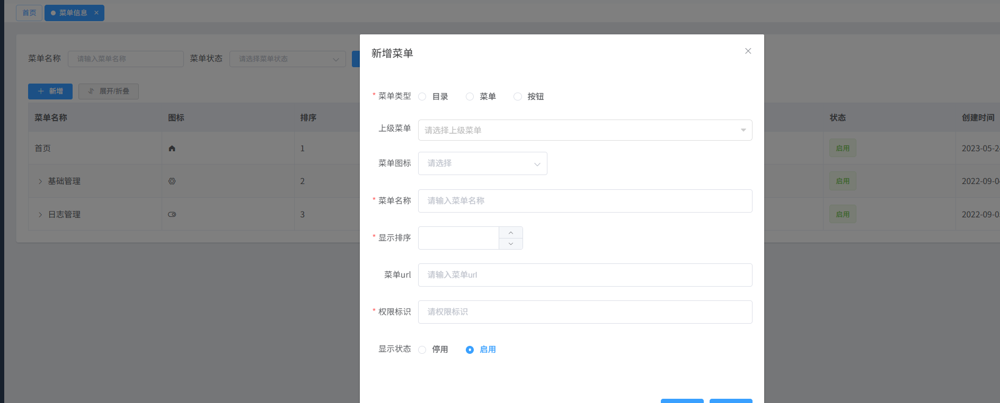

```vue
<script>
import Treeselect from "@riophae/vue-treeselect";
import "@riophae/vue-treeselect/dist/vue-treeselect.css";
  export default {
    components: {
      Treeselect
    },
    data() {
      return {
        queryParams: {},
        menuStatusList: [{
          value: '2',
          label: '启用'
        },
          {
            value: '1',
            label: '停用'
          }],
        loading: true,
        menuList: [],
        isExpandAll: false,
        refreshTable: true,
        addMenuDialogVisible: false,
        iconList: [
          { value: 'el-icon-platform-eleme', label: 'el-icon-platform-eleme' },
          { value: 'el-icon-eleme', label: 'el-icon-eleme' },
          { value: 'el-icon-delete-solid', label: 'el-icon-delete-solid' },
          { value: 'el-icon-delete', label: 'el-icon-delete' },
          { value: 'el-icon-s-tools', label: 'el-icon-s-tools' },
          { value: 'el-icon-setting', label: 'el-icon-setting' },
          { value: 'el-icon-user-solid', label: 'el-icon-user-solid' },
          { value: 'el-icon-user', label: 'el-icon-user' },
          { value: 'el-icon-phone', label: 'el-icon-phone' },
          { value: 'el-icon-phone-outline', label: 'el-icon-phone-outline' },
          { value: 'el-icon-star-on', label: 'el-icon-star-on' },
          { value: 'el-icon-star-off', label: 'el-icon-star-off' },
          { value: 'el-icon-s-goods', label: 'el-icon-s-goods' },
          { value: 'el-icon-goods', label: 'el-icon-goods' },
          { value: 'el-icon-s-help', label: 'el-icon-s-help' },
          { value: 'el-icon-picture', label: 'el-icon-picture' },
          { value: 'el-icon-picture-outline', label: 'el-icon-picture-outline' },
          { value: 'el-icon-picture-outline-round', label: 'el-icon-picture-outline-round' },
          { value: 'el-icon-upload', label: 'el-icon-upload' },
          { value: 'el-icon-upload2', label: 'el-icon-upload2' },
          { value: 'el-icon-download', label: 'el-icon-download' },
          { value: 'el-icon-s-cooperation', label: 'el-icon-s-cooperation' },
          { value: 'el-icon-s-order', label: 'el-icon-s-order' },
          { value: 'el-icon-s-promotion', label: 'el-icon-s-promotion' },
          { value: 'el-icon-s-home', label: 'el-icon-s-home' },
          { value: 'el-icon-s-shop', label: 'el-icon-s-shop' },
          { value: 'el-icon-s-marketing', label: 'el-icon-s-marketing' },
          { value: 'el-icon-s-flag', label: 'el-icon-s-flag' },
          { value: 'el-icon-s-comment', label: 'el-icon-s-comment' },
          { value: 'el-icon-s-finance', label: 'el-icon-s-finance' },
          { value: 'el-icon-s-claim', label: 'el-icon-s-claim' },
          { value: 'el-icon-s-custom', label: 'el-icon-s-custom' },
          { value: 'el-icon-s-opportunity', label: 'el-icon-s-opportunity' },
          { value: 'el-icon-s-data', label: 'el-icon-s-data' },
          { value: 'el-icon-s-check', label: 'el-icon-s-check' },
          { value: 'el-icon-s-grid', label: 'el-icon-s-grid' },
          { value: 'el-icon-menu', label: 'el-icon-menu' },
          { value: 'el-icon-share', label: 'el-icon-share' },
          { value: 'el-icon-bottom', label: 'el-icon-bottom' },
          { value: 'el-icon-top', label: 'el-icon-top' },
          { value: 'el-icon-key', label: 'el-icon-key' },
          { value: 'el-icon-unlock', label: 'el-icon-unlock' },
          { value: 'el-icon-potato-strips', label: 'el-icon-potato-strips' },
          { value: 'el-icon-shopping-cart-full', label: 'el-icon-shopping-cart-full' },
          { value: 'el-icon-shopping-cart-1', label: 'el-icon-shopping-cart-1' },
          { value: 'el-icon-shopping-cart-2', label: 'el-icon-shopping-cart-2' },
          { value: 'el-icon-shopping-bag-1', label: 'el-icon-shopping-bag-1' },
          { value: 'el-icon-sell', label: 'el-icon-sell' },
          { value: 'el-icon-present', label: 'el-icon-present' },
          { value: 'el-icon-box', label: 'el-icon-box' },
          { value: 'el-icon-bank-card', label: 'el-icon-bank-card' },
          { value: 'el-icon-wallet', label: 'el-icon-wallet' },
          { value: 'el-icon-discount', label: 'el-icon-discount' },
          { value: 'el-icon-price-tag', label: 'el-icon-price-tag' },
          { value: 'el-icon-news', label: 'el-icon-news' },
          { value: 'el-icon-guide', label: 'el-icon-guide' },
          { value: 'el-icon-connection', label: 'el-icon-connection' },
          { value: 'el-icon-chat-dot-round', label: 'el-icon-chat-dot-round' }
        ],
        menuForm: {
          menuStatus: 2
        },
        addMenuFormRules: {
          menuType: [{ required: true, message: "菜单类型不能为空", trigger: "blur" }],
          menuName: [{ required: true, message: "菜单名称不能为空", trigger: "blur" }],
          sort: [{ required: true, message: "菜单顺序不能为空", trigger: "blur" }],
          value: [{ required: true, message: "权限标识不能为空", trigger: "blur" }]
        },
        treeList: [],
      }
    },
    methods: {
      // 获取列表
      async getMenuList() {
        this.loading = true;
        const {data: res} = await this.$api.queryMenuList(this.queryParams)
        if (res.code !== 200) {
          this.$message.error(res.message);
        } else {
          this.menuList = this.$handleTree.handleTree(res.data, "id");
          this.loading = false;
        }
      },
      // 搜索
      handleQuery() {
        this.getMenuList();
      },
      // 重置
      resetQuery() {
        this.queryParams = {};
        this.getMenuList();
        this.$message.success("重置成功")
      },
      // 展开折叠
      toggleExpandAll() {
        this.refreshTable = false
        this.isExpandAll = !this.isExpandAll
        this.$nextTick(() => {
          this.refreshTable = true
        })
      },
      // 新增窗口关闭
      addMenuDialogClosed() {
        this.$refs.addMenuFormRefForm.resetFields()
      },
      // 新增下拉列表
      async getMenuVoList() {
        const {data: res} = await this.$api.querySysMenuVoList()
        if (res.code !== 200) {
          this.$message.error(res.message)
          console.log("出现错误" + res.message)
        } else {
          this.treeList = this.$handleTree.handleTree(res.data, "id")
        }
      },
      // 新增菜单操作
      addMenu() {
        this.$refs.addMenuFormRefForm.validate(async valid => {
          if (!valid) return
          const {data: res} = await this.$api.addMenu(this.menuForm);
          if (res.code !== 200) {
            this.$message.error(res.message)
          } else {
            this.$message.success("新增菜单成功")
            this.addMenuDialogVisible = false
            await this.getMenuList()
            await this.getMenuVoList()
          }
        })
      }
    },
    created() {
      this.getMenuList()
      this.getMenuVoList()
    }
  }
</script>

<template>
  <el-card>
    <el-form :inline="true" :model="queryParams">
      <el-form-item prop="menuName" label="菜单名称">
        <el-input placeholder="请输入菜单名称" clearable size="mini" @keyup.enter.native="handleQuery" v-model="queryParams.menuName"/>
      </el-form-item>
      <el-form-item prop="menuStatus" label="菜单状态">
        <el-select size="mini" placeholder="请选择菜单状态" v-model="queryParams.menuStatus">
          <el-option v-for="item in menuStatusList" :key="item.value" :label="item.label" :value="item.value">
          </el-option>
        </el-select>
      </el-form-item>
      <el-form-item>
        <el-button type="primary" icon="el-icon-search" size="mini" @click="handleQuery">搜索</el-button>
        <el-button type="primary" icon="el-icon-refresh" size="mini" @click="resetQuery">重置</el-button>
      </el-form-item>
    </el-form>
    <el-row :gutter="10" class="mb8">
      <el-col :span="1.5">
        <el-button type="primary" plain icon="el-icon-plus" size="mini" @click="addMenuDialogVisible = true">
          新增
        </el-button>
        <el-button type="info" plain icon="el-icon-sort" size="mini" @click="toggleExpandAll">
          展开/折叠
        </el-button>
      </el-col>
    </el-row>
    <el-table border stripe :header-cell-style="{ background: '#eef1f6', color: '#606266' }" v-if="refreshTable"
              v-loading="loading" :data="menuList" row-key="id" :default-expand-all="isExpandAll"
              :tree-props="{ children: 'children' }">
      <el-table-column prop="menuName" label="菜单名称" />
      <el-table-column prop="icon" label="图标">
        <template slot-scope="scope">
          <i :class="scope.row.icon" />
        </template>
      </el-table-column>
      <el-table-column prop="sort" label="排序" />
      <el-table-column prop="value" label="权限标识" />
      <el-table-column prop="url" label="组件路径" />
      <el-table-column prop="menuType" label="菜单类型">
        <template slot-scope="scope">
          <el-tag v-if="scope.row.menuType === 1">目录</el-tag>
          <el-tag v-else-if="scope.row.menuType === 2" type="success">菜单</el-tag>
          <el-tag v-else-if="scope.row.menuType === 3" type="danger">按钮</el-tag>
        </template>
      </el-table-column>
      <el-table-column prop="menuStatus" label="状态">
        <template slot-scope="scope">
          <el-tag v-if="scope.row.menuStatus === 2" type="success">启用</el-tag>
          <el-tag v-else-if="scope.row.menuStatus === 1" type="danger">禁用</el-tag>
        </template>
      </el-table-column>
      <el-table-column label="创建时间" prop="createTime" />
      <el-table-column label="更多操作" class-name="small-padding fixed-width">
        <template slot-scope="scope">
          <el-button size="mini" type="text" icon="el-icon-edit" @click="showEditMenuDialog(scope.row.id)" v-authority="['base:menu:edit']">修改
          </el-button>
          <el-button size="mini" type="text" icon="el-icon-delete" @click="handleMenuDelete(scope.row)" v-authority="['base:admin:delete']">删除
          </el-button>
        </template>
      </el-table-column>

    </el-table>
    <!--新增菜单-->
    <el-dialog title="新增菜单" :visible.sync="addMenuDialogVisible" width="30%" @close="addMenuDialogClosed">
      <el-form :model="menuForm" :rules="addMenuFormRules" ref="addMenuFormRefForm" label-width="80px">
        <el-row>
          <el-col>
            <el-form-item label="菜单类型" prop="menuType">
              <el-radio-group v-model="menuForm.menuType">
                <el-radio :label="1">目录</el-radio>
                <el-radio :label="2">菜单</el-radio>
                <el-radio :label="3">按钮</el-radio>
              </el-radio-group>
            </el-form-item>
          </el-col>
          <el-col>
            <el-form-item size="mini" label="上级菜单" prop="parentId" v-if="menuForm.menuType !== 1">
              <treeselect :options="treeList" placeholder="请选择上级菜单" v-model="menuForm.parentId" />
            </el-form-item>
          </el-col>
          <el-col>
            <el-form-item label="菜单图标" prop="icon" v-if="menuForm.menuType !== 3">
              <el-select v-model="menuForm.icon">
                <el-option v-for="item in iconList" :key="item.value" :label="item.label"
                           :value="item.value">
                  <i :class="item.value" style="font-size: 25px;" />
                </el-option>
              </el-select>
            </el-form-item>
          </el-col>
          <el-col>
            <el-form-item label="菜单名称" prop="menuName">
              <el-input v-model="menuForm.menuName" placeholder="请输入菜单名称" />
            </el-form-item>
          </el-col>
          <el-col>
            <el-form-item label="显示排序" prop="sort">
              <el-input-number v-model="menuForm.sort" controls-position="right" :min="0" />
            </el-form-item>
          </el-col>
          <el-col v-if="menuForm.menuType !== 3">
            <el-form-item label="菜单url" prop="url">
              <el-input v-model="menuForm.url" placeholder="请输入菜单url" />
            </el-form-item>
          </el-col>
          <el-col>
            <el-form-item v-if="menuForm.menuType !== 1" label="权限标识" prop="value">
              <el-input v-model="menuForm.value" placeholder="请权限标识" maxlength="50" />
            </el-form-item>
          </el-col>
          <el-col>
            <el-form-item v-if="menuForm.menuType !== 3" label="显示状态" prop="menuStatus">
              <el-radio-group v-model="menuForm.menuStatus">
                <el-radio :label="1">停用</el-radio>
                <el-radio :label="2">启用</el-radio>
              </el-radio-group>
            </el-form-item>
          </el-col>
        </el-row>
      </el-form>
      <div slot="footer" class="dialog-footer">
        <el-button type="primary" @click="addMenu">确 定</el-button>
        <el-button type="primary" @click="addMenuDialogVisible = false">取 消</el-button>
      </div>
    </el-dialog>
  </el-card>
</template>

<style lang="less" scoped>

</style>
```

## 16.3 编辑菜单和删除菜单

同样的，只需要通过添加点击事件收集数据，然后调用后端接口即可。

```vue
<script>
import Treeselect from "@riophae/vue-treeselect";
import "@riophae/vue-treeselect/dist/vue-treeselect.css";
  export default {
    components: {
      Treeselect
    },
    data() {
      return {
        queryParams: {},
        menuStatusList: [{
          value: '2',
          label: '启用'
        },
          {
            value: '1',
            label: '停用'
          }],
        loading: true,
        menuList: [],
        isExpandAll: false,
        refreshTable: true,
        addMenuDialogVisible: false,
        iconList: [
          { value: 'el-icon-platform-eleme', label: 'el-icon-platform-eleme' },
          { value: 'el-icon-eleme', label: 'el-icon-eleme' },
          { value: 'el-icon-delete-solid', label: 'el-icon-delete-solid' },
          { value: 'el-icon-delete', label: 'el-icon-delete' },
          { value: 'el-icon-s-tools', label: 'el-icon-s-tools' },
          { value: 'el-icon-setting', label: 'el-icon-setting' },
          { value: 'el-icon-user-solid', label: 'el-icon-user-solid' },
          { value: 'el-icon-user', label: 'el-icon-user' },
          { value: 'el-icon-phone', label: 'el-icon-phone' },
          { value: 'el-icon-phone-outline', label: 'el-icon-phone-outline' },
          { value: 'el-icon-star-on', label: 'el-icon-star-on' },
          { value: 'el-icon-star-off', label: 'el-icon-star-off' },
          { value: 'el-icon-s-goods', label: 'el-icon-s-goods' },
          { value: 'el-icon-goods', label: 'el-icon-goods' },
          { value: 'el-icon-s-help', label: 'el-icon-s-help' },
          { value: 'el-icon-picture', label: 'el-icon-picture' },
          { value: 'el-icon-picture-outline', label: 'el-icon-picture-outline' },
          { value: 'el-icon-picture-outline-round', label: 'el-icon-picture-outline-round' },
          { value: 'el-icon-upload', label: 'el-icon-upload' },
          { value: 'el-icon-upload2', label: 'el-icon-upload2' },
          { value: 'el-icon-download', label: 'el-icon-download' },
          { value: 'el-icon-s-cooperation', label: 'el-icon-s-cooperation' },
          { value: 'el-icon-s-order', label: 'el-icon-s-order' },
          { value: 'el-icon-s-promotion', label: 'el-icon-s-promotion' },
          { value: 'el-icon-s-home', label: 'el-icon-s-home' },
          { value: 'el-icon-s-shop', label: 'el-icon-s-shop' },
          { value: 'el-icon-s-marketing', label: 'el-icon-s-marketing' },
          { value: 'el-icon-s-flag', label: 'el-icon-s-flag' },
          { value: 'el-icon-s-comment', label: 'el-icon-s-comment' },
          { value: 'el-icon-s-finance', label: 'el-icon-s-finance' },
          { value: 'el-icon-s-claim', label: 'el-icon-s-claim' },
          { value: 'el-icon-s-custom', label: 'el-icon-s-custom' },
          { value: 'el-icon-s-opportunity', label: 'el-icon-s-opportunity' },
          { value: 'el-icon-s-data', label: 'el-icon-s-data' },
          { value: 'el-icon-s-check', label: 'el-icon-s-check' },
          { value: 'el-icon-s-grid', label: 'el-icon-s-grid' },
          { value: 'el-icon-menu', label: 'el-icon-menu' },
          { value: 'el-icon-share', label: 'el-icon-share' },
          { value: 'el-icon-bottom', label: 'el-icon-bottom' },
          { value: 'el-icon-top', label: 'el-icon-top' },
          { value: 'el-icon-key', label: 'el-icon-key' },
          { value: 'el-icon-unlock', label: 'el-icon-unlock' },
          { value: 'el-icon-potato-strips', label: 'el-icon-potato-strips' },
          { value: 'el-icon-shopping-cart-full', label: 'el-icon-shopping-cart-full' },
          { value: 'el-icon-shopping-cart-1', label: 'el-icon-shopping-cart-1' },
          { value: 'el-icon-shopping-cart-2', label: 'el-icon-shopping-cart-2' },
          { value: 'el-icon-shopping-bag-1', label: 'el-icon-shopping-bag-1' },
          { value: 'el-icon-sell', label: 'el-icon-sell' },
          { value: 'el-icon-present', label: 'el-icon-present' },
          { value: 'el-icon-box', label: 'el-icon-box' },
          { value: 'el-icon-bank-card', label: 'el-icon-bank-card' },
          { value: 'el-icon-wallet', label: 'el-icon-wallet' },
          { value: 'el-icon-discount', label: 'el-icon-discount' },
          { value: 'el-icon-price-tag', label: 'el-icon-price-tag' },
          { value: 'el-icon-news', label: 'el-icon-news' },
          { value: 'el-icon-guide', label: 'el-icon-guide' },
          { value: 'el-icon-connection', label: 'el-icon-connection' },
          { value: 'el-icon-chat-dot-round', label: 'el-icon-chat-dot-round' }
        ],
        menuForm: {
          menuStatus: 2
        },
        addMenuFormRules: {
          menuType: [{ required: true, message: "菜单类型不能为空", trigger: "blur" }],
          menuName: [{ required: true, message: "菜单名称不能为空", trigger: "blur" }],
          sort: [{ required: true, message: "菜单顺序不能为空", trigger: "blur" }],
          value: [{ required: true, message: "权限标识不能为空", trigger: "blur" }]
        },
        treeList: [],
        editMenuDialogVisible: false,
        menuInfo: [],
        editMenuFormRules: {
          menuType: [{required: true, message: "菜单类型不能为空", trigger: "blur"}],
          menuName: [{required: true, message: "菜单名称不能为空", trigger: "blur"}],
          sort: [{required: true, message: "菜单顺序不能为空", trigger: "blur"}],
          value: [{required: true, message: "权限表示不能为空", trigger: "blur"}]
        },
      }
    },
    methods: {
      // 获取列表
      async getMenuList() {
        this.loading = true;
        const {data: res} = await this.$api.queryMenuList(this.queryParams)
        if (res.code !== 200) {
          this.$message.error(res.message);
        } else {
          this.menuList = this.$handleTree.handleTree(res.data, "id");
          this.loading = false;
        }
      },
      // 搜索
      handleQuery() {
        this.getMenuList();
      },
      // 重置
      resetQuery() {
        this.queryParams = {};
        this.getMenuList();
        this.$message.success("重置成功")
      },
      // 展开折叠
      toggleExpandAll() {
        this.refreshTable = false
        this.isExpandAll = !this.isExpandAll
        this.$nextTick(() => {
          this.refreshTable = true
        })
      },
      // 新增窗口关闭
      addMenuDialogClosed() {
        this.$refs.addMenuFormRefForm.resetFields()
      },
      // 新增下拉列表
      async getMenuVoList() {
        const {data: res} = await this.$api.querySysMenuVoList()
        if (res.code !== 200) {
          this.$message.error(res.message)
          console.log("出现错误" + res.message)
        } else {
          this.treeList = this.$handleTree.handleTree(res.data, "id")
        }
      },
      // 新增菜单操作
      addMenu() {
        this.$refs.addMenuFormRefForm.validate(async valid => {
          if (!valid) return
          const {data: res} = await this.$api.addMenu(this.menuForm);
          if (res.code !== 200) {
            this.$message.error(res.message)
          } else {
            this.$message.success("新增菜单成功")
            this.addMenuDialogVisible = false
            await this.getMenuList()
            await this.getMenuVoList()
          }
        })
      },
      // 监听修改菜单窗口关闭
      editMenuDialogClosed() {
        this.$refs.editMenuFormRefForm.resetFields()
      },
      // 打开菜单
      async showEditMenuDialog(id) {
        const {data: res} = await this.$api.menuInfo(id)
        if (res.code !== 200) {
          this.$message.error(res.message)
        } else {
          this.menuInfo = res.data
          this.editMenuDialogVisible = true
        }
      },
      // 修改菜单
      editMenu() {
        this.$refs.editMenuFormRefForm.validate(async valid => {
          if (!valid) return
          const {data: res} = await this.$api.menuUpdate(this.menuInfo)
          if (res.code !== 200) {
            this.$message.error(res.message)
          } else {
            this.editMenuDialogVisible = false
            await this.getMenuList()
            this.$message.success("修改菜单成功")
          }
        })
      },
      // 删除菜单
      async handleMenuDelete(row) {
        const confirmResult = await this.$confirm('是否删除' + row.menuName + '菜单？', '提示', {
          confirmButtonText: '确定',
          cancelButtonText: '取消',
          type: 'warning'
        }).catch(err => err)
        if (confirmResult !== 'confirm') {
          return this.$message.info('取消删除')
        }
        const {data: res} = await this.$api.menuDelete(row.id)
        if (res.code !== 200) {
          this.$message.error(res.message)
        } else {
          this.$message.success('删除成功')
          await this.getMenuList()
        }
      }
    },
    created() {
      this.getMenuList()
      this.getMenuVoList()
    }
  }
</script>

<template>
  <el-card>
    <el-form :inline="true" :model="queryParams">
      <el-form-item prop="menuName" label="菜单名称">
        <el-input placeholder="请输入菜单名称" clearable size="mini" @keyup.enter.native="handleQuery" v-model="queryParams.menuName"/>
      </el-form-item>
      <el-form-item prop="menuStatus" label="菜单状态">
        <el-select size="mini" placeholder="请选择菜单状态" v-model="queryParams.menuStatus">
          <el-option v-for="item in menuStatusList" :key="item.value" :label="item.label" :value="item.value">
          </el-option>
        </el-select>
      </el-form-item>
      <el-form-item>
        <el-button type="primary" icon="el-icon-search" size="mini" @click="handleQuery">搜索</el-button>
        <el-button type="primary" icon="el-icon-refresh" size="mini" @click="resetQuery">重置</el-button>
      </el-form-item>
    </el-form>
    <el-row :gutter="10" class="mb8">
      <el-col :span="1.5">
        <el-button type="primary" plain icon="el-icon-plus" size="mini" @click="addMenuDialogVisible = true">
          新增
        </el-button>
        <el-button type="info" plain icon="el-icon-sort" size="mini" @click="toggleExpandAll">
          展开/折叠
        </el-button>
      </el-col>
    </el-row>
    <el-table border stripe :header-cell-style="{ background: '#eef1f6', color: '#606266' }" v-if="refreshTable"
              v-loading="loading" :data="menuList" row-key="id" :default-expand-all="isExpandAll"
              :tree-props="{ children: 'children' }">
      <el-table-column prop="menuName" label="菜单名称" />
      <el-table-column prop="icon" label="图标">
        <template slot-scope="scope">
          <i :class="scope.row.icon" />
        </template>
      </el-table-column>
      <el-table-column prop="sort" label="排序" />
      <el-table-column prop="value" label="权限标识" />
      <el-table-column prop="url" label="组件路径" />
      <el-table-column prop="menuType" label="菜单类型">
        <template slot-scope="scope">
          <el-tag v-if="scope.row.menuType === 1">目录</el-tag>
          <el-tag v-else-if="scope.row.menuType === 2" type="success">菜单</el-tag>
          <el-tag v-else-if="scope.row.menuType === 3" type="danger">按钮</el-tag>
        </template>
      </el-table-column>
      <el-table-column prop="menuStatus" label="状态">
        <template slot-scope="scope">
          <el-tag v-if="scope.row.menuStatus === 2" type="success">启用</el-tag>
          <el-tag v-else-if="scope.row.menuStatus === 1" type="danger">禁用</el-tag>
        </template>
      </el-table-column>
      <el-table-column label="创建时间" prop="createTime" />
      <el-table-column label="更多操作" class-name="small-padding fixed-width">
        <template slot-scope="scope">
          <el-button size="mini" type="text" icon="el-icon-edit" @click="showEditMenuDialog(scope.row.id)" v-authority="['base:menu:edit']">修改
          </el-button>
          <el-button size="mini" type="text" icon="el-icon-delete" @click="handleMenuDelete(scope.row)" v-authority="['base:admin:delete']">删除
          </el-button>
        </template>
      </el-table-column>
    </el-table>
    <!--新增菜单-->
    <el-dialog title="新增菜单" :visible.sync="addMenuDialogVisible" width="30%" @close="addMenuDialogClosed">
      <el-form :model="menuForm" :rules="addMenuFormRules" ref="addMenuFormRefForm" label-width="80px">
        <el-row>
          <el-col>
            <el-form-item label="菜单类型" prop="menuType">
              <el-radio-group v-model="menuForm.menuType">
                <el-radio :label="1">目录</el-radio>
                <el-radio :label="2">菜单</el-radio>
                <el-radio :label="3">按钮</el-radio>
              </el-radio-group>
            </el-form-item>
          </el-col>
          <el-col>
            <el-form-item size="mini" label="上级菜单" prop="parentId" v-if="menuForm.menuType !== 1">
              <treeselect :options="treeList" placeholder="请选择上级菜单" v-model="menuForm.parentId" />
            </el-form-item>
          </el-col>
          <el-col>
            <el-form-item label="菜单图标" prop="icon" v-if="menuForm.menuType !== 3">
              <el-select v-model="menuForm.icon">
                <el-option v-for="item in iconList" :key="item.value" :label="item.label"
                           :value="item.value">
                  <i :class="item.value" style="font-size: 25px;" />
                </el-option>
              </el-select>
            </el-form-item>
          </el-col>
          <el-col>
            <el-form-item label="菜单名称" prop="menuName">
              <el-input v-model="menuForm.menuName" placeholder="请输入菜单名称" />
            </el-form-item>
          </el-col>
          <el-col>
            <el-form-item label="显示排序" prop="sort">
              <el-input-number v-model="menuForm.sort" controls-position="right" :min="0" />
            </el-form-item>
          </el-col>
          <el-col v-if="menuForm.menuType !== 3">
            <el-form-item label="菜单url" prop="url">
              <el-input v-model="menuForm.url" placeholder="请输入菜单url" />
            </el-form-item>
          </el-col>
          <el-col>
            <el-form-item v-if="menuForm.menuType !== 1" label="权限标识" prop="value">
              <el-input v-model="menuForm.value" placeholder="请权限标识" maxlength="50" />
            </el-form-item>
          </el-col>
          <el-col>
            <el-form-item v-if="menuForm.menuType !== 3" label="显示状态" prop="menuStatus">
              <el-radio-group v-model="menuForm.menuStatus">
                <el-radio :label="1">停用</el-radio>
                <el-radio :label="2">启用</el-radio>
              </el-radio-group>
            </el-form-item>
          </el-col>
        </el-row>
      </el-form>
      <div slot="footer" class="dialog-footer">
        <el-button type="primary" @click="addMenu">确 定</el-button>
        <el-button type="primary" @click="addMenuDialogVisible = false">取 消</el-button>
      </div>
    </el-dialog>
    <!--修改菜单-->
    <el-dialog title="修改菜单" :visible.sync="editMenuDialogVisible" width="30%" @close="editMenuDialogClosed">
      <el-form :model="menuInfo" :rules="editMenuFormRules" ref="editMenuFormRefForm" label-width="80px">
        <el-row>
          <el-col>
            <el-form-item label="菜单类型" prop="menuType">
              <el-radio-group v-model="menuInfo.menuType">
                <el-radio :label="1">目录</el-radio>
                <el-radio :label="2">菜单</el-radio>
                <el-radio :label="3">按钮</el-radio>
              </el-radio-group>
            </el-form-item>
          </el-col>
          <el-col>
            <el-form-item size="mini" label="上级菜单" prop="parentId" v-if="menuInfo.menuType !== 1">
              <treeselect :options="treeList" placeholder="请选择上级菜单" v-model="menuInfo.parentId" />
            </el-form-item>
          </el-col>
          <el-col>
            <el-form-item label="菜单图标" prop="icon" v-if="menuInfo.menuType !== 3">
              <el-select v-model="menuInfo.icon">
                <el-option v-for="item in iconList" :key="item.value" :label="item.label"
                           :value="item.value">
                  <i :class="item.value" style="font-size: 25px;" />
                </el-option>
              </el-select>
            </el-form-item>
          </el-col>
          <el-col>
            <el-form-item label="菜单名称" prop="menuName">
              <el-input v-model="menuInfo.menuName" placeholder="请输入菜单名称" />
            </el-form-item>
          </el-col>
          <el-col>
            <el-form-item label="显示排序" prop="sort">
              <el-input-number v-model="menuInfo.sort" controls-position="right" :min="0" />
            </el-form-item>
          </el-col>
          <el-col v-if="menuInfo.menuType !== 3">
            <el-form-item label="菜单url" prop="url">
              <el-input v-model="menuInfo.url" placeholder="请输入菜单url" />
            </el-form-item>
          </el-col>
          <el-col>
            <el-form-item v-if="menuInfo.menuType !== 1" label="权限标识" prop="value">
              <el-input v-model="menuInfo.value" placeholder="请权限标识" maxlength="50" />
            </el-form-item>
          </el-col>
          <el-col>
            <el-form-item v-if="menuInfo.menuType !== 3" label="显示状态" prop="menuStatus">
              <el-radio-group v-model="menuInfo.menuStatus">
                <el-radio :label="1">停用</el-radio>
                <el-radio :label="2">启用</el-radio>
              </el-radio-group>
            </el-form-item>
          </el-col>
        </el-row>
      </el-form>
      <div slot="footer" class="dialog-footer">
        <el-button type="primary" @click="editMenu">确 定</el-button>
        <el-button type="primary" @click="editMenuDialogVisible = false">取 消</el-button>
      </div>
    </el-dialog>
  </el-card>
</template>

<style lang="less" scoped>

</style>
```

# 17. 角色开发

这里需要展示所有注册的角色。

首先先创建角色接口，在api实现。

```js
/*
后端api接口管理
 */

import request from '@/utils/request'

export default {
    // 验证码接口
    captcha() {
        return request ({
            url: '/captcha',
            method: 'get'
        })
    },
    // 登录接口
    login(params) {
        return request({
            url: '/login',
            method: 'post',
            data: params
        })
    },
    // post岗位
    queryPostList(params) {
        return request({
            url: '/post/list',
            method: 'get',
            data: params
        })
    },
    // 批量删除岗位
    batchDeleteSysPost(ids) {
        const data = {
            ids
        }
        return request({
            url: '/post/batch/delete',
            method: 'delete',
            data: data
        })
    },
    // 根据id删除岗位
    deleteSysPost(id) {
        const data = {
            id
        }
        return request({
            url: '/post/delete',
            method: 'delete',
            data: data
        })
    },
    // 获取岗位列表
    querySysPostVOList() {
        return request({
            url: '/post/vo/list',
            method: 'get'
        })
    },
    // 添加岗位
    addPost(data) {
        return request({
            url: '/post/add',
            method: 'post',
            data: data
        })
    },
    // 根据id获取岗位信息
    postInfo(id) {
        const data = {
            id
        }
        return request({
            url: '/post/info',
            method: 'get',
            data: data
        })
    },
    // 更新岗位
    updatePost(data) {
        return request({
            url: '/post/update',
            method: 'put',
            data: data
        })
    },
    // 更新岗位状态
    updatePostStatus(id, postStatus) {
        const data = {
            id,
            postStatus
        }
        return request({
            url: '/post/updateStatus',
            method: 'put',
            data: data
        })
    },
    // dept部门
    queryDeptList(params) {
        return request({
            url: "/dept/list",
            method: 'get',
            data: params
        })
    },
    querySysDeptVoList() {
        return request({
            url: '/dept/vo/list',
            method: 'get'
        })
    },
    addDept(data) {
        return request({
            url: '/dept/add',
            method: 'post',
            data: data
        })
    },
    deleteDept(id) {
        const data = {
            id
        }
        return request({
            url: '/dept/delete',
            method: 'delete',
            data: data
        })
    },
    deptInfo(id) {
        const data = {
            id
        }
        return request({
            url: '/dept/info',
            method: 'get',
            data: data
        })
    },
    deptUpdate(data) {
        return request({
            url: '/dept/update',
            method: 'put',
            data: data
        })
    },
    // menu菜单
    queryMenuList(params) {
        return request({
            url: "/menu/list",
            method: 'get',
            data: params
        })
    },
    querySysMenuVoList() {
        return request({
            url: "/menu/vo/list",
            method: 'get'
        })
    },
    addMenu(data) {
        return request({
            url: '/menu/add',
            method: 'post',
            data: data
        })
    },
    menuInfo(id) {
        const data = {
            id
        }
        return request({
            url: '/menu/info',
            method: 'get',
            data: data
        })
    },
    menuUpdate(data) {
        return request({
            url: '/menu/update',
            method: 'put',
            data: data
        })
    },
    menuDelete(id) {
        const data = {
            id
        }
        return request({
            url: '/menu/delete',
            method: 'delete',
            data: data
        })
    },
    // role角色
    queryRoleList(params) {
        return request({
            url: "/role/list",
            method: 'get',
            data: params
        })
    },
    querySysRoleVoList() {
        return request({
            url: "/role/vo/list",
            method: 'get'
        })
    },
    addRole(data) {
        return request({
            url: '/role/add',
            method: 'post',
            data: data
        })
    },
    roleInfo(id) {
        const data = {
            id
        }
        return request({
            url: '/role/info',
            method: 'get',
            data: data
        })
    },
    roleUpdate(data) {
        return request({
            url: '/role/update',
            method: 'put',
            data: data
        })
    },
    deleteRole(id) {
        const data = {
            id
        }
        return request({
            url: '/role/delete',
            method: 'delete',
            data: data
        })
    },
    updateRoleStatus(id, status) {
        const data = {
            id,
            status
        }
        return request({
            url: "/role/updateStatus",
            method: 'put',
            data: data
        })
    },
    QueryRoleMenuIdList(id) {
        const data = {
            id
        }
        return request({
            url: "/role/vo/idList",
            method: 'get',
            data: data
        })
    },
    AssignPermissions(id, menuIds) {
        const data = {
            id,
            menuIds
        }
        return request({
            url: "/role/assignPermissions",
            method: 'put',
            data: data
        })
    },
}
```

 然后开发页面，并在created钩子函数上加载后端数据。

```vue
<script>
  export default {
    data() {
      return {
        statusList: [{
          value: '1',
          label: '启用'
        },
          {
            value: '2',
            label: '停用'
          }],
        queryParams: {},
        Loading: false,
        roleList: [],
        total: 0
      }
    },
    methods: {
      // 列表
      async getRoleList() {
        this.Loading = true
        const {data:res} = await this.$api.queryRoleList(this.queryParams)
        if (res.code !== 200) {
          this.$message.error(res.message);
        } else {
          this.roleList = res.data.list
          this.total = res.data.total
          this.Loading = false
        }
      },
      // 搜索
      handleQuery() {
        this.getRoleList()
      },
      // 重置
      resetQuery() {
        this.queryParams = {}
        this.getRoleList()
        this.$message.success('重置成功')
      },
      // pageSize
      handleSizeChange(newSize) {
        this.queryParams.pageSize = newSize
        this.getRoleList()
      },
      // pageNum
      handleCurrentChange(newPage) {
        this.queryParams.pageNum = newPage
        this.getRoleList()
      },
    },
    created() {
      this.getRoleList()
    }
  }
</script>

<template>
  <el-card>
    <!--搜索-->
    <el-form :inline="true" :model="queryParams">
      <el-form-item label="角色名称" prop="roleName">
        <el-input placeholder="请输入角色名称" size="mini" clearable v-model="queryParams.roleName"
                  @keyup.enter.native="handleQuery"></el-input>
      </el-form-item>
      <el-form-item label="账号状态" prop="status">
        <el-select size="mini" placeholder="请选择账号状态" v-model="queryParams.status">
          <el-option v-for="item in statusList" :key="item.value" :label="item.label" :value="item.value" />
        </el-select>
      </el-form-item>
      <el-form-item label="开始时间" prop="beginTime">
        <el-date-picker class="input-width" size="mini" type="date" style="width:190px" value-format="yyyy-MM-dd"
                        clearable placeholder="请选择开始时间" v-model="queryParams.beginTime" @keyup.enter.native="handleQuery" />
      </el-form-item>
      <el-form-item label="结束时间" prop="endTime">
        <el-date-picker class="input-width" size="mini" type="date" style="width:190px" value-format="yyyy-MM-dd"
                        clearable placeholder="请选择结束时间" v-model="queryParams.endTime" @keyup.enter.native="handleQuery" />
      </el-form-item>
      <el-form-item>
        <el-button type="primary" icon="el-icon-search" size="mini" @click="handleQuery">搜索</el-button>
        <el-button type="primary" icon="el-icon-refresh" size="mini" @click="resetQuery">重置</el-button>
      </el-form-item>
    </el-form>
    <!--操作按钮-->
    <el-row :gutter="10" class="mb8">
      <el-col :span="1.5">
        <el-button plain type="primary" icon="el-icon-plus" size="mini"
                   @click="addRoleDialogVisible = true" v-authority="['base:role:add']">新增</el-button>
      </el-col>
    </el-row>
    <!--列表-->
    <el-table v-loading="Loading" :data="roleList" border stripe style="width: 100%"
              :header-cell-style="{ background: '#eef1f6', color: '#606266' }">
      <el-table-column label="ID" prop="id" v-if="false" />
      <el-table-column label="角色名称" prop="roleName" />
      <el-table-column label="权限字符串" prop="roleKey" />
      <el-table-column label="创建时间" prop="createTime" />
      <el-table-column label="账号状态">
        <template slot-scope="scope">
          <el-switch v-model="scope.row.status" :active-value="1" :inactive-value="2" active-color="#13ce66"
                     inactive-color="#F5222D" active-text="启用" inactive-text="停用" @change="roleUpdateStatus(scope.row)">
          </el-switch>
        </template>
      </el-table-column>
      <el-table-column label="描述" prop="description" />
      <el-table-column label="更多操作">
        <template slot-scope="scope">
          <el-button size="small" type="text" icon="el-icon-edit" @click="showEditRoleDialog(scope.row.id)" v-authority="['base:role:edit']">编辑
          </el-button>
          <el-button size="small" type="text" icon="el-icon-delete" @click="handleRoleDelete(scope.row)" v-authority="['base:role:delete']">删除
          </el-button>
          <el-button size="small" type="text" icon="el-icon-setting" @click="showSetMenuDialog(scope.row)" v-authority="['base:role:assign']">分配权限
          </el-button>
        </template>
      </el-table-column>
    </el-table>
  </el-card>
</template>

<style lang="less" scoped>

</style>
```

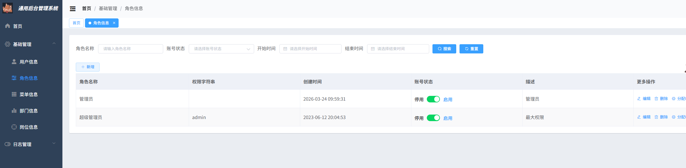

## 17.1 角色状态切换

接下来需要实现这个账号状态按钮的状态切换。

```vue
<script>
  export default {
    data() {
      return {
        statusList: [{
          value: '1',
          label: '启用'
        },
          {
            value: '2',
            label: '停用'
          }],
        queryParams: {},
        Loading: false,
        roleList: [],
        total: 0
      }
    },
    methods: {
      // 列表
      async getRoleList() {
        this.Loading = true
        const {data:res} = await this.$api.queryRoleList(this.queryParams)
        if (res.code !== 200) {
          this.$message.error(res.message);
        } else {
          this.roleList = res.data.list
          this.total = res.data.total
          this.Loading = false
        }
      },
      // 搜索
      handleQuery() {
        this.getRoleList()
      },
      // 重置
      resetQuery() {
        this.queryParams = {}
        this.getRoleList()
        this.$message.success('重置成功')
      },
      // pageSize
      handleSizeChange(newSize) {
        this.queryParams.pageSize = newSize
        this.getRoleList()
      },
      // pageNum
      handleCurrentChange(newPage) {
        this.queryParams.pageNum = newPage
        this.getRoleList()
      },
      // 角色状态切换
      async roleUpdateStatus(row) {
        const text = row.status === 2 ? '停用' : '启用'
        const confirmResult = await this.$confirm('确定要' + text + row.roleName + '角色吗？', '警告', {
          confirmButtonText: '确定',
          cancelButtonText: '取消',
          type: 'warning'
        }).catch(err => err)
        if (confirmResult !== 'confirm') {
          await this.getRoleList()
          return this.$message.info('取消删除')
        }
        await this.$api.updateRoleStatus(row.id, row.status)
        await this.getRoleList()
        return this.$message.success(text + '成功')
      }
    },
    created() {
      this.getRoleList()
    }
  }
</script>

<template>
  <el-card>
    <!--搜索-->
    <el-form :inline="true" :model="queryParams">
      <el-form-item label="角色名称" prop="roleName">
        <el-input placeholder="请输入角色名称" size="mini" clearable v-model="queryParams.roleName"
                  @keyup.enter.native="handleQuery"></el-input>
      </el-form-item>
      <el-form-item label="账号状态" prop="status">
        <el-select size="mini" placeholder="请选择账号状态" v-model="queryParams.status">
          <el-option v-for="item in statusList" :key="item.value" :label="item.label" :value="item.value" />
        </el-select>
      </el-form-item>
      <el-form-item label="开始时间" prop="beginTime">
        <el-date-picker class="input-width" size="mini" type="date" style="width:190px" value-format="yyyy-MM-dd"
                        clearable placeholder="请选择开始时间" v-model="queryParams.beginTime" @keyup.enter.native="handleQuery" />
      </el-form-item>
      <el-form-item label="结束时间" prop="endTime">
        <el-date-picker class="input-width" size="mini" type="date" style="width:190px" value-format="yyyy-MM-dd"
                        clearable placeholder="请选择结束时间" v-model="queryParams.endTime" @keyup.enter.native="handleQuery" />
      </el-form-item>
      <el-form-item>
        <el-button type="primary" icon="el-icon-search" size="mini" @click="handleQuery">搜索</el-button>
        <el-button type="primary" icon="el-icon-refresh" size="mini" @click="resetQuery">重置</el-button>
      </el-form-item>
    </el-form>
    <!--操作按钮-->
    <el-row :gutter="10" class="mb8">
      <el-col :span="1.5">
        <el-button plain type="primary" icon="el-icon-plus" size="mini"
                   @click="addRoleDialogVisible = true" v-authority="['base:role:add']">新增</el-button>
      </el-col>
    </el-row>
    <!--列表-->
    <el-table v-loading="Loading" :data="roleList" border stripe style="width: 100%"
              :header-cell-style="{ background: '#eef1f6', color: '#606266' }">
      <el-table-column label="ID" prop="id" v-if="false" />
      <el-table-column label="角色名称" prop="roleName" />
      <el-table-column label="权限字符串" prop="roleKey" />
      <el-table-column label="创建时间" prop="createTime" />
      <el-table-column label="账号状态">
        <template slot-scope="scope">
          <el-switch v-model="scope.row.status" :active-value="1" :inactive-value="2" active-color="#13ce66"
                     inactive-color="#F5222D" active-text="启用" inactive-text="停用" @change="roleUpdateStatus(scope.row)">
          </el-switch>
        </template>
      </el-table-column>
      <el-table-column label="描述" prop="description" />
      <el-table-column label="更多操作">
        <template slot-scope="scope">
          <el-button size="small" type="text" icon="el-icon-edit" @click="showEditRoleDialog(scope.row.id)" v-authority="['base:role:edit']">编辑
          </el-button>
          <el-button size="small" type="text" icon="el-icon-delete" @click="handleRoleDelete(scope.row)" v-authority="['base:role:delete']">删除
          </el-button>
          <el-button size="small" type="text" icon="el-icon-setting" @click="showSetMenuDialog(scope.row)" v-authority="['base:role:assign']">分配权限
          </el-button>
        </template>
      </el-table-column>
    </el-table>
  </el-card>
</template>

<style lang="less" scoped>

</style>
```

## 17.2 新增角色

```vue
<script>
  export default {
    data() {
      return {
        statusList: [{
          value: '1',
          label: '启用'
        },
          {
            value: '2',
            label: '停用'
          }],
        queryParams: {},
        Loading: false,
        roleList: [],
        total: 0,
        addRoleDialogVisible: false,
        addRoleForm: {
          roleName: '',
          roleKey: '',
          description: '',
          status: 1
        },
        addRoleFormRules: {
          roleName:   [{required: true, message: '请输入角色名称', trigger: 'blur'}],
          roleKey:      [{required: true, message: '请输入角色权限标识', trigger: 'blur'}],
          status:         [{required: true, message: '请输入角色状态', trigger: 'blur'}],
          description: [{required: true, message: '请输入角色描述', trigger: 'blur'}],
        },
      }
    },
    methods: {
      // 列表
      async getRoleList() {
        this.Loading = true
        const {data:res} = await this.$api.queryRoleList(this.queryParams)
        if (res.code !== 200) {
          this.$message.error(res.message);
        } else {
          this.roleList = res.data.list
          this.total = res.data.total
          this.Loading = false
        }
      },
      // 搜索
      handleQuery() {
        this.getRoleList()
      },
      // 重置
      resetQuery() {
        this.queryParams = {}
        this.getRoleList()
        this.$message.success('重置成功')
      },
      // pageSize
      handleSizeChange(newSize) {
        this.queryParams.pageSize = newSize
        this.getRoleList()
      },
      // pageNum
      handleCurrentChange(newPage) {
        this.queryParams.pageNum = newPage
        this.getRoleList()
      },
      // 角色状态切换
      async roleUpdateStatus(row) {
        const text = row.status === 2 ? '停用' : '启用'
        const confirmResult = await this.$confirm('确定要' + text + row.roleName + '角色吗？', '警告', {
          confirmButtonText: '确定',
          cancelButtonText: '取消',
          type: 'warning'
        }).catch(err => err)
        if (confirmResult !== 'confirm') {
          await this.getRoleList()
          return this.$message.info('取消删除')
        }
        await this.$api.updateRoleStatus(row.id, row.status)
        await this.getRoleList()
        return this.$message.success(text + '成功')
      },
      // 监听新建角色对话框
      addRoleDialogClosed() {
        this.$refs.addRoleFormRefForm.resetFields()
      },
      // 新增
      addRole() {
        this.$refs.addRoleFormRefForm.validate(async valid => {
          if (!valid) return
          const {data: res} = await this.$api.addRole(this.addRoleForm);
          if (res.code !== 200) {
            this.$message.error(res.message);
          } else {
            this.$message.success('新建角色成功')
            this.addRoleDialogVisible = false
            await this.getRoleList()
          }
        })
      }
    },
    created() {
      this.getRoleList()
    }
  }
</script>

<template>
  <el-card>
    <!--搜索-->
    <el-form :inline="true" :model="queryParams">
      <el-form-item label="角色名称" prop="roleName">
        <el-input placeholder="请输入角色名称" size="mini" clearable v-model="queryParams.roleName"
                  @keyup.enter.native="handleQuery"></el-input>
      </el-form-item>
      <el-form-item label="账号状态" prop="status">
        <el-select size="mini" placeholder="请选择账号状态" v-model="queryParams.status">
          <el-option v-for="item in statusList" :key="item.value" :label="item.label" :value="item.value" />
        </el-select>
      </el-form-item>
      <el-form-item label="开始时间" prop="beginTime">
        <el-date-picker class="input-width" size="mini" type="date" style="width:190px" value-format="yyyy-MM-dd"
                        clearable placeholder="请选择开始时间" v-model="queryParams.beginTime" @keyup.enter.native="handleQuery" />
      </el-form-item>
      <el-form-item label="结束时间" prop="endTime">
        <el-date-picker class="input-width" size="mini" type="date" style="width:190px" value-format="yyyy-MM-dd"
                        clearable placeholder="请选择结束时间" v-model="queryParams.endTime" @keyup.enter.native="handleQuery" />
      </el-form-item>
      <el-form-item>
        <el-button type="primary" icon="el-icon-search" size="mini" @click="handleQuery">搜索</el-button>
        <el-button type="primary" icon="el-icon-refresh" size="mini" @click="resetQuery">重置</el-button>
      </el-form-item>
    </el-form>
    <!--操作按钮-->
    <el-row :gutter="10" class="mb8">
      <el-col :span="1.5">
        <el-button plain type="primary" icon="el-icon-plus" size="mini"
                   @click="addRoleDialogVisible = true" v-authority="['base:role:add']">新增</el-button>
      </el-col>
    </el-row>
    <!--列表-->
    <el-table v-loading="Loading" :data="roleList" border stripe style="width: 100%"
              :header-cell-style="{ background: '#eef1f6', color: '#606266' }">
      <el-table-column label="ID" prop="id" v-if="false" />
      <el-table-column label="角色名称" prop="roleName" />
      <el-table-column label="权限字符串" prop="roleKey" />
      <el-table-column label="创建时间" prop="createTime" />
      <el-table-column label="账号状态">
        <template slot-scope="scope">
          <el-switch v-model="scope.row.status" :active-value="1" :inactive-value="2" active-color="#13ce66"
                     inactive-color="#F5222D" active-text="启用" inactive-text="停用" @change="roleUpdateStatus(scope.row)">
          </el-switch>
        </template>
      </el-table-column>
      <el-table-column label="描述" prop="description" />
      <el-table-column label="更多操作">
        <template slot-scope="scope">
          <el-button size="small" type="text" icon="el-icon-edit" @click="showEditRoleDialog(scope.row.id)" v-authority="['base:role:edit']">编辑
          </el-button>
          <el-button size="small" type="text" icon="el-icon-delete" @click="handleRoleDelete(scope.row)" v-authority="['base:role:delete']">删除
          </el-button>
          <el-button size="small" type="text" icon="el-icon-setting" @click="showSetMenuDialog(scope.row)" v-authority="['base:role:assign']">分配权限
          </el-button>
        </template>
      </el-table-column>
    </el-table>
    <!--分页区域-->
    <el-pagination @size-change="handleSizeChange" @current-change="handleCurrentChange"
                   :current-page="queryParams.pageNum" :page-sizes="[10, 50, 100, 500, 1000]" :page-size="queryParams.pageSize"
                   layout="total, sizes, prev, pager, next, jumper" :total="total">
    </el-pagination>
    <!--新增角色-->
    <el-dialog title="新增角色" :visible.sync="addRoleDialogVisible" width="30%" @close="addRoleDialogClosed">
      <el-form ref="addRoleFormRefForm" label-width="80px" :model="addRoleForm" :rules="addRoleFormRules">
        <el-form-item label="角色名称" prop="roleName">
          <el-input placeholder="请输入角色名称" v-model="addRoleForm.roleName" />
        </el-form-item>
        <el-form-item label="角色标识" prop="roleKey">
          <el-input placeholder="请输入角色标识" v-model="addRoleForm.roleKey" />
        </el-form-item>
        <el-form-item label="角色状态" prop="status">
          <el-radio-group v-model="addRoleForm.status">
            <el-radio :label="1">正常</el-radio>
            <el-radio :label="2">停用</el-radio>
          </el-radio-group>
        </el-form-item>
        <el-form-item label="角色描述" prop="description">
          <el-input placeholder="请输入角色描述" type="textarea" v-model="addRoleForm.description" />
        </el-form-item>
      </el-form>
      <span slot="footer" class="dialog-footer">
                <el-button type="primary" @click="addRole">确 定</el-button>
                <el-button type="primary" @click="addRoleDialogVisible = false">取 消</el-button>
            </span>
    </el-dialog>
  </el-card>
</template>

<style lang="less" scoped>

</style>
```

## 17.3 编辑角色

首先添加编辑窗口，然后在方法中实现数据回显和调用后端修改角色的接口。

```vue
<script>
  export default {
    data() {
      return {
        statusList: [{
          value: '1',
          label: '启用'
        },
          {
            value: '2',
            label: '停用'
          }],
        queryParams: {},
        Loading: false,
        roleList: [],
        total: 0,
        addRoleDialogVisible: false,
        addRoleForm: {
          roleName: '',
          roleKey: '',
          description: '',
          status: 1
        },
        addRoleFormRules: {
          roleName:   [{required: true, message: '请输入角色名称', trigger: 'blur'}],
          roleKey:      [{required: true, message: '请输入角色权限标识', trigger: 'blur'}],
          status:         [{required: true, message: '请输入角色状态', trigger: 'blur'}],
          description: [{required: true, message: '请输入角色描述', trigger: 'blur'}],
        },
        editRoleDialogVisible: false,
        roleInfo: {},
        editRoleFormRules: {
          roleName: [{ required: true, message: '请输入角色名称', trigger: 'blur' }],
          roleKey: [{ required: true, message: '请输入角色权限标识', trigger: 'blur' }],
          status: [{ required: true, message: '请输入角色状态', trigger: 'blur' }],
          description: [{ required: true, message: '请输入角色描述', trigger: 'blur' }],
        },
      }
    },
    methods: {
      // 列表
      async getRoleList() {
        this.Loading = true
        const {data:res} = await this.$api.queryRoleList(this.queryParams)
        if (res.code !== 200) {
          this.$message.error(res.message);
        } else {
          this.roleList = res.data.list
          this.total = res.data.total
          this.Loading = false
        }
      },
      // 搜索
      handleQuery() {
        this.getRoleList()
      },
      // 重置
      resetQuery() {
        this.queryParams = {}
        this.getRoleList()
        this.$message.success('重置成功')
      },
      // pageSize
      handleSizeChange(newSize) {
        this.queryParams.pageSize = newSize
        this.getRoleList()
      },
      // pageNum
      handleCurrentChange(newPage) {
        this.queryParams.pageNum = newPage
        this.getRoleList()
      },
      // 角色状态切换
      async roleUpdateStatus(row) {
        const text = row.status === 2 ? '停用' : '启用'
        const confirmResult = await this.$confirm('确定要' + text + row.roleName + '角色吗？', '警告', {
          confirmButtonText: '确定',
          cancelButtonText: '取消',
          type: 'warning'
        }).catch(err => err)
        if (confirmResult !== 'confirm') {
          await this.getRoleList()
          return this.$message.info('取消删除')
        }
        await this.$api.updateRoleStatus(row.id, row.status)
        await this.getRoleList()
        return this.$message.success(text + '成功')
      },
      // 监听新建角色对话框
      addRoleDialogClosed() {
        this.$refs.addRoleFormRefForm.resetFields()
      },
      // 新增
      addRole() {
        this.$refs.addRoleFormRefForm.validate(async valid => {
          if (!valid) return
          const {data: res} = await this.$api.addRole(this.addRoleForm);
          if (res.code !== 200) {
            this.$message.error(res.message);
          } else {
            this.$message.success('新建角色成功')
            this.addRoleDialogVisible = false
            await this.getRoleList()
          }
        })
      },
      // 监听修改角色对话框的关闭事件
      editRoleDialogClosed() {
        this.$refs.editRoleFormRefForm.resetFields()
      },
      // 展示修改对话框
      async showEditRoleDialog(id) {
        const { data: res } = await this.$api.roleInfo(id)
        if (res.code !== 200) {
          this.$message.error(res.message)
        } else {
          this.roleInfo = res.data
          this.editRoleDialogVisible = true
        }
      },
      // 修改角色信息并提交
      editRole() {
        this.$refs.editRoleFormRefForm.validate(async valid => {
          if (!valid) return
          const { data: res } = await this.$api.roleUpdate(this.roleInfo)
          if (res.code !== 200) {
            this.$message.error(res.message)
          } else {
            this.editRoleDialogVisible = false
            await this.getRoleList()
            this.$message.success("修改角色成功")
          }
        })
      },
    },
    created() {
      this.getRoleList()
    }
  }
</script>

<template>
  <el-card>
    <!--搜索-->
    <el-form :inline="true" :model="queryParams">
      <el-form-item label="角色名称" prop="roleName">
        <el-input placeholder="请输入角色名称" size="mini" clearable v-model="queryParams.roleName"
                  @keyup.enter.native="handleQuery"></el-input>
      </el-form-item>
      <el-form-item label="账号状态" prop="status">
        <el-select size="mini" placeholder="请选择账号状态" v-model="queryParams.status">
          <el-option v-for="item in statusList" :key="item.value" :label="item.label" :value="item.value" />
        </el-select>
      </el-form-item>
      <el-form-item label="开始时间" prop="beginTime">
        <el-date-picker class="input-width" size="mini" type="date" style="width:190px" value-format="yyyy-MM-dd"
                        clearable placeholder="请选择开始时间" v-model="queryParams.beginTime" @keyup.enter.native="handleQuery" />
      </el-form-item>
      <el-form-item label="结束时间" prop="endTime">
        <el-date-picker class="input-width" size="mini" type="date" style="width:190px" value-format="yyyy-MM-dd"
                        clearable placeholder="请选择结束时间" v-model="queryParams.endTime" @keyup.enter.native="handleQuery" />
      </el-form-item>
      <el-form-item>
        <el-button type="primary" icon="el-icon-search" size="mini" @click="handleQuery">搜索</el-button>
        <el-button type="primary" icon="el-icon-refresh" size="mini" @click="resetQuery">重置</el-button>
      </el-form-item>
    </el-form>
    <!--操作按钮-->
    <el-row :gutter="10" class="mb8">
      <el-col :span="1.5">
        <el-button plain type="primary" icon="el-icon-plus" size="mini"
                   @click="addRoleDialogVisible = true" v-authority="['base:role:add']">新增</el-button>
      </el-col>
    </el-row>
    <!--列表-->
    <el-table v-loading="Loading" :data="roleList" border stripe style="width: 100%"
              :header-cell-style="{ background: '#eef1f6', color: '#606266' }">
      <el-table-column label="ID" prop="id" v-if="false" />
      <el-table-column label="角色名称" prop="roleName" />
      <el-table-column label="权限字符串" prop="roleKey" />
      <el-table-column label="创建时间" prop="createTime" />
      <el-table-column label="账号状态">
        <template slot-scope="scope">
          <el-switch v-model="scope.row.status" :active-value="1" :inactive-value="2" active-color="#13ce66"
                     inactive-color="#F5222D" active-text="启用" inactive-text="停用" @change="roleUpdateStatus(scope.row)">
          </el-switch>
        </template>
      </el-table-column>
      <el-table-column label="描述" prop="description" />
      <el-table-column label="更多操作">
        <template slot-scope="scope">
          <el-button size="small" type="text" icon="el-icon-edit" @click="showEditRoleDialog(scope.row.id)" v-authority="['base:role:edit']">编辑
          </el-button>
          <el-button size="small" type="text" icon="el-icon-delete" @click="handleRoleDelete(scope.row)" v-authority="['base:role:delete']">删除
          </el-button>
          <el-button size="small" type="text" icon="el-icon-setting" @click="showSetMenuDialog(scope.row)" v-authority="['base:role:assign']">分配权限
          </el-button>
        </template>
      </el-table-column>
    </el-table>
    <!--分页区域-->
    <el-pagination @size-change="handleSizeChange" @current-change="handleCurrentChange"
                   :current-page="queryParams.pageNum" :page-sizes="[10, 50, 100, 500, 1000]" :page-size="queryParams.pageSize"
                   layout="total, sizes, prev, pager, next, jumper" :total="total">
    </el-pagination>
    <!--新增角色-->
    <el-dialog title="新增角色" :visible.sync="addRoleDialogVisible" width="30%" @close="addRoleDialogClosed">
      <el-form ref="addRoleFormRefForm" label-width="80px" :model="addRoleForm" :rules="addRoleFormRules">
        <el-form-item label="角色名称" prop="roleName">
          <el-input placeholder="请输入角色名称" v-model="addRoleForm.roleName" />
        </el-form-item>
        <el-form-item label="角色标识" prop="roleKey">
          <el-input placeholder="请输入角色标识" v-model="addRoleForm.roleKey" />
        </el-form-item>
        <el-form-item label="角色状态" prop="status">
          <el-radio-group v-model="addRoleForm.status">
            <el-radio :label="1">正常</el-radio>
            <el-radio :label="2">停用</el-radio>
          </el-radio-group>
        </el-form-item>
        <el-form-item label="角色描述" prop="description">
          <el-input placeholder="请输入角色描述" type="textarea" v-model="addRoleForm.description" />
        </el-form-item>
      </el-form>
      <span slot="footer" class="dialog-footer">
                <el-button type="primary" @click="addRole">确 定</el-button>
                <el-button type="primary" @click="addRoleDialogVisible = false">取 消</el-button>
            </span>
    </el-dialog>
    <!--编辑角色-->
    <el-dialog title="编辑角色" :visible.sync="editRoleDialogVisible" width="30%" @close="editRoleDialogClosed">
      <el-form ref="editRoleFormRefForm" label-width="80px" :model="roleInfo" :rules="editRoleFormRules">
        <el-form-item label="角色名称" prop="roleName">
          <el-input placeholder="请输入角色名称" v-model="roleInfo.roleName" />
        </el-form-item>
        <el-form-item label="角色标识" prop="roleKey">
          <el-input placeholder="请输入角色标识" v-model="roleInfo.roleKey" />
        </el-form-item>
        <el-form-item label="角色状态" prop="status">
          <el-radio-group v-model="roleInfo.status">
            <el-radio :label="1">正常</el-radio>
            <el-radio :label="2">停用</el-radio>
          </el-radio-group>
        </el-form-item>
        <el-form-item label="角色描述" prop="status">
          <el-input placeholder="请输入角色描述" type="textarea" v-model="roleInfo.description" />
        </el-form-item>
      </el-form>
      <span slot="footer" class="dialog-footer">
                <el-button type="primary" @click="editRole">确 定</el-button>
                <el-button type="primary" @click="editRoleDialogVisible = false">取 消</el-button>
            </span>
    </el-dialog>
  </el-card>
</template>

<style lang="less" scoped>

</style>
```

## 17.4 删除角色

这里需要实现根据id删除角色。为删除按钮绑定事件，添加这个事件即可。

```java
// 删除角色
async handleRoleDelete(row) {
  const confirmResult = await this.$confirm('是否删除' + row.roleName + '角色？', '警告', {
    confirmButtonText: '确定',
    cancelButtonText: '取消',
    type: 'warning'
  }).catch(err => err)
  if (confirmResult !== 'confirm') {
    return this.$message.info('取消删除')
  }
  const {data: res} = await this.$api.deleteRole(row.id)
  console.log(row.id)
  if (res.code !== 200) {
    this.$message.error(res.message)
  } else {
    this.$message.success('删除成功')
    await this.getRoleList()
  }
}
```

## 17.5 分配权限

这里的权限需要展示所有的菜单，为用户添加能够访问功能的权限。分配权限的窗口使用的是`element-UI`的树型控件。

```vue
<script>
import Treeselect from '@riophae/vue-treeselect'
import '@riophae/vue-treeselect/dist/vue-treeselect.css'
  export default {
  components: {
    Treeselect
  },
    data() {
      return {
        statusList: [{
          value: '1',
          label: '启用'
        },
          {
            value: '2',
            label: '停用'
          }],
        queryParams: {},
        Loading: false,
        roleList: [],
        total: 0,
        addRoleDialogVisible: false,
        addRoleForm: {
          roleName: '',
          roleKey: '',
          description: '',
          status: 1
        },
        addRoleFormRules: {
          roleName:   [{required: true, message: '请输入角色名称', trigger: 'blur'}],
          roleKey:      [{required: true, message: '请输入角色权限标识', trigger: 'blur'}],
          status:         [{required: true, message: '请输入角色状态', trigger: 'blur'}],
          description: [{required: true, message: '请输入角色描述', trigger: 'blur'}],
        },
        editRoleDialogVisible: false,
        roleInfo: {},
        editRoleFormRules: {
          roleName: [{ required: true, message: '请输入角色名称', trigger: 'blur' }],
          roleKey: [{ required: true, message: '请输入角色权限标识', trigger: 'blur' }],
          status: [{ required: true, message: '请输入角色状态', trigger: 'blur' }],
          description: [{ required: true, message: '请输入角色描述', trigger: 'blur' }],
        },
        setMenuDialogVisible: false,
        menuList: [],
        treeProps: {
          label: 'label',
        },
        defKeys: [],
        id: '',
      }
    },
    methods: {
      // 列表
      async getRoleList() {
        this.Loading = true
        const {data:res} = await this.$api.queryRoleList(this.queryParams)
        if (res.code !== 200) {
          this.$message.error(res.message);
        } else {
          this.roleList = res.data.list
          this.total = res.data.total
          this.Loading = false
        }
      },
      // 搜索
      handleQuery() {
        this.getRoleList()
      },
      // 重置
      resetQuery() {
        this.queryParams = {}
        this.getRoleList()
        this.$message.success('重置成功')
      },
      // pageSize
      handleSizeChange(newSize) {
        this.queryParams.pageSize = newSize
        this.getRoleList()
      },
      // pageNum
      handleCurrentChange(newPage) {
        this.queryParams.pageNum = newPage
        this.getRoleList()
      },
      // 角色状态切换
      async roleUpdateStatus(row) {
        const text = row.status === 2 ? '停用' : '启用'
        const confirmResult = await this.$confirm('确定要' + text + row.roleName + '角色吗？', '警告', {
          confirmButtonText: '确定',
          cancelButtonText: '取消',
          type: 'warning'
        }).catch(err => err)
        if (confirmResult !== 'confirm') {
          await this.getRoleList()
          return this.$message.info('取消删除')
        }
        await this.$api.updateRoleStatus(row.id, row.status)
        await this.getRoleList()
        return this.$message.success(text + '成功')
      },
      // 监听新建角色对话框
      addRoleDialogClosed() {
        this.$refs.addRoleFormRefForm.resetFields()
      },
      // 新增
      addRole() {
        this.$refs.addRoleFormRefForm.validate(async valid => {
          if (!valid) return
          const {data: res} = await this.$api.addRole(this.addRoleForm);
          if (res.code !== 200) {
            this.$message.error(res.message);
          } else {
            this.$message.success('新建角色成功')
            this.addRoleDialogVisible = false
            await this.getRoleList()
          }
        })
      },
      // 监听修改角色对话框的关闭事件
      editRoleDialogClosed() {
        this.$refs.editRoleFormRefForm.resetFields()
      },
      // 展示修改对话框
      async showEditRoleDialog(id) {
        const { data: res } = await this.$api.roleInfo(id)
        if (res.code !== 200) {
          this.$message.error(res.message)
        } else {
          this.roleInfo = res.data
          this.editRoleDialogVisible = true
        }
      },
      // 修改角色信息并提交
      editRole() {
        this.$refs.editRoleFormRefForm.validate(async valid => {
          if (!valid) return
          const { data: res } = await this.$api.roleUpdate(this.roleInfo)
          if (res.code !== 200) {
            this.$message.error(res.message)
          } else {
            this.editRoleDialogVisible = false
            await this.getRoleList()
            this.$message.success("修改角色成功")
          }
        })
      },
      // 删除角色
      async handleRoleDelete(row) {
        const confirmResult = await this.$confirm('是否删除' + row.roleName + '角色？', '警告', {
          confirmButtonText: '确定',
          cancelButtonText: '取消',
          type: 'warning'
        }).catch(err => err)
        if (confirmResult !== 'confirm') {
          return this.$message.info('取消删除')
        }
        const {data: res} = await this.$api.deleteRole(row.id)
        console.log(row.id)
        if (res.code !== 200) {
          this.$message.error(res.message)
        } else {
          this.$message.success('删除成功')
          await this.getRoleList()
        }
      },
      // 展示分配菜单权限对话框
      showSetMenuDialog(role) {
        this.id = role.id
        this.$api.querySysMenuVoList().then(res => {
          this.menuList = this.$handleTree.handleTree(res.data.data, "id")
        })
        this.$api.QueryRoleMenuIdList(role.id).then(res => {
          this.defKeys = res.data.data
        })
        this.setMenuDialogVisible = true
      },
      // 监听权限对话框关闭事件
      setRightDialogClosed() {
        this.defKeys = []
      },
      // 分配菜单权限
      async allotMenus() {
        const keys = [
            ...this.$refs.treeRef.getCheckedKeys(),
            ...this.$refs.treeRef.getHalfCheckedKeys(),
        ]
        const {data: res} = await this.$api.AssignPermissions(this.id, keys)
        if (res.code !== 200) {
          this.$message.error(res.message)
        } else {
          this.$message.success('分配权限成功')
          await this.getRoleList()
          this.setMenuDialogVisible = false
        }
      }
    },
    created() {
      this.getRoleList()
    }
  }
</script>

<template>
  <el-card>
    <!--搜索-->
    <el-form :inline="true" :model="queryParams">
      <el-form-item label="角色名称" prop="roleName">
        <el-input placeholder="请输入角色名称" size="mini" clearable v-model="queryParams.roleName"
                  @keyup.enter.native="handleQuery"></el-input>
      </el-form-item>
      <el-form-item label="账号状态" prop="status">
        <el-select size="mini" placeholder="请选择账号状态" v-model="queryParams.status">
          <el-option v-for="item in statusList" :key="item.value" :label="item.label" :value="item.value" />
        </el-select>
      </el-form-item>
      <el-form-item label="开始时间" prop="beginTime">
        <el-date-picker class="input-width" size="mini" type="date" style="width:190px" value-format="yyyy-MM-dd"
                        clearable placeholder="请选择开始时间" v-model="queryParams.beginTime" @keyup.enter.native="handleQuery" />
      </el-form-item>
      <el-form-item label="结束时间" prop="endTime">
        <el-date-picker class="input-width" size="mini" type="date" style="width:190px" value-format="yyyy-MM-dd"
                        clearable placeholder="请选择结束时间" v-model="queryParams.endTime" @keyup.enter.native="handleQuery" />
      </el-form-item>
      <el-form-item>
        <el-button type="primary" icon="el-icon-search" size="mini" @click="handleQuery">搜索</el-button>
        <el-button type="primary" icon="el-icon-refresh" size="mini" @click="resetQuery">重置</el-button>
      </el-form-item>
    </el-form>
    <!--操作按钮-->
    <el-row :gutter="10" class="mb8">
      <el-col :span="1.5">
        <el-button plain type="primary" icon="el-icon-plus" size="mini"
                   @click="addRoleDialogVisible = true" v-authority="['base:role:add']">新增</el-button>
      </el-col>
    </el-row>
    <!--列表-->
    <el-table v-loading="Loading" :data="roleList" border stripe style="width: 100%"
              :header-cell-style="{ background: '#eef1f6', color: '#606266' }">
      <el-table-column label="ID" prop="id" v-if="false" />
      <el-table-column label="角色名称" prop="roleName" />
      <el-table-column label="权限字符串" prop="roleKey" />
      <el-table-column label="创建时间" prop="createTime" />
      <el-table-column label="账号状态">
        <template slot-scope="scope">
          <el-switch v-model="scope.row.status" :active-value="1" :inactive-value="2" active-color="#13ce66"
                     inactive-color="#F5222D" active-text="启用" inactive-text="停用" @change="roleUpdateStatus(scope.row)">
          </el-switch>
        </template>
      </el-table-column>
      <el-table-column label="描述" prop="description" />
      <el-table-column label="更多操作">
        <template slot-scope="scope">
          <el-button size="small" type="text" icon="el-icon-edit" @click="showEditRoleDialog(scope.row.id)" v-authority="['base:role:edit']">编辑
          </el-button>
          <el-button size="small" type="text" icon="el-icon-delete" @click="handleRoleDelete(scope.row)" v-authority="['base:role:delete']">删除
          </el-button>
          <el-button size="small" type="text" icon="el-icon-setting" @click="showSetMenuDialog(scope.row)" v-authority="['base:role:assign']">分配权限
          </el-button>
        </template>
      </el-table-column>
    </el-table>
    <!--分页区域-->
    <el-pagination @size-change="handleSizeChange" @current-change="handleCurrentChange"
                   :current-page="queryParams.pageNum" :page-sizes="[10, 50, 100, 500, 1000]" :page-size="queryParams.pageSize"
                   layout="total, sizes, prev, pager, next, jumper" :total="total">
    </el-pagination>
    <!--新增角色-->
    <el-dialog title="新增角色" :visible.sync="addRoleDialogVisible" width="30%" @close="addRoleDialogClosed">
      <el-form ref="addRoleFormRefForm" label-width="80px" :model="addRoleForm" :rules="addRoleFormRules">
        <el-form-item label="角色名称" prop="roleName">
          <el-input placeholder="请输入角色名称" v-model="addRoleForm.roleName" />
        </el-form-item>
        <el-form-item label="角色标识" prop="roleKey">
          <el-input placeholder="请输入角色标识" v-model="addRoleForm.roleKey" />
        </el-form-item>
        <el-form-item label="角色状态" prop="status">
          <el-radio-group v-model="addRoleForm.status">
            <el-radio :label="1">正常</el-radio>
            <el-radio :label="2">停用</el-radio>
          </el-radio-group>
        </el-form-item>
        <el-form-item label="角色描述" prop="description">
          <el-input placeholder="请输入角色描述" type="textarea" v-model="addRoleForm.description" />
        </el-form-item>
      </el-form>
      <span slot="footer" class="dialog-footer">
                <el-button type="primary" @click="addRole">确 定</el-button>
                <el-button type="primary" @click="addRoleDialogVisible = false">取 消</el-button>
            </span>
    </el-dialog>
    <!--编辑角色-->
    <el-dialog title="编辑角色" :visible.sync="editRoleDialogVisible" width="30%" @close="editRoleDialogClosed">
      <el-form ref="editRoleFormRefForm" label-width="80px" :model="roleInfo" :rules="editRoleFormRules">
        <el-form-item label="角色名称" prop="roleName">
          <el-input placeholder="请输入角色名称" v-model="roleInfo.roleName" />
        </el-form-item>
        <el-form-item label="角色标识" prop="roleKey">
          <el-input placeholder="请输入角色标识" v-model="roleInfo.roleKey" />
        </el-form-item>
        <el-form-item label="角色状态" prop="status">
          <el-radio-group v-model="roleInfo.status">
            <el-radio :label="1">正常</el-radio>
            <el-radio :label="2">停用</el-radio>
          </el-radio-group>
        </el-form-item>
        <el-form-item label="角色描述" prop="status">
          <el-input placeholder="请输入角色描述" type="textarea" v-model="roleInfo.description" />
        </el-form-item>
      </el-form>
      <span slot="footer" class="dialog-footer">
                <el-button type="primary" @click="editRole">确 定</el-button>
                <el-button type="primary" @click="editRoleDialogVisible = false">取 消</el-button>
            </span>
    </el-dialog>
<!--    分配权限页面-->
    <el-dialog title="分配权限" :visible.sync="setMenuDialogVisible" width="20%" @close="setRightDialogClosed">
      <el-tree :data="menuList" :props="treeProps" show-checkbox node-key="id" default-expand-all :default-checked-keys="defKeys" ref="treeRef">

      </el-tree>
      <span slot="footer" class="dialog-footer">
        <el-button type="primary" @click="allotMenus">确 定</el-button>
        <el-button type="primary" @click="setMenuDialogVisible= false">取 消</el-button>
      </span>
    </el-dialog>
  </el-card>
</template>

<style lang="less" scoped>

</style>
```

# 18. 用户开发

这里需要实现用户信息的页面。

## 18.1 用户列表

同样的，在钩子函数上访问后端接口，在前端使用elementUI展示即可。

首先在api上引入后端接口。

```js
/*
后端api接口管理
 */

import request from '@/utils/request'

export default {
    // 验证码接口
    captcha() {
        return request ({
            url: '/captcha',
            method: 'get'
        })
    },
    // 登录接口
    login(params) {
        return request({
            url: '/login',
            method: 'post',
            data: params
        })
    },
    // post岗位
    queryPostList(params) {
        return request({
            url: '/post/list',
            method: 'get',
            data: params
        })
    },
    // 批量删除岗位
    batchDeleteSysPost(ids) {
        const data = {
            ids
        }
        return request({
            url: '/post/batch/delete',
            method: 'delete',
            data: data
        })
    },
    // 根据id删除岗位
    deleteSysPost(id) {
        const data = {
            id
        }
        return request({
            url: '/post/delete',
            method: 'delete',
            data: data
        })
    },
    // 获取岗位列表
    querySysPostVOList() {
        return request({
            url: '/post/vo/list',
            method: 'get'
        })
    },
    // 添加岗位
    addPost(data) {
        return request({
            url: '/post/add',
            method: 'post',
            data: data
        })
    },
    // 根据id获取岗位信息
    postInfo(id) {
        const data = {
            id
        }
        return request({
            url: '/post/info',
            method: 'get',
            data: data
        })
    },
    // 更新岗位
    updatePost(data) {
        return request({
            url: '/post/update',
            method: 'put',
            data: data
        })
    },
    // 更新岗位状态
    updatePostStatus(id, postStatus) {
        const data = {
            id,
            postStatus
        }
        return request({
            url: '/post/updateStatus',
            method: 'put',
            data: data
        })
    },
    // dept部门
    queryDeptList(params) {
        return request({
            url: "/dept/list",
            method: 'get',
            data: params
        })
    },
    querySysDeptVoList() {
        return request({
            url: '/dept/vo/list',
            method: 'get'
        })
    },
    addDept(data) {
        return request({
            url: '/dept/add',
            method: 'post',
            data: data
        })
    },
    deleteDept(id) {
        const data = {
            id
        }
        return request({
            url: '/dept/delete',
            method: 'delete',
            data: data
        })
    },
    deptInfo(id) {
        const data = {
            id
        }
        return request({
            url: '/dept/info',
            method: 'get',
            data: data
        })
    },
    deptUpdate(data) {
        return request({
            url: '/dept/update',
            method: 'put',
            data: data
        })
    },
    // menu菜单
    queryMenuList(params) {
        return request({
            url: "/menu/list",
            method: 'get',
            data: params
        })
    },
    querySysMenuVoList() {
        return request({
            url: "/menu/vo/list",
            method: 'get'
        })
    },
    addMenu(data) {
        return request({
            url: '/menu/add',
            method: 'post',
            data: data
        })
    },
    menuInfo(id) {
        const data = {
            id
        }
        return request({
            url: '/menu/info',
            method: 'get',
            data: data
        })
    },
    menuUpdate(data) {
        return request({
            url: '/menu/update',
            method: 'put',
            data: data
        })
    },
    menuDelete(id) {
        const data = {
            id
        }
        return request({
            url: '/menu/delete',
            method: 'delete',
            data: data
        })
    },
    // role角色
    queryRoleList(params) {
        return request({
            url: "/role/list",
            method: 'get',
            data: params
        })
    },
    querySysRoleVoList() {
        return request({
            url: "/role/vo/list",
            method: 'get'
        })
    },
    addRole(data) {
        return request({
            url: '/role/add',
            method: 'post',
            data: data
        })
    },
    roleInfo(id) {
        const data = {
            id
        }
        return request({
            url: '/role/info',
            method: 'get',
            data: data
        })
    },
    roleUpdate(data) {
        return request({
            url: '/role/update',
            method: 'put',
            data: data
        })
    },
    deleteRole(id) {
        const data = {
            id
        }
        return request({
            url: '/role/delete',
            method: 'delete',
            data: data
        })
    },
    updateRoleStatus(id, status) {
        const data = {
            id,
            status
        }
        return request({
            url: "/role/updateStatus",
            method: 'put',
            data: data
        })
    },
    QueryRoleMenuIdList(id) {
        const data = {
            id
        }
        return request({
            url: "/role/vo/idList",
            method: 'get',
            data: data
        })
    },
    AssignPermissions(id, menuIds) {
        const data = {
            id,
            menuIds
        }
        return request({
            url: "/role/assignPermissions",
            method: 'put',
            data: data
        })
    },
    // admin用户
    queryAdminList(params) {
        return request({
            url: "/admin/list",
            method: 'get',
            data: params
        })
    },
    updateAdminStatus(id, status) {
        const data = {
            id,
            status
        }
        return request({
            url: "/admin/updateStatus",
            method: 'put',
            data: data
        })
    },
    addAdmin(data) {
        return request({
            url: '/admin/add',
            method: 'post',
            data: data
        })
    },
    adminInfo(id) {
        const data = {
            id
        }
        return request({
            url: '/admin/info',
            method: 'get',
            data: data
        })
    },
    adminUpdate(data) {
        return request({
            url: '/admin/update',
            method: 'put',
            data: data
        })
    },
    resetPassword(id, password) {
        const data = {
            id,
            password
        }
        return request({
            url: '/admin/updatePassword',
            method: 'put',
            data: data
        })
    },
    deleteAdmin(id) {
        const data = {
            id
        }
        return request({
            url: '/admin/delete',
            method: 'delete',
            data: data
        })
    },
    adminUpdatePersonal(data) {
        return request({
            url: '/admin/updatePersonal',
            method: 'put',
            data: data
        })
    },
    adminUpdatePersonalPassword(data) {
        return request({
            url: '/admin/updatePersonalPassword',
            method: 'put',
            data: data
        })
    },
}
```

然后在`Admin.vue`实现查询用户列表操作。

```vue
<script>
  export default {
    data() {
      return {
        statusList: [{
          value: '1',
          label: '启用'
        },
          {
            value: '2',
            label: '停用'
          }],
        Loading: false,
        queryParams: {},
        adminList: [],
        total: 0,
      }
    },
    methods: {
      // 查询列表
      async getAdminList() {
        this.Loading = true
        const {data: res} = await this.$api.queryAdminList(this.queryParams)
        if (res.code !== 200) {
          this.$message.error(res.message)
        } else {
          this.adminList = res.data.list
          this.total = res.data.total
          this.Loading = false
        }
      },
      // 搜索按钮操作
      handleQuery() {
        this.getAdminList();
      },
      // 重置按钮操作
      resetQuery() {
        this.queryParams = {}
        this.getAdminList();
        this.$message.success('重置成功')
      },
      // pageSize
      handleSizeChange(newSize) {
        this.queryParams.pageSize = newSize
        this.getAdminList()
      },
      // pageNum
      handleCurrentChange(newPage) {
        this.queryParams.pageNum = newPage
        this.getAdminList()
      },
    },
    created() {
      this.getAdminList()
    }
  }
</script>

<template>
  <el-card>
    <!--搜索区域-->
    <el-form :inline="true" :model="queryParams">
      <el-form-item label="用户账号" prop="username">
        <el-input size="mini" placeholder="请输入用户账号" clearable v-model="queryParams.username"
                  @keyup.enter.native="handleQuery" />
      </el-form-item>
      <el-form-item label="账号状态" prop="status">
        <el-select size="mini" placeholder="请选择账号状态" v-model="queryParams.status">
          <el-option v-for="item in statusList" :key="item.value" :label="item.label"
                     :value="item.value"></el-option>
        </el-select>
      </el-form-item>
      <el-form-item label="开始时间" prop="beginTime">
        <el-date-picker class="input-width" size="mini" type="date" style="width: 190px" value-format="yyyy-MM-dd"
                        clearable placeholder="请选择开始时间" v-model="queryParams.beginTime" @keyup.enter.native="handleQuery" />
      </el-form-item>
      <el-form-item label="结束时间">
        <el-date-picker class="input-width" size="mini" type="date" style="width: 190px" value-format="yyyy-MM-dd"
                        clearable placeholder="请选择结束时间" v-model="queryParams.endTime" @keyup.enter.native="handleQuery" />
      </el-form-item>
      <el-form-item>
        <el-button type="primary" icon="el-icon-search" size="mini" @click="handleQuery">搜索</el-button>
        <el-button type="primary" icon="el-icon-refresh" size="mini" @click="resetQuery">重置</el-button>
      </el-form-item>
      <!--操作按钮-->
      <el-row :gutter="10" class="mb8">
        <el-col :span="1.5">
          <el-button plain type="primary" icon="el-icon-plus" size="mini"
                     @click="addDialogVisible = true" v-authority="['base:admin:add']">新增</el-button>
        </el-col>
      </el-row>
      <!--列表-->
      <el-table v-loading="Loading" :data="adminList" border stripe style="width: 100%"
                :header-cell-style="{ background: '#eef1f6', color: '#606266' }">
        <el-table-column label="ID" prop="id" v-if="false" />
        <el-table-column label="用户账号" prop="username" />
        <el-table-column label="用户昵称" prop="nickname" />
        <el-table-column label="用户手机" prop="phone" width="120" />
        <el-table-column label="用户邮箱" prop="email" width="170" />
        <el-table-column label="用户头像" prop="icon">
          <template slot-scope="scope">
            <el-avatar shape="circle" :src="scope.row.icon"></el-avatar>
          </template>
        </el-table-column>
        <el-table-column label="创建时间" prop="createTime" width="160" />
        <el-table-column label="账号状态" width="150">
          <template slot-scope="scope">
            <el-switch v-model="scope.row.status" :active-value="1" :inactive-value="2" active-color="#13ce66"
                       inactive-color="#F5222D" active-text="启用" inactive-text="停用"
                       @change="adminUpdateStatus(scope.row)">
            </el-switch>
          </template>
        </el-table-column>
        <el-table-column label="部门/岗位" width="180">
          <template slot-scope="scope">
            <div>{{ scope.row.deptName }} / {{ scope.row.postName }}</div>
          </template>
        </el-table-column>
        <el-table-column label="角色名称" prop="roleName">
          <template slot-scope="scope">
            <el-tag type="success">{{ scope.row.roleName }}</el-tag>
          </template>
        </el-table-column>
        <el-table-column label="个人简介" prop="note" />
        <el-table-column label="更多操作" fixed="right" width="200">
          <template slot-scope="scope">
            <el-button size="small" type="text" icon="el-icon-edit"
                       @click="showEditAdminDialog(scope.row.id)" v-authority="['base:admin:edit']">编辑
            </el-button>
            <el-button size="small" type="text" icon="el-icon-delete" @click="handleAdminDelete(scope.row)" v-authority="['base:admin:delete']">删除
            </el-button>
            <el-button size="small" type="text" icon="el-icon-key" @click="handleResetPwd(scope.row)" v-authority="['base:admin:reset']">重置密码
            </el-button>
          </template>
        </el-table-column>
      </el-table>
      <!--分页区域-->
      <el-pagination @size-change="handleSizeChange" @current-change="handleCurrentChange"
                     :current-page="queryParams.pageNum" :page-sizes="[10, 50, 100, 500, 1000]" :page-size="queryParams.pageSize"
                     layout="total, sizes, prev, pager, next, jumper" :total="total">
      </el-pagination>
    </el-form>
  </el-card>
</template>

<style scoped>

</style>
```

## 18.2 用户状态修改

同样的，在用户状态上添加点击事件，然后向后端调用接口即可。

```vue
<script>
  export default {
    data() {
      return {
        statusList: [{
          value: '1',
          label: '启用'
        },
          {
            value: '2',
            label: '停用'
          }],
        Loading: false,
        queryParams: {},
        adminList: [],
        total: 0,
      }
    },
    methods: {
      // 查询列表
      async getAdminList() {
        this.Loading = true
        const {data: res} = await this.$api.queryAdminList(this.queryParams)
        if (res.code !== 200) {
          this.$message.error(res.message)
        } else {
          this.adminList = res.data.list
          this.total = res.data.total
          this.Loading = false
        }
      },
      // 搜索按钮操作
      handleQuery() {
        this.getAdminList();
      },
      // 重置按钮操作
      resetQuery() {
        this.queryParams = {}
        this.getAdminList();
        this.$message.success('重置成功')
      },
      // pageSize
      handleSizeChange(newSize) {
        this.queryParams.pageSize = newSize
        this.getAdminList()
      },
      // pageNum
      handleCurrentChange(newPage) {
        this.queryParams.pageNum = newPage
        this.getAdminList()
      },
      // 修改用户状态
      async adminUpdateStatus(row) {
        const text = row.status === 2 ? '停用' : '启用';
        const confirmResult = await this.$confirm('确定' + text + row.username + '用户吗？', '警告', {
          confirmButtonText: '确定',
          cancelButtonText: '取消',
          type: 'warning'
        }).catch(err => err)
        if (confirmResult !== 'confirm') {
          await this.getAdminList()
          return this.$message.info('取消删除')
        }
        this.$api.updateAdminStatus(row.id, row.status)
        this.$message.success(text + '成功')
        await this.getAdminList()
      }
    },
    created() {
      this.getAdminList()
    }
  }
</script>

<template>
  <el-card>
    <!--搜索区域-->
    <el-form :inline="true" :model="queryParams">
      <el-form-item label="用户账号" prop="username">
        <el-input size="mini" placeholder="请输入用户账号" clearable v-model="queryParams.username"
                  @keyup.enter.native="handleQuery" />
      </el-form-item>
      <el-form-item label="账号状态" prop="status">
        <el-select size="mini" placeholder="请选择账号状态" v-model="queryParams.status">
          <el-option v-for="item in statusList" :key="item.value" :label="item.label"
                     :value="item.value"></el-option>
        </el-select>
      </el-form-item>
      <el-form-item label="开始时间" prop="beginTime">
        <el-date-picker class="input-width" size="mini" type="date" style="width: 190px" value-format="yyyy-MM-dd"
                        clearable placeholder="请选择开始时间" v-model="queryParams.beginTime" @keyup.enter.native="handleQuery" />
      </el-form-item>
      <el-form-item label="结束时间">
        <el-date-picker class="input-width" size="mini" type="date" style="width: 190px" value-format="yyyy-MM-dd"
                        clearable placeholder="请选择结束时间" v-model="queryParams.endTime" @keyup.enter.native="handleQuery" />
      </el-form-item>
      <el-form-item>
        <el-button type="primary" icon="el-icon-search" size="mini" @click="handleQuery">搜索</el-button>
        <el-button type="primary" icon="el-icon-refresh" size="mini" @click="resetQuery">重置</el-button>
      </el-form-item>
      <!--操作按钮-->
      <el-row :gutter="10" class="mb8">
        <el-col :span="1.5">
          <el-button plain type="primary" icon="el-icon-plus" size="mini"
                     @click="addDialogVisible = true" v-authority="['base:admin:add']">新增</el-button>
        </el-col>
      </el-row>
      <!--列表-->
      <el-table v-loading="Loading" :data="adminList" border stripe style="width: 100%"
                :header-cell-style="{ background: '#eef1f6', color: '#606266' }">
        <el-table-column label="ID" prop="id" v-if="false" />
        <el-table-column label="用户账号" prop="username" />
        <el-table-column label="用户昵称" prop="nickname" />
        <el-table-column label="用户手机" prop="phone" width="120" />
        <el-table-column label="用户邮箱" prop="email" width="170" />
        <el-table-column label="用户头像" prop="icon">
          <template slot-scope="scope">
            <el-avatar shape="circle" :src="scope.row.icon"></el-avatar>
          </template>
        </el-table-column>
        <el-table-column label="创建时间" prop="createTime" width="160" />
        <el-table-column label="账号状态" width="150">
          <template slot-scope="scope">
            <el-switch v-model="scope.row.status" :active-value="1" :inactive-value="2" active-color="#13ce66"
                       inactive-color="#F5222D" active-text="启用" inactive-text="停用"
                       @change="adminUpdateStatus(scope.row)">
            </el-switch>
          </template>
        </el-table-column>
        <el-table-column label="部门/岗位" width="180">
          <template slot-scope="scope">
            <div>{{ scope.row.deptName }} / {{ scope.row.postName }}</div>
          </template>
        </el-table-column>
        <el-table-column label="角色名称" prop="roleName">
          <template slot-scope="scope">
            <el-tag type="success">{{ scope.row.roleName }}</el-tag>
          </template>
        </el-table-column>
        <el-table-column label="个人简介" prop="note" />
        <el-table-column label="更多操作" fixed="right" width="200">
          <template slot-scope="scope">
            <el-button size="small" type="text" icon="el-icon-edit"
                       @click="showEditAdminDialog(scope.row.id)" v-authority="['base:admin:edit']">编辑
            </el-button>
            <el-button size="small" type="text" icon="el-icon-delete" @click="handleAdminDelete(scope.row)" v-authority="['base:admin:delete']">删除
            </el-button>
            <el-button size="small" type="text" icon="el-icon-key" @click="handleResetPwd(scope.row)" v-authority="['base:admin:reset']">重置密码
            </el-button>
          </template>
        </el-table-column>
      </el-table>
      <!--分页区域-->
      <el-pagination @size-change="handleSizeChange" @current-change="handleCurrentChange"
                     :current-page="queryParams.pageNum" :page-sizes="[10, 50, 100, 500, 1000]" :page-size="queryParams.pageSize"
                     layout="total, sizes, prev, pager, next, jumper" :total="total">
      </el-pagination>
    </el-form>
  </el-card>
</template>
<style scoped>
</style>
```

## 18.3 新增用户

```vue
<script>
import Treeselect from '@riophae/vue-treeselect'
import '@riophae/vue-treeselect/dist/vue-treeselect.css'
  export default {
  components: {
    Treeselect
  },
    data() {
      return {
        statusList: [{
          value: '1',
          label: '启用'
        },
          {
            value: '2',
            label: '停用'
          }],
        Loading: false,
        queryParams: {},
        adminList: [],
        total: 0,
        addDialogVisible: false,
        deptList: [],
        roleList: [],
        postList: [],
        addForm: {
          username: '',
          password: '',
          deptId: undefined,
          postId: undefined,
          roleId: undefined,
          email: '',
          nickname: '',
          status: 1,
          phone: '',
          note: ''
        },
        addFormRules: {
          deptId: [{ required: true, message: '请选择部门', trigger: 'blur' }],
          postId: [{ required: true, message: '请选择岗位', trigger: 'blur' }],
          roleId: [{ required: true, message: '请选择角色', trigger: 'blur' }],
          username: [{ required: true, message: '请输入用户账号', trigger: 'blur' }],
          password: [{ required: true, message: '请输入用户密码', trigger: 'blur' }],
          status: [{ required: true, message: '请选择状态', trigger: 'blur' }],
          email: [{ required: true, message: '请输入用户邮箱', trigger: 'blur' }],
          nickname: [{ required: true, message: '请输入用户昵称', trigger: 'blur' }],
          phone: [{ required: true, message: '请输入用户手机', trigger: 'blur' }]
        },
      }
    },
    methods: {
      // 查询列表
      async getAdminList() {
        this.Loading = true
        const {data: res} = await this.$api.queryAdminList(this.queryParams)
        if (res.code !== 200) {
          this.$message.error(res.message)
        } else {
          this.adminList = res.data.list
          this.total = res.data.total
          this.Loading = false
        }
      },
      // 搜索按钮操作
      handleQuery() {
        this.getAdminList();
      },
      // 重置按钮操作
      resetQuery() {
        this.queryParams = {}
        this.getAdminList();
        this.$message.success('重置成功')
      },
      // pageSize
      handleSizeChange(newSize) {
        this.queryParams.pageSize = newSize
        this.getAdminList()
      },
      // pageNum
      handleCurrentChange(newPage) {
        this.queryParams.pageNum = newPage
        this.getAdminList()
      },
      // 修改用户状态
      async adminUpdateStatus(row) {
        const text = row.status === 2 ? '停用' : '启用';
        const confirmResult = await this.$confirm('确定' + text + row.username + '用户吗？', '警告', {
          confirmButtonText: '确定',
          cancelButtonText: '取消',
          type: 'warning'
        }).catch(err => err)
        if (confirmResult !== 'confirm') {
          await this.getAdminList()
          return this.$message.info('取消删除')
        }
        this.$api.updateAdminStatus(row.id, row.status)
        this.$message.success(text + '成功')
        await this.getAdminList()
      },
      // 部门下拉列表
      async getDeptVoList() {
        const {data:res} = await this.$api.querySysDeptVoList()
        if (res.code !== 200) {
          this.$message.error(res.message)
        } else {
          this.deptList = this.$handleTree.handleTree(res.data, "id")
        }
      },
      // 角色下拉列表
      async getRoleVoList() {
        const {data: res} = await this.$api.querySysRoleVoList()
        if (res.code !== 200) {
          this.$message.error(res.message)
        } else {
          this.roleList =res.data
        }
      },
      // 岗位下拉列表
      async getPostVoList() {
        const {data: res} = await this.$api.querySysPostVoList()
        if (res.code !== 200) {
          this.$message.error(res.message)
        } else {
          this.postList = res.data
        }
      },
      // 监听添加用户对话框关闭
      addDialogClosed() {
        this.$refs.addFormRefForm.resetFields()
      },
      // 新增用户
      addAdmin() {
        this.$refs.addFormRefForm.validate(async valid => {
          if (!valid) return
          const {data: res} = await this.$api.addAdmin(this.addForm);
          if (res.code !== 200) {
            this.$message.error(res.message)
          } else {
            this.$message.success('新增用户成功')
            this.addDialogVisible = false
            await this.getAdminList()
          }
        })
      }
    },
    created() {
      this.getAdminList()
      this.getRoleVoList()
      this.getPostVoList()
      this.getDeptVoList()
    }
  }
</script>

<template>
  <el-card>
    <!--搜索区域-->
    <el-form :inline="true" :model="queryParams">
      <el-form-item label="用户账号" prop="username">
        <el-input size="mini" placeholder="请输入用户账号" clearable v-model="queryParams.username"
                  @keyup.enter.native="handleQuery" />
      </el-form-item>
      <el-form-item label="账号状态" prop="status">
        <el-select size="mini" placeholder="请选择账号状态" v-model="queryParams.status">
          <el-option v-for="item in statusList" :key="item.value" :label="item.label"
                     :value="item.value"></el-option>
        </el-select>
      </el-form-item>
      <el-form-item label="开始时间" prop="beginTime">
        <el-date-picker class="input-width" size="mini" type="date" style="width: 190px" value-format="yyyy-MM-dd"
                        clearable placeholder="请选择开始时间" v-model="queryParams.beginTime" @keyup.enter.native="handleQuery" />
      </el-form-item>
      <el-form-item label="结束时间">
        <el-date-picker class="input-width" size="mini" type="date" style="width: 190px" value-format="yyyy-MM-dd"
                        clearable placeholder="请选择结束时间" v-model="queryParams.endTime" @keyup.enter.native="handleQuery" />
      </el-form-item>
      <el-form-item>
        <el-button type="primary" icon="el-icon-search" size="mini" @click="handleQuery">搜索</el-button>
        <el-button type="primary" icon="el-icon-refresh" size="mini" @click="resetQuery">重置</el-button>
      </el-form-item>
      <!--操作按钮-->
      <el-row :gutter="10" class="mb8">
        <el-col :span="1.5">
          <el-button plain type="primary" icon="el-icon-plus" size="mini"
                     @click="addDialogVisible = true" v-authority="['base:admin:add']">新增</el-button>
        </el-col>
      </el-row>
      <!--列表-->
      <el-table v-loading="Loading" :data="adminList" border stripe style="width: 100%"
                :header-cell-style="{ background: '#eef1f6', color: '#606266' }">
        <el-table-column label="ID" prop="id" v-if="false" />
        <el-table-column label="用户账号" prop="username" />
        <el-table-column label="用户昵称" prop="nickname" />
        <el-table-column label="用户手机" prop="phone" width="120" />
        <el-table-column label="用户邮箱" prop="email" width="170" />
        <el-table-column label="用户头像" prop="icon">
          <template slot-scope="scope">
            <el-avatar shape="circle" :src="scope.row.icon"></el-avatar>
          </template>
        </el-table-column>
        <el-table-column label="创建时间" prop="createTime" width="160" />
        <el-table-column label="账号状态" width="150">
          <template slot-scope="scope">
            <el-switch v-model="scope.row.status" :active-value="1" :inactive-value="2" active-color="#13ce66"
                       inactive-color="#F5222D" active-text="启用" inactive-text="停用"
                       @change="adminUpdateStatus(scope.row)">
            </el-switch>
          </template>
        </el-table-column>
        <el-table-column label="部门/岗位" width="180">
          <template slot-scope="scope">
            <div>{{ scope.row.deptName }} / {{ scope.row.postName }}</div>
          </template>
        </el-table-column>
        <el-table-column label="角色名称" prop="roleName">
          <template slot-scope="scope">
            <el-tag type="success">{{ scope.row.roleName }}</el-tag>
          </template>
        </el-table-column>
        <el-table-column label="个人简介" prop="note" />
        <el-table-column label="更多操作" fixed="right" width="200">
          <template slot-scope="scope">
            <el-button size="small" type="text" icon="el-icon-edit"
                       @click="showEditAdminDialog(scope.row.id)" v-authority="['base:admin:edit']">编辑
            </el-button>
            <el-button size="small" type="text" icon="el-icon-delete" @click="handleAdminDelete(scope.row)" v-authority="['base:admin:delete']">删除
            </el-button>
            <el-button size="small" type="text" icon="el-icon-key" @click="handleResetPwd(scope.row)" v-authority="['base:admin:reset']">重置密码
            </el-button>
          </template>
        </el-table-column>
      </el-table>
      <!--分页区域-->
      <el-pagination @size-change="handleSizeChange" @current-change="handleCurrentChange"
                     :current-page="queryParams.pageNum" :page-sizes="[10, 50, 100, 500, 1000]" :page-size="queryParams.pageSize"
                     layout="total, sizes, prev, pager, next, jumper" :total="total">
      </el-pagination>
    </el-form>
    <!-- 添加用户 -->
    <el-dialog title="新增用户" :visible.sync="addDialogVisible" width="40%" @close="addDialogClosed">
      <el-form :model="addForm" :rules="addFormRules" ref="addFormRefForm" label-width="80px">
        <el-row>
          <el-col :span="12">
            <el-form-item label="用户昵称" prop="nickname">
              <el-input v-model="addForm.nickname" placeholder="请输入用户昵称" maxlength="30" />
            </el-form-item>
          </el-col>
          <el-col :span="12">
            <el-form-item size="mini" label="归属部门" prop="deptId">
              <treeselect v-model="addForm.deptId" :options="deptList" :show-count="true"
                          placeholder="请选择归属部门" />
            </el-form-item>
          </el-col>
        </el-row>
        <el-row>
          <el-col :span="12">
            <el-form-item label="手机号码" prop="phone">
              <el-input v-model="addForm.phone" placeholder="请输入手机号码" maxlength="11" />
            </el-form-item>
          </el-col>
          <el-col :span="12">
            <el-form-item label="用户邮箱" prop="email">
              <el-input v-model="addForm.email" placeholder="请输入邮箱" maxlength="50" />
            </el-form-item>
          </el-col>
        </el-row>
        <el-row>
          <el-col :span="12">
            <el-form-item label="用户名称" prop="username">
              <el-input v-model="addForm.username" placeholder="请输入用户名称" maxlength="30" />
            </el-form-item>
          </el-col>
          <el-col :span="12">
            <el-form-item label="用户密码" prop="password">
              <el-input v-model="addForm.password" placeholder="请输入用户密码" type="password" maxlength="20"
                        show-password />
            </el-form-item>
          </el-col>
        </el-row>
        <el-row>
          <el-col :span="12">
            <el-form-item label="用户状态" prop="status">
              <el-radio-group v-model="addForm.status">
                <el-radio :label="1">正常</el-radio>
                <el-radio :label="2">停用</el-radio>
              </el-radio-group>
            </el-form-item>
          </el-col>
        </el-row>
        <el-row>
          <el-col :span="12">
            <el-form-item label="用户岗位" prop="postId">
              <el-select placeholder="请选择岗位" v-model="addForm.postId">
                <el-option v-for="item in postList" :key="item.id" :label="item.postName" :value="item.id">
                </el-option>
              </el-select>
            </el-form-item>
          </el-col>
          <el-col :span="12">
            <el-form-item label="用户角色" prop="roleId">
              <el-select placeholder="请选择角色" v-model="addForm.roleId">
                <el-option v-for="item in roleList" :key="item.id" :label="item.roleName"
                           :value="item.id"></el-option>
              </el-select>
            </el-form-item>
          </el-col>
        </el-row>
        <el-row>
          <el-col :span="24">
            <el-form-item label="个人简介" prop="note">
              <el-input v-model="addForm.note" type="textarea" placeholder="请输入内容"></el-input>
            </el-form-item>
          </el-col>
        </el-row>
      </el-form>
      <span slot="footer" class="dialog-footer">
                <el-button type="primary" @click="addAdmin">确 定</el-button>
                <el-button type="primary" @click="addDialogVisible = false">取 消</el-button>
            </span>
    </el-dialog>
  </el-card>
</template>

<style scoped>

</style>
```

## 18.4 编辑用户、删除用户和重置密码

接下来需要实现修改用户和删除用户。修改用户和新增用户类似，需要展开新窗口，并实现数据回显，然后用新数据调用后端的update接口即可。而删除只需要获取id，然后调用后端的delete接口即可。

```vue
<script>
import Treeselect from '@riophae/vue-treeselect'
import '@riophae/vue-treeselect/dist/vue-treeselect.css'
  export default {
  components: {
    Treeselect
  },
    data() {
      return {
        statusList: [{
          value: '1',
          label: '启用'
        },
          {
            value: '2',
            label: '停用'
          }],
        Loading: false,
        queryParams: {},
        adminList: [],
        total: 0,
        addDialogVisible: false,
        deptList: [],
        roleList: [],
        postList: [],
        addForm: {
          username: '',
          password: '',
          deptId: undefined,
          postId: undefined,
          roleId: undefined,
          email: '',
          nickname: '',
          status: 1,
          phone: '',
          note: ''
        },
        addFormRules: {
          deptId: [{ required: true, message: '请选择部门', trigger: 'blur' }],
          postId: [{ required: true, message: '请选择岗位', trigger: 'blur' }],
          roleId: [{ required: true, message: '请选择角色', trigger: 'blur' }],
          username: [{ required: true, message: '请输入用户账号', trigger: 'blur' }],
          password: [{ required: true, message: '请输入用户密码', trigger: 'blur' }],
          status: [{ required: true, message: '请选择状态', trigger: 'blur' }],
          email: [{ required: true, message: '请输入用户邮箱', trigger: 'blur' }],
          nickname: [{ required: true, message: '请输入用户昵称', trigger: 'blur' }],
          phone: [{ required: true, message: '请输入用户手机', trigger: 'blur' }]
        },
        editDialogVisible: false,
        adminInfo: {},
        editFormRules: {
          deptId: [{ required: true, message: '请选择部门', trigger: 'blur' }],
          postId: [{ required: true, message: '请选择岗位', trigger: 'blur' }],
          roleId: [{ required: true, message: '请选择角色', trigger: 'blur' }],
          username: [{ required: true, message: '请输入用户账号', trigger: 'blur' }],
          status: [{ required: true, message: '请选择状态', trigger: 'blur' }],
          email: [{ required: true, message: '请输入用户邮箱', trigger: 'blur' }],
          nickname: [{ required: true, message: '请输入用户昵称', trigger: 'blur' }],
          phone: [{ required: true, message: '请输入用户手机', trigger: 'blur' }]
        },
      }
    },
    methods: {
      // 查询列表
      async getAdminList() {
        this.Loading = true
        const {data: res} = await this.$api.queryAdminList(this.queryParams)
        if (res.code !== 200) {
          this.$message.error(res.message)
        } else {
          this.adminList = res.data.list
          this.total = res.data.total
          this.Loading = false
        }
      },
      // 搜索按钮操作
      handleQuery() {
        this.getAdminList();
      },
      // 重置按钮操作
      resetQuery() {
        this.queryParams = {}
        this.getAdminList();
        this.$message.success('重置成功')
      },
      // pageSize
      handleSizeChange(newSize) {
        this.queryParams.pageSize = newSize
        this.getAdminList()
      },
      // pageNum
      handleCurrentChange(newPage) {
        this.queryParams.pageNum = newPage
        this.getAdminList()
      },
      // 修改用户状态
      async adminUpdateStatus(row) {
        const text = row.status === 2 ? '停用' : '启用';
        const confirmResult = await this.$confirm('确定' + text + row.username + '用户吗？', '警告', {
          confirmButtonText: '确定',
          cancelButtonText: '取消',
          type: 'warning'
        }).catch(err => err)
        if (confirmResult !== 'confirm') {
          await this.getAdminList()
          return this.$message.info('取消删除')
        }
        this.$api.updateAdminStatus(row.id, row.status)
        this.$message.success(text + '成功')
        await this.getAdminList()
      },
      // 部门下拉列表
      async getDeptVoList() {
        const {data:res} = await this.$api.querySysDeptVoList()
        if (res.code !== 200) {
          this.$message.error(res.message)
        } else {
          this.deptList = this.$handleTree.handleTree(res.data, "id")
        }
      },
      // 角色下拉列表
      async getRoleVoList() {
        const {data: res} = await this.$api.querySysRoleVoList()
        if (res.code !== 200) {
          this.$message.error(res.message)
        } else {
          this.roleList =res.data
        }
      },
      // 岗位下拉列表
      async getPostVoList() {
        const {data: res} = await this.$api.querySysPostVoList()
        if (res.code !== 200) {
          this.$message.error(res.message)
        } else {
          this.postList = res.data
        }
      },
      // 监听添加用户对话框关闭
      addDialogClosed() {
        this.$refs.addFormRefForm.resetFields()
      },
      // 新增用户
      addAdmin() {
        this.$refs.addFormRefForm.validate(async valid => {
          if (!valid) return
          const {data: res} = await this.$api.addAdmin(this.addForm);
          if (res.code !== 200) {
            this.$message.error(res.message)
          } else {
            this.$message.success('新增用户成功')
            this.addDialogVisible = false
            await this.getAdminList()
          }
        })
      },
      // 展示编辑用户的对话框
      async showEditAdminDialog(id) {
        const {data: res} = await this.$api.adminInfo(id)
        if (res.code !== 200) {
          this.$message.error(res.message)
        } else {
          this.adminInfo = res.data
          this.editDialogVisible = true
        }
      },
      // 监听修改用户对话框的关闭
      editDialogClosed() {
        this.$refs.editFormRefForm.resetFields()
      },
      // 修改用户
      editAdminInfo() {
        this.$refs.editFormRefForm.validate(async valid => {
          if (!valid) return
          const {data: res} = await this.$api.adminUpdate(this.adminInfo)
          if (res.code !== 200) {
            this.$message.error(res.message)
          } else {
            this.editDialogVisible = false
            await this.getAdminList()
            this.$message.success('修改用户成功')
          }
        })
      },
      // 删除用户
      async handleAdminDelete(row) {
        const confirmResult = await this.$confirm('是否删除' + row.username + '用户吗？', '警告', {
          confirmButtonText: '确定',
          cancelButtonText: '取消',
          type: 'warning'
        }).catch(err => err)
        if (confirmResult !== 'confirm') {
          return this.$message.info('取消删除')
        }
        const {data: res} = await this.$api.deleteAdmin(row.id)
        if (res.code !== 200) {
          this.$message.error(res.message)
        } else {
          this.$message.success('删除成功')
          await this.getAdminList()
        }
      },
      // 重置密码
      handleResetPwd(row) {
        this.$prompt('请输入' + row.username + '的新密码：', '提示', {
          confirmButtonText: '确定',
          cancelButtonText: '取消',
          closeOnClickModel: false,
          inputPattern: /^.{5,20}$/,
          inputErrorMessage: '用户密码必须在5-20位之间'
        }).then(({value}) => {
          this.$api.resetPassword(row.id, value).then(response => {
            this.$message.success('修改成功, 新密码为：' + value);
          });
        }).catch(() => {
          this.$message.info('取消重置密码')
        });

      }
    },
    created() {
      this.getAdminList()
      this.getRoleVoList()
      this.getPostVoList()
      this.getDeptVoList()
    }
  }
</script>

<template>
  <el-card>
    <!--搜索区域-->
    <el-form :inline="true" :model="queryParams">
      <el-form-item label="用户账号" prop="username">
        <el-input size="mini" placeholder="请输入用户账号" clearable v-model="queryParams.username"
                  @keyup.enter.native="handleQuery" />
      </el-form-item>
      <el-form-item label="账号状态" prop="status">
        <el-select size="mini" placeholder="请选择账号状态" v-model="queryParams.status">
          <el-option v-for="item in statusList" :key="item.value" :label="item.label"
                     :value="item.value"></el-option>
        </el-select>
      </el-form-item>
      <el-form-item label="开始时间" prop="beginTime">
        <el-date-picker class="input-width" size="mini" type="date" style="width: 190px" value-format="yyyy-MM-dd"
                        clearable placeholder="请选择开始时间" v-model="queryParams.beginTime" @keyup.enter.native="handleQuery" />
      </el-form-item>
      <el-form-item label="结束时间">
        <el-date-picker class="input-width" size="mini" type="date" style="width: 190px" value-format="yyyy-MM-dd"
                        clearable placeholder="请选择结束时间" v-model="queryParams.endTime" @keyup.enter.native="handleQuery" />
      </el-form-item>
      <el-form-item>
        <el-button type="primary" icon="el-icon-search" size="mini" @click="handleQuery">搜索</el-button>
        <el-button type="primary" icon="el-icon-refresh" size="mini" @click="resetQuery">重置</el-button>
      </el-form-item>
      <!--操作按钮-->
      <el-row :gutter="10" class="mb8">
        <el-col :span="1.5">
          <el-button plain type="primary" icon="el-icon-plus" size="mini"
                     @click="addDialogVisible = true" v-authority="['base:admin:add']">新增</el-button>
        </el-col>
      </el-row>
      <!--列表-->
      <el-table v-loading="Loading" :data="adminList" border stripe style="width: 100%"
                :header-cell-style="{ background: '#eef1f6', color: '#606266' }">
        <el-table-column label="ID" prop="id" v-if="false" />
        <el-table-column label="用户账号" prop="username" />
        <el-table-column label="用户昵称" prop="nickname" />
        <el-table-column label="用户手机" prop="phone" width="120" />
        <el-table-column label="用户邮箱" prop="email" width="170" />
        <el-table-column label="用户头像" prop="icon">
          <template slot-scope="scope">
            <el-avatar shape="circle" :src="scope.row.icon"></el-avatar>
          </template>
        </el-table-column>
        <el-table-column label="创建时间" prop="createTime" width="160" />
        <el-table-column label="账号状态" width="150">
          <template slot-scope="scope">
            <el-switch v-model="scope.row.status" :active-value="1" :inactive-value="2" active-color="#13ce66"
                       inactive-color="#F5222D" active-text="启用" inactive-text="停用"
                       @change="adminUpdateStatus(scope.row)">
            </el-switch>
          </template>
        </el-table-column>
        <el-table-column label="部门/岗位" width="180">
          <template slot-scope="scope">
            <div>{{ scope.row.deptName }} / {{ scope.row.postName }}</div>
          </template>
        </el-table-column>
        <el-table-column label="角色名称" prop="roleName">
          <template slot-scope="scope">
            <el-tag type="success">{{ scope.row.roleName }}</el-tag>
          </template>
        </el-table-column>
        <el-table-column label="个人简介" prop="note" />
        <el-table-column label="更多操作" fixed="right" width="200">
          <template slot-scope="scope">
            <el-button size="small" type="text" icon="el-icon-edit"
                       @click="showEditAdminDialog(scope.row.id)" v-authority="['base:admin:edit']">编辑
            </el-button>
            <el-button size="small" type="text" icon="el-icon-delete" @click="handleAdminDelete(scope.row)" v-authority="['base:admin:delete']">删除
            </el-button>
            <el-button size="small" type="text" icon="el-icon-key" @click="handleResetPwd(scope.row)" v-authority="['base:admin:reset']">重置密码
            </el-button>
          </template>
        </el-table-column>
      </el-table>
      <!--分页区域-->
      <el-pagination @size-change="handleSizeChange" @current-change="handleCurrentChange"
                     :current-page="queryParams.pageNum" :page-sizes="[10, 50, 100, 500, 1000]" :page-size="queryParams.pageSize"
                     layout="total, sizes, prev, pager, next, jumper" :total="total">
      </el-pagination>
    </el-form>
    <!-- 添加用户 -->
    <el-dialog title="新增用户" :visible.sync="addDialogVisible" width="40%" @close="addDialogClosed">
      <el-form :model="addForm" :rules="addFormRules" ref="addFormRefForm" label-width="80px">
        <el-row>
          <el-col :span="12">
            <el-form-item label="用户昵称" prop="nickname">
              <el-input v-model="addForm.nickname" placeholder="请输入用户昵称" maxlength="30" />
            </el-form-item>
          </el-col>
          <el-col :span="12">
            <el-form-item size="mini" label="归属部门" prop="deptId">
              <treeselect v-model="addForm.deptId" :options="deptList" :show-count="true"
                          placeholder="请选择归属部门" />
            </el-form-item>
          </el-col>
        </el-row>
        <el-row>
          <el-col :span="12">
            <el-form-item label="手机号码" prop="phone">
              <el-input v-model="addForm.phone" placeholder="请输入手机号码" maxlength="11" />
            </el-form-item>
          </el-col>
          <el-col :span="12">
            <el-form-item label="用户邮箱" prop="email">
              <el-input v-model="addForm.email" placeholder="请输入邮箱" maxlength="50" />
            </el-form-item>
          </el-col>
        </el-row>
        <el-row>
          <el-col :span="12">
            <el-form-item label="用户名称" prop="username">
              <el-input v-model="addForm.username" placeholder="请输入用户名称" maxlength="30" />
            </el-form-item>
          </el-col>
          <el-col :span="12">
            <el-form-item label="用户密码" prop="password">
              <el-input v-model="addForm.password" placeholder="请输入用户密码" type="password" maxlength="20"
                        show-password />
            </el-form-item>
          </el-col>
        </el-row>
        <el-row>
          <el-col :span="12">
            <el-form-item label="用户状态" prop="status">
              <el-radio-group v-model="addForm.status">
                <el-radio :label="1">正常</el-radio>
                <el-radio :label="2">停用</el-radio>
              </el-radio-group>
            </el-form-item>
          </el-col>
        </el-row>
        <el-row>
          <el-col :span="12">
            <el-form-item label="用户岗位" prop="postId">
              <el-select placeholder="请选择岗位" v-model="addForm.postId">
                <el-option v-for="item in postList" :key="item.id" :label="item.postName" :value="item.id">
                </el-option>
              </el-select>
            </el-form-item>
          </el-col>
          <el-col :span="12">
            <el-form-item label="用户角色" prop="roleId">
              <el-select placeholder="请选择角色" v-model="addForm.roleId">
                <el-option v-for="item in roleList" :key="item.id" :label="item.roleName"
                           :value="item.id"></el-option>
              </el-select>
            </el-form-item>
          </el-col>
        </el-row>
        <el-row>
          <el-col :span="24">
            <el-form-item label="个人简介" prop="note">
              <el-input v-model="addForm.note" type="textarea" placeholder="请输入内容"></el-input>
            </el-form-item>
          </el-col>
        </el-row>
      </el-form>
      <span slot="footer" class="dialog-footer">
                <el-button type="primary" @click="addAdmin">确 定</el-button>
                <el-button type="primary" @click="addDialogVisible = false">取 消</el-button>
            </span>
    </el-dialog>
    <!--修改用户-->
    <el-dialog title="修改用户" :visible.sync="editDialogVisible" width="40%" @close="editDialogClosed">
      <el-form :model="adminInfo" :rules="editFormRules" ref="editFormRefForm" label-width="80px">
        <el-row>
          <el-col :span="12">
            <el-form-item label="用户昵称" prop="nickname">
              <el-input v-model="adminInfo.nickname" placeholder="请输入用户昵称" maxlength="30" />
            </el-form-item>
          </el-col>
          <el-col :span="12">
            <el-form-item size="mini" label="归属部门" prop="deptId">
              <treeselect v-model="adminInfo.deptId" :options="deptList" :show-count="true"
                          placeholder="请选择归属部门" />
            </el-form-item>
          </el-col>
        </el-row>
        <el-row>
          <el-col :span="12">
            <el-form-item label="手机号码" prop="phone">
              <el-input v-model="adminInfo.phone" placeholder="请输入手机号码" maxlength="11" />
            </el-form-item>
          </el-col>
          <el-col :span="12">
            <el-form-item label="用户邮箱" prop="email">
              <el-input v-model="adminInfo.email" placeholder="请输入邮箱" maxlength="50" />
            </el-form-item>
          </el-col>
        </el-row>
        <el-row>
          <el-col :span="12">
            <el-form-item label="用户名称" prop="username">
              <el-input v-model="adminInfo.username" placeholder="请输入用户名称" maxlength="30" />
            </el-form-item>
          </el-col>
          <el-col :span="12">
            <el-form-item label="用户状态" prop="status">
              <el-radio-group v-model="adminInfo.status">
                <el-radio :label="1">正常</el-radio>
                <el-radio :label="2">停用</el-radio>
              </el-radio-group>
            </el-form-item>
          </el-col>
        </el-row>
        <el-row>
          <el-col :span="12">
            <el-form-item label="用户岗位" prop="postId">
              <el-select placeholder="请选择岗位" v-model="adminInfo.postId">
                <el-option v-for="item in postList" :key="item.id" :label="item.postName" :value="item.id">
                </el-option>
              </el-select>
            </el-form-item>
          </el-col>
          <el-col :span="12">
            <el-form-item label="用户角色" prop="roleId">
              <el-select placeholder="请选择角色" v-model="adminInfo.roleId">
                <el-option v-for="item in roleList" :key="item.id" :label="item.roleName"
                           :value="item.id"></el-option>
              </el-select>
            </el-form-item>
          </el-col>
        </el-row>
        <el-row>
          <el-col :span="24">
            <el-form-item label="个人简介" prop="note">
              <el-input v-model="adminInfo.note" type="textarea" placeholder="请输入内容"></el-input>
            </el-form-item>
          </el-col>
        </el-row>
      </el-form>
      <span slot="footer" class="dialog-footer">
                <el-button type="primary" @click="editAdminInfo">确 定</el-button>
                <el-button type="primary" @click="editDialogVisible = false">取 消</el-button>
            </span>
    </el-dialog>
  </el-card>
</template>

<style scoped>

</style>
```

## 18.5 个人信息

点击右上角头像有个人信息，打开可以展示个人信息，并实现个人信息的修改。

# 19. 登录日志

这里需要实现登录日志的列表查看、删除、批量删除和清空登录日志。

首先需要在api中添加接口。

```js
/*
后端api接口管理
 */

import request from '@/utils/request'

export default {
    // 验证码接口
    captcha() {
        return request ({
            url: '/captcha',
            method: 'get'
        })
    },
    // 登录接口
    login(params) {
        return request({
            url: '/login',
            method: 'post',
            data: params
        })
    },
    // post岗位
    queryPostList(params) {
        return request({
            url: '/post/list',
            method: 'get',
            data: params
        })
    },
    // 批量删除岗位
    batchDeleteSysPost(ids) {
        const data = {
            ids
        }
        return request({
            url: '/post/batch/delete',
            method: 'delete',
            data: data
        })
    },
    // 根据id删除岗位
    deleteSysPost(id) {
        const data = {
            id
        }
        return request({
            url: '/post/delete',
            method: 'delete',
            data: data
        })
    },
    // 获取岗位列表
    querySysPostVoList() {
        return request({
            url: '/post/vo/list',
            method: 'get'
        })
    },
    // 添加岗位
    addPost(data) {
        return request({
            url: '/post/add',
            method: 'post',
            data: data
        })
    },
    // 根据id获取岗位信息
    postInfo(id) {
        const data = {
            id
        }
        return request({
            url: '/post/info',
            method: 'get',
            data: data
        })
    },
    // 更新岗位
    updatePost(data) {
        return request({
            url: '/post/update',
            method: 'put',
            data: data
        })
    },
    // 更新岗位状态
    updatePostStatus(id, postStatus) {
        const data = {
            id,
            postStatus
        }
        return request({
            url: '/post/updateStatus',
            method: 'put',
            data: data
        })
    },
    // dept部门
    queryDeptList(params) {
        return request({
            url: "/dept/list",
            method: 'get',
            data: params
        })
    },
    querySysDeptVoList() {
        return request({
            url: '/dept/vo/list',
            method: 'get'
        })
    },
    addDept(data) {
        return request({
            url: '/dept/add',
            method: 'post',
            data: data
        })
    },
    deleteDept(id) {
        const data = {
            id
        }
        return request({
            url: '/dept/delete',
            method: 'delete',
            data: data
        })
    },
    deptInfo(id) {
        const data = {
            id
        }
        return request({
            url: '/dept/info',
            method: 'get',
            data: data
        })
    },
    deptUpdate(data) {
        return request({
            url: '/dept/update',
            method: 'put',
            data: data
        })
    },
    // menu菜单
    queryMenuList(params) {
        return request({
            url: "/menu/list",
            method: 'get',
            data: params
        })
    },
    querySysMenuVoList() {
        return request({
            url: "/menu/vo/list",
            method: 'get'
        })
    },
    addMenu(data) {
        return request({
            url: '/menu/add',
            method: 'post',
            data: data
        })
    },
    menuInfo(id) {
        const data = {
            id
        }
        return request({
            url: '/menu/info',
            method: 'get',
            data: data
        })
    },
    menuUpdate(data) {
        return request({
            url: '/menu/update',
            method: 'put',
            data: data
        })
    },
    menuDelete(id) {
        const data = {
            id
        }
        return request({
            url: '/menu/delete',
            method: 'delete',
            data: data
        })
    },
    // role角色
    queryRoleList(params) {
        return request({
            url: "/role/list",
            method: 'get',
            data: params
        })
    },
    querySysRoleVoList() {
        return request({
            url: "/role/vo/list",
            method: 'get'
        })
    },
    addRole(data) {
        return request({
            url: '/role/add',
            method: 'post',
            data: data
        })
    },
    roleInfo(id) {
        const data = {
            id
        }
        return request({
            url: '/role/info',
            method: 'get',
            data: data
        })
    },
    roleUpdate(data) {
        return request({
            url: '/role/update',
            method: 'put',
            data: data
        })
    },
    deleteRole(id) {
        const data = {
            id
        }
        return request({
            url: '/role/delete',
            method: 'delete',
            data: data
        })
    },
    updateRoleStatus(id, status) {
        const data = {
            id,
            status
        }
        return request({
            url: "/role/updateStatus",
            method: 'put',
            data: data
        })
    },
    QueryRoleMenuIdList(id) {
        const data = {
            id
        }
        return request({
            url: "/role/vo/idList",
            method: 'get',
            data: data
        })
    },
    AssignPermissions(id, menuIds) {
        const data = {
            id,
            menuIds
        }
        return request({
            url: "/role/assignPermissions",
            method: 'put',
            data: data
        })
    },
    // admin用户
    queryAdminList(params) {
        return request({
            url: "/admin/list",
            method: 'get',
            data: params
        })
    },
    updateAdminStatus(id, status) {
        const data = {
            id,
            status
        }
        return request({
            url: "/admin/updateStatus",
            method: 'put',
            data: data
        })
    },
    addAdmin(data) {
        return request({
            url: '/admin/add',
            method: 'post',
            data: data
        })
    },
    adminInfo(id) {
        const data = {
            id
        }
        return request({
            url: '/admin/info',
            method: 'get',
            data: data
        })
    },
    adminUpdate(data) {
        return request({
            url: '/admin/update',
            method: 'put',
            data: data
        })
    },
    resetPassword(id, password) {
        const data = {
            id,
            password
        }
        return request({
            url: '/admin/updatePassword',
            method: 'put',
            data: data
        })
    },
    deleteAdmin(id) {
        const data = {
            id
        }
        return request({
            url: '/admin/delete',
            method: 'delete',
            data: data
        })
    },
    adminUpdatePersonal(data) {
        return request({
            url: '/admin/updatePersonal',
            method: 'put',
            data: data
        })
    },
    adminUpdatePersonalPassword(data) {
        return request({
            url: '/admin/updatePersonalPassword',
            method: 'put',
            data: data
        })
    },
    // sysLoginInfo登录日志
    querySysLoginInfoList(params) {
        return request({
            url: "/sysLoginInfo/list",
            method: 'get',
            data: params
        })
    },
    batchDeleteSysLoginInfo(ids) {
        const data = {
            ids
        }
        return request({
            url: '/sysLoginInfo/batch/delete',
            method: 'delete',
            data: data
        })
    },
    cleanSysLoginInfo() {
        return request({
            url: '/sysLoginInfo/clean',
            method: 'delete'
        })
    },
    deleteSysLoginInfo(id) {
        const data = {
            id
        }
        return request({
            url: '/sysLoginInfo/delete',
            method: 'delete',
            data: data
        })
    },
}
```

然后修改`LoginLog.vue`页面即可。

```vue
<script>
export default {
  data() {
    return {
      queryParams: {},
      loginStatusList: [{
        value: '1',
        label: '成功'
      }, {
        value: '2',
        label: '失败'
      }],
      sysLoginInfoList: [],
      Loading: true,
      ids: [],
      single: true,
      multiple: true,
      total: 0,
    }
  },
  methods: {
    // 多选框选中数据
    handleSelectionChange(selection) {
      this.ids = selection.map(item => item.id);
      this.single = selection.length != 1;
      this.multiple = !selection.length;
    },
    // 查询列表
    async getSysLoginInfoList() {
      this.Loading = true
      const { data: res } = await this.$api.querySysLoginInfoList(this.queryParams)
      if (res.code !== 200) {
        this.$message.error(res.message)
      } else {
        this.sysLoginInfoList = res.data.list
        this.total = res.data.total
        this.Loading = false
      }
    },
    // 搜索按钮操作
    handleQuery() {
      this.getSysLoginInfoList();
    },
    // 重置按钮操作
    resetQuery() {
      this.queryParams = {}
      this.getSysLoginInfoList();
      this.$message.success("重置成功")
    },
    // pageSize
    handleSizeChange(newSize) {
      this.queryParams.pageSize = newSize
      this.getSysLoginInfoList()
    },
    // pageNum
    handleCurrentChange(newPage) {
      this.queryParams.pageNum = newPage
      this.getSysLoginInfoList()
    },
    // 清空
    async handleClean() {
      const confirmResult = await this.$confirm('是否清空登录日志？', '提示', {
        confirmButtonText: '确定',
        cancelButtonText: '取消',
        type: 'warning'
      }).catch(err => err)
      if (confirmResult !== 'confirm') {
        return this.$message.info('已取消')
      }
      const { data: res } = await this.$api.cleanSysLoginInfo()
      if (res.code !== 200) {
        this.$message.error(res.message)
      } else {
        this.$message.success('清空成功')
        await this.getSysLoginInfoList()
      }
    },
    // 删除
    async handleDelete(id) {
      const confirmResult = await this.$confirm('是否确认删除登录日志编号为"' + id + '"的数据项？', '提示', {
        confirmButtonText: '确定',
        cancelButtonText: '取消',
        type: 'warning'
      }).catch(err => err)
      if (confirmResult !== 'confirm') {
        return this.$message.info('已取消删除')
      }
      const { data: res } = await this.$api.deleteSysLoginInfo(id)
      if (res.code !== 200) {
        this.$message.error(res.message)
      } else {
        this.$message.success('删除成功')
        await this.getSysLoginInfoList()
      }
    },
    // 批量删除
    async batchHandleDelete() {
      const loginInfoIds = this.ids;
      const confirmResult = await this.$confirm('是否确认删除登录日志编号为"' + loginInfoIds + '"的数据项？', '提示', {
        confirmButtonText: '确定',
        cancelButtonText: '取消',
        type: 'warning'
      }).catch(err => err)
      if (confirmResult !== 'confirm') {
        return this.$message.info('已取消删除')
      }
      const { data: res } = await this.$api.batchDeleteSysLoginInfo(loginInfoIds)
      if (res.code !== 200) {
        this.$message.error(res.message)
      } else {
        this.$message.success('删除成功')

        await this.getSysLoginInfoList()
      }
    },
  },
  created() {
    this.getSysLoginInfoList()
  }
}
</script>

<template>
  <el-card>
    <!--条件搜索区域-->
    <el-form :model="queryParams" :inline="true">
      <el-form-item prop="username" label="用户名称">
        <el-input v-model="queryParams.username" placeholder="请输入用户名称" clearable size="mini"
                  @keyup.enter.native="handleQuery" />
      </el-form-item>
      <el-form-item prop="loginStatus" label="登录状态">
        <el-select size="mini" placeholder="请选择岗位状态" v-model="queryParams.loginStatus">
          <el-option v-for="item in loginStatusList" :key="item.value" :label="item.label" :value="item.value">
          </el-option>
        </el-select>
      </el-form-item>
      <el-form-item prop="beginTime" label="开始时间">
        <el-date-picker class="input-width" v-model="queryParams.beginTime" size="mini" type="date"
                        style="width: 190px" value-format="yyyy-MM-dd" clearable placeholder="请选择开始时间"
                        @keyup.enter.native="handleQuery"></el-date-picker>
      </el-form-item>
      <el-form-item prop="endTime" label="结束时间">
        <el-date-picker class="input-width" v-model="queryParams.endTime" size="mini" type="date"
                        style="width: 190px" value-format="yyyy-MM-dd" clearable placeholder="请选择结束时间"
                        @keyup.enter.native="handleQuery"></el-date-picker>
      </el-form-item>
      <el-form-item>
        <el-button type="primary" icon="el-icon-search" size="mini" @click="handleQuery">搜索</el-button>
        <el-button type="primary" icon="el-icon-refresh" size="mini" @click="resetQuery">重置</el-button>
      </el-form-item>
    </el-form>
    <!--操作按钮-->
    <el-row :gutter="10" class="mb8">
      <el-col :span="1.5">
        <el-button type="danger" plain icon="el-icon-delete" size="mini" :disabled="multiple"
                   @click="batchHandleDelete" v-authority="['monitor:loginLog:delete']">删除
        </el-button>
      </el-col>
      <el-col :span="1.5">
        <el-button type="danger" plain icon="el-icon-delete" size="mini" @click="handleClean" v-authority="['monitor:loginLog:clean']">清空</el-button>
      </el-col>
    </el-row>
    <!--列表区域-->
    <el-table v-loading="Loading" :data="sysLoginInfoList" border stripe style="width: 100%"
              :header-cell-style="{ background: '#eef1f6', color: '#606266' }" @selection-change="handleSelectionChange">
      <el-table-column type="selection" />
      <el-table-column label="ID" prop="id" v-if="false" />
      <el-table-column label="用户账号" prop="username" />
      <el-table-column label="登录IP地址" prop="ipAddress" />
      <el-table-column label="登录地点" prop="loginLocation" />
      <el-table-column label="浏览器类型" prop="browser" />
      <el-table-column label="操作系统" prop="os" />
      <el-table-column label="登录状态" prop="loginStatus">
        <template slot-scope="scope">
          <el-tag v-if="scope.row.loginStatus === 1" type="success">成功</el-tag>
          <el-tag v-else-if="scope.row.loginStatus === 2" type="danger">失败</el-tag>
        </template>
      </el-table-column>
      <el-table-column label="提示消息" prop="message" />
      <el-table-column label="访问时间" prop="loginTime" />
      <el-table-column label="更多操作">
        <template slot-scope="scope">
          <el-button size="small" type="text" icon="el-icon-delete" @click="handleDelete(scope.row.id)" v-authority="['monitor:loginLog:delete']">删除
          </el-button>
        </template>
      </el-table-column>
    </el-table>
    <!--分页区域-->
    <el-pagination @size-change="handleSizeChange" @current-change="handleCurrentChange"
                   :current-page="queryParams.pageNum" :page-sizes="[10, 50, 100, 500, 1000]" :page-size="queryParams.pageSize"
                   layout="total, sizes, prev, pager, next, jumper" :total="total">
    </el-pagination>
  </el-card>
</template>
<style lang="less" scoped lang="less">

</style>
```

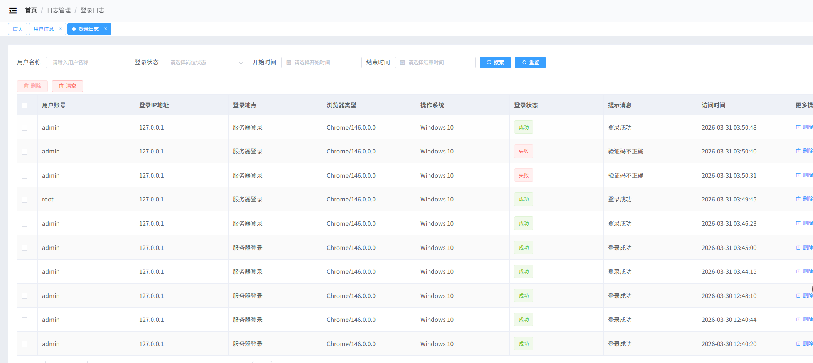

同时也可以清空日志、删除和批量删除日志。

# 20. 操作日志

同样的，先在api添加操作日志的接口。

```js
/*
后端api接口管理
 */

import request from '@/utils/request'

export default {
    // 验证码接口
    captcha() {
        return request ({
            url: '/captcha',
            method: 'get'
        })
    },
    // 登录接口
    login(params) {
        return request({
            url: '/login',
            method: 'post',
            data: params
        })
    },
    // post岗位
    queryPostList(params) {
        return request({
            url: '/post/list',
            method: 'get',
            data: params
        })
    },
    // 批量删除岗位
    batchDeleteSysPost(ids) {
        const data = {
            ids
        }
        return request({
            url: '/post/batch/delete',
            method: 'delete',
            data: data
        })
    },
    // 根据id删除岗位
    deleteSysPost(id) {
        const data = {
            id
        }
        return request({
            url: '/post/delete',
            method: 'delete',
            data: data
        })
    },
    // 获取岗位列表
    querySysPostVoList() {
        return request({
            url: '/post/vo/list',
            method: 'get'
        })
    },
    // 添加岗位
    addPost(data) {
        return request({
            url: '/post/add',
            method: 'post',
            data: data
        })
    },
    // 根据id获取岗位信息
    postInfo(id) {
        const data = {
            id
        }
        return request({
            url: '/post/info',
            method: 'get',
            data: data
        })
    },
    // 更新岗位
    updatePost(data) {
        return request({
            url: '/post/update',
            method: 'put',
            data: data
        })
    },
    // 更新岗位状态
    updatePostStatus(id, postStatus) {
        const data = {
            id,
            postStatus
        }
        return request({
            url: '/post/updateStatus',
            method: 'put',
            data: data
        })
    },
    // dept部门
    queryDeptList(params) {
        return request({
            url: "/dept/list",
            method: 'get',
            data: params
        })
    },
    querySysDeptVoList() {
        return request({
            url: '/dept/vo/list',
            method: 'get'
        })
    },
    addDept(data) {
        return request({
            url: '/dept/add',
            method: 'post',
            data: data
        })
    },
    deleteDept(id) {
        const data = {
            id
        }
        return request({
            url: '/dept/delete',
            method: 'delete',
            data: data
        })
    },
    deptInfo(id) {
        const data = {
            id
        }
        return request({
            url: '/dept/info',
            method: 'get',
            data: data
        })
    },
    deptUpdate(data) {
        return request({
            url: '/dept/update',
            method: 'put',
            data: data
        })
    },
    // menu菜单
    queryMenuList(params) {
        return request({
            url: "/menu/list",
            method: 'get',
            data: params
        })
    },
    querySysMenuVoList() {
        return request({
            url: "/menu/vo/list",
            method: 'get'
        })
    },
    addMenu(data) {
        return request({
            url: '/menu/add',
            method: 'post',
            data: data
        })
    },
    menuInfo(id) {
        const data = {
            id
        }
        return request({
            url: '/menu/info',
            method: 'get',
            data: data
        })
    },
    menuUpdate(data) {
        return request({
            url: '/menu/update',
            method: 'put',
            data: data
        })
    },
    menuDelete(id) {
        const data = {
            id
        }
        return request({
            url: '/menu/delete',
            method: 'delete',
            data: data
        })
    },
    // role角色
    queryRoleList(params) {
        return request({
            url: "/role/list",
            method: 'get',
            data: params
        })
    },
    querySysRoleVoList() {
        return request({
            url: "/role/vo/list",
            method: 'get'
        })
    },
    addRole(data) {
        return request({
            url: '/role/add',
            method: 'post',
            data: data
        })
    },
    roleInfo(id) {
        const data = {
            id
        }
        return request({
            url: '/role/info',
            method: 'get',
            data: data
        })
    },
    roleUpdate(data) {
        return request({
            url: '/role/update',
            method: 'put',
            data: data
        })
    },
    deleteRole(id) {
        const data = {
            id
        }
        return request({
            url: '/role/delete',
            method: 'delete',
            data: data
        })
    },
    updateRoleStatus(id, status) {
        const data = {
            id,
            status
        }
        return request({
            url: "/role/updateStatus",
            method: 'put',
            data: data
        })
    },
    QueryRoleMenuIdList(id) {
        const data = {
            id
        }
        return request({
            url: "/role/vo/idList",
            method: 'get',
            data: data
        })
    },
    AssignPermissions(id, menuIds) {
        const data = {
            id,
            menuIds
        }
        return request({
            url: "/role/assignPermissions",
            method: 'put',
            data: data
        })
    },
    // admin用户
    queryAdminList(params) {
        return request({
            url: "/admin/list",
            method: 'get',
            data: params
        })
    },
    updateAdminStatus(id, status) {
        const data = {
            id,
            status
        }
        return request({
            url: "/admin/updateStatus",
            method: 'put',
            data: data
        })
    },
    addAdmin(data) {
        return request({
            url: '/admin/add',
            method: 'post',
            data: data
        })
    },
    adminInfo(id) {
        const data = {
            id
        }
        return request({
            url: '/admin/info',
            method: 'get',
            data: data
        })
    },
    adminUpdate(data) {
        return request({
            url: '/admin/update',
            method: 'put',
            data: data
        })
    },
    resetPassword(id, password) {
        const data = {
            id,
            password
        }
        return request({
            url: '/admin/updatePassword',
            method: 'put',
            data: data
        })
    },
    deleteAdmin(id) {
        const data = {
            id
        }
        return request({
            url: '/admin/delete',
            method: 'delete',
            data: data
        })
    },
    adminUpdatePersonal(data) {
        return request({
            url: '/admin/updatePersonal',
            method: 'put',
            data: data
        })
    },
    adminUpdatePersonalPassword(data) {
        return request({
            url: '/admin/updatePersonalPassword',
            method: 'put',
            data: data
        })
    },
    // sysLoginInfo登录日志
    querySysLoginInfoList(params) {
        return request({
            url: "/sysLoginInfo/list",
            method: 'get',
            data: params
        })
    },
    batchDeleteSysLoginInfo(ids) {
        const data = {
            ids
        }
        return request({
            url: '/sysLoginInfo/batch/delete',
            method: 'delete',
            data: data
        })
    },
    cleanSysLoginInfo() {
        return request({
            url: '/sysLoginInfo/clean',
            method: 'delete'
        })
    },
    deleteSysLoginInfo(id) {
        const data = {
            id
        }
        return request({
            url: '/sysLoginInfo/delete',
            method: 'delete',
            data: data
        })
    },
    // SysOperationLog操作日志
    querySysOperationLogList(params) {
        return request({
            url: "/sysOperationLog/list",
            method: 'get',
            data: params
        })
    },
    batchDeleteSysOperationLog(ids) {
        const data = {
            ids
        }
        return request({
            url: '/sysOperationLog/batch/delete',
            method: 'delete',
            data: data
        })
    },
    cleanSysOperationLog() {
        return request({
            url: '/sysOperationLog/clean',
            method: 'delete'
        })
    },
    deleteSysOperationLog(id) {
        const data = {
            id
        }
        return request({
            url: '/sysOperationLog/delete',
            method: 'delete',
            data: data
        })
    },
}
```

然后编辑`Operator.vue`页面。

```vue
<script>
export default {
  data() {
    return {
      Loading: true,
      ids: [],
      single: true,
      multiple: true,
      showSearch: true,
      total: 0,
      queryParams: {},
      sysOperationLogList: [],
    }
  },
  methods: {
    // 多选框选中数据
    handleSelectionChange(selection) {
      this.ids = selection.map(item => item.id);
      this.single = selection.length !== 1;
      this.multiple = !selection.length;
    },
    // 查询列表
    async getSysOperationLogList() {
      this.Loading = true
      const { data: res } = await this.$api.querySysOperationLogList(this.queryParams)
      if (res.code !== 200) {
        this.$message.error(res.message)
      } else {
        this.sysOperationLogList = res.data.list
        this.total = res.data.total
        this.Loading = false
      }
    },
    // 搜索按钮操作
    handleQuery() {
      this.getSysOperationLogList();
    },
    // 重置按钮操作
    resetQuery() {
      this.queryParams = {}
      this.getSysOperationLogList();
      this.$message.success("重置成功")
    },
    // pageSize
    handleSizeChange(newSize) {
      this.queryParams.pageSize = newSize
      this.getSysOperationLogList()
    },
    // pageNum
    handleCurrentChange(newPage) {
      this.queryParams.pageNum = newPage
      this.getSysOperationLogList()
    },
    // 清空
    async handleClean() {
      const confirmResult = await this.$confirm('是否清空操作日志？', '提示', {
        confirmButtonText: '确定',
        cancelButtonText: '取消',
        type: 'warning'
      }).catch(err => err)
      if (confirmResult !== 'confirm') {
        return this.$message.info('已取消')
      }
      const { data: res } = await this.$api.cleanSysOperationLog()
      if (res.code !== 200) {
        this.$message.error(res.message)
      } else {
        this.$message.success('清空成功')
        await this.getSysOperationLogList()
      }
    },
    // 删除
    async handleDelete(id) {
      const confirmResult = await this.$confirm('是否确认删除操作日志编号为"' + id + '"的数据项？', '提示', {
        confirmButtonText: '确定',
        cancelButtonText: '取消',
        type: 'warning'
      }).catch(err => err)
      if (confirmResult !== 'confirm') {
        return this.$message.info('已取消删除')
      }
      const { data: res } = await this.$api.deleteSysOperationLog(id)
      if (res.code !== 200) {
        this.$message.error(res.message)
      } else {
        this.$message.success('删除成功')
        await this.getSysOperationLogList()
      }
    },
    // 批量删除
    async batchHandleDelete() {
      const sysOperationLogIds = this.ids;
      const confirmResult = await this.$confirm('是否确认删除操作日志编号为"' + sysOperationLogIds + '"的数据项？', '提示', {
        confirmButtonText: '确定',
        cancelButtonText: '取消',
        type: 'warning'
      }).catch(err => err)
      if (confirmResult !== 'confirm') {
        return this.$message.info('已取消删除')
      }
      const { data: res } = await this.$api.batchDeleteSysOperationLog(sysOperationLogIds)
      if (res.code !== 200) {
        this.$message.error(res.message)
      } else {
        this.$message.success('删除成功')
        await this.getSysOperationLogList()
      }
    },
  },
  created() {
    this.getSysOperationLogList()
  },
}
</script>

<template>
  <el-card>
    <!--条件搜索区域-->
    <el-form :model="queryParams" :inline="true" v-show="showSearch">
      <el-form-item prop="username" label="用户名称">
        <el-input v-model="queryParams.username" placeholder="请输入用户名称" clearable size="mini"
                  @keyup.enter.native="handleQuery" />
      </el-form-item>
      <el-form-item prop="beginTime" label="开始时间">
        <el-date-picker class="input-width" v-model="queryParams.beginTime" size="mini" type="date"
                        style="width: 190px" value-format="yyyy-MM-dd" clearable placeholder="请选择开始时间"
                        @keyup.enter.native="handleQuery"></el-date-picker>
      </el-form-item>
      <el-form-item prop="endTime" label="结束时间">
        <el-date-picker class="input-width" v-model="queryParams.endTime" size="mini" type="date"
                        style="width: 190px" value-format="yyyy-MM-dd" clearable placeholder="请选择结束时间"
                        @keyup.enter.native="handleQuery"></el-date-picker>
      </el-form-item>
      <el-form-item>
        <el-button type="primary" icon="el-icon-search" size="mini" @click="handleQuery">搜索</el-button>
        <el-button type="primary" icon="el-icon-refresh" size="mini" @click="resetQuery">重置</el-button>
      </el-form-item>
    </el-form>
    <!--操作按钮-->
    <el-row :gutter="10" class="mb8">
      <el-col :span="1.5">
        <el-button type="danger" plain icon="el-icon-delete" size="mini" :disabled="multiple"
                   @click="batchHandleDelete" v-authority="['monitor:operator:delete']">删除
        </el-button>
      </el-col>
      <el-col :span="1.5">
        <el-button type="danger" plain icon="el-icon-delete" size="mini" @click="handleClean"
                   v-authority="['monitor:operator:clean']">清空</el-button>
      </el-col>
    </el-row>
    <!--列表区域-->
    <el-table v-loading="Loading" :data="sysOperationLogList" border stripe style="width: 100%"
              :header-cell-style="{ background: '#eef1f6', color: '#606266' }" @selection-change="handleSelectionChange">
      <el-table-column type="selection" />
      <el-table-column label="ID" prop="id" v-if="false" />
      <el-table-column label="用户账号" prop="username" />
      <el-table-column label="请求方式" prop="method" />
      <el-table-column label="登录IP" prop="ip" />
      <el-table-column label="请求的URL" prop="url" />
      <el-table-column label="操作时间" prop="createTime" />
      <el-table-column label="更多操作">
        <template slot-scope="scope">
          <el-button size="small" type="text" icon="el-icon-delete" @click=handleDelete(scope.row.id)
                     v-authority="['monitor:operator:delete']">删除
          </el-button>
        </template>
      </el-table-column>
    </el-table>
    <!--分页区域-->
    <el-pagination @size-change="handleSizeChange" @current-change="handleCurrentChange"
                   :current-page="queryParams.pageNum" :page-sizes="[10, 50, 100, 500, 1000]" :page-size="queryParams.pageSize"
                   layout="total, sizes, prev, pager, next, jumper" :total="total">
    </el-pagination>
  </el-card>
</template>

<style scoped lang="less">

</style>
```

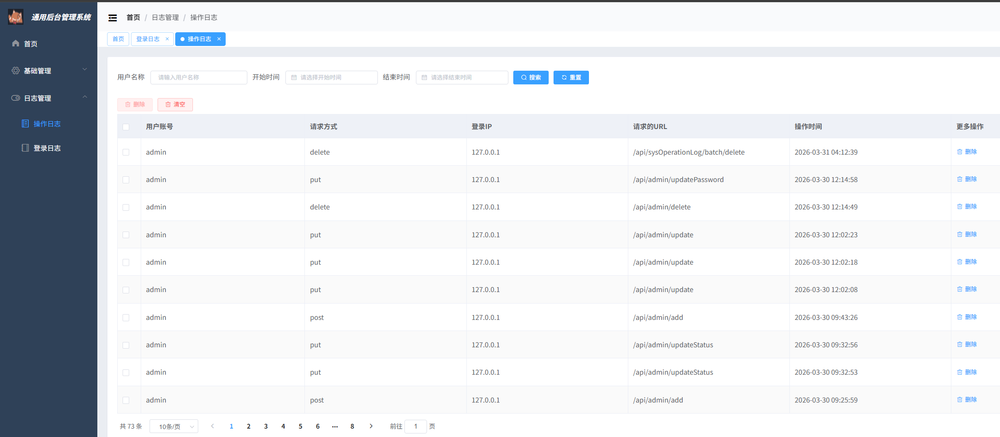

# 21. 权限管理

不同的用户拥有不同的权限，访问不同的页面。

首先在utils下创建`authority.js`。

```js
/*
检测是否有权限
 */
export function checkAuthority(permissionCode, permissions) {
    let hasPermission = true
    if (permissionCode) {
        if (permissionCode instanceof Array && permissionCode.length > 0) {
            hasPermission = permissions.some(permissions => permissionCode.includes(permissions))
        } else {
            hasPermission = permissions.some(item => item === permissionCode)
        }
    }
    return hasPermission
}
```

这个方法用来检测是否有权限。

然后在`permission`中添加`Authority.js`文件，用来验证是否有权限，没有权限则将当前节点移出父节点。

```js
/*
获取前线配置
 */
import {checkAuthority} from '@/utils/authority'
import storage from '@/uitls/storage'

export default {
    inserted(el, binding, vnode) {
        const {value} = binding
        const permissions = storage.getItem('permissionList') || []
        const hasPermission = checkAuthority(value, permissions)
        if (!hasPermission) {
            if (el.parentNode) {
                el.parentNode.removeChild(el)
            } else {
                el.innerHTML = ''
            }
        } else {
            el && el.setAttribute('code', value)
        }
    }
}
```

然后创建`index.js`用来给前端使用。

```js
/*
vue使用配置
 */
import authority from "./Authority";
import Vue from 'vue'
const install = function (Vue) {
    Vue.directive('authority', authority)
}

if (window.Vue) {
    window.authority = authority
    Vue.use(install)
}
authority.install = install
export default authority
```

在前端`main.js`中使用即可。

```js
import Vue from 'vue'
import App from './App.vue'
import router from "@/router/router"
import store from "@/store"
import ElementUI from 'element-ui'
import 'element-ui/lib/theme-chalk/index.css'
import request from '@/utils/request'
import storage from '@/utils/storage'
import './assets/css/global.css'
import api from './api'
import handleTree from '@/utils/common'
import AuthorityDirective from '@/permission/index.js'

Vue.prototype.$storage = storage
Vue.prototype.$request = request
Vue.prototype.$store = store
Vue.prototype.$api = api
Vue.prototype.$handleTree = handleTree

Vue.use(ElementUI).use(AuthorityDirective)

Vue.config.productionTip = false

console.log("环境变量 -> ", process.env["VUE_APP_BASE_API"])

new Vue({
  router,
  render: h => h(App),
}).$mount('#app')
```

设置后给管理员仅添加新增的功能，就能看到管理员无法编辑和删除。

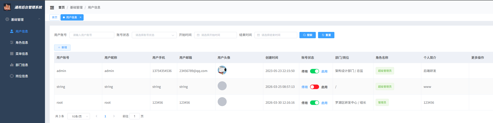

